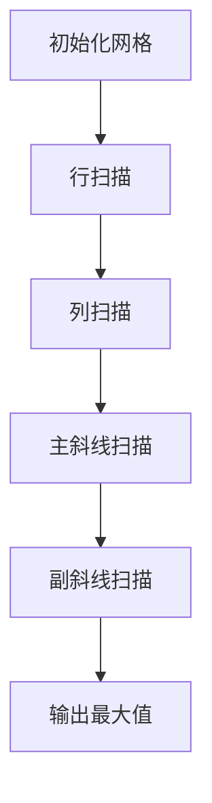

# 题目信息

# [语言月赛 202405] 最大的和

## 题目描述

小 S 喜欢连在一起的数字，如果这些数字的和很大就更好了。

所以她现在要给你一个 $n$ 行 $n$ 列的网格 $A$，第 $i$ 行第 $j$ 列上填有一个**整数** $A_{i, j}$。

接下来你可以在 $A$ 上任取**一行**、**一列**或**一条与任意对角线平行**且**只经过网格交叉点**的**直线**（注意，不是线段），满足经过至少一个数字，且经过的数字之和最大。

如果对上面的表述有疑惑，请参考**样例解释**辅助理解。

你需要告诉小 S 这个最大的数字之和。

## 说明/提示

### 样例 1 解释

对于样例 $1$，不难看出第 $3$ 行数字之和最大，有 $3 + 3 + 3 = 9$。

### 样例 2 解释

对于样例 $2$，数字之和最大的，满足条件的线如下所示：


此时有 $4 + 9 = 13$。

注意，因为要求与对角线平行的直线只能经过**网格交点**，所以并不能出现同时取 $4, 1, 9$ 或同时取 $4, 1, 9, 2$ 这样的情况。

### 样例 $3$ 解释

取某条只经过一个 $-1$ 的直线即为最大。注意，不可以一个数字都不选。

### 样例 $4$ 解释

显然，取斜着的线一定不优，只能选择中间那一行或一列，答案是 $-10 + 99999 - 10 = 99979$。

### 数据范围

对于前 $30 \%$ 的数据，保证 $A_{1, 1}$ 或 $A_{n, n}$ 的值为网格中**唯一的**非负整数。  
对于另 $20 \%$ 的数据，保证**每一行**数字相同，且最后一行中的数字之和为**最大值**。  
对于另 $20 \%$ 的数据，保证**每一行**数字相同，网格中不存在负数。  
对于 $100 \%$ 的数据，保证 $1 \leq n \leq 2 \times 10^3, -10^5 \leq A_{i, j} \leq 10^5$。

## 样例 #1

### 输入

```
3
1 1 1
2 2 2
3 3 3
```

### 输出

```
9
```

## 样例 #2

### 输入

```
3
-1 1 2
4 0 3
1 9 2
```

### 输出

```
13
```

## 样例 #3

### 输入

```
3
-1 -1 -1
-1 -1 -1
-1 -1 -1
```

### 输出

```
-1
```

## 样例 #4

### 输入

```
3
-100 -10 -100
-10 99999 -10
-100 -10 -100
```

### 输出

```
99979
```

# AI分析结果


### Kay的C++算法解析：最大的和 深入学习指南

---

### 1. 题目解读与核心算法识别

✨ **本题主要考察**：**枚举与模拟应用**

🗣️ **初步分析**：
> 解决"最大的和"这道题，关键在于理解并运用**枚举思想**。就像在迷宫中寻找宝藏最多的路径，我们需要系统地检查所有可能的路线（行、列、斜线）。枚举的核心是**不遗漏任何候选方案**并高效计算。  
> - **核心难点**：斜线方向的处理需要巧妙特征值（行±列）和边界检查，避免无效访问。
> - **解决方案**：分四类枚举（行/列/主斜线/副斜线），用特征值简化斜线遍历。
> - **可视化设计**：像素网格中将用不同颜色高亮当前扫描线（如黄色行/蓝色斜线），实时显示当前和与最大值。当发现新最大值时，触发8-bit胜利音效并闪烁提示。
> - **复古游戏化**：AI自动演示模式将像"贪吃蛇AI"一样逐线扫描，每完成一类路径（如所有行）解锁像素成就勋章。

---

### 2. 精选优质题解参考

**题解（作者：ShiRoZeTsu）**
* **点评**：
  - **思路清晰性**：将问题分解为行、列、主副斜线四类独立枚举，逻辑直白；通过行±列的特征值系统化斜线处理（如`d=行-列`），推导严谨。
  - **代码规范性**：变量名`res`/`ans`简洁合理，边界检查`(1<=j-i<=n)`完整；使用`long long`预防溢出体现严谨性。
  - **算法有效性**：O(n²)复杂度完美匹配数据范围（n≤2000），斜线枚举方式避免重复计算。
  - **实践价值**：代码可直接用于竞赛，循环嵌套结构易于调试，图示辅助理解斜线特征值。

---

### 3. 核心难点辨析与解题策略

1. **难点1：斜线的系统化枚举**
   * **分析**：斜线需按方向分类处理。主对角线方向（左上→右下）用**行-列=常数**，副方向（右上→左下）用**行+列=常数**。常数范围需精确计算（如主斜线：`d∈[1-n, n-1]`）。
   * 💡 **学习笔记**：斜线枚举 = 确定特征值范围 + 遍历行号 + 动态计算列号。

2. **难点2：边界条件的鲁棒性**
   * **分析**：动态计算的列号（如`j = i-d`）可能越界。优质题解通过`if(1<=j<=n)`过滤无效位置，确保只累加网格内元素。
   * 💡 **学习笔记**：网格遍历中，先验判断索引有效性比事后纠错更高效。

3. **难点3：数据范围的防御性编程**
   * **分析**：n=2000时，最大和可能达4e9（2000×2e5），超出`int`范围。`long long`类型和`ans`初始值`-1e18`规避了溢出与初始化错误。
   * 💡 **学习笔记**：估算极端值范围是竞赛编程的基本功。

#### ✨ 解题技巧总结
- **分类枚举法**：将复杂问题拆解为独立子类型（行/列/斜线）分而治之。
- **特征值映射**：用数学关系（如行±列）简化高维遍历。
- **边界预判**：在累加前检查索引，减少无效计算。
- **数据类型预判**：通过极端值反推所需变量类型。

---

### 4. C++核心代码实现赏析

**通用核心实现（综合自题解思路）**
```cpp
#include <iostream>
#include <algorithm>
using namespace std;
const int N = 2005;
long long a[N][N]; // 网格数据

int main() {
    int n; cin >> n;
    for (int i=1; i<=n; i++)
        for (int j=1; j<=n; j++)
            cin >> a[i][j];

    long long ans = -1e18; // 初始化为极小值

    // 1. 枚举行
    for (int i=1; i<=n; i++) {
        long long res = 0;
        for (int j=1; j<=n; j++) res += a[i][j];
        ans = max(ans, res);
    }

    // 2. 枚举列
    for (int i=1; i<=n; i++) {
        long long res = 0;
        for (int j=1; j<=n; j++) res += a[j][i];
        ans = max(ans, res);
    }

    // 3. 主斜线(左上→右下)：行-列=常数d
    for (int d=1-n; d<=n-1; d++) {
        long long res = 0;
        for (int i=1; i<=n; i++) {
            int j = i - d; // 由行数和d计算列号
            if (j>=1 && j<=n) res += a[i][j];
        }
        ans = max(ans, res);
    }

    // 4. 副斜线(右上→左下)：行+列=常数s
    for (int s=2; s<=2*n; s++) {
        long long res = 0;
        for (int i=1; i<=n; i++) {
            int j = s - i; // 由行数和s计算列号
            if (j>=1 && j<=n) res += a[i][j];
        }
        ans = max(ans, res);
    }

    cout << ans << endl;
}
```
**代码解读概要**：  
> 1. 读入网格数据后，初始化`ans`为极小值（覆盖全负数场景）。  
> 2. 四段独立循环分别处理：行累加、列累加、主斜线（特征值`d`）、副斜线（特征值`s`）。  
> 3. 斜线遍历中，通过`行号±特征值`动态计算列号，并用`if`确保索引有效。  
> 4. 实时用`max`更新全局最大值`ans`。

---

### 5. 算法可视化：像素动画演示

**主题**：*网格寻宝者*（8-bit像素探险游戏）  
**核心演示**：四类路径扫描过程与实时和更新



**动画步骤**：  
1. **像素网格**：16色FC风格，每个格子显示数字（负数红色，正数绿色）  
2. **扫描高亮**：  
   - 当前行：黄色横条移动，伴随"滴"声  
   - 斜线：蓝色像素箭头沿对角线移动，格子按节奏闪烁  
3. **数据反馈**：  
   - 右侧面板实时显示：当前路径和(`res`)、历史最大值(`ans`)  
   - 当`ans`更新：播放"升级"音效，网格边框闪烁金色  
4. **交互控制**：  
   - 速度滑块：调节扫描速度（慢速学习/快速概览）  
   - 单步执行：按空格键逐步观察累加过程  
   - AI演示：自动完成四类扫描，类似"吃豆人"路径探索  
5. **游戏化元素**：  
   - 每完成一类路径解锁勋章（行→铜杯，斜线→金杯）  
   - 最终根据效率评分（S/A/B）并生成分享码  

---

### 6. 拓展练习与相似问题

**通用技巧迁移**：  
枚举思想适用于：  
1. 矩阵局部求和（子矩阵、十字区域）  
2. 路径搜索问题（迷宫最短路径）  
3. 像素图像处理（区域填充/边缘检测）  

**洛谷推荐**：  
1. **P1115 最大子段和**  
   → 一维版"最大和"，巩固连续累加思想  
2. **P1719 最大加权矩形**  
   → 二维最大子矩阵，枚举进阶训练  
3. **P1219 八皇后**  
   → 斜线冲突检测，深化特征值应用  

---

<conclusion>  
通过系统枚举行、列、斜线，我们高效解决了"最大的和"问题。关键在掌握**特征值映射**简化斜线遍历，并用**防御性编程**处理边界与数据范围。记住：好的枚举如同精密的扫描仪——不重不漏，步步为营。尝试用可视化工具观察累加过程，你会更深入理解网格遍历的本质！  
</conclusion>

---
处理用时：169.17秒