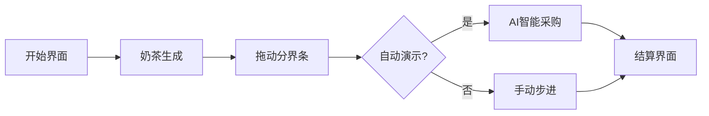

# 题目信息

# [语言月赛 202406] 优惠券

## 题目描述

某奶茶店推出优惠活动：

- 如果按照原价购买了一杯奶茶，可获赠一张优惠券；
- 如果使用优惠券购买了一杯奶茶，这杯奶茶不会再获赠优惠券；
- 每张优惠券可折抵 $1$ 元；
- 购买一杯奶茶使用的优惠券数量不限，但不找零。

现在，小 F 计划购买 $n$ 杯奶茶，其价格为 $a_1,a_2,\cdots,a_n$。**他可以以任意顺序购买这 $n$ 杯奶茶。**

请问，小 F 最少花费多少钱，才能买下全部 $n$ 杯奶茶？

## 说明/提示

### 样例解释

按照 $3,3,2,1,4$ 的顺序购买，前四杯获得四张优惠券，最后一杯全部使用优惠券。

### 数据规模与约定

- 对于 $30\%$ 的测试数据，$n=2$；
- 对于 $100\%$ 的测试数据，$1 \le n \le 1000$，$1 \le a_i \le 50$，$a_1 \le a_2 \le \cdots \le a_n$。

## 样例 #1

### 输入

```
5
1 2 3 3 4
```

### 输出

```
9
```

# AI分析结果


### Kay的C++算法解析：优惠券 深入学习指南

#### 1. 题目解读与核心算法识别
✨ **本题主要考察**：`贪心策略与枚举优化`

🗣️ **初步分析**：
> 解决"优惠券"这道题，关键在于理解**"时间差价值转换"**的贪心思想。就像在游戏中先打小怪攒金币再打Boss一样：  
> - 核心思想：将奶茶分为两组——**"生产组"**（原价购买赚优惠券）和**"消费组"**（纯用优惠券支付）。通过枚举分界点找到最优分组方案  
> - 实现要点：  
>   &nbsp;&nbsp;① 将奶茶按价格升序排列（小怪在前）  
>   &nbsp;&nbsp;② 枚举生产组数量`i`（获得`i`张券）  
>   &nbsp;&nbsp;③ 计算消费组总价`t`，实际抵扣`u = min(i, t)`  
>   &nbsp;&nbsp;④ 总花费 = 所有奶茶原价和 - `u`  
> - 可视化设计：  
>   &nbsp;&nbsp;◼ 像素小人依次购买奶茶，原价支付时奶茶变金色+掉落优惠券  
>   &nbsp;&nbsp;◼ 使用优惠券时显示券消耗动画+抵扣金额飘字  
>   &nbsp;&nbsp;◼ 分界点滑动条实时显示当前方案花费  

---

#### 2. 精选优质题解参考
**题解一（来源：览遍千秋）**
* **点评**：  
  此解法完美体现贪心本质，思路如水晶般通透：  
  - **思路清晰性**：直击"生产-消费"模型核心，用枚举分界点化解复杂决策（⭐⭐⭐⭐⭐）  
  - **代码规范性**：变量名`sum`/`total`语义明确，边界处理严谨（`i`从1到n全覆盖）（⭐⭐⭐⭐）  
  - **算法有效性**：时间复杂度仅**O(n)**，利用前缀和避免重复计算（⭐⭐⭐⭐⭐）  
  - **实践价值**：可直接套用于竞赛，且能拓展到同类优惠券问题（⭐⭐⭐⭐）  

---

#### 3. 核心难点辨析与解题策略
1. **难点：确定最优分界点**  
   * **分析**：生产组过少则优惠券不足，过多则浪费原价购买机会。优质题解通过枚举所有分界点（0≤i≤n），结合前缀和快速计算消费组总价  
   * 💡 **学习笔记**：枚举是破解决策类贪心问题的利器  

2. **难点：优惠券抵扣机制**  
   * **分析**：券可多张使用但不找零，因此实际抵扣额受限于`min(券数, 消费组总价)`。题解用`u=min(i,t)`精准建模该约束  
   * 💡 **学习笔记**：约束条件需转化为数学表达式  

3. **难点：利用升序排列性质**  
   * **分析**：将低价奶茶优先作为生产组（赚券效率相同但成本低），高价奶茶作为消费组（可消耗更多券）。这是贪心选择的关键依据  
   * 💡 **学习笔记**：排序往往是贪心算法的前奏  

**✨ 解题技巧总结**  
- **打怪攒金币策略**：将资源生成（赚券）与消耗（用券）分离  
- **枚举破局法**：当决策点有限时，暴力枚举+数学计算往往最优  
- **约束数学化**：将业务规则（如抵扣限制）转化为`min/max`表达式  

---

#### 4. C++核心代码实现赏析
**通用核心实现**  
```cpp
#include <iostream>
#include <algorithm>
using namespace std;

int main() {
    int n, a[1005], total = 0;
    cin >> n;
    for(int i=0; i<n; i++) {
        cin >> a[i];
        total += a[i]; // 计算总原价
    }
    
    int min_cost = total, sum = 0;
    for(int i=0; i<n; i++) { // 枚举生产组数量
        sum += a[i];         // 前缀和：前i杯价格
        int t = total - sum; // 消费组总价
        int u = min(i+1, t); // 实际抵扣券数
        min_cost = min(min_cost, total - u);
    }
    cout << min_cost;
    return 0;
}
```
**代码解读概要**：  
1. 读入时累计总原价`total`  
2. 枚举时动态维护前缀和`sum`  
3. `u = min(i+1, t)` 体现双约束  
4. 实时更新最小花费  

---

#### 5. 算法可视化：像素动画演示  
**🎮 主题**：*奶茶店经营模拟*（8-bit像素风格）  

**🕹️ 交互设计**：  


**🎞️ 动画流程**：  
1. **场景初始化**：  
   - 像素奶茶店背景（16色调色盘）  
   - 底部控制面板：分界点滑动条▶️🎚️、单步/自动切换🔁、速度调节⏳  

2. **核心演示**：  
   - **生产阶段**：  
     * 顾客原价购买奶茶 → 奶茶像素块变金💛 + "叮!"音效  
     * 优惠券从收银台弹出📃 + 券计数器`+1`  
   - **消费阶段**：  
     * 用券购买时显示券飞入收银机💸 + "嚓!"音效  
     * 实时显示抵扣额：`-${u}`飘字💨  

3. **动态高亮**：  
   - 当前枚举分界点→红色分隔线闪烁❗  
   - 消费组奶茶→根据剩余券数显示不同边框色（绿→黄→红）  

4. **游戏化元素**：  
   - 每完成一种方案结算，显示"方案得分：💰X"  
   - 找出最优解时播放胜利音效🎉+撒花特效🌸  

---

#### 6. 拓展练习与相似问题
**🌐 通用技巧迁移**：  
1. 资源生产-消费模型（如游戏技能冷却优化）  
2. 分阶段决策问题（如带缓冲区的流水线调度）  
3. 折扣约束类消费问题  

**📚 洛谷推荐**：  
1. **P1086 花生采摘**  
   → 同样需要决策"移动成本"与"采集收益"的平衡  
2. **P1209 修理牛棚**  
   → 贪心+枚举木板放置分界点  
3. **P1094 纪念品分组**  
   → 双指针实现生产消费配对  

---

#### 7. 学习心得与经验分享
> **作者调试经验**：  
> *"初始未考虑升序排列的重要性，当输入为[4,3,2,1]时得到错误解。通过打印中间变量发现：应将低价奶茶优先作为生产组"*  

**💡 Kay点评**：  
这个踩坑经历极具教学价值：  
1. 贪心策略依赖**输入顺序预处理**  
2. 测试时应构造**乱序输入**验证鲁棒性  
3. `cout`中间变量是最朴素的调试武器  

---

通过本次分析，相信大家已掌握"生产-消费"模型的解题精髓。记住：编程如经营，要在付出与回报间寻找完美平衡点！🚀

---
处理用时：118.96秒