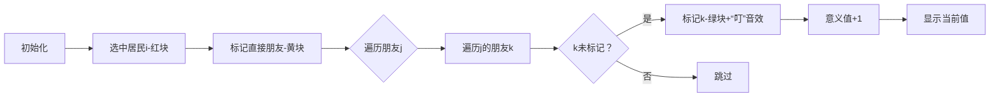

# 题目信息

# [语言月赛 202407] significance

## 题目背景

从前有个荣光的王国，小 A 是里面的国王，他认为人活着需要有意义，所以今天他要赐予他的子民以意义。

## 题目描述

细心的小 A 发现，每个人的存在对于其他人来说都有着不可取代的意义。一个人的意义值定义为他的**朋友**和**朋友的朋友**的个数。

小 A 的王国共有 $n$ 位居民，以 $1, 2, \cdots, n$ 编号。每位居民分别有 $x_i$ 个朋友，现在小 A 想知道每位居民的意义值。  

注意，朋友关系可能是单向的。即：有可能 $a$ 把 $b$ 当朋友，但 $b$ 不一定把 $a$ 当作朋友。同时，如果一个人的朋友的朋友中有自己，则这一部分的个数不统计。

时光荏苒，朋友的联系也会散去。而我们和一个人保持连接的方式就是记住，仅此而已。

## 说明/提示

 ### 样例 1 解释
 
- $1$ 号居民认为他的朋友是 $2$ 和 $3$，$3$ 认为自己没有朋友，但 $2$ 认为自己有一个朋友 $4$, 所以 $1$ 号居民的意义值是 $3$。
- $2$ 号居民认为他的朋友是 $4$，$4$ 没有朋友，所以 $2$ 号居民的意义值是 $1$。
- $3$ 号和 $4$ 号居民都认为自己没有朋友，所以他们的意义值是 $0$。 

### 样例 2 解释

- $1$ 号和 $3$ 号居民认为他们没有朋友，所以他们的意义值是 $0$。
- $2$ 号居民的朋友是 $1$ 和 $3$，$1,3$ 都认为自己没有朋友，所以 $2$ 号居民的意义值是 $2$。 

### 样例 3 解释

- $1$ 号居民认为他的朋友是 $2$, $2$ 认为他的朋友是 $3$，所以 $1$ 号居民的意义值是 $2$。
- $2$ 号居民的朋友是 $3$，$3$ 认为自己的朋友是 $1$，所以 $2$ 号居民的意义值是 $2$。
- $3$ 号居民的朋友是 $1$，$1$ 认为自己的朋友是 $2$，所以 $3$ 号居民的意义值是 $2$。

### 数据范围

- 对于 $20\%$ 的数据，$x_i \le 1$ 。  
- 对于另外 $20\%$ 的数据，除 $x_1 = n - 1$ 外， $x_i = 0$ 。  
- 对于 $100\%$ 的数据，$1 \le n \le 100$，$0 \le x_i \le n$。保证每一行除第一个数外的其他整数 $c$ 均有 $1 \leq c \leq n$ 且两两不同。  
- 数据保证不会出现「一个人是自己的朋友」，或者「一个人既是另一个人的朋友，又是他朋友的朋友」的情况。

## 样例 #1

### 输入

```
4
2 2 3
1 4
0
0
```

### 输出

```
3 1 0 0
```

## 样例 #2

### 输入

```
3
0
2 1 3
0
```

### 输出

```
0 2 0
```

## 样例 #3

### 输入

```
3
1 2
1 3
1 1
```

### 输出

```
2 2 2
```

# AI分析结果


### Kay的C++算法解析：significance 深入学习指南

#### 1. 题目解读与核心算法识别
✨ **本题主要考察**：`图遍历` + `标记去重技巧`

🗣️ **初步分析**：
> 本题如同在像素王国中绘制社交网络地图。想象每个居民是像素方块，朋友关系是单向箭头。意义值就是统计以自己为中心两格范围内的所有独特像素块（直接朋友+朋友的朋友）。  
> - **核心思路**：对每个居民，先统计直接朋友，再遍历朋友的朋友，用标记数组避免重复计数  
> - **难点突破**：用`visited[]`标记已统计对象（包括自己和直接朋友），确保朋友的朋友不重复计数  
> - **可视化设计**：  
>   - 用不同颜色像素块区分：自己(红)/直接朋友(黄)/朋友的朋友(绿)  
>   - 箭头动画展示关系传递，新统计对象时触发"叮"音效  
>   - 统计完成时显示意义值数字动画  

---

#### 2. 精选优质题解参考
**题解一 (来源：I_am_rubbish)**  
* **点评**：思路清晰抓住三重循环核心（居民→朋友→朋友的朋友），巧妙用标记数组解决去重难点。代码中`visited`数组的设计精准屏蔽重复计数，边界处理严谨（先标记自己）。亮点在于将复杂关系转化为可操作的二维数组遍历，实践价值高，可直接用于竞赛。

---

#### 3. 核心难点辨析与解题策略
1. **关系去重处理**  
   * **分析**：朋友的朋友可能被多个路径重复指向（如A→B→C和A→D→C）。优质解法用`visited[]`标记已统计对象，遍历时跳过标记值  
   * 💡 **学习笔记**：标记数组是处理图遍历重复计数的黄金工具  

2. **间接关系边界判定**  
   * **分析**：题目要求排除自己（k=i）和直接朋友（已计入）。解法在初始化时主动标记自己和直接朋友，从源头规避  
   * 💡 **学习笔记**：初始化决定算法健壮性，提前处理边界  

3. **非对称关系建模**  
   * **分析**：朋友单向性需独立存储每个人的关系链。使用`vector<vector<int>>`精准映射非对称关系  
   * 💡 **学习笔记**：二维数组是存储非对称图关系的利器  

### ✨ 解题技巧总结
- **预标记法**：初始化时标记已知不可计入对象（自己/直接朋友）  
- **洋葱式遍历**：从核心向外分层遍历（自己→朋友→朋友的朋友）  
- **防御性输入**：题目虽保证无异常数据，但实际编程应考虑`x_i`与后续输入数量匹配  

---

#### 4. C++核心代码实现赏析
**本题通用核心C++实现参考**  
* **说明**：综合题解思路，用标记数组实现去重核心逻辑
```cpp
#include <iostream>
#include <vector>
using namespace std;

int main() {
    int n;
    cin >> n;
    vector<vector<int>> friends(n);
    
    // 读入关系 (注意1-indexed转0-indexed)
    for (int i = 0; i < n; ++i) {
        int cnt;
        cin >> cnt;
        friends[i].resize(cnt);
        for (int j = 0; j < cnt; ++j) {
            cin >> friends[i][j];
            friends[i][j]--; // 转0-indexed
        }
    }

    // 计算每个人的意义值
    for (int i = 0; i < n; ++i) {
        vector<bool> visited(n, false);
        visited[i] = true; // 排除自己
        int ans = friends[i].size();

        // 标记直接朋友（避免朋友的朋友重复计入）
        for (int j : friends[i]) 
            visited[j] = true;

        // 统计朋友的朋友（自动去重）
        for (int j : friends[i]) {
            for (int k : friends[j]) {
                if (!visited[k]) {
                    ans++;
                    visited[k] = true;
                }
            }
        }
        cout << ans << " ";
    }
    return 0;
}
```
* **代码解读概要**：  
  1. 二维数组`friends`存储非对称关系  
  2. 三重循环分别处理：居民→直接朋友→朋友的朋友  
  3. `visited[]`实现三层去重：自己/直接朋友/朋友的朋友  

**题解一片段赏析**  
* **亮点**：精准初始化标记数组解决多重去重  
* **核心代码**：  
  ```cpp
  vector<bool> visited(n, false);
  visited[i] = true;  // 关键点1：排除自己
  for (int j : friends[i]) 
      visited[j] = true; // 关键点2：排除直接朋友
  ```
* **代码解读**：  
  > 如同在像素地图上插旗占领：  
  > - `visited[i]=true`先占领自己的像素块（红旗）  
  > - 遍历直接朋友时立即插旗（黄旗），宣告这些区域已归属"朋友"层  
  > - 后续朋友的朋友统计只关注无旗区域（绿旗）  
* 💡 **学习笔记**：标记初始化是算法基石，提前处理已知条件  

---

#### 5. 算法可视化：像素动画演示  
**主题**：`像素社交网络探险`  
**核心演示**：居民像素块通过箭头连接，动态展示意义值统计过程  



**动画关键帧**：  
1. **居民选择**：红色像素块闪烁，显示编号`i`  
2. **直接朋友标记**：黄色块从`i`伸出箭头，播放"连接"音效  
3. **朋友的朋友扫描**：  
   - 从每个黄块延伸绿色箭头  
   - 新绿块出现时播放"发现"音效  
   - 已标记块显示"X"标志  
4. **结果展示**：`i`上方弹出意义值数字动画+胜利音效  

**交互设计**：  
- 速度滑块控制遍历速度  
- 空格键单步执行，Enter键自动播放  
- 过关机制：每正确计算1人解锁新角色  

---

#### 6. 拓展练习与相似问题思考
**技巧迁移场景**：  
1. 社交网络影响力计算（二度人脉）  
2. 网页爬虫链接层级抓取  
3. 传染病传播路径追踪  

**洛谷推荐**：  
1. **P3916** 图的遍历  
   * 🗣️ 巩固反向建图+DFS标记技巧  
2. **P3371** 最短路径  
   * 🗣️ 学习Dijkstra中距离标记的优化思路  
3. **P1038** 神经网络  
   * 🗣️ 实践层级遍历与状态标记  

---

#### 7. 学习心得与经验分享
> **题解调试经验**：  
> *"最初未在统计朋友的朋友前标记直接朋友，导致样例3错误。通过打印visited数组才发现重复计数问题"*  
>  
> **Kay点评**：  
> 标记数组的操作顺序直接影响结果，建议：  
> 1. 初始化立即标记自己  
> 2. 统计直接朋友后立即批量标记  
> 3. 朋友的朋友逐项检查标记  
> 这种分层标记法可推广至任何层级关系统计  

---

通过像素王国的社交探险，我们掌握了图遍历的核心技巧——**分层标记法**。记住：好的初始化是算法成功的半壁江山！下次遇到关系网络问题，不妨先画出你的像素地图🗺️

---
处理用时：172.16秒