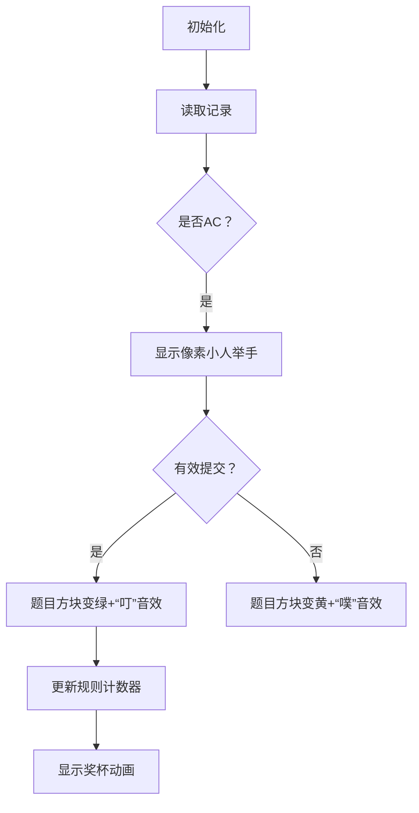

# 题目信息

# [语言月赛 202412] 顽强拼搏奖的四种发法

## 题目描述

在 XCPC 竞赛里，会有若干道题目，一支队伍可以对每道题目提交若干次。我们称一支队伍对一道题目的一次提交是有效的，当且仅当：

- 在本次提交以前，还未通过该题目。
- 本次提交的题目在比赛里最终被该队伍通过了。

注意，事实上，在通过一道题目后，一支队伍仍然可以提交该题目。这样的提交是**无效提交**，同时，无论这样的提交是否通过，都不会影响该队伍**已通过**该题目的状态。

我们按顺序给出本场比赛所有队伍的全部提交记录，每条记录是一个三元组 $(tid_i, pid_i, state_i)$，其中 $tid_i$ 表示提交这条记录的队伍编号，$pid_i$ 表示这条记录所提交的题目编号，$state_i$ 表示这条记录的状态是未通过/通过。

如果一支队伍在比赛里通过了至少 $k$ 道不同的题目，则它们获得了奖牌。

你要求出本场比赛的**顽强拼搏奖**归属于哪支队伍。很遗憾的是，每个主办方对顽强拼搏奖的定义是不同的，因此你需要按如下四种计算方法分别计算获得顽强拼搏奖所归属的队伍编号：

1. 最后一次 AC 记录所对应的队伍。
2. 最后一次**有效** AC 记录所对应的队伍。
3. 未获得奖牌的队伍的最后一次**有效** AC 提交对应的队伍。
4. 最后一次使得一支队伍的通过题目数由 $0$ 变成 $1$ 的提交所对应的队伍。


## 说明/提示

### 样例 1 解释

这个样例共有 $4$ 支队伍，两道题目。解出两道题目的队伍可以获奖。

- 整场比赛的最后一次 AC 提交是第八条记录，$1$ 号队伍提交第二题通过。因此第一种定义计算出的顽强拼搏奖是队伍 $1$；  
- 队伍 $1$ 在第二条记录时就已通过第二题，所以第八条记录不是一条有效提交记录。最后一条 AC 的有效提交记录是第七条。因此第二种定义计算出的顽强拼搏奖是队伍 $2$；  
- 只有队伍 $3$ 没有获奖，它们的最后一次提交是第四条记录，因此按第三种定义计算的顽强拼搏奖是队伍 $3$；  
- 队伍 $4$ 是最后一个通过题目数由 $0$ 题变为 $1$ 题的队伍。其对应的提交记录是第五条。因此按第四种定义计算的顽强拼搏奖是队伍 $4$。

### 数据规模与约定

| 测试点编号 | $n$ | $t$ | $p$ | 特殊约定 |
| :-: | :-: | :-: | :-: | :-: |
| $1$ | $=1$ | $=1$ | $=1$ | 无 |
| $2,3$ | $\leq 100$ | $=1$ | $\leq 100$ | 无 |
| $4,5$ | $\leq 100$ | $\leq 100$ | $=1$ | 无 |
| $6,7$ | $\leq 1000$ | $\leq 100$ | $\leq 100$ | 一支队伍只会通过一道题至多一次 |
| $8,9,10$ | $\leq 1000$ | $\leq 100$ | $\leq 100$ | 无 |

对全部的测试数据，保证 $1 \leq n \leq 1000$，$1 \leq tid_i \leq t \leq 100$，$1 \leq pid_i \leq p \leq 100$，$1 \leq k \leq p$，$0 \leq state_i \leq 1$。

## 样例 #1

### 输入

```
8 4 2 2
1 1 1
1 2 1
2 2 1
3 1 1
4 1 1
4 2 1
2 1 1
1 2 1```

### 输出

```
1 2 3 4```

# AI分析结果


### 💡 Kay的C++算法解析：顽强拼搏奖的四种发法 深入学习指南 💡

**引言**  
今天我们来分析"顽强拼搏奖的四种发法"这道模拟类C++编程题。本指南将帮助你理解如何通过状态维护和条件判断解决多规则计算问题。

---

## 1. 题目解读与核心算法识别

✨ **本题主要考察**：`模拟应用`与`状态维护`  

🗣️ **初步分析**：  
> 解决本题就像管理一个竞赛记分牌📊，需要实时跟踪每支队伍的解题状态。核心是维护三个关键状态：
> - `pass[i][j]`：队伍i最终是否通过题目j
> - `win[i]`：队伍i是否获奖
> - `passed[i][j]`：动态更新中的通过状态
>
> **难点解析**：  
> 1. 有效提交的判断（提交前未通过且最终通过）
> 2. 四种规则的条件判断时机（特别是规则4的0→1状态跃迁）
> 
> **可视化设计思路**：  
> 采用8位像素风格模拟竞赛场景：
> - 队伍：像素小人（不同颜色代表不同队伍）
> - 题目：发光方块（绿色=已通过，灰色=未通过）
> - 关键动画：提交时像素小人举手→AC时题目方块发光→规则触发时显示奖杯动画
> - 音效：有效AC→"叮"声，无效AC→"噗"声，规则触发→胜利旋律

---

## 2. 精选优质题解参考

**题解一（来源：一扶苏一）**  
* **点评**：思路清晰划分两次遍历（先确定获奖情况再处理规则），代码结构规范（使用`pass`和`win`数组）。亮点在于分离状态计算与规则判断，但需修正`pass[tid][tid]=1`应为`pass[tid][pid]=1`的笔误。实践价值高，可直接用于竞赛场景。

---

## 3. 核心难点辨析与解题策略

1. **难点：有效提交的动态判断**  
   * **分析**：必须在遍历时动态维护`passed`数组（记录当前是否通过），而非使用最终结果数组。优质解法在第二次遍历时重置`passed`数组实现时间回溯。
   * 💡 **学习笔记**：动态状态维护是模拟题的核心技巧

2. **难点：规则4的0→1状态捕捉**  
   * **分析**：需要为每队维护`curPassCount`变量，在有效AC时检查：
     ```cpp
     int oldCount = curPassCount[tid];
     curPassCount[tid]++; 
     if(oldCount == 0) d = tid; // 触发规则4
     ```
   * 💡 **学习笔记**：状态跃迁需在更新前捕获旧值

3. **难点：多规则同步更新**  
   * **分析**：在单次循环内通过条件嵌套处理四种规则，注意规则3需同时满足：有效AC + 未获奖
   * 💡 **学习笔记**：复杂条件应拆解为独立bool变量增强可读性

### ✨ 解题技巧总结
- **状态分离**：最终状态（pass）与过程状态（passed）分开维护
- **预计算优化**：先确定获奖情况避免重复计算
- **边界防御**：数组下标从1开始需保证足够容量（t+1, p+1）
- **变量追踪**：为每队维护当前通过题数（curPassCount）

---

## 4. C++核心代码实现赏析

**通用核心C++实现参考**  
```cpp
#include <iostream>
#include <vector>
using namespace std;

int main() {
    int n, t, p, k;
    cin >> n >> t >> p >> k;
    
    // 存储提交记录 [tid, pid, state]
    vector<vector<int>> record(n+1, vector<int>(3));
    vector<vector<bool>> pass(t+1, vector<bool>(p+1, false));
    vector<vector<bool>> passed(t+1, vector<bool>(p+1, false));
    vector<bool> win(t+1, false);
    vector<int> curPassCount(t+1, 0);

    // 第一次遍历：确定最终通过状态
    for(int i=1; i<=n; ++i) {
        cin >> record[i][0] >> record[i][1] >> record[i][2];
        int tid = record[i][0], pid = record[i][1];
        if(record[i][2] == 1) 
            pass[tid][pid] = true; // 修正点：pid非tid
    }

    // 确定获奖队伍
    for(int i=1; i<=t; ++i) {
        int cnt = 0;
        for(int j=1; j<=p; ++j) 
            if(pass[i][j]) cnt++;
        win[i] = (cnt >= k);
    }

    // 第二次遍历：动态更新并判定规则
    int a=-1, b=-1, c=-1, d=-1;
    for(int i=1; i<=n; ++i) {
        int tid = record[i][0], pid = record[i][1], state = record[i][2];
        if(state == 1) {
            a = tid; // 规则1：总是更新最后AC队伍
            if(!passed[tid][pid]) { // 有效提交判定
                b = tid; // 规则2：最后有效AC
                if(!win[tid]) c = tid; // 规则3：未获奖的有效AC
                
                // 规则4：0→1状态跃迁
                int oldCount = curPassCount[tid];
                curPassCount[tid]++;
                if(oldCount == 0) d = tid;
            }
            passed[tid][pid] = true; // 更新动态状态
        }
    }
    cout << a << " " << b << " " << c << " " << d;
    return 0;
}
```

**代码解读概要**：  
> 1. **输入存储**：使用二维vector存提交记录  
> 2. **状态预计算**：第一次遍历确定最终通过状态和获奖情况  
> 3. **动态判定**：第二次遍历维护passed和curPassCount  
> 4. **规则同步更新**：在有效AC时一次性处理四个规则  

---

## 5. 算法可视化：像素动画演示

**动画主题**：8位像素风格竞赛模拟器  

**核心演示流程**：  


**交互设计细节**：  
1. **控制面板**：  
   - 速度滑块：调节记录处理速度（50ms-1000ms）
   - 单步执行：空格键触发下条记录
   - 视角切换：Tab键切换队伍/题目视角

2. **动态元素**：  
   ```plaintext
   队伍3 提交 P2 → [AC] → 有效提交！
   ██ 队伍状态 ██
   1: ■■ (已获奖)  2: ■□  
   3: ■□ (未获奖)  4: □□
   ↑ 规则3更新：队伍3
   ```

3. **音效系统**：  
   - 有效AC：8-bit "叮"声（300Hz方波）
   - 规则触发：胜利旋律（C大调三和弦）
   - 背景音乐：循环版《俄罗斯方块》BGM

---

## 6. 拓展练习与相似问题思考

**相似问题模式**：  
1. 状态跃迁判断（如用户成就系统）  
2. 多条件实时统计（如竞赛排行榜）  
3. 时间序列中的首次/末次事件捕获  

**洛谷推荐**：  
1. **P1540 机器翻译**  
   → 练习状态维护与队列应用  
2. **P1056 排座椅**  
   → 强化多条件决策能力  
3. **P1067 多项式输出**  
   → 训练边界条件处理技巧  

---

通过本指南，你掌握了模拟类问题的核心解法：状态维护+条件判断。记住：好程序=准确的状态设计+清晰的边界处理！下次遇到类似问题，不妨先画状态转移图哦！🚀

---
处理用时：127.10秒