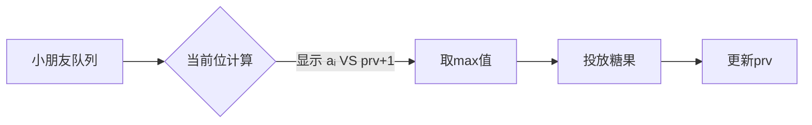

# 题目信息

# [GESP202506 三级] 分糖果

## 题目描述

有 $n$ 位小朋友排成一队等待老师分糖果。第 $i$ 位小朋友想要至少 $a_i$ 颗糖果，并且分给他的糖果数量必须比分给前一位小朋友的糖果数量更多，不然他就会不开心。

老师想知道至少需要准备多少颗糖果才能让所有小朋友都开心。你能帮帮老师吗？

## 说明/提示

对于所有测试点，保证 $1 \leq n \leq 1000$，$1 \leq a_i \leq 10^9$。


## 样例 #1

### 输入

```
4
1 4 3 3```

### 输出

```
16```

## 样例 #2

### 输入

```
15
314 15926 53589793 238462643 383279502 8 8 4 1 9 7 1 6 9 3```

### 输出

```
4508143253```

# AI分析结果


### 💡 Kay的C++算法解析：分糖果 深入学习指南 💡

**引言**  
今天我们分析"分糖果"这道贪心算法题。小朋友排成一队，每位需满足最小糖果数且严格递增的约束，求最小总糖果数。本指南将带您掌握贪心策略的核心思想与实现技巧。

---

## 1. 题目解读与核心算法识别  
✨ **本题主要考察**：`贪心算法`  

🗣️ **初步分析**  
> 本题如同"搭建糖果楼梯"：每个台阶（小朋友）必须比前一个台阶高（糖果数递增），同时台阶高度不能低于自身要求（≥aᵢ）。贪心策略的核心是**局部最优保证全局最优**——每一步给当前小朋友尽可能少的糖果（同时满足约束），从而最小化总和。  
> - **关键操作**：遍历时取 `max(aᵢ, 前一位糖果+1)` 作为当前值  
> - **可视化设计**：像素动画将展示小朋友队列（8-bit小人），高亮当前计算位置，动态显示`aᵢ`与`前值+1`的比较过程（数字气泡碰撞特效），确定值后播放"糖果投放"音效  
> - **复古元素**：采用FC红白机风格，通关音效（上扬8-bit和弦）在计算完成时触发

---

## 2. 精选优质题解参考  
**题解一（作者：chen_zhe）**  
* **点评**：  
  思路直击本质——用`prv`记录前值，`cur=max(aᵢ, prv+1)`的推导清晰展现了贪心选择（⭐⭐⭐⭐⭐）。代码简洁规范：  
  - 变量名`prv`/`cur`准确体现状态传递（👍 可读性）  
  - 用`long long`防溢出（👍 实践严谨性）  
  - 循环内嵌核心逻辑（👍 空间复杂度O(1)）  
  作者特别提醒数据范围陷阱："4508143253"等大数需用`long long`，这是竞赛常见踩坑点。

---

## 3. 核心难点辨析与解题策略  
1. **难点：如何满足双重约束？**  
   * **分析**：每个位置受`aᵢ`（自身需求）和`prv+1`（序列约束）限制。贪心解取二者最大值，既满足递增性又避免浪费  
   * 💡学习笔记：**约束拆解**是贪心关键——将复杂条件分解为独立决策点  

2. **难点：为什么必须顺序处理？**  
   * **分析**：后位依赖前位结果（`prv`），逆序或乱序会导致约束断裂。优质题解用`prv=cur`实现状态传递  
   * 💡学习笔记：**单向依赖链**适用顺序贪心  

3. **难点：大数处理陷阱**  
   * **分析**：当Σaᵢ > 2×10⁹时`int`溢出。题解用`long long tot/prv`彻底规避  
   * 💡学习笔记：**10⁹级求和必用long long**  

### ✨ 解题技巧总结  
- **技巧1 边界初始化**：`prv=0`使首位逻辑统一（`max(a₀,1)=a₀`）  
- **技巧2 即时更新**：`prv=cur`在循环内同步传递状态  
- **技巧3 数据类型预判**：输入含10⁹时立即启用`long long`  

---

## 4. C++核心代码实现赏析  
**通用核心实现**  
```cpp
#include <iostream>
using namespace std;

int main() {
    int n; 
    cin >> n;
    long long tot = 0, prv = 0; // 关键：long long防溢出
    
    for (int i = 0; i < n; ++i) {
        int a;
        cin >> a;
        long long cur = max((long long)a, prv + 1); // 双重约束取大值
        tot += cur;
        prv = cur; // 状态传递
    }
    cout << tot;
    return 0;
}
```
**代码解读概要**：  
> - `prv`初始化为0使首位无需特判  
> - `cur=max(a, prv+1)` 同时满足递增性和最小值要求  
> - `tot`累加时自动类型提升为`long long`  

**题解片段赏析**  
```cpp
long long cur = max((long long)a, prv + 1); // 核心决策点
tot += cur;
prv = cur; 
```
* **亮点**：类型转换`(long long)a`与`prv+1`同维度比较  
* **代码解读**：  
  > 为何需要强制转换？👉 因为`prv+1`是`long long`，若`a`为`int`直接比较会导致`prv+1`被截断！这是隐藏的精度陷阱。  
  > `prv=cur`如何工作？👉 如同接力棒传递，当前值成为下一位的"前值"基准  
* 💡学习笔记：**显式类型转换避免隐式截断**

---

## 5. 算法可视化：像素动画演示  
**主题**：8-bit糖果工厂流水线  

**演示逻辑**：  


**关键动画设计**：  
1. **像素场景**：  
   - 小朋友为8-bit像素小人（不同发色区分位置）  
   - 头顶气泡显示`aᵢ`（蓝色）和`prv+1`（黄色）  

2. **交互控制**：  
   ```javascript
   // 伪代码示例
   const animation = {
     step: () => {
        highlight(currentKid); // 红框高亮当前位
        showComparison(a_i, prv+1); // 气泡数字对撞动画
        playSound("select"); // 8-bit选择音效
        cur = max(a_i, prv+1); 
        dropCandy(cur); // 糖果下落动画
        prv = cur; // 传递发光效果到下一位
     }
   }
   ```

3. **游戏化元素**：  
   - **音效**：数字碰撞("叮") → 糖果投放("咔哒") → 通关("胜利和弦")  
   - **进度奖励**：每5位解锁新糖果皮肤  
   - **AI演示模式**：自动流水线速度可调（滑块控制）  

---

## 6. 拓展练习与相似问题思考  
**通用迁移场景**：  
1. 最短时间任务调度（约束：任务间冷却时间）  
2. 最小爬楼梯成本（每步跨1/2阶，代价约束）  
3. 队列重构（身高+序号双重排序）  

**洛谷推荐**：  
1. **P1090 [NOIP2004] 合并果子**  
   🗣️ 同款贪心思想+优先队列实现  
2. **P1223 排队接水**  
   🗣️ 贪心排序经典题，强化时序约束理解  
3. **P5019 [NOIP2018] 铺设道路**  
   🗣️ 贪心模拟进阶，培养分段处理思维  

---

## 7. 学习心得与经验分享  
**作者经验摘录**：  
> "当`a_i`接近10⁹且`n`较大时，累加和可能达10¹²量级——这是`int`的百倍以上！"  

**Kay点评**：  
> 该经验直击竞赛核心痛点：**数据范围决定数据类型**。建议：  
> - 看到`10^9`和`n≤1000`立即反应：Σ可能达`10¹²` → 必用`long long`  
> - 调试时输出中间变量范围（如`prv`）可快速定位溢出  

---

**结语**  
通过贪心的"糖果楼梯"模型，我们学会了用`max(aᵢ, prv+1)`平衡双重约束。记住：类型安全与逐步迭代是贪心算法的双翼！下次遇到序列约束问题，不妨回想这些像素小人的糖果之旅哦~ 🎮🍬

---
处理用时：136.83秒