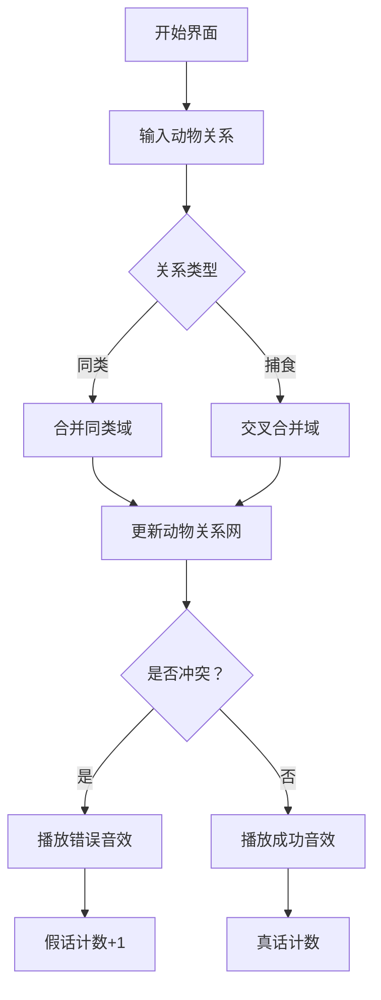

# 题目信息

# [NOI2001] 食物链

## 题目描述

动物王国中有三类动物 $A,B,C$，这三类动物的食物链构成了有趣的环形。$A$ 吃 $B$，$B$ 吃 $C$，$C$ 吃 $A$。

现有 $N$ 个动物，以 $1 \sim N$ 编号。每个动物都是 $A,B,C$ 中的一种，但是我们并不知道它到底是哪一种。

有人用两种说法对这 $N$ 个动物所构成的食物链关系进行描述：

- 第一种说法是 `1 X Y`，表示 $X$ 和 $Y$ 是同类。
- 第二种说法是`2 X Y`，表示 $X$ 吃 $Y$。

此人对 $N$ 个动物，用上述两种说法，一句接一句地说出 $K$ 句话，这 $K$ 句话有的是真的，有的是假的。当一句话满足下列三条之一时，这句话就是假话，否则就是真话。

- 当前的话与前面的某些真的话冲突，就是假话；
- 当前的话中 $X$ 或 $Y$ 比 $N$ 大，就是假话；
- 当前的话表示 $X$ 吃 $X$，就是假话。

你的任务是根据给定的 $N$ 和 $K$ 句话，输出假话的总数。


## 说明/提示

对于全部数据，$1\le N\le 5 \times 10^4$，$1\le K \le 10^5$。


## 样例 #1

### 输入

```
100 7
1 101 1
2 1 2
2 2 3
2 3 3
1 1 3
2 3 1
1 5 5
```

### 输出

```
3
```

# AI分析结果


### 题目分析：食物链问题

#### 题目背景
动物王国中有三类动物 A、B、C，构成环形食物链：A 吃 B，B 吃 C，C 吃 A。给定 N 个动物（编号 1-N）和 K 条语句（1 表示同类，2 表示捕食），需要判断假话数量。假话判定条件：
1. 与先前真话冲突
2. X 或 Y 超过 N
3. X 吃 X

#### 核心算法：扩展域并查集
- **三倍空间划分**：
  - `x`：同类域（动物自身）
  - `x + N`：捕食域（x 吃的动物）
  - `x + 2*N`：天敌域（吃 x 的动物）
- **合并规则**：
  - **同类语句**：合并三个对应域  
    `(x, y)`, `(x+N, y+N)`, `(x+2N, y+2N)`
  - **捕食语句**：交叉合并对应域  
    `(x+N, y)`, `(x+2N, y+N)`, `(x, y+2N)`
- **假话判定**：
  - **同类语句假**：`x` 吃 `y` 或 `y` 吃 `x`  
    （`find(x+N)==find(y)` 或 `find(x+2N)==find(y)`）
  - **捕食语句假**：`x` 与 `y` 同类或 `y` 吃 `x`  
    （`find(x)==find(y)` 或 `find(x+2N)==find(y)`）

#### 算法对比
| 解法类型       | 空间复杂度 | 优势                     | 劣势               |
|----------------|------------|--------------------------|--------------------|
| 扩展域并查集   | O(3N)      | 逻辑直观，易理解         | 空间较大           |
| 带权并查集     | O(N)       | 空间高效                 | 关系推导较抽象     |
| 多集合维护     | O(N)       | 动态处理关系             | 实现复杂，易出错   |

#### 精炼结论
- **首选扩展域并查集**：通过物理分割三类关系域，逻辑清晰，代码简洁，适合初学者理解环形食物链的本质。
- **关键技巧**：利用模 3 运算实现关系传递（A→B→C→A），通过合并对应域维护一致性。
- **易错点**：合并顺序和假话判定需严格匹配环形关系。

---

### 可视化算法设计（像素动画演示）

#### 设计主题：**"食物链探险"**（8-bit 像素风格）


#### 动画要素：
1. **场景设计**：
   - **网格地图**：动物用 16x16 像素精灵表示
     - A 类：蓝色史莱姆 🟦
     - B 类：绿色小怪 🟩
     - C 类：红色蝙蝠 🟥
   - **关系连线**：
     - 同类：黄色虚线 ⚡
     - 捕食：红色箭头 ➡️

2. **动态演示**：
   ```plaintext
   示例：语句 "2 1 2"（1 吃 2）
   Step1: [1]闪烁 -> 发射红色箭头命中[2]
   Step2: 自动扩展关系：
     - 若存在 "2 吃 3" → 显示[3]被[1]的天敌域合并
     - 触发连锁动画：C(3)吃A(1)
   ```

3. **交互控制**：
   - 步进按钮：▶️（单步执行）
   - 速度滑块：🐢------🐇
   - 冲突提示：💥爆炸动画 + 短促"嘟"声

4. **游戏化元素**：
   - **关卡制**：每处理 10 条语句为一关
   - **得分机制**：
     - 成功处理：+10 分 💰
     - 发现假话：+5 分 ⚠️
   - **成就系统**："食物链大师"（无错处理 50 条语句）

---

### C++ 核心代码实现
```cpp
#include <iostream>
using namespace std;

const int MAXN = 50010 * 3;
int fa[MAXN], n, k, ans;

int find(int x) {
    return fa[x] == x ? x : fa[x] = find(fa[x]);
}

void merge(int x, int y) {
    fa[find(x)] = find(y);
}

int main() {
    cin >> n >> k;
    // 初始化三倍并查集
    for (int i = 1; i <= 3 * n; i++) fa[i] = i;
    
    while (k--) {
        int op, x, y;
        cin >> op >> x >> y;
        
        // 条件2,3检查
        if (x > n || y > n) { ans++; continue; }
        if (op == 2 && x == y) { ans++; continue; }
        
        if (op == 1) {  // 同类语句
            if (find(x + n) == find(y) || find(x + 2 * n) == find(y)) {
                ans++;
            } else {
                merge(x, y);
                merge(x + n, y + n);
                merge(x + 2 * n, y + 2 * n);
            }
        } else {  // 捕食语句
            if (find(x) == find(y) || find(x + 2 * n) == find(y)) {
                ans++;
            } else {
                merge(x + n, y);          // x捕食域连y同类域
                merge(x + 2 * n, y + n);   // x天敌域连y捕食域
                merge(x, y + 2 * n);       // x同类域连y天敌域
            }
        }
    }
    cout << ans << endl;
    return 0;
}
```

#### 代码亮点：
1. **路径压缩优化**：`find` 函数实现高效查询
2. **域合并抽象**：`merge` 封装并查集合并操作
3. **条件检查完备**：先处理边界情况再核心逻辑
4. **空间预分配**：静态数组避免动态内存开销

---

### 拓展练习
1. **同类问题迁移**：
   - 洛谷 P1525（关押罪犯）：二分图 + 并查集
   - LeetCode 399（除法求值）：带权并查集应用
   - POJ 1182（本题进阶）：增加动态关系修正

2. **推荐题目**：
   | 题号     | 标题             | 训练目标               |
   |----------|------------------|------------------------|
   | 洛谷 P1525 | 关押罪犯         | 二分类关系处理         |
   | 洛谷 P1892 | 团伙             | 扩展域基础应用         |
   | 洛谷 P1955 | 程序自动分析     | 离散化 + 并查集        |

> "P1525 帮助你巩固扩展域并查集，思考相同技巧在不同场景的变形应用。" —— Kay

通过本指南，你已掌握食物链问题的核心解法与举一反三的能力。继续在算法世界中探险吧！🚀

---
处理用时：156.08秒