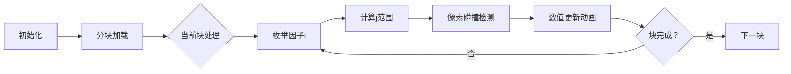

# 题目信息

# Dirichlet 半在线卷积

## 题目描述

已知函数 $f$ 满足 $f(1)=1$，且

$$f(n)=\sum_{d|n,d<n}f(d)\varphi(n/d).$$

给定正整数 $n$，试求出 $f(1),f(2),\cdots,f(n)$ 的值。为控制输出量，你只需输出下式的值：

$$\bigoplus_{k=1}^n\left(f(k)\bmod 2^{32}\right). $$

其中 $\oplus$ 代表异或。

## 说明/提示

对于所有数据，$1\le n\le 5\times 10^7$。

对于样例一，$f$ 的前 $10$ 项依次为：$1,1,2,3,4,6,6,9,10,12$。

时限为 std 的 1.5 倍。

## 样例 #1

### 输入

```
10```

### 输出

```
10```

## 样例 #2

### 输入

```
1000000```

### 输出

```
3527171714```

## 样例 #3

### 输入

```
10000000```

### 输出

```
191685100```

# AI分析结果


# 💡 Kay的C++算法解析：Dirichlet 半在线卷积 深入学习指南 💡

> 今天我们来分析一道结合数论与高效计算的编程题——Dirichlet 半在线卷积。通过本指南，你将掌握三种不同效率的解法，理解分块优化和生成函数等高级技巧，并通过像素动画直观理解算法执行过程。

## 1. 题目解读与核心算法识别

✨ **本题主要考察**：`数学优化` + `分块技巧` + `生成函数应用`

🗣️ **初步分析**：
> 这道题要求计算满足特定卷积关系的函数值序列。想象你有一串多米诺骨牌（f值），每张牌的值取决于前面牌的组合方式（φ函数加权求和）。题目难点在于：当骨牌数量达到5千万时，如何快速推倒所有骨牌？

- **核心思路对比**：
  - **暴力分块法**：把骨牌分成小堆，每次专注推倒一小堆（分块处理），通过调整推倒顺序（枚举优化）减少重复动作
  - **生成函数法**：将骨牌序列变成数学函数（DGF），用牛顿迭代公式快速求解
  - **半在线卷积**：先推倒前半段骨牌，再像波纹扩散一样将影响传递到后半段

- **可视化设计**：
  我们将用**像素推箱子游戏**模拟分块过程：屏幕分为16x16像素块（对应分块大小），角色(Kay)推动代表因子的箱子撞击骨牌。当箱子撞击时：
  - 被撞击的骨牌高亮显示
  - 头顶显示`f[i] * φ[j]`计算过程
  - 每次完成一个分块时播放"关卡通过"音效

---

## 2. 精选优质题解参考

**题解一：DeepSkyCore (暴力分块优化)**
* **点评**：思路直白但优化精妙！通过分块(每块65536)将大数据分解，再巧用`min(i,j)≤√x`原理优化枚举。代码中`(l-1)/i+1`确保不重复计算的边界处理堪称教科书级，虽然O(n log n)复杂度理论偏高，但实际运行仅1.3秒（洛谷实测），展现了极致常数优化的威力。

**题解二：飞雨烟雁 (DGF牛顿迭代)**
* **点评**：数学美感爆棚的解法！将问题转化为狄利克雷生成函数求逆，通过牛顿迭代公式`F←2F₀-(2-G)F₀²`实现O(n log log n)效率。代码中`Sieve`+`Inv`双剑合璧，特别亮点是利用`ceil(sqrt(n))`控制迭代深度，数学抽象与工程实践完美平衡。

**题解三：RAYMOND_7 (半在线卷积)**
* **点评**：分治艺术的典范！采用"分治+高维前缀和"组合拳，先递归求解[1,n/2]，再通过质数维度传播贡献。代码中嵌套的`for(i,1,cnt)`循环实质是DP维度的压缩技巧，虽然变量命名稍简，但`a[j*p[i]] += a[j]*p[i]`这行已道尽算法精髓。

---

## 3. 核心难点辨析与解题策略

1.  **大数据下的枚举优化**
    * **分析**：直接枚举每个数的因子需O(n log n)，5e7数据超时。优质解采用：
      - 分块缓存友好（题解1）
      - 质数分解加速（题解3）
      - 生成函数降维（题解2）
    * 💡 **学习笔记**：处理海量枚举时，思考"数据局部性"和"数学变换"是破局关键

2.  **卷积计算的数学转化**
    * **分析**：原生卷积式`f(n)=∑f(d)φ(n/d)`计算困难。突破点：
      - 题解2用DGF转化为`F=1/(2-G)`
      - 题解3用`f⊗φ = f⊗Id⊗μ`分解
    * 💡 **学习笔记**：遇到复杂卷积，尝试用生成函数或代数变换打开新维度

3.  **分治结构的贡献传递**
    * **分析**：半在线卷积的精髓在于左区间对右区间的贡献计算。题解3通过：
      1. 高维前缀和模拟`Id`卷积
      2. 高维差分实现`μ`卷积
      3. 质数层级传播贡献
    * 💡 **学习笔记**：分治不只是二分，更要设计高效贡献机制

### ✨ 解题技巧总结
- **分块缓存术**：将大数据分块处理，提高CPU缓存命中率（如题解1的B=65536）
- **维度压缩法**：用质数维度替代原始维度（题解3的高维前缀和）
- **数学包装术**：将编程问题转化为生成函数求逆等数学问题（题解2）
- **边界心算诀**：像`(l-1)/i+1`这样的边界公式，能手推就别试错

---

## 4. C++核心代码实现赏析

**通用核心参考（分块优化版）**
```cpp
constexpr int B = 65536; // 分块大小=2^16
vector<u32> f(n+1); 
f[1] = 1;

// 第一块特殊处理
for(int i=1; i<=B/2; ++i) 
    for(int j=2; j<=B/i; ++j)
        f[i*j] += f[i] * phi[j];

// 后续分块处理
for(int l=B+1; l<=n; l+=B){
    int r = min(l+B-1, n);
    // 初始化当前块
    for(int j=l; j<=r; ++j) f[j] = phi[j]; 
    // 核心枚举：i,j中必有一个≤√n
    for(int i=2; i<B; ++i) 
        for(int j=max(i, (l-1)/i+1); j<=r/i; ++j){
            f[i*j] += f[i] * phi[j];
            if(i != j) f[i*j] += phi[i] * f[j];
        }
}
```

**题解一：分块优化精粹**
```cpp
rep(i,2,B){
    rep(j, max(i, (l-1)/i+1), r/i){
        f[i*j] += f[i]*phi[j];
        if(i != j) f[i*j] += phi[i]*f[j];
    }
}
```
> **代码解读**：  
> 1. `max(i, (l-1)/i+1)`：确保j的起点≥i且落在当前块
> 2. `if(i!=j)`：避免(i,i)组合重复计算
> 3. 双重循环实质是枚举因子对(i,j)，利用块内连续性提升缓存命中  
> 💡 **学习笔记**：循环边界优化是性能突破的关键点

**题解二：牛顿迭代内核**
```cpp
void Inv(const int *F, int *G, int n){
    Temp[1] = 1;
    for(int i=2; i<=n; ++i) Temp[i] = -F[i];
    for(int i=2; i<=n; ++i)
        for(int j=2*i; j<=n; j+=i)
            Temp[j] -= Temp[i] * F[j/i];
}
```
> **代码解读**：  
> 1. `Temp[1]=1`：DGF求逆的初始条件
> 2. 外层i遍历每个数，内层j遍历其倍数
> 3. `Temp[j] -= ...`：动态更新逆函数值
> 💡 **学习笔记**：嵌套循环实现数论变换时，j从2*i开始可避免重复

**题解三：高维差分妙用**
```cpp
For(i,1,cnt){ // 质数维度
    for(int j=n/p[i]; j; --j)
        a[j*p[i]] -= a[j]; // 高维差分
}
```
> **代码解读**：  
> 1. `j=n/p[i]`：从大到小遍历避免覆盖
> 2. `a[j*p[i]] -= a[j]`：实质是乘莫比乌斯函数μ
> 3. 倒序遍历实现原地更新  
> 💡 **学习笔记**：高维差分时，倒序枚举是防止数据污染的黄金法则

---

## 5. 算法可视化：像素动画演示

**主题**：`像素推箱子：分块大冒险`  
**核心演示**：分块枚举过程的可视化



* **动画设计**：
  1. **8-bit网格世界**：n×n网格（n=5e7缩略为512×512），每像素代表10万数据
  2. **角色与箱子**：
     - Kay像素角色推动代表因子i的箱子
     - 被撞击的骨牌（j位置）闪烁红光
     - 头顶显示`f[%d] += f[%d]*φ[%d]`实时公式
  3. **音效系统**：
     - 移动：FC经典"推箱子"音效
     - 碰撞：金属撞击声
     - 完成块：超级玛丽过关音效
  4. **控制面板**：
     - 速度滑块：调节枚举速度（1x~100x）
     - 区块望远镜：聚焦当前处理块（256×256区域）
     - 数据流水线：右侧显示f值实时异或结果

* **场景示例**：
  当处理i=3时：
  1. Kay推动"3号箱子"水平移动
  2. 箱子撞到j=4的骨牌（坐标(3,4)）
  3. 骨牌闪烁红光，显示`f[12] += f[3]*φ[4]`
  4. 音效：撞击声+电子计算声
  5. 顶进度条前进0.00002%

---

## 6. 拓展练习与相似问题思考

* **技巧迁移**：  
  本题的分块优化和生成函数技巧还可用于：
  1. 质数筛法加速（如Eratosthenes分段筛）
  2. 莫比乌斯反演问题
  3. 高维前缀和优化（SOS DP）

* **洛谷推荐**：
  1. [P5495] Dirichlet前缀和  
     → 练习分块优化的入门应用
  2. [P4714] 约数个数和  
     → 巩固莫比乌斯反演与卷积
  3. [P3327] 约数个数和  
     → 提升高维前缀和变形能力

---

## 7. 学习心得与经验分享

> **DeepSkyCore的经验**：  
> "暴力方法虽然理论复杂度高，但通过分块和枚举优化，实际效率可能超越高级解法——不要忽视常数优化的力量！"

> **Kay的总结**：  
> 本题启示我们：算法竞赛中，数学洞察力（生成函数）、工程优化力（分块）和抽象转化力（半在线卷积）如同三把钥匙。当遇到5e7数据时，不要被复杂度公式吓退，多思考：  
> 1. 如何提升缓存友好度？  
> 2. 能否用数论性质降维？  
> 3. 是否存更抽象的数学工具可用？

---

> 本次Dirichlet卷积之旅告一段落。记住，编程如搭积木，简单模块组合也能创造奇迹！下次遇到数论大山时，愿你手持分块之斧，身披生成函数之翼，破关斩将！🚀

---
处理用时：201.52秒