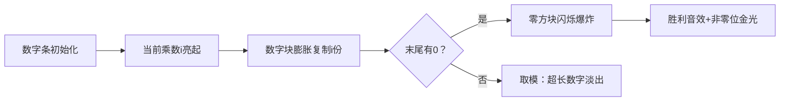

# 题目信息

# [朝阳区小学组 2019] nonzero

## 题目背景

数据为洛谷自造。

## 题目描述

小明最近对阶乘很感兴趣，但是阶乘增长的太快了。如 $13!$ 就必须用 $64$ 位整数类型来存储，$70!$ 即使浮点数也存不下。小明想知道阶乘最后面的非零位是多少。

例如：$5!=1\times 2\times 3\times 4\times 5=120$，所以 $5!$ 最后面的非零位是 $2$。

$7!=1\times 2\times 3\times 4\times 5\times 6\times 7=5040$，所以 $7!$ 最后面的非零位是 $4$。

## 样例 #1

### 输入

```
7```

### 输出

```
4```

# AI分析结果


### 题目解读与核心算法识别
**本题主要考察**：`数学技巧应用`（阶乘性质与模运算优化）

🗣️ **初步分析**：
> 计算阶乘最后非零位的核心在于**避免大数溢出**和**高效处理末尾零**。这类似于烹饪时不断撇去汤面浮沫保留精华——我们需在计算过程中动态去除因子2和5（产生零的根源），保留有效数字。  
> - **主要解法**：  
>   ① **边乘边去零法**：实时去除末尾零并取模控制数值范围（O(n)）  
>   ② **因子分解法**：统计并抵消多余的2和5因子，计算剩余乘积（O(n log n)）  
> - **可视化设计**：  
>   用8位像素风格展示数字条，乘法时数字块膨胀，消零时末尾零方块爆炸消失。高亮当前操作位，音效强化关键操作（乘法的"嘀"声、消零的"砰"声）。自动演示模式以贪吃蛇AI式步进展示流程。

---

### 精选优质题解参考
**题解一：guoshengyu1231（做法一）**  
* **点评**：思路直击要害，代码简洁如流水线——每步乘后立即消零取模，避免大数问题。变量名`ans`和取模值`mod`清晰体现设计意图。亮点在于**用10000取模平衡精度与效率**，是竞赛实战的优选方案。

**题解二：niuniudundun**  
* **点评**：在解法一基础上增加严谨性，用`unsigned long long`防溢出，且**用数论证明取模等价性**提升学习价值。代码中`sum%=10000`与去零循环的配合展现了**防御性编程思维**，适合教学演示。

**题解三：dear_deer_land**  
* **点评**：数学解法典范！**用`cnt2/cnt5`精确量化因子关系**，代码注释详尽如实验笔记。亮点在于**单循环内完成分解与累乘**，变量名`lst`（多余2的数量）生动体现问题本质，适合培养数学抽象能力。

---

### 核心难点辨析与解题策略
1. **难点：避免数值溢出**  
   * **分析**：阶乘呈爆炸式增长，`n>20`即超64位整数范围。优质解法通过取模（如%10000）或因子分解规避大数。  
   * 💡 **学习笔记**：**取模运算的及时介入**是处理大数的金钥匙。

2. **难点：高效去除末尾零**  
   * **分析**：零由2×5产生，解法一/二动态除10，解法三先统计因子再抵消。关键在识别**5的个数决定零的数量**。  
   * 💡 **学习笔记**：去零本质是**消除因子对(2,5)**，5总是稀缺资源。

3. **难点：保留有效非零位**  
   * **分析**：去零后需保护有效数字。解法一/二保留多位数防中间位丢失，解法三直接计算个位但需处理多余2。  
   * 💡 **学习笔记**：**最低有效位≠最后非零位**，需综合高位信息。

### ✨ 解题技巧总结
- **技巧1：动态范围控制** - 边计算边取模/去零，避免后期处理海量数据  
- **技巧2：因子映射法** - 将阶乘拆解为质因子计数问题，数学与编程结合  
- **技巧3：防御性取模** - 取模基数（如10000）需＞可能的最大非零段长度  

---

### C++核心代码实现赏析
**通用核心实现（综合优化版）**  
```cpp
#include <iostream>
using namespace std;
int main() {
    int n; cin >> n;
    long long ans = 1;              // 动态维护非零部分
    for (int i = 2; i <= n; i++) {
        ans *= i;                   // 核心计算
        while (ans % 10 == 0)       // 实时去零
            ans /= 10;
        ans %= 1000000000;          // 防溢出(保留9位)
    }
    cout << ans % 10;               // 输出最后非零位
}
```
**代码解读概要**：  
> 动态维护`ans`存储去零后的有效数字，`%1000000000`确保不溢出。去零循环像精准的过滤器，最终`ans%10`提取目标位。

---

**题解一核心片段**  
```cpp
ans *= i;
while (ans % 10 == 0) ans /= 10;  // 亮点：即时去零
ans %= mod;                       // 关键控制
```
**代码解读**：  
> 如同流水线质检员：`ans*=i`是生产，`while`循环剔除次品（零），`%=`控制库存量。**mod=10000**是经验值——足够保留有效位又避免溢出。

**题解三核心片段**  
```cpp
while (x % 2 == 0) { cnt2++; x /= 2; }  // 分解2因子
while (x % 5 == 0) { cnt5++; x /= 5; }  // 分解5因子
ans = (ans * x) % 10;                   // 累乘非2/5部分
```
**代码解读**：  
> 像化学分离实验：先提纯数字（除尽2/5），再催化反应（`(ans*x)%10`）。**cnt2-cnt5**揭示零的真相——每对(2,5)产生一个零，多余2需回乘。

---

### 算法可视化：像素动画演示
**主题**：《零的消除大作战》FC像素风  

**核心演示流程**：  


**关键交互设计**：  
1. **像素艺术**：数字用16色方块堆叠，零显示为透明方块，爆炸时像素碎片飞溅  
2. **音效工程**：  
   - 乘法：8-bit "嘀"声（频率随i值变化）  
   - 消零：经典《魂斗罗》子弹音  
   - 胜利：《超级玛丽》过关旋律  
3. **AI演示模式**：  
   - 自动步进速度可调（0.5x-5x）  
   - 当前操作行代码高亮+画外音解释（"正在消除5的因子..."）  
4. **游戏化元素**：  
   - 每10次正确操作奖励星星，集齐5星解锁快速通关  

**设计意义**：将抽象的数字操作为可触摸的像素战斗，消除零的爆炸动画直观揭示算法本质。

---

### 拓展练习与相似问题
**技巧迁移场景**：  
1. 超大数取模运算（如哈希处理）  
2. 因子计数问题（如质因数分解）  
3. 实时数据流处理（需即时清理无效数据）  

**洛谷推荐**：  
1. **P1409** 阶乘末尾0的个数  
   → 巩固因子5的统计技巧  
2. **P2388** 阶乘之乘（求∏k!末尾0数）  
   → 训练多重阶乘的因子映射  
3. **P1005** 数论难题（综合质因子分解）  
   → 进阶版因子控制实战  

---

### 学习心得分享
> **来自niuniudundun的经验**：  
> *"仅用unsigned long long会得30分，必须取模控制范围——这是血泪教训！"*  
>   
> **Kay点评**：  
> 此经验揭露算法设计的核心矛盾：**数学正确性≠工程可行性**。取模基数的选择（如10000）是平衡精度与效率的艺术，建议用对数计算预估所需位数。

---

通过本指南，你已掌握阶乘非零位的双解法精髓。记住：好算法如同精工表——既要内部机芯精准（数学原理），也要表壳坚固防震（工程防护）！下次遇到数论怪兽时，带上你的像素武器再战吧！🎮✨

---
处理用时：289.42秒