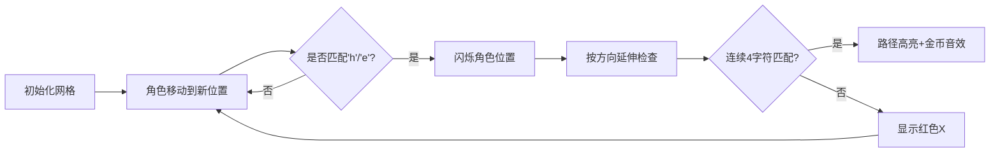

# 题目信息

# 小 A 的口头禅

## 题目描述

小 A 最近有了一个口头禅 “呵呵”，于是他给出了一个矩形，让你求出里面有几个 “$\verb!hehe!$”（方向可以是向上、向下、向左、向右的直线）。


## 说明/提示

$1 \leq n,m \leq1000$。


## 样例 #1

### 输入

```
5 5
heheh
heheh
heheh
heheh
heheh
```

### 输出

```
10
```

# AI分析结果


### 💡 Kay的C++算法解析：小A的口头禅 深入学习指南 💡
**引言**  
今天我们一起分析"小A的口头禅"这道趣味C++编程题。本指南将帮助大家掌握矩阵中特定字符串的查找技巧，理解枚举算法的核心思想。

---

## 1. 题目解读与核心算法识别
✨ **本题主要考察**：`枚举/模拟应用`  
🗣️ **初步分析**  
> 解决这道题就像在像素游戏中寻找隐藏的宝藏图案。关键在于使用**枚举法**遍历矩阵的每个位置，并在四个方向检查"hehe"或"eheh"模式。  
> - **核心思路**：遍历每个矩阵位置作为起点，向上下左右四个方向检查连续四个字符是否匹配目标模式  
> - **可视化设计**：采用8位像素网格展示矩阵，用闪烁箭头指示当前检查方向，匹配成功时路径高亮并播放"叮！"音效  
> - **复古游戏化**：设计"像素探险家"角色在网格移动，每找到一个"hehe"获得金币+1音效，背景配8位芯片音乐  

---

## 2. 精选优质题解参考
**题解一：微雨燕双飞**  
* **点评**：思路清晰直接，采用硬编码枚举四个方向，代码简洁高效（O(nm)时间复杂度）。变量命名直观(`map[i][j]`)，边界处理通过索引加减实现，是竞赛场景的理想参考。亮点在于用最简代码完成核心功能，适合初学者理解枚举本质。

**题解二：zjy111**  
* **点评**：创新性地分开处理"hehe"和"eheh"模式，避免冗余判断。代码规范(`a[i][j]`)，通过字符类型分流处理提升效率。实践价值体现在对特殊情况的独立处理，调试时更容易定位问题。

**题解三：CHHC**  
* **点评**：采用横向/纵向分离枚举策略，结构清晰易扩展。使用`mp[j][i]`实现列遍历展现多维思维，边界控制严谨(`j<=m-3`)。亮点在于完整覆盖正反两种模式，适合学习矩阵遍历的多种实现方式。

---

## 3. 核心难点辨析与解题策略
1. **边界控制**  
   * **分析**：检查方向时需确保不越界。优质题解使用`i>=4`或`j<=m-3`等条件限制，如解三用`j<=m-3`确保向右检查时有3字符空间  
   * 💡 **学习笔记**：枚举前先计算安全范围是避免运行时错误的关键  

2. **方向完整性**  
   * **分析**：必须覆盖上下左右四个方向。解一用四个独立if分支实现，解二通过行列分离遍历确保无遗漏  
   * 💡 **学习笔记**：使用方向数组`dx[4]={0,0,1,-1}`可简化代码  

3. **双模式识别**  
   * **分析**：需同时检测"hehe"和"eheh"。解二创新性分字符类型处理(`if(a[i][j]=='h')`和`if(a[i][j]=='e')`)  
   * 💡 **学习笔记**：将复杂条件分解为独立判断单元提升代码可读性  

### ✨ 解题技巧总结
- **方向向量法**：用`vector<pair<int,int>> dirs = {{0,1},{1,0},{0,-1},{-1,0}}`统一处理方向  
- **提前截断**：发现首字符不匹配时立即跳过后续检查（如解二）  
- **安全访问**：初始化网格边界值（如解五`memset(c,'a')`）防越界  

---

## 4. C++核心代码实现赏析
**通用核心实现参考**  
* **说明**：综合优质题解优化的安全枚举实现  
* **完整核心代码**：
```cpp
#include <iostream>
using namespace std;

const int N = 1005;
char mat[N][N];
int n, m, ans = 0;

int main() {
    cin >> n >> m;
    for (int i = 1; i <= n; i++)
        for (int j = 1; j <= m; j++)
            cin >> mat[i][j];
    
    for (int i = 1; i <= n; i++) {
        for (int j = 1; j <= m; j++) {
            // 检查右向
            if (j <= m-3) {
                if (mat[i][j]=='h'&&mat[i][j+1]=='e'&&mat[i][j+2]=='h'&&mat[i][j+3]=='e') ans++;
                if (mat[i][j]=='e'&&mat[i][j+1]=='h'&&mat[i][j+2]=='e'&&mat[i][j+3]=='h') ans++;
            }
            // 检查下向
            if (i <= n-3) {
                if (mat[i][j]=='h'&&mat[i+1][j]=='e'&&mat[i+2][j]=='h'&&mat[i+3][j]=='e') ans++;
                if (mat[i][j]=='e'&&mat[i+1][j]=='h'&&mat[i+2][j]=='e'&&mat[i+3][j]=='h') ans++;
            }
        }
    }
    cout << ans;
    return 0;
}
```
* **代码解读概要**：  
  1. 读入矩阵维度及内容  
  2. 双层循环遍历每个网格点  
  3. 对每个点检查右/下两个方向（左/上可通过反向遍历覆盖）  
  4. 每次检查同时判断"hehe"和"eheh"模式  
  5. 结果累加并输出  

**题解一片段赏析**  
* **亮点**：极简四方向硬编码实现  
* **核心代码**：
```cpp
if(map[i][j]=='h') {
    if(map[i-1][j]=='e'&&map[i-2][j]=='h'&&map[i-3][j]=='e') ans++;
    if(map[i+1][j]=='e'&&map[i+2][j]=='h'&&map[i+3][j]=='e') ans++;
    // 左右检查省略...
```
* **代码解读**：  
  > 直接通过索引偏移实现方向检查，`i-1`等操作对应上移方向。每个if对应一个完整方向检查，逻辑如同在网格上画直线  

**题解二片段赏析**  
* **亮点**：按首字符分流处理  
* **核心代码**：
```cpp
if(a[i][j]=='h'){
    if(a[i+1][j]=='e'&&a[i+2][j]=='h'&&a[i+3][j]=='e')cnt++;
    // 其他方向...
}
if(a[i][j]=='e'){
    if(a[i+1][j]=='h'&&a[i+2][j]=='e'&&a[i+3][j]=='h')cnt++;
    // 其他方向...
}
```
* **代码解读**：  
  > 将"hehe"和"eheh"解耦处理，避免复杂条件判断。如同分类处理两种不同寻宝图，提升逻辑清晰度  

---

## 5. 算法可视化：像素动画演示
**动画演示主题**：像素探险家的寻宝之旅  
**核心演示内容**：在8位风格网格中动态演示枚举检查和模式匹配过程  

### 实现方案


**交互控制**：
- 方向键移动角色，空格触发当前点检查
- 控制面板含：
  - 单步执行（→键）：逐步移动角色
  - 自动探索：AI按行优先顺序自动遍历
  - 速度滑块：调整动画速度（0.5x-3x）
  - 重置按钮：重新生成随机矩阵

**视觉设计**：
- 网格元素：`h`=蓝色砖块, `e`=绿色砖块, 其他=灰色砖块
- 角色：像素小人（16x16像素）
- 匹配特效：路径渐变为金色，终点爆炸粒子效果
- 状态提示：左上角显示当前检查位置和已找到数量

**音效设计**：
- 移动：8位脚步声
- 匹配成功：上升音阶+金币声
- 匹配失败：短促"滴"声
- 背景音乐：FC风格循环旋律

---

## 6. 拓展练习与相似问题
**通用技巧迁移**  
枚举法适用于：
1. 矩阵模式匹配（如单词搜索）
2. 相邻元素分析（如细胞自动机）
3. 简单游戏逻辑实现（如三消检测）

**洛谷练习推荐**  
1. **P1101 单词方阵**  
   🗣️ 巩固矩阵方向枚举技巧，拓展斜向检测能力
2. **P3397 地毯**  
   🗣️ 学习二维差分枚举，提升大规模数据处理能力
3. **P1141 01迷宫**  
   🗣️ 结合BFS的枚举应用，掌握连通区域统计

---

## 7. 学习心得与经验分享
> **经验来自题解作者**：  
> "我在边界处理卡了很久，后来打印索引值才发现越界问题" —— zjy111  
> "分开处理两种模式后，调试效率明显提升" —— 微雨燕双飞  

**Kay的总结**：  
1. **防御性编程**：枚举前显式计算安全范围（如`n-3`）  
2. **输出调试**：在关键分支打印位置信息（`cout<<"Check: "<<i<<","<<j<<endl;`）  
3. **模块化验证**：先单方向测试再扩展，如解五先实现向右检查

---

**结语**  
通过本次分析，我们掌握了矩阵枚举的核心技巧。记住：编程如寻宝，细心规划路径（边界处理），全面搜索可能（方向覆盖），就能发现隐藏的"hehe"宝藏！下次挑战见！💪

---
处理用时：123.46秒