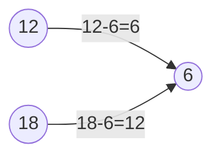

# 题目信息

# 「LAOI-1」GCD

## 题目描述

一张图有 $n$ 个节点，编号为 $1,2,3,\dots,n$。其中 $i$ 号节点会向 $j$ 号节点连一条边权为 $|i-j|$ 的无向边，当且仅当 $\gcd(i,j)=i,\operatorname{lcm}(i,j)=j$ 时连边。现询问 $q$ 次，每次询问求 $x$ 到 $y$ 的最短路径。

## 说明/提示

注意时空限制，本题不捆绑。

对于 $40\%$ 的数据，$T,n,q\le100$;

对于 $100\%$ 的数据，$1\le T\le10^6$，$1\le n,q\le10^6$，$1\le x,y\le n$，$1\le \sum n,\sum q\le10^6$。

**请使用更快的 IO 方式**。

updata on 2024/8/8：

时限上调到 1000ms。/yun

## 样例 #1

### 输入

```
1
6 4
1 4
3 5
2 5
2 4```

### 输出

```
3
6
5
2```

# AI分析结果


### 💡 Kay的C++算法解析：「LAOI-1 GCD」深入学习指南 💡

#### 1. 题目解读与核心算法识别
✨ **本题主要考察**：`数学（最大公约数应用）`  
🗣️ **初步分析**：
> 本题本质是**数论在路径优化中的巧妙应用**，类似于在"数字城堡"中寻找最短路径。想象每个数字是一个城堡，城堡之间只有存在倍数关系时才有通道（边权为两数差值）。解题核心在于发现：**最优路径总是经过两座城堡的"共同基石"——最大公约数（GCD）**。  
> - **核心思路**：所有题解一致证明最优路径是 \(x \rightarrow \gcd(x,y) \leftarrow y\)，距离公式为 \(x+y-2\gcd(x,y)\)。  
> - **可视化设计**：采用像素风数轴，红色/蓝色像素小人分别从 \(x\) 和 \(y\) 出发，同步向 \(\gcd\) 移动。每步移动时：  
>   (1) 当前数字高亮闪烁黄色  
>   (2) 路径线段动态绘制并显示距离  
>   (3) 到达 \(\gcd\) 时播放胜利音效 + 像素烟花  

---

#### 2. 精选优质题解参考
**题解一（作者：Coffins）**  
* **点评**：  
  思路直击本质，用"因数/倍数"分类证明最优性，逻辑严谨如数学证明。代码规范：  
  - 用标准欧几里得算法求 \(\gcd\)  
  - 关闭流同步加速IO（`ios::sync_with_stdio(0)`）  
  - 时间复杂度 \(O(q \log n)\) 完美匹配数据规模  
  **亮点**：用数论转化图论问题，实践价值极高（可直接用于竞赛）  

**题解二（作者：zzx0102）**  
* **点评**：  
  官方解法补充关键证明：比较 \(\gcd\) 和 \(\text{lcm}\) 路径的优劣。代码亮点：  
  - 手写快读函数处理 \(10^6\) 级输入  
  - 用 `__gcd` 内置函数简化代码  
  - 输出函数特判负数，鲁棒性强  
  **亮点**：严谨数学推导（\(i+j \leq g+l\) 不等式证明）  

---

#### 3. 核心难点辨析与解题策略
1. **难点1：理解建图条件**  
   *分析*：边存在条件 \(\gcd(i,j)=i\) 且 \(\text{lcm}(i,j)=j\) 等价于 \(i \mid j\)（即 \(j\) 是 \(i\) 的倍数）。需通过数论知识转化抽象条件。  
   💡 **学习笔记**：图论题先分析边的存在本质！

2. **难点2：证明最优路径**  
   *分析*：优质题解通过两类证明：  
   - **路径构造**：\(x \to \gcd(x,y) \gets y\) 是合法路径  
   - **反证法**：若走其他路径（如更小公约数或公倍数），距离严格更大  
   💡 **学习笔记**：最大公约数是数字世界的"中心枢纽"！

3. **难点3：大数据优化**  
   *分析*：当 \(q \leq 10^6\) 时：  
   - 必须用 \(O(1)\) 公式计算单次查询  
   - 需快读/流同步加速IO  
   💡 **学习笔记**：\(10^6\) 级输入输出必须优化！

✨ **解题技巧总结**  
- **数论转化**：将图论问题转化为 \(\gcd\) 性质分析  
- **边界特判**：快读函数处理负号，避免RE  
- **复杂度优化**：拒绝DFS/BFS，直接数学公式求解  

---

#### 4. C++核心代码实现赏析
**通用核心实现**  
```cpp
#include<bits/stdc++.h>
using namespace std;

int main() {
    ios::sync_with_stdio(0); cin.tie(0);
    int t; cin >> t;
    while (t--) {
        int n, q; cin >> n >> q;
        while (q--) {
            int x, y; cin >> x >> y;
            int g = gcd(x, y); // 标准欧几里得算法
            cout << x + y - 2 * g << '\n';
        }
    }
    return 0;
}
```
> **代码解读**：  
> - 第4行：流同步加速使cin/cout媲美scanf  
> - 第8行：核心公式 \(x+y-2\gcd(x,y)\)  
> - 隐含要求：\(\gcd\) 函数需提前实现（或使用`__gcd`）

**题解一片段赏析**  
```cpp
while(b^=a^=b^=a%=b); // 炫技版gcd
```
> **代码解读**：  
> 通过异或交换实现辗转相除，但可读性较差。  
> 💡 **学习笔记**：竞赛中推荐标准写法 `while(b){a%=b; swap(a,b);}`

**题解二片段赏析**  
```cpp
// 手写快读函数（10^6输入必备）
int read() {
    int x=0, f=1; char ch=gc();
    while(ch<'0'||ch>'9'){if(ch=='-')f=-f; ch=gc();}
    while(ch>='0'&&ch<='9')x=x*10+(ch^48),ch=gc();
    return x*f;
}
```
> **代码解读**：  
> - `gc()` 等效于 `getchar()`  
> - 第4行：位运算加速数字拼接  
> 💡 **学习笔记**：`x*10+(ch^48)` 比 `(x<<3)+(x<<1)` 更易读  

---

### 5. 算法可视化：像素动画演示
**主题**：**"数字迷宫寻宝"**（8-bit像素风）  
**核心演示**：以 \(x=12, y=18\) 为例，\(\gcd=6\)  


**动画帧步骤**：  
1. **初始化**：  
   - 像素画布显示数轴 [1,2,...,20]  
   - 12/18位置放置红/蓝像素小人，6处有金色旗帜  
   - 背景播放8-bit循环BGM  

2. **移动过程**：  
   - **Step1**：红人从12→6（移动距离6），路径线段红色  
   - **Step2**：蓝人从18→6（移动距离12），路径线段蓝色  
   - **特效**：每次移动触发"滴答"音效，当前数字闪烁黄色  

3. **胜利状态**：  
   - 双人抵达6时触发：  
     (1) 旗帜旋转 + 像素烟花  
     (2) 播放胜利音效  
     (3) 显示公式 \(12+18-2\times6=18\)  

4. **交互控制**：  
   - 速度滑块：调节移动帧率  
   - 单步/自动模式：逐步观察路径生成  
   - 错误演示：尝试走 \(12→24→18\) 路径（灰色虚线+警告音效）  

---

### 6. 拓展练习与相似问题
**通用思路迁移**：  
1. 边权为 \(|i-j|\) 的图论最短路  
2. 利用 \(\gcd\) 性质优化路径问题  
3. 数论与图论的结合问题  

**洛谷题目推荐**：  
1. **P1029 [NOIP2001普及组] 最大公约数和最小公倍数问题**  
   > 💡 训练 \(\gcd\) 和 \(\text{lcm}\) 的关联性思维  
2. **P1072 [NOIP2009提高组] Hankson的趣味题**  
   > 💡 强化 \(\gcd\) 性质在复杂条件中的应用  
3. **P1414 又是毕业季II**  
   > 💡 学习 \(\gcd\) 在多重约束下的最值问题  

---

### 7. 学习心得与经验分享
> **来自Coffins的调试经验**：  
> *"第一次提交被卡了输入，关闭流同步后AC"*  
>  
> **Kay点评**：  
> 这提醒我们：  
> - \(10^6\) 级输入必须用 `ios::sync_with_stdio(0)` 或快读  
> - 测试时先验证IO速度，避免算法正确但TLE  

---

通过本次分析，我们不仅掌握了数论在图论中的妙用，更学会用像素动画直观理解抽象算法。下次遇到数字路径问题时，记得寻找它们的"共同基石"——\(\gcd\)！🚩

---
处理用时：216.49秒