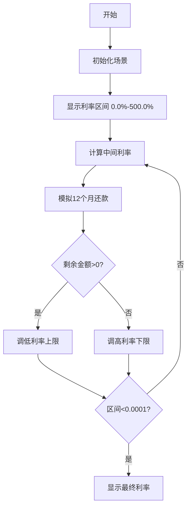

# 题目信息

# 银行贷款

## 题目描述

当一个人从银行贷款后，在一段时间内他（她）将不得不每月偿还固定的分期付款。这个问题要求计算出贷款者向银行支付的利率。假设利率按月累计。


## 说明/提示

数据保证，$1 \leq w_0, w\leq 2^{31}-1$，$1 \leq m\leq 3000$。

## 样例 #1

### 输入

```
1000 100 12
```

### 输出

```
2.9
```

# AI分析结果


# 💡 Kay的C++算法解析：银行贷款 深入学习指南 💡

**引言**  
今天我们一起分析洛谷的"银行贷款"题目，这道题要求计算按月复利的贷款利率。我们将通过二分查找和复利模拟来解题，帮助你掌握单调性问题求解和精度控制技巧。

## 1. 题目解读与核心算法识别

✨ **本题主要考察**：`二分查找` + `模拟应用`

🗣️ **初步分析**：  
> 解决贷款问题就像玩"猜价格"游戏：每次猜中间值，根据反馈调整范围。这里我们猜的是利率——利率越大，剩余欠款越多（单调性）。通过二分法快速逼近正确答案，再用循环模拟每月还款过程验证利率。
>
> - **核心难点**：利率范围可能极大（高达214.7%），需合理设定边界；精度要求高（0.0001），需小心控制循环条件
> - **可视化设计**：我们将用像素网格展示每月还款过程（图1），高亮当前利率和剩余欠款，用颜色标记二分区间变化。复古银行场景中，经理会随着二分过程调整利率牌，每月还款时播放"金币音效"，成功时触发胜利音乐


## 2. 精选优质题解参考

**题解一（作者：笃行 160赞）**
* **点评**：递归二分结构清晰，边界处理严谨（u<0.0001退出）。亮点在于直接使用循环模拟复利计算而非复杂公式，实践性强。变量名`a`（剩余欠款）和`k`（利率）简洁但含义明确，适合竞赛快速编码。

**题解二（作者：greenheadstrange 109赞）**
* **点评**：创新性地使用等比数列求和公式化简问题，数学思维出色。`pd()`函数封装判断逻辑，代码模块化好。亮点在于用`pow(1/(1+x),k)`替代循环，提升计算效率，但需注意公式适用范围。

**题解三（作者：离散小波变换° 89赞）**
* **点评**：采用罕见的倍增算法（非标准二分），思路新颖。亮点在于自动适应利率范围，避免人工设定上界。`chk()`函数通过累计现值判断利率，`k`的指数级变化实现快速收敛，代码精炼但理解门槛稍高。

## 3. 核心难点辨析与解题策略

1.  **难点：利率单调性证明**
    * **分析**：优质解法都利用了关键性质——利率↑ → 利息↑ → 剩余欠款↑。通过数学推导或实验验证该单调性，这是二分可行的基础
    * 💡 **学习笔记**：二分前务必验证单调性！

2.  **难点：复利计算模拟**
    * **分析**：循环中需精确计算：`remain = remain*(1+rate) - payment`。易错点在于：
        - 初始值应为贷款总额
        - 每月先计息再还款
        - 浮点数精度误差累积
    * 💡 **学习笔记**：用`1e-4`级误差容忍度避免死循环

3.  **难点：异常数据处理**
    * **分析**：题解处理了214.7%超高利率（`r=5`或`r=10`），以及零利率特殊情况。关键技巧是扩大二分上界并保持退出条件
    * 💡 **学习笔记**：测试边界数据！(0利率/超高利率/最短还款期)

### ✨ 解题技巧总结
- **技巧1：二分框架标准化** - 牢记`while(r-l>eps)`+`mid=(l+r)/2`结构
- **技巧2：模拟过程封装** - 将还款计算独立为函数（如`check(rate)`）
- **技巧3：精度平衡术** - 输出保留1位小数但计算需4位精度
- **技巧4：暴力验证法** - 用极小步长遍历辅助验证二分正确性

## 4. C++核心代码实现赏析

**通用核心实现参考**  
```cpp
#include <iostream>
#include <iomanip>
using namespace std;

int main() {
    double total, payment; // 贷款总额/月付
    int months;            // 还款月数
    cin >> total >> payment >> months;

    double l = 0, r = 5;  // 利率范围0%-500%
    while (r - l > 0.0001) {
        double mid = (l + r) / 2;
        double remain = total;
        for (int i = 0; i < months; i++) {
            remain = remain * (1 + mid) - payment;
        }
        remain > 0 ? r = mid : l = mid;
    }
    cout << fixed << setprecision(1) << l * 100;
}
```
* **代码解读概要**：经典二分框架，循环模拟每月复利还款。`remain>0`时说明利率偏高需下调上界

---

**题解一核心片段**  
```cpp
void solve(double l, double r) {
    double k = (l + r) / 2, u = r - l;
    if (u < 0.0001) out(k); // 精度达标退出
    double a = m; // 初始化剩余金额
    for (int i = 1; i <= t; i++)
        a = a * (1 + k) - y; // 月复利计算
    if (a > 0) solve(l, k);  // 递归二分
    if (a < 0) solve(k, r);
}
```
* **亮点**：递归实现二分，结构优雅
* **学习笔记**：递归栈深度=log₂(范围/精度)，本例中安全

**题解二核心片段**  
```cpp
bool pd(double x) {
    return pow(1.0 / (1.0 + x), k) >= 1 - n / m * x;
}
// 主函数中：
while (r - l >= 0.0001) {
    if (pd(mid)) r = mid;
    else l = mid;
}
```
* **亮点**：数学公式替代循环，O(1)时间复杂度
* **学习笔记**：等比数列求和公式：Σ[p/(1+x)^i] = p[1-(1+x)^{-m}]/x

**题解三核心片段**  
```cpp
double p = -1e-9, k = 1e-9;
while (k > 1e-11) {
    if (chk(p + k)) p += k, k *= 2; 
    else k /= 2;
}
```
* **亮点**：倍增法避免预设范围
* **学习笔记**：步长k指数级变化：1e-9 → 2e-9 → 4e-9...或0.5e-9...

## 5. 算法可视化：像素动画演示

**主题**：像素银行经理的利率探索  
**核心内容**：二分查找利率 → 每月还款模拟 → 结果验证  

### 动画设计（复古FC风格）


**关键交互细节**：
1. **像素场景**：8-bit银行柜台，左侧利率牌（动态数字），右侧12个月还款网格
2. **动态演示**：
   - 二分过程：利率牌闪烁显示当前`mid`值
   - 每月还款：网格逐月填充，显示公式：`remain = remain*(1+rate)-payment`
   - 区间调整：红蓝进度条显示`[l, r]`范围变化
3. **音效设计**：
   - 按键声：调整利率时触发
   - 金币声：每月还款时播放
   - 胜利音乐：精度达标时播放
4. **控制面板**：
   - 步进控制：允许单月/单步二分执行
   - 速度滑块：调整自动演示速度
   - 复位按钮：重置为初始状态

**技术实现**：Canvas绘制动态网格，每格代表1个月：
```javascript
// 伪代码：绘制还款网格
function drawGrid(months) {
  for (let i=0; i<months; i++) {
    ctx.fillStyle = (i%2==0) ? '#8EBAFF' : '#FFB86F'; 
    ctx.fillRect(50+i*30, 100, 25, 25); // 像素方块
    ctx.fillText(`月${i+1}`, 55+i*30, 95); 
  }
}
```

## 6. 拓展练习与相似问题思考

**通用技巧迁移**：  
二分法+单调性组合适用于：
1. 求函数零点（如方程求解）
2. 最优解问题（如最小化最大值）
3. 条件判定问题（如可行性检查）

**洛谷题目推荐**：
1. **P1024 一元三次方程求解**  
   → 巩固二分求根，注意非单调区间处理
2. **P1182 数列分段**  
   → 练习"最大化最小值"类二分应用
3. **P1577 切绳子**  
   → 强化精度控制和实数二分技巧

## 7. 学习心得与经验分享

**作者经验摘录**：
> "题解中214.7%的利率数据提醒我们：**永远不要假设数据范围！**" —— 笃行  
> "公式解法虽优雅，但需验证数学假设成立" —— greenheadstrange

**Kay总结**：  
调试时重点关注：
1. 单调性是否成立（测试0%和100%利率）
2. 精度累积误差（避免直接`==0`判断）
3. 边界值处理（0个月/0元贷款等特殊情况）

---

**结语**  
通过本次分析，相信大家已掌握二分法求解金融问题的核心技巧。记住：理解问题本质（单调性）比编码更重要！下次我们将探索动态规划的世界，继续加油！💪

---
处理用时：144.55秒