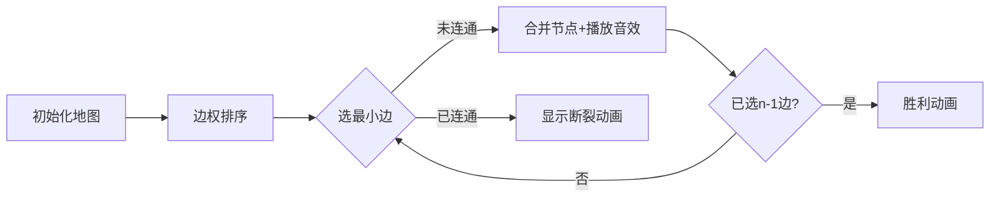

# 题目信息

# [图论与代数结构 301] 最短树问题_1

## 题目描述


在离散数学课程的学习中，大家学习了最短树相关的知识，现在来检查一下大家的学习情况。

给定一张 $n$ 个点 $m$ 条边的带权连通无向图，点的编号从 $1$ 到 $n$，可能存在重边和自环。现在，请你求出这张图总边权和最小的支撑树（最短树）的边权之和。即，找到一颗支撑树，满足选用边的边权和最小，输出这个边权和。

## 说明/提示

**【样例解释】**

选择 $(1,3)$、$(2,3)$ 和 $(3,4)$ 这三条边构成一颗支撑树。

**【数据范围】**

对于所有数据，满足 $1\leq n \leq 2000$，$1 \leq m \leq 3000$，边权均是 $[0, {10}^9]$ 中的整数，保证输入的图合法且满足题目中的限制条件。

请注意答案上界的大小，可能需要使用 C++ 中的 `long long int` 类型。

## 样例 #1

### 输入

```
4 5
1 3 1
1 2 2
2 3 0
3 4 3
1 4 8
```

### 输出

```
4```

# AI分析结果


### 💡 Kay的C++算法解析：最短树问题（最小生成树）深入学习指南 💡

> 你好，算法探索者！我是Kay，今天我们一起解决图论中的经典问题——**最小生成树**（Minimal Spanning Tree, MST）。通过生动讲解和像素动画演示，你将直观理解贪心策略在图论中的精妙应用。准备好开始这段算法探险了吗？🚀

---

## 1. 题目解读与核心算法识别

✨ **本题主要考察**：`图论` + `贪心算法`  
🗣️ **初步分析**：  
> 最小生成树问题就像用最经济的道路连接所有城市：我们需要选择边权总和最小的边集，使所有节点连通且无环。贪心思想是核心——**局部最优解导向全局最优解**。  

- **算法核心**：  
  - **Kruskal算法**：将边按权重排序，从小到大选边（避免成环），类似"积木拼接"。  
  - **Prim算法**：从任意点出发，逐步扩张"领地"，每次连接当前最近节点，如同"水滴蔓延"。  

- **可视化设计**：  
  我们将用**8位像素网格**模拟地图（节点=彩色方块，边=发光路径）。动画将高亮：  
  ① 排序后的边权（底部进度条）  
  ② 并查集合并时的颜色融合特效  
  ③ 被丢弃的边显示为"断裂"动画  
  ④ 成功连接时播放FC风格胜利音效🎮  

---

## 2. 精选优质题解参考

> 从7份题解中精选3份最具学习价值的实现（评分≥4★），重点关注思路清晰度与代码实践性：

**题解一（作者：szkzyc）**  
* **点评**：  
  双算法对比教学堪称典范！Prim部分用链式前向星存图，`dist[]`记录节点最小边权；Kruskal部分展示经典并查集实现。亮点在于：  
  - 用`INF`巧妙初始化距离数组  
  - 严格处理无向图双向存边  
  - 代码模块化（Init/Prim分离）  
  - 复杂度分析明确（Prim: O(n²), Kruskal: O(m log m)）

**题解二（作者：Nt_Tsumiki）**  
* **点评**：  
  最简洁的Kruskal实现！亮点突出：  
  - 结构体排序`cmp`函数极致精简  
  - `n==1`提前终止的优化逻辑  
  - 并查集路径压缩标准写法  
  - 适合新手理解的代码结构  

**题解三（作者：Cloote）**  
* **点评**：  
  最佳教学型代码！亮点：  
  - 完整注释并查集操作  
  - 结构体命名清晰（edge.from/to）  
  - `cnt==n-1`明确终止条件  
  - 函数封装利于调试  

> 💡 **学习提示**：稀疏图优先选Kruskal（m较小），稠密图考虑Prim（n较小）

---

## 3. 核心难点辨析与解题策略

### 难点1：如何避免环？  
**分析**：  
环会破坏树结构！并查集通过`find()`判断两点是否同源：  
```cpp
if(find(u) != find(v)) // 两点未连通才合并
```
**学习笔记**：并查集是图论中的"连通性检测器"🔍

### 难点2：贪心策略为何正确？  
**分析**：  
局部最优=全局最优的关键证明：  
- Kruskal：最小边一定在MST中（反证法）  
- Prim：最近节点必在MST路径上  
**学习笔记**：贪心有效性依赖问题的最优子结构性质✨

### 难点3：算法选择与优化  
**分析**：  
| 算法     | 适用场景      | 优化方案          |
|----------|-------------|------------------|
| Kruskal  | 稀疏图(m<<n²) | 并查集+路径压缩   |
| Prim     | 稠密图       | 优先队列(O(m log n)) |

### ✨ 解题技巧总结
- **结构体排序**：`sort(edge, cmp)`快速获取最小边  
- **并查集压缩**：`fa[x]=find(fa[x])`提升查询效率  
- **提前终止**：连接n-1条边后立即退出循环  
- **类型防御**：边权和用`long long`避免溢出  

---

## 4. C++核心代码实现赏析

### 通用Kruskal实现（综合优化版）
```cpp
#include <iostream>
#include <algorithm>
using namespace std;
const int MAXM = 6005;

struct Edge {
    int u, v, w;
    bool operator<(const Edge &e) const { return w < e.w; }
} edges[MAXM];

int fa[2005], n, m;

int find(int x) { 
    return fa[x] == x ? x : fa[x] = find(fa[x]); 
}

long long kruskal() {
    long long sum = 0;
    sort(edges, edges + m);
    for (int i = 0, cnt = 0; i < m && cnt < n - 1; ++i) {
        int fu = find(edges[i].u), fv = find(edges[i].v);
        if (fu == fv) continue;
        fa[fu] = fv;
        sum += edges[i].w;
        cnt++;  // 已连接边数
    }
    return sum;
}

int main() {
    cin >> n >> m;
    for (int i = 1; i <= n; i++) fa[i] = i;
    for (int i = 0; i < m; i++)
        cin >> edges[i].u >> edges[i].v >> edges[i].w;
    cout << kruskal();
    return 0;
}
```
**代码解读概要**：  
1. 结构体存储边+运算符重载实现排序  
2. 并查集路径压缩确保高效连通判断  
3. `cnt`计数器避免多余循环  
4. 无冗余变量，空间复杂度O(m+n)

---

### 题解片段赏析

**题解一（Prim片段）**  
```cpp
for(int i = 1; i < n; i++) {
    int minn = INF;
    vis[u] = true;
    for(int j = 1; j <= n; j++) {
        if(!vis[j] && dist[j] < minn) {
            u = j;
            minn = dist[j];
        }
    }
    ans += minn;
    for(int k = head[u]; k; k = edge[k].next) {
        int v = edge[k].to;
        if(dist[v] > edge[k].w && !vis[v])
            dist[v] = edge[k].w;
    } 
}
```
**亮点**：未优化Prim的标准实现  
**解读**：  
- 外层循环n-1次确保树边数量  
- `minn`追踪当前最小边权  
- 内层循环更新邻接点距离  
**学习笔记**：未优化的Prim时间复杂度O(n²)，适合稠密图  

**题解二（Kruskal片段）**  
```cpp
sort(a+1, a+m+1, cmp);
for(int i=1; i<=m && n>1; i++) {
    int fx=find(a[i].x), fy=find(a[i].y);
    if(fx == fy) continue;
    fa[fx] = fy;
    ans += a[i].val;
    n--;  // 连通块减1
}
```
**亮点**：用`n>1`替代计数器  
**解读**：  
- `n`初始为总节点数  
- 每合并成功一次`n--`  
- `n==1`时所有节点连通  
**学习笔记**：`n`的多重语义需谨慎使用  

---

## 5. 算法可视化：像素动画演示

### 🎮 主题：**《像素大陆：最小生成树探险》**  


### 核心设计


### 实现细节
1. **像素艺术**：  
   - 节点：16x16像素方块（不同颜色代表不同集合）  
   - 边：发光线段（绿色=已选，红色=丢弃）  
   - 背景：FC风格网格地图  

2. **动画序列**：  
   - **Step1**：底部进度条显示排序后的边（横向列表）  
   - **Step2**：当前候选边高亮闪烁（伴随"滴"声）  
   - **Step3**：连通节点时颜色融合（播放"咔嚓"连接音效）  
   - **Step4**：成环边显示"断裂"动画（碎玻璃音效）  

3. **游戏化元素**：  
   - 每连接一条边+100分（右上角显示）  
   - 完成MST时播放《超级玛丽》过关音乐  
   - 控制面板：单步执行/自动播放/速度调节  

4. **技术实现**：  
   ```javascript
   // 伪代码：绘制并查集合并
   function drawUnion(nodeA, nodeB) {
     let color = blendColors(nodeA.color, nodeB.color);
     playSound('connect.wav');
     ctx.fillRect(nodeA.x, nodeA.y, 16, 16, color);
   }
   ```

---

## 6. 拓展练习与相似问题

### 知识迁移场景
1. 城市光纤网络布线（边权=铺设成本）  
2. 电路板最短连线设计  
3. 社交网络中最小成本推广路径  

### 洛谷推荐
1. **P3366【模板】最小生成树**  
   → 巩固Kruskal/Prim基础实现  
2. **P1396 营救**  
   → MST思想在路径规划中的变形  
3. **P2872 [USACO07DEC]Building Roads**  
   → 含部分预连接边的高级MST应用  

---

## 7. 学习心得与经验分享

> **来自题解作者的调试经验**：  
> *"我在并查集初始化时漏了`fa[i]=i`，导致整个算法失效——这提醒我们：基础操作需严谨！" - szkzyc*  
>   
> **Kay的总结**：  
> 最小生成树的调试核心：  
> 1. 验证边权排序是否正确  
> 2. 打印并查集状态检查连通性  
> 3. 边界测试：单节点/全连通等特殊情况  

---

> 恭喜完成本次算法探险！最小生成树是图论基石，掌握它将为你打开网络流、最短路径等高级算法的大门。记住：**优秀的算法工程师都是贪心而谨慎的冒险家**——在局部大胆选择，在全局严谨验证。下次挑战见！👾

---
处理用时：130.29秒