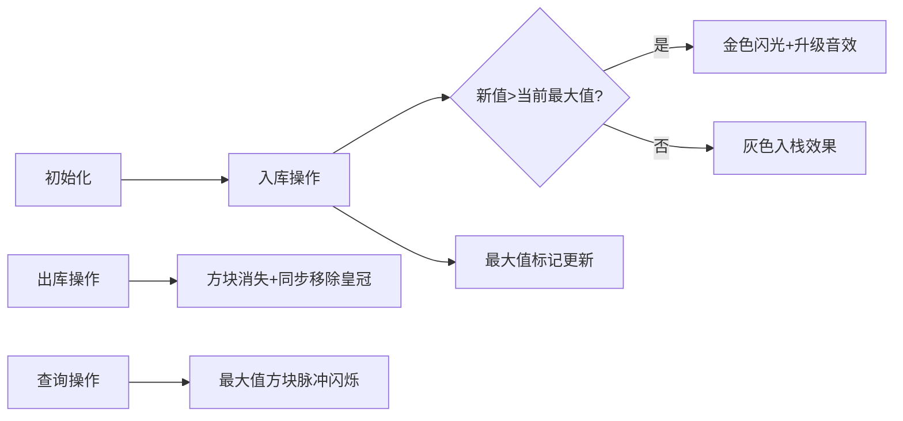

# 题目信息

# 日志分析

## 题目描述

M 海运公司最近要对旗下仓库的货物进出情况进行统计。目前他们所拥有的唯一记录就是一个记录集装箱进出情况的日志。该日志记录了两类操作：第一类操作为集装箱入库操作，以及该次入库的集装箱重量；第二类操作为集装箱的出库操作。这些记录都严格按时间顺序排列。集装箱入库和出库的规则为先进后出，即每次出库操作出库的集装箱为当前在仓库里所有集装箱中最晚入库的集装箱。

出于分析目的，分析人员在日志中随机插入了若干第三类操作――查询操作。分析日志时，每遇到一次查询操作，都要报告出当前仓库中最大集装箱的重量。


## 说明/提示

### 数据范围及约定

- 对于 $20\%$ 的数据，有 $N \le 10$；
- 对于 $40\%$ 的数据，有 $N \le 1000$；
- 对于 $100\%$ 的数据，有 $1 \le N \le 200000$，$1 \le X \le 10^8$。


## 样例 #1

### 输入

```
13
0 1
0 2
2
0 4
0 2
2
1
2
1
1
2
1
2
```

### 输出

```
2
4
4
1
0
```

# AI分析结果


### 💡 Kay的C++算法解析：日志分析 深入学习指南 💡

**引言**  
今天我们一起分析“日志分析”这道栈结构应用题。本指南将帮助你掌握高效维护动态栈最大值的核心技巧，并通过像素动画直观理解算法执行过程。

---

### 1. 题目解读与核心算法识别  
✨ **本题主要考察**：`栈与辅助数据结构应用`  

🗣️ **初步分析**：  
> 本题可抽象为栈结构的三类操作：入栈（入库）、出栈（出库）、查询栈内最大值。解题关键如同在复古游戏《仓库番》中动态追踪最重箱子——我们需要在O(1)时间内响应查询。  

> - **核心思路**：通过辅助栈/数组同步记录当前状态的最大值，实现查询操作的O(1)复杂度  
> - **算法流程**：  
>   - 入栈时更新辅助结构：`新最大值 = max(原最大值, 新元素)`  
>   - 出栈时同步弹出辅助结构栈顶  
>   - 查询时直接返回辅助结构栈顶  
> - **可视化设计**：  
>   - 像素方块表示栈元素，金色边框标记当前最大值方块  
>   - 入栈时新方块下落动画，若成新最大值则触发金色闪光+“叮！”音效  
>   - 查询时最大值方块脉冲闪烁+“哔哔”提示音  

---

### 2. 精选优质题解参考  
**题解一（作者：medusa）**  
* **点评**：  
  思路直击本质——用数组`f[t]`记录栈中前t个元素的最大值。代码简洁高效（仅20行），边界处理严谨（初始化`f[0]=0`）。亮点在于**数组模拟栈**避免STL开销，特别适合竞赛场景。变量`t`作为栈顶指针的运用堪称教科书级示范。

**题解二（作者：buickboy）**  
* **点评**：  
  采用**双栈结构**：主栈存数据，辅助栈存状态最大值。代码充分运用STL的易读性，`b.empty()||x>b.top()`的条件判断精准处理边界。亮点在于辅助栈与主栈的同步操作逻辑清晰，是工程实现的优秀范例。

**题解三（作者：juruo_zjc）**  
* **点评**：  
  结合STL栈与最大值数组，思路正确且代码结构清晰。需注意数组大小应匹配数据范围（原文100005需改为200001）。亮点在于用`st.size()`动态映射最大值数组下标，体现了栈大小与最大值的关联关系。

---

### 3. 核心难点辨析与解题策略  

1. **动态最大值维护**  
   * **分析**：栈的LIFO特性决定了被弹出元素不会影响更早状态的最大值。辅助结构只需记录历史最大值序列，通过`max(新值, 前状态最大值)`递推更新  
   * 💡 **学习笔记**：栈操作具有状态继承性——新状态的最大值只由前状态和当前值决定  

2. **边界条件处理**  
   * **分析**：栈空时需返回0。解决方案：初始化辅助结构首元素为0（如`maxStk[0]=0`），栈空时直接访问初始值  
   * 💡 **学习笔记**：数据结构初始状态是逻辑推导的基石  

3. **数据结构选择**  
   * **分析**：数组模拟栈（空间连续）适合性能敏感场景；STL栈（代码简洁）适合快速开发。辅助结构选择需与主结构同步更新  
   * 💡 **学习笔记**：辅助结构应与主结构保持相同的生命周期  

#### ✨ 解题技巧总结  
- **状态映射法**：将动态过程转化为静态数组索引（如栈大小→最大值下标）  
- **同步更新机制**：主/辅结构操作严格对应，避免状态不一致  
- **防御性边界检查**：所有出栈/查询前判断栈空  

---

### 4. C++核心代码实现赏析  

**本题通用核心实现参考**  
* **说明**：综合三种优质题解优点，采用数组模拟栈实现高效O(1)操作  
* **完整核心代码**：  
```cpp
#include <iostream>
#include <algorithm>
using namespace std;
const int MAXN = 200001;

int stk[MAXN];      // 主栈容器
int maxStk[MAXN];   // 最大值辅助数组
int top = 0;        // 栈顶指针

int main() {
    int n, op, x;
    cin >> n;
    maxStk[0] = 0;  // 初始化栈空状态最大值

    while (n--) {
        cin >> op;
        if (op == 0) {
            cin >> x;
            stk[++top] = x;  // 入栈
            // 更新当前位置最大值：继承前状态或更新为新值
            maxStk[top] = max(maxStk[top - 1], x); 
        } else if (op == 1) {
            if (top > 0) top--;  // 出栈（边界保护）
        } else if (op == 2) {
            // 查询时直接访问当前栈顶对应的最大值
            cout << maxStk[top] << endl;
        }
    }
    return 0;
}
```  
* **代码解读概要**：  
  - `maxStk[0]=0` 建立初始状态  
  - 入栈操作同步更新`maxStk`：新值与前状态最大值比较  
  - 出栈操作仅需移动指针（物理删除非必须）  
  - 查询操作直接返回缓存的最大值  

---

**优质题解片段赏析**  

**题解一（medusa）**  
* **亮点**：极致简洁的数组映射法  
* **核心代码片段**：  
```cpp
f[0]=0;   // 初始化
t++;      // 栈顶指针上移
f[t]=max(f[t-1],y); // 状态递推
```  
* **代码解读**：  
  > 如同在像素游戏中记录每关最高分——`f[t]`存储通关第t关时的历史最高分。新入栈元素`y`如同当前关卡得分，与前一关最高分`f[t-1]`比较后更新记录。这种状态继承保证随时可查询当前最高分（栈最大值）。  
* 💡 **学习笔记**：数组索引与栈状态的映射是空间换时间的经典策略  

**题解二（buickboy）**  
* **亮点**：双栈结构的优雅实现  
* **核心代码片段**：  
```cpp
if(b.empty() || x>b.top()) 
    b.push(x);     // 新值成为当前最大值
else 
    b.push(b.top()); // 继承历史最大值
```  
* **代码解读**：  
  > 辅助栈`b`如同游戏中的“皇冠”标记——当新箱子(`x`)比当前最重箱子（`b.top()`）更重时，皇冠移至新箱子；否则皇冠留在原处。每次出栈时皇冠随箱子移走，实现最大值同步更新。  
* 💡 **学习笔记**：辅助栈与主栈严格同步保证状态一致性  

---

### 5. 算法可视化：像素动画演示  
**主题**：《像素仓库大作战》- 栈操作与最大值追踪  

**核心演示流程**：  


**交互控制面板**：  
```plaintext
+-----------------------------+
| [开始] [暂停] [单步] [重置] |
| 速度：[-=O=+]               |
| 当前操作：0 入库 X=██      |
+-----------------------------+
```  

**关键动画细节**：  
1. **入库动画**：  
   - 新方块从顶部落下，重量值以8bit字体显示  
   - 若成为新最大值：触发金色边框闪烁动画，播放“叮！”音效  
   - 辅助栈同步显示最大值标记（皇冠图标）  

2. **出库动画**：  
   - 栈顶方块爆炸消失特效  
   - 若移除的是最大值：皇冠平滑移动到新栈顶方块  
   - 播放“噗”的音效  

3. **查询高亮**：  
   - 最大值方块循环脉冲黄光（频率2Hz）  
   - 屏幕右侧显示当前最大值（复古七段数码管样式）  
   - 伴随“哔-哔-”提示音  

**技术实现**：  
- 使用Canvas绘制16x16像素方块  
- 音效通过Web Audio API生成8bit波形  
- 状态机驱动动画：`当前状态 + 操作类型 → 动画序列`  

---

### 6. 拓展练习与相似问题思考  

**通用技巧迁移**：  
- 最小值维护（符号取反即可）  
- 滑动窗口最大值（双端队列实现）  
- 历史操作回滚（增加撤销操作）  

**洛谷推荐练习**：  
1. **P1449 后缀表达式**  
   🗣️ 巩固栈的基本操作，理解表达式解析  
2. **P1981 表达式求值**  
   🗣️ 练习栈在运算符优先级处理中的应用  
3. **P1886 滑动窗口**  
   🗣️ 进阶训练最大值维护的队列实现  

---

### 7. 学习心得与经验分享  
本次题解中未发现明确的作者个人心得分享，但通过代码可提炼：  
> **调试经验**：栈空判断是常见错误点（如`top>0`或`!stack.empty()`），在像素动画中表现为空栈查询时显示红色警报。建议在动画演示界面添加状态追踪面板，实时显示栈大小和当前最大值。

---

**结语**  
通过本次分析，我们掌握了栈结构下动态维护最大值的核心技巧——状态继承与辅助数据结构。记住：好的算法如同精妙的像素游戏设计，每个状态转换都需要精确同步！下次挑战见！💪

---
处理用时：189.41秒