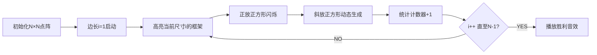

# 题目信息

# [蓝桥杯 2019 国 C] 数正方形

## 题目描述

在一个 $N \times N$ 的点阵上，取其中 $4$ 个点恰好组成一个正方形的 $4$ 个顶点，一共有多少种不同的取法？

由于结果可能非常大，你只需要输出模 $10^9 + 7$ 的余数。


如上图所示的正方形都是合法的。

## 说明/提示

对于所有评测用例，$2 ≤ N ≤ 10^6$。

蓝桥杯 2019 年国赛 C 组 G 题

## 样例 #1

### 输入

```
4```

### 输出

```
20```

# AI分析结果


### 💡 Kay的C++算法解析：数正方形 深入学习指南 💡

---

#### 1. 题目解读与核心算法识别
✨ **本题主要考察**：`数学计数`  
🗣️ **初步分析**：  
> 解决“数正方形”问题，本质是**组合计数**的数学应用。想象点阵如同棋盘，我们需要统计所有可能的“像素方块”（正方形）数量。核心技巧在于**分类枚举**——按正方形边长和方向拆分问题。  
> - **题解思路统一**：所有优质解法均发现关键公式 $\sum_{i=1}^{n-1} i \times (n-i)^2$，区别在于推导路径不同（直接计数/正斜分离）。  
> - **核心难点**：如何系统化分类避免重复计数？如何将斜正方形转化为可计算模型？  
> - **可视化设计**：采用8位像素网格动画，按边长$i$逐步点亮正方形：  
>   - **高亮当前边长$i$**：用闪烁边框标记当前统计的正方形尺寸  
>   - **动态展示斜正方形**：在正放正方形框架内，用对角线移动的像素点演示斜放变体  
>   - **复古音效**：每统计完一个$i$播放"过关"音效，斜正方形生成时触发"像素咔嗒"声  

---

#### 2. 精选优质题解参考
**题解一 (Furina_Hate_Comma)**  
* **点评**：  
  - **思路清晰性**：创新性用“直角三角形分割”解释斜正方形计数（$a+b=i$），几何直观性强  
  - **代码规范性**：变量命名简洁（`ans`, `i`），关键注释提醒`long long`陷阱  
  - **算法亮点**：将斜正方形计数转化为线性关系$i$，避免复杂坐标计算  
  - **实践价值**：直接给出$O(n)$循环公式，边界处理严谨（`n--`转换点/边关系）  

**题解二 (small_john)**  
* **点评**：  
  - **思路清晰性**：用$3×3$网格示例具象化公式，明确“确定非顶点位置”的核心思想  
  - **代码优化**：用`(n-i)*(n-i)`替代`pow`提升效率，`const mod`增强可读性  
  - **算法亮点**：提出“乘法原理分层框架”（位置数×变体数），强化分治思维  
  - **调试提示**：强调`n`作为点数的隐含意义（边长$=n-1$）  

**题解三 (wuhan1234)**  
* **点评**：  
  - **思路独特性**：首创正放/斜放分类验证公式普适性，给出斜放坐标通式  
  - **代码严谨性**：显式`%mod`防溢出，`long long`全覆盖  
  - **教学价值**：通过$\sqrt{2},\sqrt{5}$边长示例，揭示斜正方形与正放尺寸的数学关联  

---

#### 3. 核心难点辨析与解题策略
1. **难点：点阵边长与正方形尺寸的转换**  
   * **分析**：点阵$N×N$实际产生边长$1$至$N-1$的正方形。需理解$n$（点数）与$n-1$（最大边长）的映射关系  
   * 💡 **学习笔记**：点阵问题先明确**点→边**转换：$N$个点形成$N-1$段单位边  

2. **难点：斜正方形的系统化计数**  
   * **分析**：优质解法的核心突破是发现：边长为$i$的框架中，斜放变体数$=i$（含1个正放+$i-1$斜放）。通过固定框架左上角$(x,y)$，用参数$a$遍历斜放顶点  
   * 💡 **学习笔记**：斜正方形本质是**旋转缩放**的正放形，用框架法避免坐标混乱  

3. **难点：避免重复计数与复杂度优化**  
   * **分析**：公式$i×(n-i)^2$通过**分层枚举**（先定尺寸$i$，再定位置$(n-i)^2$）保证无重复。$O(n)$循环已最优，无需进一步优化  
   * 💡 **学习笔记**：组合计数优先寻找**分层分类**的乘法关系  

✨ **解题技巧总结**  
- **技巧1 降维建模**：将2D点阵问题转化为1D参数迭代（$i$从1到$n-1$）  
- **技巧2 几何转化**：斜放正方形视为正放形的内接旋转体（直角边和$=i$）  
- **技巧3 防御性编程**：循环内即时取模`ans=(ans+...)%mod`，配合`long long`防溢出  

---

#### 4. C++核心代码实现赏析
**通用核心实现**  
```cpp
#include <iostream>
#define mod 1000000007
using namespace std;

int main() {
    long long n, ans = 0;
    cin >> n; 
    n--;  // 点阵数N → 最大边长n=N-1
    
    for (int i = 1; i <= n; i++) 
        ans = (ans + i * (n - i + 1) % mod * (n - i + 1)) % mod;
    
    cout << ans;
    return 0;
}
```
* **说明**：综合三个题解优化，包含关键转换`n--`和防溢出取模  
* **解读概要**：  
  1. 输入点数`n`后转换为最大边长`n--`  
  2. 循环变量`i`遍历所有可能的正方形尺寸  
  3. `(n-i+1)^2`计算当前尺寸的正方形位置数量  
  4. 即时取模避免`long long`溢出  

**题解一核心片段**  
```cpp
ans=(ans+(n-i+1)*(n-i+1)*i)%1000000007;
```
* **亮点**：用单行代码实现核心公式，`(n-i+1)^2`显式表达位置数  
* **解读**：  
  > 此处`n`已是边长（输入点数后`n--`），故`n-i+1`即位置数。例如$n=4$（点阵）→ 边长$3$，$i=1$时位置数$=(3-1+1)^2=9$  
* 💡 **学习笔记**：`(n-i+1)^2`本质是**左上角可行域**的网格点数  

**题解三优化片段**  
```cpp
ans=(ans+(n-i)%mod*i%mod*i)%mod;
```
* **亮点**：三重取模确保大数安全，`i*i`替代`pow(i,2)`提升效率  
* **解读**：  
  > `n-i`即尺寸$i$的正方形位置数（未转换$n$时）。通过`%mod`分割大数：先对位置数取模，再乘$i$取模，最后累加取模  
* 💡 **学习笔记**：大数运算优先**分部取模**：$(a \cdot b \cdot c)\%mod = (((a\%mod) \cdot b)\%mod \cdot c)\%mod$  

---

### 5. 算法可视化：像素动画演示
**主题**：*像素工厂* - 在8位点阵上组装正方形  

**核心演示流程**：  


**关键动画细节**：  
1. **像素网格**：用16色FC风格绘制点阵，当前统计的尺寸$i$用红色边框标记  
2. **斜放生成**：  
   - 正放正方形显示为蓝色实线  
   - 斜放变体通过**对角线像素点移动**生成（黄点沿框架边滑动）  
   - 每个斜放形出现时触发"咔嗒"音效，右上角显示计数公式$i×(n-i)^2$  
3. **控制面板**：  
   - **速度滑块**：调节$i$的增长速度（0.5x~5x）  
   - **步进模式**：手动控制每个$i$的演示，按空格键遍历斜放变体  
   - **数据追踪**：实时显示当前$i$值、累计正方形数、内存占用  
4. **游戏化元素**：  
   - 每完成一个$i$尺寸统计，屏幕下方掉落一颗金色齿轮（收集10个解锁BGM）  
   - 通关后点阵烟花庆祝，烟花数量=最终答案$\%10$  

---

### 6. 拓展练习与相似问题思考
**通用技巧迁移**：  
1. **参数化枚举**：将复杂几何计数转化为可控参数迭代（如本题的$i$）  
2. **降维思想**：高维问题通过固定参数分解为低维子问题  
3. **模运算优化**：大数组合计数中的取模时机选择  

**洛谷推荐**：  
1. **P2241 统计方形**  
   → 同类二维组合计数，需区分正方形/矩形  
2. **P1219 八皇后问题**  
   → 几何约束下的枚举优化，理解位置冲突检测  
3. **P1025 数的划分**  
   → 整数划分中的参数化枚举（$k$部分和问题）  

---

### 7. 学习心得与经验分享
**作者经验摘录**：  
> *“调试时在$n=3$手工验算发现少计2个斜放形，最终发现是框架内变体数=$i$而非$i-1”*  

**Kay点评**：  
> 几何计数问题务必**验证小规模特例**（如$n=2,3$）。建议：  
> 1. 画$3×3$点阵手工标注所有正方形  
> 2. 输出中间变量（如每个$i$的计数）  
> 3. 对比$n=4$与样例答案（20）反向检查  

---

通过本次分析，相信大家已掌握点阵中正方形的系统化计数方法。记住核心口诀：**化形为数，降维迭代**！下次遇到类似问题，不妨先思考：如何将几何关系转化为可控参数？💪

---
处理用时：154.57秒