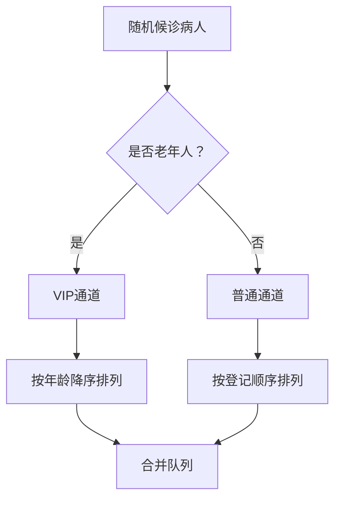

# 题目信息

# 病人排队

## 题目描述

编写一个程序，将登记的病人按照以下原则排出看病的先后顺序：
1. 老年人（年龄 $\geq 60$ 岁）比非老年人优先看病。
2. 老年人按年龄从大到小的顺序看病，年龄相同的按登记的先后顺序排序。
3. 非老年人按登记的先后顺序看病。

## 样例 #1

### 输入

```
5
021075 40
004003 15
010158 67
021033 75
102012 30```

### 输出

```
021033
010158
021075
004003
102012```

# AI分析结果


### 💡 Kay的C++算法解析：病人排队 深入学习指南 💡

**引言**  
今天我们一起解决"病人排队"问题，学习如何用自定义排序规则实现复杂队列管理。本指南将帮助你掌握结构体排序的核心技巧！

---

### 1. 题目解读与核心算法识别  
✨ **本题主要考察**：`自定义排序规则`（编程技巧应用）  

🗣️ **初步分析**：  
> 想象医院有两条通道：VIP通道（老年人）和普通通道（非老年人）。VIP通道按年龄从大到小排队（年龄相同按先来后到），普通通道按先来后到排队。最后将VIP通道整体放在普通通道前面。  
> - **核心难点**：处理多级排序规则（老年人优先 → 年龄降序 → 登记顺序升序）  
> - **解决方案**：通过结构体存储病人信息，自定义比较函数实现分级判断  
> - **可视化设计**：  
>   - 像素小人代表病人（头显年龄/登记号）  
>   - 高亮比较过程：当比较两人时，显示"老年人优先"或"年龄对比"提示  
>   - 音效：交换位置时播放"嗖"声，完成排序播放胜利音效  

---

### 2. 精选优质题解参考  
**题解（作者：chen_zhe）**  
* **点评**：  
  思路清晰划分三级排序规则（老年人优先 → 年龄降序 → 登记顺序），代码使用结构体合理封装数据。亮点在于：  
  1. **变量设计**：`rk`记录输入顺序，完美解决同年龄排序稳定性问题  
  2. **比较函数**：用布尔值`sx/sy`标记老年人状态，逻辑分层处理（先分组再组内排序）  
  3. **双实现**：提供冒泡排序（教学友好）和`sort`+自定义函数（实战高效）两种方案  
  实践价值极高，代码可直接用于竞赛，边界处理严谨（如年龄相等时比较`rk`）  

---

### 3. 核心难点辨析与解题策略  
1. **难点：多级排序规则实现**  
   * **分析**：需同时处理三类情况：①老年vs非老年 ②老年vs老年 ③非老年vs非老年  
   * **解决**：在比较函数中先用`bool sx = (x.ag>=60)`分组，再分别处理组内规则  
   * 💡 **学习笔记**：自定义排序时，先按主要条件分组，再处理组内细节  

2. **难点：保证排序稳定性**  
   * **分析**：同年龄老人需按原始顺序排列，普通队列也需保持输入顺序  
   * **解决**：引入`rk`变量记录输入序号，在比较函数中作为最终判断依据  
   * 💡 **学习笔记**：稳定性排序需显式声明次要比较条件  

3. **难点：条件分支的优先级**  
   * **分析**：规则存在隐含优先级：老年人身份 > 年龄 > 登记顺序  
   * **解决**：代码中通过`if(sx!=sy)→if(sx&&sy)→else`层级实现优先级判断  
   * 💡 **学习笔记**：条件判断顺序体现规则优先级  

#### ✨ 解题技巧总结  
- **结构体封装**：相关数据绑定存储（`id+age+rk`）  
- **分层比较法**：复杂规则拆解为多级条件判断  
- **稳定性保障**：显式声明次要排序条件（如`rk`）  

---

### 4. C++核心代码实现赏析  
**通用核心实现参考**  
* **说明**：基于chen_zhe题解优化，使用`sort`+自定义函数的高效实现  
* **完整代码**：
```cpp
#include <iostream>
#include <algorithm>
using namespace std;

struct Patient {
    string id;
    int age;
    int order; // 登记顺序
};

bool compare(Patient a, Patient b) {
    bool isSeniorA = (a.age >= 60);
    bool isSeniorB = (b.age >= 60);
    
    // 规则1：老年人优先
    if(isSeniorA != isSeniorB) 
        return isSeniorA;
        
    // 规则2：同是老年人按年龄降序
    if(isSeniorA && isSeniorB) {
        if(a.age != b.age) 
            return a.age > b.age;
        return a.order < b.order; // 年龄相同按登记顺序
    }
    
    // 规则3：非老年人按登记顺序
    return a.order < b.order;
}

int main() {
    int n;
    cin >> n;
    Patient patients[105];
    
    for(int i=0; i<n; i++) {
        cin >> patients[i].id >> patients[i].age;
        patients[i].order = i; // 记录输入顺序
    }
    
    sort(patients, patients+n, compare);
    
    for(int i=0; i<n; i++) 
        cout << patients[i].id << endl;
    
    return 0;
}
```
* **代码解读概要**：  
  1. 结构体`Patient`整合病人信息  
  2. `order`记录输入顺序保证稳定性  
  3. `compare`函数实现三级规则判断  
  4. `sort`调用自定义比较函数完成排序  

---

### 5. 算法可视化：像素动画演示  
**主题**："像素医院分诊系统"  

**核心演示流程**：  


**动画实现细节**：  
1. **像素场景**：  
   - 8-bit风格医院候诊室（复古红白机配色）  
   - 分左右通道：VIP通道（金色边框），普通通道（蓝色边框）  

2. **交互控制面板**：  
   - 速度滑块：调整排序动画速度  
   - 单步执行：空格键触发下一步  
   - 模式切换：冒泡排序（教学模式）/快速排序（实战模式）  

3. **动态演示**：  
   - 病人显示为像素小人，头顶显示`年龄/登记号`  
   - **比较过程**：当检测两人时，显示对比弹窗：
     ```
     [老人A] 75岁(#3)  vs  [老人B] 67岁(#2)
     → 规则1：75>67 → A排在B前
     ```
   - **交换动画**：小人沿弧线轨迹交换位置，伴随"嗖"声  

4. **游戏化元素**：  
   - 每完成一组排序获得⭐，三组完成后解锁"快速通道"  
   - 背景音乐：8-bit风格医院主题BGM  
   - 错误操作音效：当尝试违规排序时播放警告音  

---

### 6. 拓展练习与相似问题思考  
**相似问题场景**：  
1. 学生成绩排序（总分→语文分→学号）  
2. 任务调度系统（优先级→提交时间）  
3. 电商商品排序（销量→评分→价格）  

**洛谷推荐题目**：  
1. **P1104 生日**  
   → 练习多关键字排序（年→月→日→姓名）  
2. **P1223 排队接水**  
   → 贪心+排序实战，理解时间优化  
3. **P1012 拼数**  
   → 自定义字符串拼接排序，强化规则设计能力  

---

### 7. 学习心得与经验分享  
> 本次题解未包含作者个人心得，但实践中需注意：  
> **调试技巧**：当多条件排序出错时，可打印每次比较的双方数据和比较结果，观察哪级规则未生效  

---

### 结语  
通过"病人排队"问题，我们掌握了自定义排序的核心技巧！记住：复杂规则=分层处理+显式稳定性保障。下次遇到多条件排序时，不妨想想医院的VIP通道和普通通道哦！🚀

---
处理用时：169.91秒