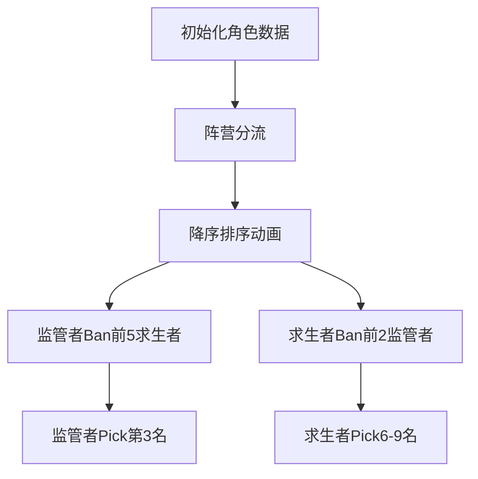

# 题目信息

# [语言月赛202211] BAN-PICK

## 题目描述

在第五人格职业联赛的每一场对局中，需要进行 Ban-Pick 流程。Ban 即角色禁用，Pick 即角色选用。

如试题 Winner 所述，游戏分为 **求生者（$\texttt{Survivor}$）** 与 **监管者（$\texttt
{Hunter}$）** 两个阵营。**求生者阵营** 共有 $n$ 名角色，**监管者阵营** 共有 $m$ 名角色。

在某局比赛中，**监管者** 可以 ban(禁用) 掉 **求生者阵营** $5$ 名角色，**求生者** 可以 ban(禁用) 掉 **监管者阵营** $2$ 名角色。

每个角色，无论其属于求生者阵营还是监管者阵营，均可以使用 **熟练度** 来量化该阵营选手选择该角色的优先程度。选手一定会优先选择 **熟练度** 更高的角色进行游戏。

基于这样的考量，**监管者选手** 在进行 Ban 流程时，往往会选择 ban(禁用) 掉 **求生者阵营熟练度最高** 的若干名 **求生者角色**。同样，**求生者选手** 在进行 Ban 流程时，往往会选择 ban(禁用) 掉 **监管者阵营熟练度最高** 的若干名 **监管者角色**。

在 Ban 流程完成后，需要执行 Pick 流程。

如试题 Winner 所述，**求生者选手** 需要从 **求生者阵营** 中选择 $4$ 名不同的角色，**监管者选手** 需要从 **监管者阵营** 中选择 $1$ 名角色。

现在告诉你所有角色的名字、阵营与选手对其熟练度，请你给出双方阵营 Pick 的角色名字。

## 说明/提示

### 输入输出样例 1 解释

求生者阵营角色：$\texttt{Amily,Lydia,Lisa,Freddie,Cliche,Aesop,Eli,Norton,Emma}$。

监管者阵营角色：$\texttt{Beck,Tiletower,Yidhra}$。

监管者选手将 ban 掉求生者阵营中角色 $\texttt{Norton,Eli,Aesop,Cliche,Freddie}$。

求生者选手将 ban 掉监管者阵营中角色 $\texttt{Tiletower,Yidhra}$。

### 数据规模与约定

对于前 $20\%$ 的数据，$n = 9, m = 3$。

对于前 $50\%$ 的数据，保证 $n \leq 10 ^ 3, m \leq 10 ^3$。

对于前 $70\%$ 的数据，保证 $w _ i \leq 10 ^ 9$。

对于所有数据，保证 $9 \leq n \leq 10 ^ 5, 3 \leq m \leq 10 ^ 5$，所有名字长度 $\leq 10$。熟练度大小 $w _ i$ 满足 $1 \leq w _ i \leq 10 ^ {18}$。保证每个阵营中熟练度互不相同。保证名字仅有大写字母和小写字母构成。

## 样例 #1

### 输入

```
9 3
Amily S 1
Lydia S 2
Lisa S 4
Beck H 1
Freddie S 5
Cliche S 6
Aesop S 7
Eli S 8
Norton S 9
Tiletower H 3
Yidhra H 2
Emma S 3
```

### 输出

```
Beck
Lisa
Emma
Lydia
Amily```

# AI分析结果


# 💡 Kay的C++算法解析：BAN-PICK 深入学习指南 💡

## 1. 题目解读与核心算法识别

✨ **本题主要考察**：`排序应用` + `模拟执行`

🗣️ **初步分析**：
> 解决"BAN-PICK"题目的核心思路就像体育比赛的选秀环节——教练会根据选手能力值从高到低排序，优先淘汰最强的对手，再挑选剩余最优选手。本题需要：
> 1. 将角色按阵营分为两组
> 2. 对每组按熟练度**降序排序**
> 3. 模拟Ban流程：跳过前5个求生者(监管者Ban)和前2个监管者(求生者Ban)
> 4. 输出Pick结果：监管者选第3名，求生者选第6-9名
>
> **可视化设计**：采用复古游戏《街头霸王》选人界面风格：
> - 角色头像按熟练度高低横向排列
> - Ban操作：被禁角色变灰并播放"KO"音效
> - Pick操作：选中角色闪烁绿光并播放"胜利"音效
> - 控制面板：可调节排序速度，单步观察Ban/Pick逻辑

---

## 2. 精选优质题解参考

**题解一 (来源：Maxmilite)**
* **点评**：这份题解思路清晰直白，完美契合题目要求。通过结构体分类存储角色数据，利用标准库sort实现高效排序（O(n log n)复杂度）。代码规范性强：变量名cntS/cntH明确，阵营判断逻辑简洁。亮点在于完整呈现了"输入→分类→排序→输出"的标准解题框架，边界处理严谨（直接索引排序后数组），可直接用于竞赛场景。

---

## 3. 核心难点辨析与解题策略

1.  **多阵营数据分离存储**
    * **分析**：输入混合两种阵营角色，需实时分流存储。优质题解用`if(v=="H")`判断分流，用独立计数器`cntS/cntH`动态记录
    * 💡 **学习笔记**：处理混合数据时，预判分类条件可提升效率

2.  **大规模数据排序优化**
    * **分析**：角色数达10^5级，必须采用O(n log n)排序。题解调用`sort`+自定义比较函数`cmp`，避免手写排序
    * 💡 **学习笔记**：熟练使用STL排序是处理大数据的关键

3.  **索引定位的数学映射**
    * **分析**：Ban掉Top K角色等效于输出第K+1名后的角色。题解直接索引排序后数组（监管者取[3]，求生者取[6-9]）
    * 💡 **学习笔记**：将题目规则转化为数组索引可简化代码

### ✨ 解题技巧总结
-   **数据分类预处理**：混合输入先分离再处理
-   **STL优先原则**：标准库排序比手写更高效可靠
-   **索引映射转换**：将业务规则转化为数组索引位置
-   **结构体组织**：相关数据捆绑存储提升可读性

---

## 4. C++核心代码实现赏析

**本题通用核心C++实现参考**
* **说明**：基于Maxmilite题解优化，强化可读性和通用性
* **完整核心代码**：
```cpp
#include <iostream>
#include <algorithm>
using namespace std;

struct Role {
    string name;
    long long val;
};

bool cmp(Role a, Role b) { 
    return a.val > b.val; // 降序排序
}

int main() {
    int n, m;
    cin >> n >> m;
    
    Role s[100005], h[100005]; // S:求生者 H:监管者
    int cntS = 0, cntH = 0;
    
    // 1. 分流存储
    for(int i=0; i<n+m; i++) {
        string name, type;
        long long val;
        cin >> name >> type >> val;
        if(type == "S") s[cntS++] = {name, val};
        else h[cntH++] = {name, val};
    }
    
    // 2. 双阵营排序
    sort(s, s+cntS, cmp);
    sort(h, h+cntH, cmp);
    
    // 3. 按规则输出Pick结果
    cout << h[2].name << endl;     // 监管者Pick：第3名(索引2)
    for(int i=5; i<9; i++) {       // 求生者Pick：第6-9名(索引5-8)
        cout << s[i].name << endl;
    }
    return 0;
}
```
* **代码解读概要**：
  1. **结构体封装**：`Role`聚合角色属性
  2. **分流存储**：根据类型字段动态存入对应数组
  3. **降序排序**：自定义比较函数实现熟练度从高到低排序
  4. **索引定位**：直接通过计算后的索引输出目标角色

---

**题解片段赏析**
* **亮点**：简洁高效的数据分类与STL排序应用
* **核心代码片段**：
```cpp
if (v == "H") {
    ++cntH;
    h[cntH].name = name;
    h[cntH].val = val;
} else {
    ++cntS;
    s[cntS].name = name;
    s[cntS].val = val;
}

sort(s + 1, s + cntS + 1, cmp);
sort(h + 1, h + cntH + 1, cmp);

cout << h[3].name << endl;
for (int i = 6; i <= 9; ++i) {
    cout << s[i].name << endl;
}
```
* **代码解读**：
  > 通过`if-else`实现阵营分流，`cntS/cntH`作为动态指针。`sort`的`[start, end)`区间参数使用精确（`s+1`到`s+cntS+1`），注意数组索引从1开始的设计。输出时直接访问排序后数组的指定位置，省去额外过滤步骤
* 💡 **学习笔记**：数组索引从1开始时，排序范围需`+1`调整

---

## 5. 算法可视化：像素动画演示

* **主题**：街机风格《BanPick大乱斗》排序演示  
* **核心演示**：角色按熟练度排队→Ban操作灰化→Pick角色高亮  



**动画帧步骤**：  
1. **像素初始化**：
   - 8-bit风格界面，左右分区显式S/H阵营
   - 角色显示为16x16像素头像，底部显示熟练度数值
   - 控制面板：排序速度滑块/单步执行/重置按钮

2. **排序动态演示**：
   ```python
   # 伪代码：冒泡排序可视化
   for i in range(n-1):
       for j in range(n-i-1):
           if role[j].val < role[j+1].val:
               swap(role[j], role[j+1])  # 播放交换音效
               highlight(j, j+1)         # 当前比较对高亮黄框
   ```

3. **Ban/Pick特效**：
   - Ban操作：角色头像变灰+碎裂动画+低沉音效
   - Pick操作：角色绿框闪烁+上扬音效+弹出选择标识
   - 监管者Pick时播放语音："3rd pick locked in!"

4. **游戏化元素**：
   - 每完成一阵营排序得100分
   - 正确输出结果时解锁"Pro Picker"成就
   - 背景音乐：8-bit风格竞技场主题曲

---

## 6. 拓展练习与相似问题

* **技巧迁移**：排序+规则映射方法适用于：
  1. 排行榜Top-K筛选（如P1093）
  2. 比赛晋级规则模拟（如P1786）
  3. 资源按优先级分配（如P1803）

* **洛谷推荐**：
  1. **P1093** 奖学金  
     → 相同排序逻辑，多关键字比较
  2. **P1786** 帮贡排序  
     → 更复杂的多级排序规则
  3. **P1177** 【模板】快速排序  
     → 巩固排序算法基础实现

---

## 7. 学习心得与经验分享
> 本次分析的题解中未发现明确的作者个人心得分享部分

---

通过本次分析，我们掌握了**数据分类→排序→规则映射**的解题范式。记住：在算法世界中，做好数据整理就赢了半场比赛！下次见！🚀

---
处理用时：94.80秒