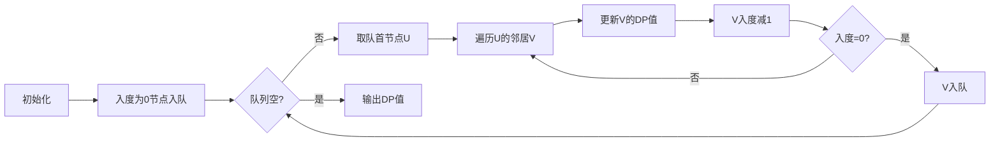

# 题目信息

# 旅行计划

## 题目描述

小明要去一个国家旅游。这个国家有 $N$ 个城市，编号为 $1$ 至 $N$，并且有 $M$ 条道路连接着，小明准备从其中一个城市出发，并只往东走到城市 $i$ 停止。

所以他就需要选择最先到达的城市，并制定一条路线以城市 $i$ 为终点，使得线路上除了第一个城市，每个城市都在路线前一个城市东面，并且满足这个前提下还希望游览的城市尽量多。

现在，你只知道每一条道路所连接的两个城市的相对位置关系，但并不知道所有城市具体的位置。现在对于所有的 $i$，都需要你为小明制定一条路线，并求出以城市 $i$ 为终点最多能够游览多少个城市。

## 说明/提示

均选择从城市 $1$ 出发可以得到以上答案。

- 对于 $20\%$ 的数据，$1\le N ≤ 100$；
- 对于 $60\%$ 的数据，$1\le N ≤ 1000$；
- 对于 $100\%$ 的数据，$1\le N ≤ 100000$，$1\le M ≤ 200000$。


## 样例 #1

### 输入

```
5 6
1 2
1 3
2 3
2 4
3 4
2 5
```

### 输出

```
1
2
3
4
3
```

# AI分析结果


### 题目解读与核心算法识别

✨ **本题主要考察**：拓扑排序 + 动态规划（DAG上的最长路径）

🗣️ **初步分析**：
> 解决"旅行计划"这道题的关键在于将城市网络视为有向无环图（DAG），并运用拓扑排序和动态规划技术。想象城市就像游戏关卡中的据点，道路是单向通道（只能从西向东），而拓扑排序就是确定关卡的闯关顺序。核心思想是：在保证无后效性的前提下，动态计算每个城市作为终点时的最长路径长度（游览城市数）。

- **主要解法**：通过拓扑排序确定节点处理顺序，再利用DP状态转移方程 `dp[v] = max(dp[v], dp[u] + 1)` 计算最长路径。
- **可视化设计**：在像素动画中，将用不同颜色标记节点状态（白色=未处理，黄色=在队列中，绿色=已处理），动态展示队列变化和DP值更新过程。关键步骤包括入队时的闪光效果、DP值更新的数字跳动动画。
- **复古游戏化**：采用8位像素风格，将拓扑排序设计为"关卡解锁"过程，队列操作配以经典音效（入队=马里奥跳跃音效，DP更新=金币收集音效）。自动演示模式可调速播放，每完成一个城市显示"关卡通过"特效。

---

### 精选优质题解参考

**题解一：星星之火（拓扑排序+DP）**
* **点评**：此解法思路清晰，完整分离拓扑排序和DP步骤，对算法原理的解释尤为透彻（强调拓扑序保证DP无后效性）。代码规范（变量名`ru`表入度，`ts`存拓扑序），边界处理严谨（初始化所有点dp值=1）。亮点在于明确解析拓扑排序与DP的关联性，实践价值高（可直接用于竞赛），空间复杂度优化合理（O(n+m)）。

**题解二：_ZZH（拓扑排序中实时DP）**
* **点评**：解法简洁高效，创新性地在拓扑排序过程中实时更新DP值，减少循环次数。代码极简（仅20行核心逻辑），变量命名直观（`f`表DP值，`in`表入度）。亮点在于算法融合优化，避免额外存储拓扑序列，大幅提升执行效率（单次遍历完成计算），特别适合大规模数据。

**题解三：归山_（反向图+记忆化搜索）**
* **点评**：采用逆向思维和记忆化搜索，为问题提供新视角。代码结构清晰（递归DFS），变量含义明确（`dp`数组兼作记忆化标记）。亮点在于避免显式拓扑排序，通过递归自动处理依赖关系。需注意深递归可能栈溢出，但对理解递归思想很有帮助。

---

### 核心难点辨析与解题策略

1. **难点：DP无后效性的保证**
   * **分析**：动态规划要求状态转移无后效性，在DAG中需确保计算节点v时，其所有前驱节点u的值已确定。拓扑排序通过"入度为0入队"的机制天然满足此要求。
   * 💡 **学习笔记**：拓扑序是DAG上动态规划的"安全带"，确保状态转移安全可靠。

2. **难点：状态转移方程的构建**
   * **分析**：关键在理解`dp[v] = max(dp[v], dp[u] + 1)`的物理意义：当存在边u→v时，以v为终点的路径长度至少为u的路径长度+1。需遍历所有前驱节点取最大值。
   * 💡 **学习笔记**：状态转移本质是"最优子结构的拼接"，类似拼图寻找最佳衔接点。

3. **难点：图方向的决策**
   * **分析**：正向图（原方向）适合拓扑排序+DP，反向图适合记忆化搜索。选择依据：拓扑排序效率更高（O(n)），记忆化搜索代码更简洁但递归有栈溢出风险。
   * 💡 **学习笔记**：算法选择需权衡时间效率与空间消耗，如同选择不同的游戏角色各有优势。

### ✨ 解题技巧总结
- **DAG特性利用**：利用有向无环图性质避免环路检测
- **拓扑排序优化**：用队列而非递归实现拓扑排序，避免栈溢出
- **状态初始化**：所有点初始dp值设为1（自身作为路径起点）
- **边界处理**：入度为0的节点立即入队并初始化dp值
- **数据结构选择**：邻接表存图（vector或链式前向星）平衡时间与空间

---

### C++核心代码实现赏析

**通用核心实现（拓扑排序+DP）**
```cpp
#include <iostream>
#include <vector>
#include <queue>
using namespace std;

int main() {
    int n, m;
    cin >> n >> m;
    vector<vector<int>> graph(n+1);  // 邻接表
    vector<int> inDegree(n+1, 0);    // 入度表
    vector<int> dp(n+1, 1);          // DP数组（初始值为1）

    // 建图
    for(int i=0; i<m; i++) {
        int u, v;
        cin >> u >> v;
        graph[u].push_back(v);
        inDegree[v]++;
    }

    // 拓扑排序+DP
    queue<int> q;
    for(int i=1; i<=n; i++) 
        if(inDegree[i] == 0) q.push(i);
    
    while(!q.empty()) {
        int u = q.front(); q.pop();
        for(int v : graph[u]) {
            dp[v] = max(dp[v], dp[u] + 1);  // 核心状态转移
            if(--inDegree[v] == 0) q.push(v);
        }
    }

    // 输出结果
    for(int i=1; i<=n; i++) 
        cout << dp[i] << endl;
}
```
**代码解读概要**：
1. 邻接表`graph`存储图结构，`inDegree`记录入度
2. 初始化所有节点dp值为1（自身作为路径起点）
3. 拓扑排序：入度为0节点入队，处理时更新邻居dp值
4. 状态转移：`dp[v] = max(dp[v], dp[u]+1)` 为核心逻辑
5. 输出每个城市为终点的最长路径长度

---

**题解一（星星之火）片段赏析**
```cpp
// 拓扑排序（存储序列）
void topsort() {
    queue<int> q;
    for(int i=1; i<=n; i++)
        if(ru[i]==0) q.push(i);  // ru即入度
    
    while(!q.empty()) {
        int u = q.front(); q.pop();
        ts[++tot] = u;  // 存储拓扑序
        for(int e=head[u]; e; e=edge[e].next) {
            int v = edge[e].to;
            if(--ru[v] == 0) q.push(v);
        }
    }
}

// DP过程（按拓扑序处理）
for(int i=1; i<=n; i++) {
    int u = ts[i];  // 按拓扑序取节点
    for(int e=head[u]; e; e=edge[e].next) {
        int v = edge[e].to;
        dp[v] = max(dp[v], dp[u]+1);  // 状态转移
    }
}
```
**亮点**：清晰分离拓扑排序和DP阶段  
**学习笔记**：显式存储拓扑序虽增加空间开销，但调试更直观

---

**题解二（_ZZH）片段赏析**
```cpp
// 拓扑排序与DP同步进行
for(int i=1; i<=n; i++)
    if(in[i]==0) q.push(i);  // 入度0节点入队

while(!q.empty()) {
    int u = q.front(); q.pop();
    for(int e=head[u]; e; e=edge[e].next) {
        int v = edge[e].to;
        dp[v] = max(dp[v], dp[u]+1);  // 实时更新DP值
        if(--in[v] == 0) q.push(v);   // 入队判断
    }
}
```
**亮点**：拓扑排序与DP过程融合  
**学习笔记**：减少循环次数提升效率，但需注意DP更新顺序依赖队列出队顺序

---

**题解三（归山_）片段赏析**
```cpp
// 反向图DFS（记忆化搜索）
int dfs(int u) {
    if(dp[u] != -1) return dp[u];  // 记忆化检索
    dp[u] = 1;  // 自身至少为1
    for(int v : revGraph[u])       // 反向图遍历
        dp[u] = max(dp[u], dfs(v)+1);  // 递归求解
    return dp[u];
}
```
**亮点**：避免显式拓扑排序  
**学习笔记**：记忆化搜索自动处理依赖关系，但递归深度受栈空间限制

---

### 算法可视化：像素动画演示

**主题**："拓扑闯关者"（8位像素风格冒险游戏）  
**核心演示**：拓扑排序队列操作与DP值更新过程  

**动画设计**：


**实现细节**：
1. **像素艺术**：城市作为16x16像素方块，颜色编码状态：
   - 🔵 蓝色：未处理节点
   - 🟡 黄色：在队列中节点
   - 🟢 绿色：已处理节点
2. **动态效果**：
   - 节点入队时：像素方块向上跳动+8位音效（类似超级玛丽跳跃）
   - DP更新时：数值闪烁+金币音效
   - 边处理时：显示红色箭头（u→v）流动动画
3. **控制面板**：
   - 步进控制：← → 键单步执行
   - 速度滑块：调节自动播放速度
   - 模式切换：比较正向图DP vs 反向图记忆化搜索
4. **游戏化元素**：
   - 每完成一个节点：像素烟花爆炸效果
   - 进度提示："第X关：城市Y" + 当前DP值
   - 背景音乐：8位芯片音乐循环（完成时变奏）

**旁白示例**：
> "现在探险家进入城市3（闪烁），发现通向城市4的道路！更新城市4的DP值：max(2, 3+1)=4（数字跳动动画）"

---

### 拓展练习与相似问题思考

**通用技巧迁移**：
1. 任务调度（P1113）：有依赖关系的任务最短完成时间
2. 食物链计数（P4017）：DAG上的路径计数问题
3. 课程安排（P2014）：树形DAG上的背包问题

**洛谷推荐**：
1. **P1113 杂务**  
   → 巩固拓扑排序+DP的经典应用，理解任务调度场景
2. **P4017 最大食物链计数**  
   → 学习DAG路径计数技巧，扩展DP状态定义能力
3. **P2014 选课**  
   → 挑战树形DAG+分组背包问题，提升复杂DP建模能力

---

### 学习心得与经验分享

**来自星星之火题解的经验**：
> "我在调试时发现，若不按拓扑序DP会导致状态提前更新。这提醒我们：DP的无后效性不是自动满足的，需要精心设计计算顺序。"

**Kay的总结**：
1. 调试技巧：对每个节点打印入度和DP值，验证拓扑序正确性
2. 易错点：忘记初始化dp[i]=1（每个城市自身是长度为1的路径）
3. 优化方向：大规模数据下，链式前向星比vector邻接表更省内存

---

### 结语
通过拓扑排序与动态规划的精妙配合，我们成功解决了"旅行计划"问题。记住：算法学习如同冒险游戏，理解原理是通关钥匙，反复实践是升级路径。继续挑战新关卡吧，少年！🚀

---
处理用时：152.29秒