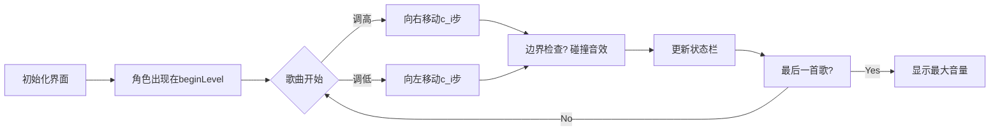

# 题目信息

# [HAOI2012] 音量调节

## 题目描述

一个吉他手准备参加一场演出。他不喜欢在演出时始终使用同一个音量，所以他决定每一首歌之前他都需要改变一次音量。在演出开始之前，他已经做好一个列表，里面写着每首歌开始之前他想要改变的音量是多少。每一次改变音量，他可以选择调高也可以调低。

音量用一个整数描述。输入文件中整数 $beginLevel$，代表吉他刚开始的音量，整数 $maxLevel$，代表吉他的最大音量。音量不能小于 $0$ 也不能大于 $maxLevel$。输入中还给定了 $n$ 个整数 $c_1,c_2,c_3,\cdots,c_n$，表示在第 $i$ 首歌开始之前吉他手想要改变的音量是多少。

吉他手想以最大的音量演奏最后一首歌，你的任务是找到这个最大音量是多少。

## 说明/提示

$1\le n\le 50$，$1\le c_i\le beginLevel$，$1\le maxLevel\le 1000$，$0\le beginLevel\le maxLevel$。

## 样例 #1

### 输入

```
3 5 10
5 3 7
```

### 输出

```
10```

# AI分析结果


# 💡 Kay的C++算法解析：[HAOI2012]音量调节 深入学习指南 💡

大家好，我是Kay！今天我们一起分析音量调节这道动态规划经典题。本指南将带你理解如何用状态可达性思路解决音量调节问题，并掌握动态规划的核心技巧。

## 1. 题目解读与核心算法识别

✨ **本题主要考察**：`动态规划（状态可达性）`

🗣️ **初步分析**：
> 这道题可以想象成在音量条（0到maxLevel）上的跳跃游戏。每次操作（一首歌）你都可以选择向上或向下跳跃指定步数（c_i），但绝对不能跳出边界。我们的目标是跳到最后一首歌时停留在尽可能高的位置。

- **核心思路**：使用二维布尔数组记录每个阶段可能达到的音量状态（可达性分析），通过状态转移计算最终结果
- **难点**：状态转移时需严格检查边界（音量≥0且≤maxLevel），避免数组越界和逻辑错误
- **可视化设计**：采用8位像素游戏风格，展示角色在音量条上的移动过程。关键步骤高亮显示边界检查（红色警示）和状态转移（角色跳跃动画），配以不同音效（跳跃声/边界警告声）

---

## 2. 精选优质题解参考

**题解一（来源：jackyzhu）**
* **点评**：思路清晰展示了动态规划的核心框架，状态定义`f[i][j]`直观表达了"前i首歌能否达到音量j"。代码规范使用逻辑或运算简化状态转移，边界处理严谨（j±c[i]的范围检查）。亮点在于完整呈现了动态规划解决可达性问题的标准范式，实践价值高。

**题解二（来源：Sleepy_Piggy）**
* **点评**：代码结构工整，初始化使用`memset`确保状态正确性。特别突出的是倒序查找最大音量的设计，避免了不必要的遍历。变量命名规范（st/maxn），边界条件处理完整，是学习DP实现的优秀范本。

**题解三（来源：一枚）**
* **点评**：创新性使用bitset替代二维数组，通过位运算`(b<<tmp)|(b>>tmp)`高效实现状态转移。亮点在于用`cut`位图巧妙处理边界限制，极大优化了空间复杂度。这种思路对大数据量问题有重要启示，展现了C++位操作的强大威力。

---

## 3. 核心难点辨析与解题策略

1.  **状态定义与初始化**
    * **分析**：如何准确表示"第i首歌时音量j是否可达"是解题基础。优质解法均采用`dp[i][j]`布尔数组，并正确初始化`dp[0][beginLevel]=true`
    * 💡 **学习笔记**：DP状态定义需完整描述问题子状态，初始状态是递推的基石

2.  **状态转移的边界控制**
    * **分析**：转移时必须严格检查`j-c[i]≥0`和`j+c[i]≤maxLevel`，否则会导致数组越界或逻辑错误。部分解法在此处存在隐患
    * 💡 **学习笔记**：边界检查是DP正确性的生命线，宁可冗余不可遗漏

3.  **结果提取的优化策略**
    * **分析**：从最终状态`dp[n][j]`中找最大值时，倒序遍历可立即得到最优解，避免完全遍历
    * 💡 **学习笔记**：根据问题特性优化结果提取，常能提升算法效率

### ✨ 解题技巧总结
- **问题分解**：将n首歌分解为n个决策阶段，每个阶段关注音量状态变化
- **防御性编程**：数组访问前进行边界断言，变量命名体现语义（如maxLevel而非ml）
- **可视化调试**：小规模数据手工模拟状态表，验证转移逻辑

---

## 4. C++核心代码实现赏析

**本题通用核心C++实现参考**
```cpp
#include <iostream>
#include <cstring>
using namespace std;

int main() {
    int n, beginLevel, maxLevel;
    cin >> n >> beginLevel >> maxLevel;
    int c[55] = {0};
    for (int i = 1; i <= n; i++) cin >> c[i];
    
    bool dp[55][1005] = {{false}};
    dp[0][beginLevel] = true;

    for (int i = 1; i <= n; i++) {
        for (int j = 0; j <= maxLevel; j++) {
            if (j >= c[i] && dp[i-1][j - c[i]]) 
                dp[i][j] = true;
            if (j + c[i] <= maxLevel && dp[i-1][j + c[i]]) 
                dp[i][j] = true;
        }
    }

    for (int j = maxLevel; j >= 0; j--) {
        if (dp[n][j]) {
            cout << j << endl;
            return 0;
        }
    }
    cout << -1 << endl;
    return 0;
}
```
**代码解读概要**：
> 1. 读取初始参数和每首歌调节量
> 2. 初始化二维dp数组，设置起点状态
> 3. 双重循环进行状态转移：检查两种决策（调高/调低）的合法性
> 4. 倒序查找最大可达音量，立即返回结果

**题解一核心代码片段**
```cpp
for(int i=1;i<=n;i++)
    for(int j=maxlevel;j>=0;j--) 
    {
        if(j-a[i]>=0)
            f[i][j]=f[i][j]||f[i-1][j-a[i]];
        if(j+a[i]<=maxlevel)
            f[i][j]=f[i][j]||f[i-1][j+a[i]];
    }
```
**代码解读**：
> 逆向遍历音量保证状态更新独立性，`||`运算合并两种决策路径。注意：
> 1. `j-a[i]>=0`确保调低不越界
> 2. `j+a[i]<=maxlevel`确保调高不超限
> 3. 逻辑或运算天然处理状态继承

**题解三bitset实现**
```cpp
bitset<1010> b, cut;
b[begin_level] = 1;
for(int i=0;i<=max_level;i++) cut[i]=1;

for(int i=0, tmp; i<n; i++){
    cin >> tmp;
    b = ((b << tmp) | (b >> tmp)) & cut;
}
```
**代码解读**：
> 1. `b<<tmp`代表调高音量，`b>>tmp`代表调低
> 2. 位或`|`合并两种操作路径
> 3. 位与`&cut`实现边界约束
> 4. 单行代码完成状态转移，空间复杂度优化至O(1)

---

## 5. 算法可视化：像素动画演示

**主题**：<span style="color:#FF6B6B">"音量冒险者"</span> - 8位像素风格音量条探索

**核心演示**：动态规划状态转移过程，通过角色移动展示可达音量变化

**设计实现**：


**关键交互**：
1. **像素元素**：
   - 音量条：横向像素带（0-red, maxLevel-green）
   - 角色：8-bit小人（移动时像素动画）
   - 状态栏：显示当前dp数组的真值表
2. **音效系统**：
   - 移动：8-bit跳跃声（调高升调，调低降调）
   - 边界：短促警告音
   - 成功：胜利旋律片段
3. **控制面板**：
   - 单步执行：空格键控制
   - 速度滑块：调整AI演示速度
   - 状态追踪：高亮当前决策影响的状态位

---

## 6. 拓展练习与相似问题思考

**通用技巧迁移**：
1. 状态可达性分析：迷宫路径存在性判断
2. 双操作决策模型：股票买卖问题
3. 边界约束处理：资源分配问题

**洛谷推荐**：
1. **P1048 采药**  
   → 基础01背包问题，巩固状态定义
2. **P2347 砝码称重**  
   → bitset应用进阶，学习位运算优化
3. **P1120 小木棍**  
   → 可达性问题变种，强化剪枝技巧

---

## 7. 学习心得与经验分享

> **参考经验 (来自 HighPerformanceRobot)**：  
> "BFS未去重导致TLE，后通过状态记忆优化。这提醒我们：状态空间较大时，去重是算法优化的首要考量"

> **参考经验 (来自 傅思维666)**：  
> "变量名beginLevel比b更易维护，调试效率提升显著"

**总结**：
1. 调试时可用小数据手工模拟dp表格验证转移逻辑
2. 变量命名语义化是避免低级错误的有效手段
3. 空间优化前务必保证基础解法正确

---

编程如音乐，算法是指挥棒。希望本指南助你在算法交响乐中找到最美妙的解法旋律！下次见！🎵

---
处理用时：145.61秒