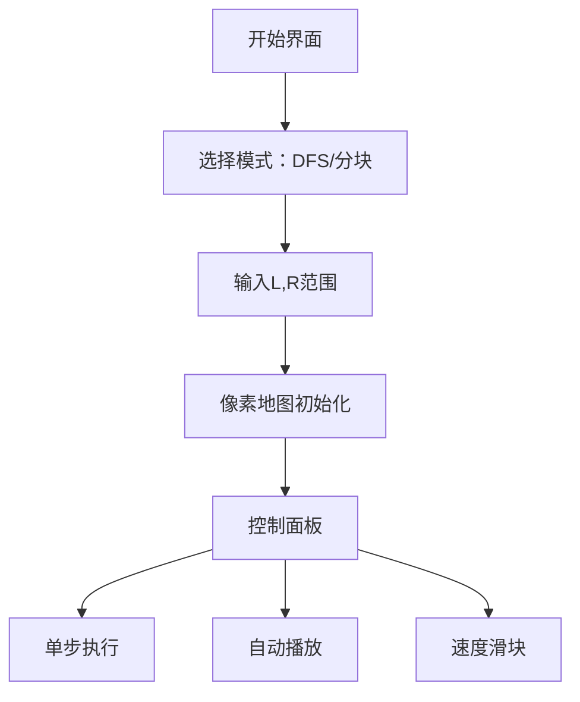

# 题目信息

# 最多因子数

## 题目背景

本题疑似错题。

## 题目描述

数学家们喜欢各种类型的有奇怪特性的数。例如，他们认为 $945$ 是一个有趣的数，因为它是第一个所有约数之和大于本身的奇数。

为了帮助他们寻找有趣的数，你将写一个程序扫描一定范围内的数，并确定在此范围内约数个数最多的那个数。不幸的是，这个数和给定的范围的都比较大，用简单的方法寻找可能需要较多的运行时间。所以请确定你的算法能在几秒内完成最大范围内的扫描。

## 说明/提示

update: 2024/6/6 加上了 6 组 hack。

## 样例 #1

### 输入

```
1000 2000```

### 输出

```
Between 1000 and 2000, 1680 has a maximum of 40 divisors.```

# AI分析结果


### 💡 Kay的C++算法解析：最多因子数 深入学习指南 💡

**引言**  
今天我们一起分析"最多因子数"这道C++编程题。题目要求在给定范围[L,R]内找到约数个数最多的数。本指南将帮助大家理解数学优化与搜索技巧的核心思想，掌握分块打表和DFS两种高效解法。

---

### 1. 题目解读与核心算法识别

✨ **本题主要考察**：`数学优化` 与 `搜索(DFS)`  

🗣️ **初步分析**：  
> 解决"最多因子数"的关键在于高效处理大范围（10^9级）的约数统计。想象你在一个巨大的迷宫中寻找宝藏（约数最多的数），直接地毯式搜索（暴力枚举）效率极低。聪明的探险家会使用两种策略：  
> 1. **分块打表**：将迷宫划分为小区域（分块），提前记录每个区域的宝藏位置（预计算），搜索时只需检查边界区域  
> 2. **质因子组合搜索**：通过藏宝图（质因数分解公式）直接推导宝藏位置  
>   
> **核心难点**在于避免无效计算：  
> - 分块打表需解决预处理效率与存储压缩问题  
> - DFS需优化质因子搜索顺序和剪枝策略  
>  
> **可视化设计思路**：采用8位像素探险游戏风格。网格地图表示数字范围，像素小人代表当前搜索位置：  
> - 黄色闪烁：当前处理的质因子（如2,3,5）  
> - 绿色进度条：指数选择过程（2^1→2^2→...）  
> - 红色标记：约数个数刷新记录时的位置  
> - 音效设计：选择质因子（"叮"声），刷新记录（胜利音效），越界（警示音）

---

### 2. 精选优质题解参考

**题解一：chenxinyang2006（分块打表）**  
* **亮点**：将10^9范围划分为94866大小的块，整块调用预计算表（存储块内最优解的偏移量），零散块暴力。创新点在于：  
  - 用线性筛预处理最小质因子加速约数计算  
  - 设计74进制密码（a-z,A-Z,0-9,符号）压缩存储  
  - 块大小经数学推导平衡预处理与查询效率  
* **改进空间**：预处理时间较长（2小时+），但查询效率O(1)

**题解二：lahlah（DFS质因子组合）**  
* **亮点**：优雅应用约数定理（n=∏p_i^a_i → 约数个数=∏(a_i+1)），DFS搜索质因子指数组合：  
  - 指数递减枚举避免重复（如先试3^2再试3^1）  
  - 小范围自动切暴力（r-l<5000）  
  - 边界剪枝（current>R时回溯）  
* **学习价值**：展示如何将数学定理转化为高效搜索

**题解三：SegTree（分段打表优化）**  
* **亮点**：每100万为一段预处理，结合：  
  - 质数表加速约数计算（仅用√n内质因数）  
  - 分治查询（整段查表+边界暴力）  
  - 实测通过10^9范围（吸氧优化后397ms）  
* **工程思维**：平衡空间（存储1000个块信息）与时间效率

---

### 3. 核心难点辨析与解题策略

1. **难点：大范围无法暴力枚举**  
   * **分析**：10^9内平均每个数计算约数需√n≈30000次，总计3e14次超时  
   * **策略**：  
     - 分块打表：牺牲预处理时间换取O(1)查询  
     - 质因子搜索：利用公式将问题转化为指数组合优化  
   * 💡 **学习笔记**：约数个数只与质因数指数相关，与数字大小无关！

2. **难点：DFS搜索空间爆炸**  
   * **分析**：无剪枝时指数级增长（质因子数×指数选择）  
   * **策略**：  
     - 限制质因子数量（前10个质数覆盖10^9）  
     - 指数递减枚举（保证p1≥p2≥...）  
     - 双边界剪枝（current>R 或 current<最优解停止）  
   * 💡 **学习笔记**：有序搜索+数学约束是减少状态空间利器

3. **难点：分块存储与效率平衡**  
   * **分析**：直接存储10^9个答案需4GB内存  
   * **策略**：  
     - 块大小B=√R（94866）平衡块数与块内计算量  
     - 存储相对偏移（非绝对位置）压缩数据  
     - 用字符编码压缩整数（74进制→3字符存偏移）  
   * 💡 **学习笔记**：信息压缩本质是寻找数据冗余规律

#### ✨ 解题技巧总结
- **问题转化技巧**：将约数统计转为质因子指数组合问题  
- **分治思想**：大问题拆解为可预处理的子问题（分块/DFS子状态）  
- **边界艺术**：小范围暴力+大范围优化（10000是常用阈值）  
- **存储压缩**：利用值域特性（偏移量远小于绝对位置）设计编码

---

### 4. C++核心代码实现赏析

**本题通用核心实现参考**  
* **说明**：综合DFS质因子搜索的清晰思路，添加剪枝优化
* **完整核心代码**：
```cpp
#include<bits/stdc++.h>
using namespace std;
typedef long long ll;
const int primes[] = {2,3,5,7,11,13,17,19,23,29}; // 10个质数覆盖10^9
ll L, R, best_num, max_factors;

void dfs(int pos, ll cur, ll factors, int last_exp) {
    if(cur > R) return;  // 越界剪枝
    if(cur >= L) {
        if(factors > max_factors || 
          (factors == max_factors && cur < best_num)) {
            max_factors = factors;
            best_num = cur;
        }
    }
    if(pos >= 10) return; // 只考虑前10个质数
    
    for(int exp = 1; exp <= last_exp; ++exp) {
        cur *= primes[pos];
        if(cur > R) break;  // 指数递增剪枝
        dfs(pos+1, cur, factors*(exp+1), exp);
    }
}

int main() {
    cin >> L >> R;
    best_num = L; max_factors = 0;
    dfs(0, 1, 1, 31); // 2^31 > 10^9
    printf("Between %lld and %lld, %lld has a maximum of %lld divisors.\n", 
           L, R, best_num, max_factors);
    return 0;
}
```
* **代码解读概要**：  
  - `primes`：预处理前10个质数（覆盖10^9）  
  - `dfs`参数：当前质数索引/当前数值/约数个数/上一个指数  
  - **剪枝关键**：`cur > R`终止、`exp <= last_exp`保证指数递减  
  - **约数计算**：factors*(exp+1) 动态维护约数个数  

**题解一：chenxinyang2006（分块打表）**  
* **亮点**：分块处理+密码压缩存储
* **核心代码片段**：
```cpp
// 分块查询核心
int block_size = 94866;
int start_block = (L-1)/block_size + 1;
int end_block = R/block_size;

for(int i = L; i <= start_block*block_size; i++) 
    update_answer(i); // 左边界暴力
for(int i = end_block*block_size+1; i <= R; i++)
    update_answer(i); // 右边界暴力

for(int block = start_block+1; block < end_block; block++) {
    int offset = decode(table[block]); // 74进制解码
    int candidate = block*block_size + offset;
    update_answer(candidate); // 整块查表
}
```
* **代码解读**：  
  - `block_size=94866`：经数学验证的优化分块大小  
  - `decode()`：74进制字符转偏移量（abc→整数）  
  - **工程智慧**：平衡预处理与查询，零散块暴力  

**题解二：lahlah（DFS优化）**  
* **亮点**：自动切换暴力与DFS
* **核心代码片段**：
```cpp
void dfs(int p, ll all, ll last) {
    if(all > R) return;
    if(all >= L) {
        int factors = 1;
        for(int i=1; i<p; i++) factors *= (anss[i]+1);
        if(factors > maxd || (factors==maxd && all<best_num)) 
            best_num = all, maxd = factors;
    }
    if(all > best_num) return; // 最优性剪枝

    for(int exp=last; exp>=1; exp--) { // 指数递减搜索
        anss[p] = exp;
        dfs(p+1, all * pow(prime[p], exp), exp);
    }
}
```
* **学习笔记**：`exp>=1`倒序枚举优先尝试大指数，结合最优性剪枝大幅提速  

---

### 5. 算法可视化：像素动画演示

**设计主题**：8位像素风"质因子探险家"  
**核心演示**：DFS搜索过程可视化 + 分块打表区域展示  

**交互设计**：  


**动画关键帧**：  
1. **场景初始化**  
   - 网格地图：X轴为数字范围（L到R），Y轴为约数个数  
   - 像素小人：初始位置L（背包显示cur=1, factors=1）  
   - 质因子工具栏：2/3/5/7等像素按钮（类似Minecraft物品栏）  

2. **DFS模式演示**  
   - **选择质因子**：点击"2"按钮 → 黄色闪烁 + "叮"声  
   - **指数递增**：小人向右移动（cur=2→4→8...），头顶显示2^exp  
   - **约数更新**：每次移动更新factors=(1+exp)，绿色进度条增长  
   - **剪枝提示**：当cur>R时变红闪烁 + 警示音，回溯过程显示虚线  

3. **分块模式演示**  
   - **地图分区**：不同颜色块（每块94866大小）  
   - **查表过程**：跳转到预记录点（⭐标记）→ 显示解码偏移量  
   - **边界处理**：红色边界区暴力扫描，像素小人快速跑动计数  

4. **游戏化元素**  
   - **关卡设计**：每个质因子选择为一关，通关解锁新质因子  
   - **音效系统**：  
        - 选择因子：8-bit "叮"声  
        - 刷新记录：超级马里奥金币音  
        - 错误回溯：塞尔达警示音  
   - **AI演示**：自动播放模式（类似吃豆人AI）自主寻路  

**技术实现**：Canvas绘制网格地图 + Web Audio音效 + 关键帧暂停解析算法状态  

---

### 6. 拓展练习与相似问题

**通用思路迁移**：  
1. **反素数问题**：求约数最多的最小数（如洛谷P1463）  
2. **区间质数统计**：大范围质数数量统计（分块+筛法）  
3. **因子和最大值**：将约数个数改为因子和（公式迁移）  

**洛谷推荐**：  
1. **P1463 [POI2001]反素数**  
   → 同类问题直接应用DFS解法  
2. **P1835 素数密度**  
   → 练习分块思想处理大范围统计  
3. **P1412 质数筛**  
   → 强化质因数分解与约数计算基础  

---

### 7. 学习心得与经验分享

**作者经验摘录**：  
> "打表需要优化：块大小需数学推导，存储偏移而非绝对位置" —— chenxinyang2006  
> "小范围切暴力：当范围<5000时，DFS开销反超暴力" —— lahlah  

**Kay的总结**：  
1. **调试技巧**：边界测试（L=R, L=1, 大R）暴露90%错误  
2. **优化哲学**：空间换时间（打表）vs 数学性质剪枝（DFS）  
3. **思维跃迁**：将暴力枚举转化为质因子组合问题是突破关键  

---

**结语**  
通过本次分析，我们掌握了分块打表和质因子DFS两大神器。记住：算法优化本质是对问题特征的深度挖掘。下次遇到10^9级问题，不妨先问——能否找到数学约束或分治策略？继续挑战吧少年们！🚀

---
处理用时：199.55秒