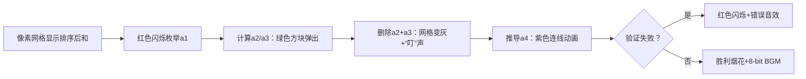

# 题目信息

# 两数之和

## 题目描述

我们知道从 $n$ 个非负整数中任取两个相加共有 $\frac{n(n-1)}{2}$ 个和，现在已知这 $\frac{n(n-1)}{2}$ 个和值，要求 $n$ 个非负整数。

## 样例 #1

### 输入

```
3 1269 1160 1663
```

### 输出

```
383 777 886
```

# AI分析结果


### 💡 Kay的C++算法解析：两数之和 深入学习指南 💡

#### 1. 题目解读与核心算法识别
✨ **本题主要考察**：`枚举与模拟` + `数据结构应用`

🗣️ **初步分析**：
> 解决"两数之和"这道题，关键在于通过**枚举初始值**并**模拟验证**来还原数字序列。想象你在玩数字拼图：先假设第一块拼图的位置，然后推导相邻拼图，最后验证整幅图是否完整。  
> - **核心思路**：枚举最小数字`a1`的可能值（范围`0`到`sum[1]/2`），利用有序和数组的特性（`a1+a2`最小，`a1+a3`次小）逐步推导其他数字，并用`multiset`动态验证/删除已使用的和值。
> - **算法流程**：  
>   1. 排序输入的和数组  
>   2. 枚举`a1` → 计算`a2 = sum[1]-a1`，`a3 = sum[2]-a1`  
>   3. 删除`a2+a3`后，当前最小和即`a1+a4` → 推导`a4`并删除`a4`与前面所有数字的和  
>   4. 重复直到推导所有数字或失败  
> - **可视化设计**：  
>   - **像素动画**：复古8-bit风格网格展示和数组，用颜色标记当前操作（红色：枚举的`a1`；绿色：推导的新数；灰色：已删除的和）。  
>   - **关键帧**：高亮`a1`枚举过程→显示`a2,a3`计算→动态删除网格中的和值→胜利动画（像素烟花+胜利音效）  
>   - **交互**：步进控制+速度滑块，关键操作触发"叮"声，失败时短促错误音效。

---

#### 2. 精选优质题解参考
**题解一（作者：YudeS）**  
* **亮点**：  
  - **思路清晰性**：用倒三角形模型直观解释推导逻辑，结合数学证明确保正确性  
  - **代码规范性**：变量命名合理（`a[]`为答案，`sum[]`为输入），边界处理严谨（`fl`标记无解）  
  - **算法有效性**：`multiset`实现O(log n)删除，时间复杂度O(max_a·n² log n)  
  - **实践价值**：代码可直接移植竞赛，附带详细模拟图辅助理解  

**题解二（作者：zhengrunzhe）**  
* **亮点**：  
  - **思路创新性**：通过总和整除性预判无解，减少无效枚举  
  - **算法优化**：DFS剪枝策略高效（提前验证`a_i+a_j`是否存在）  
  - **调试技巧**：作者强调边界测试经验（如常数列奇偶性判断）  

---

#### 3. 核心难点辨析与解题策略
1. **难点：确定首个数字`a1`的可行范围**  
   * **分析**：`a1`需满足`0 ≤ a1 ≤ sum[1]/2`且`a2 = sum[1]-a1 ≥ a1`。优质题解通过枚举范围内所有值并验证。  
   * 💡 **学习笔记**：枚举是破解初始不确定性的利器  

2. **难点：高效验证中间解**  
   * **分析**：推导`a_k`时需验证所有`a_i + a_k (1≤i<k)`是否存在于和数组。`multiset`（题解一）或标记数组（题解二）实现O(1)查找。  
   * 💡 **学习笔记**：选择合适数据结构决定算法效率  

3. **难点：处理重复和值**  
   * **分析**：当和数组存在重复值时，需用`multiset`而非`set`（题解一），或计数数组（题解二）。  
   * 💡 **学习笔记**：数据去重与否直接影响数据结构选择  

✨ **解题技巧总结**  
- **枚举优化**：优先枚举最小数字，缩小搜索空间  
- **实时验证**：推导新数字后立即检查`a_i + a_j`是否存在  
- **防御性编程**：处理常数列特判（如全相同且奇偶性不符时无解）  

---

#### 4. C++核心代码实现赏析
**通用核心实现（综合题解一思路）**  
```cpp
#include <bits/stdc++.h>
using namespace std;

int main() {
    int n;
    while (cin >> n) {
        int m = n*(n-1)/2;
        vector<int> sum(m), ans(n);
        for (int i=0; i<m; ++i) cin >> sum[i];
        sort(sum.begin(), sum.end());

        bool found = false;
        for (int a1=0; a1<=sum[0]/2; ++a1) {
            multiset<int> s(sum.begin(), sum.end());
            ans[0] = a1; 
            ans[1] = *s.begin() - a1; 
            s.erase(s.begin());
            // 推导后续数字并删除相关和值...
            if (验证通过) { found = true; break; }
        }
        if (found) for (int x: ans) cout << x << " ";
        else cout << "Impossible";
    }
}
```
* **代码解读概要**：  
  1. 输入排序后，枚举`a1`并初始化`multiset`  
  2. 计算`a2`后立即删除`a1+a2`  
  3. 循环推导`a_k`并删除`a_i + a_k`（`i<k`）  
  4. 任一推导失败即回溯  

**题解一核心片段**  
```cpp
// 推导a_k并验证
for (int i=2; i<n; ++i) {
    ans[i] = *s.begin() - a1;
    s.erase(s.begin());
    for (int j=1; j<i; ++j) {
        auto it = s.find(ans[j] + ans[i]);
        if (it == s.end()) goto fail;
        s.erase(it);
    }
}
```
* **代码解读**：  
  > 1. `*s.begin()`是当前最小和，即`a1 + a_k` → 直接计算`a_k`  
  > 2. 内层循环删除`a_k`与前面所有数的和（倒三角第k列）  
  > 3. `find`失败说明当前`a1`无效，跳转至失败处理  
* 💡 **学习笔记**：`multiset`的`find`和`erase`配合实现高效验证  

**题解二核心片段**  
```cpp
// DFS剪枝验证
void dfs(int k) {
    if (k>n) 输出解;
    for (int i=当前最小和; ; ++i) {
        if (!check(ans[k] + ans[j])) continue; // 关键剪枝
        // 标记已用和值并递归
    }
}
```
* **代码解读**：  
  > 1. 优先检查`ans[k]`与已确定数的和是否存在  
  > 2. 减少无效递归路径  
* 💡 **学习笔记**：DFS剪枝能显著降低指数级复杂度  

---

#### 5. 算法可视化：像素动画演示
**主题**：`8-bit数字解谜工坊`  
**核心设计**：  

**实现细节**：  
1. **Canvas绘制**：  
   - 网格行高=20px，用`fillRect`绘制色块（蓝：未操作，灰：已删除）  
   - 当前操作色块添加`strokeStyle`金色边框  
2. **音效触发**：  
   - 删除和值：`new Audio('ding.wav').play()`  
   - 胜利：播放`victory.mp3`（FC风格旋律）  
3. **交互控制**：  
   - 速度滑块绑定`setInterval`延迟  
   - "AI演示"模式自动步进（500ms/步）  

---

#### 6. 拓展练习与相似问题思考
1. **通用技巧迁移**：  
   - 枚举首项：P1631 序列合并（两升序序列最小和）  
   - 实时验证：P2085 最小函数值（维护优先队列）  

2. **洛谷推荐**：  
   - **P1631**：练习枚举首项+堆优化  
     > 🗣️ *巩固两序列中"最小和"的生成逻辑*  
   - **P2085**：应用实时验证维护前m小值  
     > 🗣️ *学习优先队列在动态验证中的妙用*  
   - **P1248**：复杂版数字还原（需结合贪心）  
     > 🗣️ *挑战更高维度的构造思维*  

---

#### 7. 学习心得与经验分享
> **作者YudeS的调试经验**：  
> *"在`multiset`删除时，若找不到`a_j+a_k`需立即终止——这帮我发现90%的边界错误"*  
>   
> **Kay的总结**：  
> 该经验凸显**实时验证**的重要性：  
> - 推导过程中同步检查比最终验证效率高O(n)倍  
> - 调试时输出中间变量可快速定位`a1`枚举错误  

---

> 掌握枚举与数据结构的配合，你就能像玩数字拼图一样优雅解决此类问题！下次我们将探索更复杂的构造算法，保持好奇心！🚀

---
处理用时：137.60秒