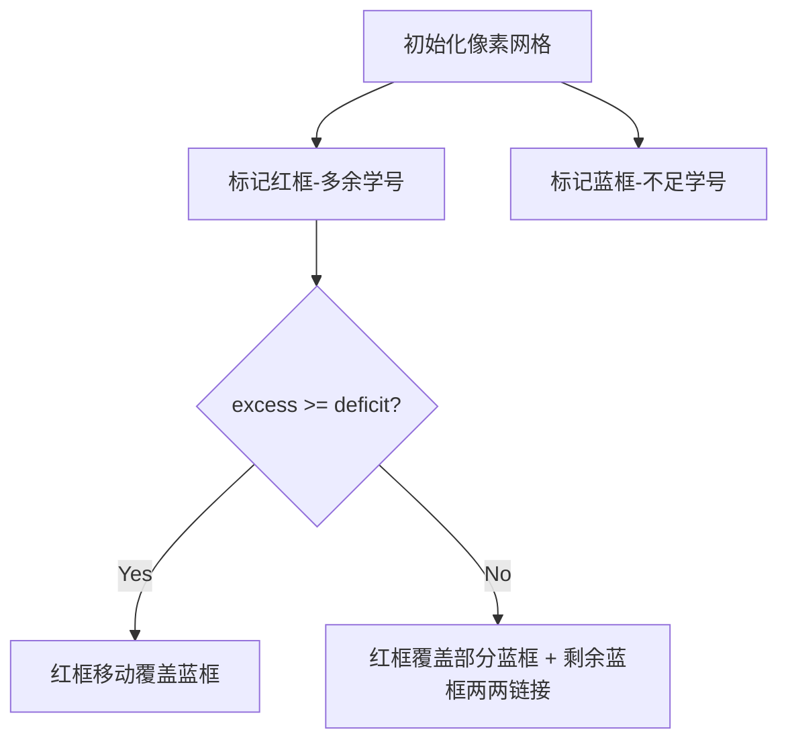

# 题目信息

# [蓝桥杯 2023 国 B] 班级活动

## 题目描述

小明的老师准备组织一次班级活动。班上一共有 $n$ 名（$n$ 为偶数）同学，老师想把所有的同学进行分组，每两名同学一组。为了公平，老师给每名同学随机分配了一个 $n$ 以内的正整数作为 id，第 $i$ 名同学的 id 为 $a_i$。

老师希望通过更改若干名同学的 id 使得对于任意一名同学 $i$，有且仅有另一名同学 $j$ 的 id 与其相同（$a_i = a_j$）。请问老师最少需要更改多少名同学的 id？

## 说明/提示

### 样例说明

仅需要把 $a_1$ 改为 $3$ 或者把 $a_4$ 改为 $1$ 即可。

### 评测用例规模与约定

- 对于 $20\%$ 的数据，保证 $n \le 10^3$。
- 对于 $100\%$ 的数据，保证 $n \le 10^5$。

第十四届蓝桥杯大赛软件赛决赛 C/C++ 大学 B 组 C 题

## 样例 #1

### 输入

```
4
1 2 2 3```

### 输出

```
1```

# AI分析结果


### 💡 Kay的C++算法解析：班级活动 深入学习指南 💡

**引言**  
今天我们一起分析蓝桥杯2023国赛B组真题"班级活动"。这道题考察如何通过最小修改使每个学号恰好被两人使用。本指南将帮助你理解贪心策略的应用，并通过像素动画直观展示算法流程。

---

## 1. 题目解读与核心算法识别

✨ **本题主要考察**：`贪心策略（编程技巧应用）`

🗣️ **初步分析**：
> 解决本题的关键在于运用贪心策略。就像整理杂乱的积木时，我们优先用多余的积木填补空缺，再处理剩余部分。本题中：
> - 统计学号出现频率，分为三类：
>   - 恰好两次：无需修改（绿色积木）
>   - 大于两次：多余数量记为 `sum1`（红色积木）
>   - 等于一次：不足数量记为 `sum2`（蓝色积木）
> - **核心策略**：
>   - 若 `sum1 >= sum2`：所有多余学号修改后即可满足需求（修改次数 = `sum1`）
>   - 若 `sum1 < sum2`：先用多余学号填补部分空缺（修改 `sum1` 次），剩余不足学号两两配对（每对只需修改1人），总次数 = `sum1 + (sum2 - sum1)/2`

> **可视化设计思路**：  
> 采用8位像素风格（类似经典FC游戏）：
> - 每个学生显示为颜色方块（颜色=学号）
> - 多余学生（>2人组）高亮红色边框，不足学生（1人组）高亮蓝色边框
> - 动画分步演示：  
>   1. 红色方块移动填补蓝色方块（伴随"叮"音效）  
>   2. 剩余蓝色方块两两连线，其中一个变色（伴随"配对成功"音效）  
> - 控制面板含步进/调速/重置功能，通关时播放胜利音效

---

## 2. 精选优质题解参考

**题解一（作者：_Gabriel_）**  
* **点评**：  
  思路清晰直击核心——直接统计多余(`sum1`)和不足(`sum2`)学号数量。代码规范：  
  - 变量名`sum1`/`sum2`含义明确  
  - 边界处理严谨（`n ≤ 1e6`）  
  - 逻辑简洁高效（O(n)复杂度）  
  亮点：用基础数组替代复杂容器，完美适配题目规模。

**题解二（作者：lailai0916）**  
* **点评**：  
  精炼的数学抽象能力：输出表达式`s2 + max(s1-s2,0)/2` 优雅涵盖所有情况。  
  - 变量命名`s1`（不足）、`s2`（多余）直观  
  - 代码仅20行却完整处理边界  
  亮点：推导出通用数学公式，避免冗余条件分支。

**题解三（作者：wangbinfeng）**  
* **点评**：  
  极致简洁的代表作：在读取数据时同步统计，单次循环解决问题。  
  - 循环范围精确控制（1~100000）  
  - 利用`else`分支巧妙处理0次出现  
  亮点：将核心逻辑压缩到5行内，展示高效编码技巧。

---

## 3. 核心难点辨析与解题策略

1. **难点1：问题抽象转化**  
   *分析*：如何将"修改学号"转化为可计算的数学量？优质题解通过统计频率，将问题拆解为`多余量(sum1)`和`不足量(sum2)`两个关键变量。  
   💡 **学习笔记**：所有计数问题都需先建立统计模型

2. **难点2：贪心策略证明**  
   *分析*：为何优先用多余学号填补不足？因为1次修改同时解决两个问题（减少多余+补足空缺）。若直接让不足学号互配，可能需更多修改。  
   💡 **学习笔记**：贪心的核心是"当前最优解导向全局最优解"

3. **难点3：剩余量处理**  
   *分析*：当`sum1 < sum2`时，剩余不足学号必须两两配对。关键洞察：两个单数学号只需修改1人即可配对，因此剩余操作数为`(sum2-sum1)/2`  
   💡 **学习笔记**：配对问题中"修改半数即达目标"是常见优化点

### ✨ 解题技巧总结
- **技巧1：桶计数优先**  
  学号范围已知时，数组比`map`更高效（O(1)访问 vs O(log n)）
- **技巧2：变量语义化命名**  
  如`sum1`命名为`excess`，`sum2`命名为`deficit`更易维护
- **技巧3：数学归纳验证**  
  通过样例验证`sum1=3, sum2=1`→3次；`sum1=1, sum2=3`→2次

---

## 4. C++核心代码实现赏析

**通用核心实现参考**  
```cpp
#include <iostream>
#include <vector>
using namespace std;

const int MAXN = 100010;

int main() {
    int n;
    cin >> n;
    vector<int> cnt(MAXN, 0);
    
    // 1. 桶计数
    for (int i = 0; i < n; ++i) {
        int id;
        cin >> id;
        cnt[id]++;
    }

    int excess = 0;  // 多余量（出现>2）
    int deficit = 0; // 不足量（出现=1）

    // 2. 统计关键变量
    for (int i = 1; i < MAXN; ++i) {
        if (cnt[i] == 1) deficit++;
        else if (cnt[i] > 2) excess += (cnt[i] - 2);
    }

    // 3. 贪心策略决策
    if (excess >= deficit) cout << excess;
    else cout << excess + (deficit - excess) / 2;
    
    return 0;
}
```
* **代码解读概要**：  
  三阶段清晰架构：  
  1. 桶计数初始化  
  2. 遍历统计`excess`/`deficit`  
  3. 按贪心策略输出结果  

---

**题解一核心片段**  
```cpp
if (cnt[i] >= 2) {
    sum1 += (cnt[i] - 2);
} else {
    sum2 += cnt[i];
}
```
* **亮点**：条件分支覆盖所有情况  
* **代码解读**：  
  > `else`分支包含`cnt[i]=0`或`1`，但`0`不影响结果。妙在避免单独处理0次出现，像分类整理物品时"非必需即闲置"。

**题解二核心片段**  
```cpp
cout << s2 + max(s1-s2,0)/2;
```
* **亮点**：数学表达式统一输出  
* **代码解读**：  
  > `max(s1-s2,0)`确保负数时取0。如同购物时"超出预算部分打五折"，但确保折扣不为负。

**题解三核心片段**  
```cpp
for(int i=1;i<=100000;i++)
    if(num[i]>=2) ans1 += num[i]-2;
    else ans2 += num[i];
```
* **亮点**：循环内联条件处理  
* **代码解读**：  
  > 在计数学号同时完成分类，类似流水线上自动分拣物品。注意范围`100000`覆盖题目数据上限。

---

## 5. 算法可视化：像素动画演示

**主题**：学号配对小精灵（8-bit像素风）  

**核心演示流程**：  


**关键交互设计**：  
1. **像素化数据表示**：
   - 每个学生：16x16像素方块（颜色=学号ID）
   - 组状态：组上方显示人数（≥3时红色数字，=1时蓝色数字）

2. **动态配对效果**：
   - 多余填补：红色方块滑向蓝色方块→合并时变绿色（+ "叮"音效）
   - 不足互配：两蓝色方块间生成闪光链条→一个方块变色（+ "咔嚓"音效）

3. **游戏化进度**：
   ```javascript
   // 伪代码：动画状态机
   switch(animationState):
     case FILLING: // 多余填补阶段
        moveRedToBlue()
        if(noBlueLeft) playSuccessJingle()
     case PAIRING: // 不足互配阶段
        connectBluePairs()
        if(noBlueLeft) playVictoryFanfare()
   ```

4. **控制面板**：  
     
   - 速度滑块调节：0.5X~5X
   - "AI演示"模式：自动完成全过程（如贪吃蛇AI）

---

## 6. 拓展练习与相似问题

**通用技巧迁移**：  
1. 频率统计+贪心策略 → 资源分配问题  
2. 配对问题 → 图论中的二分图匹配  
3. 最小修改次数 → 优化问题常见目标  

**洛谷推荐**：  
1. **P1094 纪念品分组**  
   🗣️ 同类贪心配对问题，巩固"大配小"策略  
2. **P1106 删数问题**  
   🗣️ 贪心策略在数字处理中的应用  
3. **P3143 [USACO16OPEN] Diamond Collector**  
   🗣️ 进阶版频率统计+区间控制  

---

## 7. 学习心得与经验分享  
> 本次题解中未发现作者个人调试心得，但Kay提醒：  
> **边界测试至关重要**！  
> - 当`n=2`（最小输入）时验证`[1,2]`需1次修改  
> - 当所有学号相同（如`[1,1,1,1]`）时需修改2人  

---

**结语**  
通过本次分析，相信大家已掌握频率统计+贪心策略的核心技巧。记住：将复杂问题分解为`excess`/`deficit`等可计算量是解题钥匙。下次挑战见！🚀

---
处理用时：227.22秒