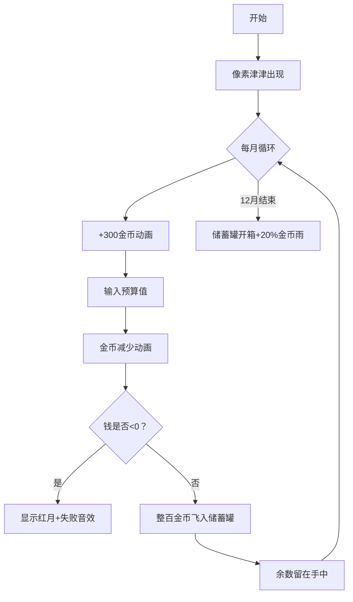

# 题目信息

# [NOIP 2004 提高组] 津津的储蓄计划

## 题目描述

津津的零花钱一直都是自己管理。每个月的月初妈妈给津津 $300$ 元钱，津津会预算这个月的花销，并且总能做到实际花销和预算的相同。

为了让津津学习如何储蓄，妈妈提出，津津可以随时把整百的钱存在她那里，到了年末她会加上 $20\%$ 还给津津。因此津津制定了一个储蓄计划：每个月的月初，在得到妈妈给的零花钱后，如果她预计到这个月的月末手中还会有多于 $100$ 元或恰好 $100$ 元，她就会把整百的钱存在妈妈那里，剩余的钱留在自己手中。


例如 $11$月初津津手中还有 $83$ 元，妈妈给了津津 $300$ 元。津津预计$11$月的花销是 $180$ 元，那么她就会在妈妈那里存 $200$ 元，自己留下 $183$ 元。到了 $11$ 月月末，津津手中会剩下 $3$ 元钱。


津津发现这个储蓄计划的主要风险是，存在妈妈那里的钱在年末之前不能取出。有可能在某个月的月初，津津手中的钱加上这个月妈妈给的钱，不够这个月的原定预算。如果出现这种情况，津津将不得不在这个月省吃俭用，压缩预算。


现在请你根据 $2004$ 年 $1$ 月到 $12$ 月每个月津津的预算，判断会不会出现这种情况。如果不会，计算到 $2004$ 年年末，妈妈将津津平常存的钱加上 $20\%$ 还给津津之后，津津手中会有多少钱。


## 样例 #1

### 输入

```
290
230
280
200
300
170
340
50 
90 
80 
200
60 
```

### 输出

```
-7 
```

## 样例 #2

### 输入

```
290 
230 
280 
200 
300 
170 
330 
50 
90 
80 
200 
60 
```

### 输出

```
1580
```

# AI分析结果


### 💡 Kay的C++算法解析：津津的储蓄计划 深入学习指南 💡

**引言**  
今天我们来分析NOIP 2004提高组的经典题目"津津的储蓄计划"。这道题通过生活化的储蓄场景，帮助我们掌握**模拟算法**的核心思想和实现技巧。本指南将带你逐步拆解题目逻辑，并通过像素动画直观展示算法运行过程。

---

## 1. 题目解读与核心算法识别

✨ **本题主要考察**：`模拟应用`（编程技巧应用类）

🗣️ **初步分析**：  
> 解决这道题就像操作一个像素风格的储蓄小游戏🎮：每个月津津会获得金币（+300），支付生活开销后，把多余的金币存入储蓄罐。核心在于**严格按规则分步执行**：
> - **所有题解**都采用顺序模拟：逐月处理收入、支出、存钱操作
> - **核心难点**：正确处理存钱逻辑（整百存储）和边界检测（钱不够时立即终止）
> - **可视化设计**：我们将用像素动画展示：
>   - 每月初：金色硬币+300动画
>   - 支出时：钱袋减少特效
>   - 存钱时：整百金币飞入储蓄罐
>   - 钱不够：红色警告闪烁 + 失败音效💥
> - **复古游戏化**：采用FC红白机像素风格，关键操作配8-bit音效，每月作为独立"关卡"

---

## 2. 精选优质题解参考

**题解一（来源：wurang）**  
* **点评**：思路最简洁直白，用`n`记录手持现金，`s`记录储蓄金额。边界处理干净利落（钱不够时直接`return`终止），存钱逻辑用`while(n>=100)`清晰表达循环存钱过程。变量命名虽简单但含义明确，代码可直接用于竞赛。

**题解二（来源：sea_bird）**  
* **点评**：教学价值突出，添加详细注释解释变量含义（如强调`cos`是cost不是三角函数）。使用`flag`标记状态增强可读性，存钱逻辑采用数学计算`(money/100)*100`避免循环，适合初学者理解。

**题解三（来源：yedalong）**  
* **点评**：算法实现最精炼，用`sum`存储蓄金额，`ans`存手持现金。创新性地用`(300-s+ans)/100*100`单行完成存钱计算，配合取模运算`ans=(...)%100`高效更新手持金额，展示进阶技巧。

---

## 3. 核心难点辨析与解题策略

1. **操作顺序陷阱**  
   * **分析**：必须先执行`手持现金+300`再减去开销，顺序颠倒会导致计算错误。优质题解都严格保持：收入→支出→存钱顺序
   * 💡 学习笔记：模拟类问题必须严格遵循题目描述的时序逻辑

2. **整百存储的实现**  
   * **分析**：两种主流实现：
     - 循环法（wurang）：`while(n>=100){n-=100;s+=100}`
     - 数学法（yedalong）：`s += (n/100)*100; n %= 100;`
   * 💡 学习笔记：数学法效率更高，循环法更易理解

3. **边界处理时机**  
   * **分析**：必须在存钱前检测`手持现金<0`。如sea_bird在支出后立即用`if(money<0)`判断，避免无效存钱操作
   * 💡 学习笔记：状态检测要放在可能引发错误的关键操作前

### ✨ 解题技巧总结
- **分层模拟法**：将复杂过程拆解为收入、支出、存储三个独立模块
- **即时终止**：检测到错误条件时立即退出，避免无效计算（如wurang的`return 0`）
- **变量名语义化**：如`hand_cash`比`n`更易理解（参考sea_bird的`money`）
- **数学优化**：用整除/取模代替循环提升效率（参考yedalong解法）

---

## 4. C++核心代码实现赏析

**通用核心实现参考**  
```cpp
#include <iostream>
using namespace std;

int main() {
    int hand = 0;     // 手持现金
    int saving = 0;   // 储蓄金额

    for(int month=1; month<=12; ++month) {
        hand += 300;  // 每月收入
        
        int cost;
        cin >> cost;  // 输入本月开销
        hand -= cost; // 支付开销
        
        if(hand < 0) { // 检测钱是否不够
            cout << "-" << month;
            return 0;
        }
        
        saving += (hand / 100) * 100; // 整百存钱
        hand %= 100;                  // 更新手持现金
    }
    
    // 年末计算总金额（储蓄*1.2 + 手持现金）
    cout << saving * 1.2 + hand;
    return 0;
}
```
* **代码解读概要**：  
  1. 初始化手持现金(`hand`)和储蓄(`saving`)  
  2. 循环12个月：先收入300，再扣除开销  
  3. 若出现负数立即输出月份并终止  
  4. 用整除/取模实现整百存储  
  5. 年末计算总金额（储蓄*120% + 手持现金）

---

**题解片段赏析**  
**wurang解法核心**  
```cpp
n = n + 300 - y;          // 合并收入与支出
if(n < 0) {               // 边界检测
    cout << "-" << i;      // 输出失败月份
    return 0;    
} 
while(n >= 100) {         // 循环存钱
    n -= 100;
    s += 100;
}
```
* **亮点**：操作顺序清晰，安全检测前置  
* **代码解读**：  
  - 第1行：合并收入与支出简化计算  
  - 第2行：**钱不够立即退出**是关键防御  
  - 第5行：`while`循环直观展示存钱过程  
* 💡 学习笔记：循环存钱逻辑更符合现实场景理解

**sea_bird解法核心**  
```cpp
money -= cos;             // 支付开销
if(money<0) {            // 边界检测
    cout<<"-"<<i;
    flag=false;          // 状态标记
    break;
}
mom += (money/100)*100;  // 数学计算存钱
money %= 100;            // 更新手持金额
```
* **亮点**：使用`flag`增强可读性，数学优化存钱  
* **代码解读**：  
  - 第4行：`flag`标记使程序流更清晰  
  - 第7行：`(money/100)*100`高效计算整百金额  
  - 第8行：取模运算确保手持现金<100  
* 💡 学习笔记：状态标记有利于复杂逻辑扩展

**yedalong解法核心**  
```cpp
sum += (300 - s + ans)/100*100;  // 计算存钱
ans = (300 - s + ans) % 100;     // 更新手持现金
```
* **亮点**：单行完成所有计算，极致简洁  
* **代码解读**：  
  - 合并收入、支出、存余计算  
  - `(300-s+ans)`包含上月结余和本月收支  
  - 整除/取模同步完成存钱和余数更新  
* 💡 学习笔记：数学表达式可大幅简化模拟代码

---

## 5. 算法可视化：像素动画演示

**动画主题**  
"津津的储蓄大冒险" - FC红白机风格模拟游戏  

**核心交互设计**  


**实现细节**  
1. **像素素材设计**：
   - 津津角色：16x16像素，不同状态表情（正常/惊讶）
   - 金币：8x8金色像素块，带闪烁效果
   - 储蓄罐：32x32像素，存钱时播放"叮"音效

2. **关键动画触发**：
   ```javascript
   // 伪代码示例
   function simulateMonth(month) {
     playSound('coin'); // 300金币音效
     character.hand += 300; 
     highlight(character, 'golden'); // 金币增加高亮
     
     const cost = getInput(); // 获取预算输入
     if(character.hand < cost) {
        playSound('error'); // 错误音效
        flashScreen('red'); // 红色闪烁
        showText(`-${month}`); 
        return false;
     }
     
     // 存钱动画
     const saveAmount = Math.floor(character.hand / 100) * 100;
     animateCoinsMoving(saveAmount, 'character', 'saving_box'); 
     playSound('ding'); // 存钱音效
     
     character.hand %= 100; // 更新手持现金
   }
   ```

3. **游戏化元素**：
   - **关卡制**：12个月作为12个关卡
   - **成就系统**：连续存钱触发"储蓄达人"奖杯
   - **BGM**：循环播放8-bit轻快音乐
   - **胜利动画**：年末储蓄罐爆炸金币雨+20%绿色特效币

**设计价值**：通过视觉化现金流动和存钱操作，帮助理解模拟算法的时序性和状态转换逻辑。

---

## 6. 拓展练习与相似问题思考

**相似问题场景**  
1. 按月分期计算（如贷款还款模拟）
2. 资源消耗型游戏逻辑（如生存游戏食物消耗）
3. 状态累积系统（如会员积分累计）

**洛谷推荐**  
1. [P1035 级数求和](https://www.luogu.com.cn/problem/P1035)  
   → **推荐理由**：训练循环累加和边界判断，类似"每月累计"思想
   
2. [P1423 小玉在游泳](https://www.luogu.com.cn/problem/P1423)  
   → **推荐理由**：强化分步模拟能力，计算体力消耗与恢复
   
3. [P1217 回文质数](https://www.luogu.com.cn/problem/P1217)  
   → **推荐理由**：综合训练数值计算和状态判断能力

---

## 7. 学习心得与经验分享

**来自题解作者的实战经验**  
> sea_bird在题解中特别提醒：  
> "`cin>>cos;//这里不是三角函数而是每个月花费的钱`"  
> → 强调**变量命名要避免歧义**，这是实际编程中常见的调试痛点

**Graph_Theory的简洁技巧**：  
> 使用三目运算符`cout<<(safe?cash+save*120:-i);`  
> → **学习价值**：展示条件输出的简洁写法，但需平衡可读性

---

**结语**  
储蓄计划题目帮助我们掌握了模拟算法的核心：**按序执行+状态维护**。记住Kay的小口诀："先收钱，再花钱，存钱之前查余额"。多加练习后，你会发现这类模拟问题就像玩像素游戏一样有趣又充满挑战！下次见！👾

---
处理用时：144.23秒