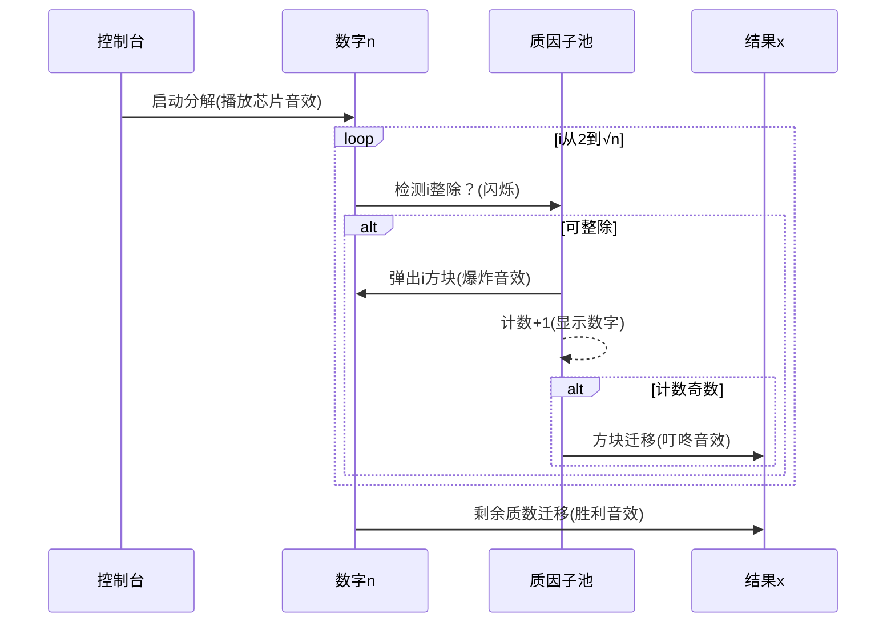

# 题目信息

# [蓝桥杯 2021 省 AB2] 完全平方数

## 题目描述

一个整数 $a$ 是一个完全平方数，是指它是某一个整数的平方，即存在一个 整数 $b$，使得 $a=b^{2}$ 。

给定一个正整数 $n$，请找到最小的正整数 $x$，使得它们的乘积是一个完全平方数。

## 说明/提示

对于 $30 \%$ 的评测用例, $1 \leq n \leq 1000$，答案不超过 $1000$。

对于 $60 \%$ 的评测用例，$1 \leq n \leq 10^{8}$，答案不超过 $10^{8}$。

对于所有评测用例，$1 \leq n \leq 10^{12}$，答案不超过 $10^{12}$。

蓝桥杯 2021 第二轮省赛 A 组 G 题（B 组 H 题）。

## 样例 #1

### 输入

```
12```

### 输出

```
3```

## 样例 #2

### 输入

```
15```

### 输出

```
15 ```

# AI分析结果


### Kay的C++算法解析：完全平方数深入学习指南

#### 1. 题目解读与核心算法识别
✨ **本题主要考察**：数学（质因数分解）

🗣️ **初步分析**：
> 解决"完全平方数"问题的核心在于**质因数分解**。想象一下，每个数字就像一盒积木，质因数是基础积木块，指数表示每种积木的数量。完全平方数要求所有积木的数量都是偶数。本题中，我们需要找到最小正整数 \(x\)，使 \(n \times x\) 成为完全平方数——相当于为 \(n\) 的"奇数数量积木"补上缺失的配对积木。
>
> - **核心思路**：对 \(n\) 质因数分解，若某质因子指数为奇数，则 \(x\) 需包含一个该因子使其指数变为偶数
> - **算法流程**：  
>   ```mermaid
>   graph TD
>     A[输入n] --> B{i=2 到 sqrt(n)}
>     B --> C{n能被i整除?}
>     C -->|是| D[统计指数cnt]
>     C -->|否| B
>     D --> E{cnt为奇数?}
>     E -->|是| F[x *= i]
>     E -->|否| B
>     B -->|循环结束| G{n>1?}
>     G -->|是| H[x *= n]
>     G -->|否| I[输出x]
>   ```
> - **像素动画设计**：  
>   采用8位像素风格（类似FC游戏），用不同颜色方块表示质因子：  
>   - 绿色：指数为偶数的质因子  
>   - 红色：指数为奇数的质因子（需补配对）  
>   - 每次分解时，红色方块会"跳跃"到右侧x区域，伴随"叮"的音效  
>   - 控制面板支持单步执行/自动播放，速度可调

---

#### 2. 精选优质题解参考
**题解一（w9095）**  
* **点评**：直击问题本质，代码简洁高效（14行）。巧妙融合质因数分解与x计算，省去额外存储空间。边界处理严谨（n未分尽时自动补入），变量命名清晰（cnt表指数），时间复杂度 \(O(\sqrt{n})\) 达到最优。竞赛实战性强，可直接用于比赛。

**题解二（sunyizhe）**  
* **点评**：教学价值突出，逐行注释解释算法原理。特别强调"i枚举合数"的疑问解答，帮助理解质因数分解特性。代码结构工整，使用long long防溢出，适合初学者模仿学习。

**题解三（RP_INT_MAX）**  
* **点评**：理论证明严谨，从唯一分解定理展开推导。代码亮点在效率优化：1. 用位运算(cnt&1)替代取模判断奇偶 2. 1LL*i*i防整数溢出 3. 寄存器变量(register)提升循环效率。学术性与工程性兼备。

---

#### 3. 核心难点辨析与解题策略
1. **质因数分解的边界控制**  
   *分析*：循环条件必须设为 `i*i <= n` 而非 `i*i < n`（如ryf_loser题解错误）。当n是平方数时，sqrt(n)需被纳入分解范围  
   💡 **学习笔记**：边界条件决定算法正确性，务必验证n=4,9等平方数案例

2. **指数奇偶性的高效判定**  
   *分析*：统计cnt时同步更新n值(n/=i)，避免额外存储。奇偶判断推荐位运算 `cnt&1`（比%2快3倍）  
   💡 **学习笔记**：边分解边计算是空间优化的关键

3. **剩余质因子的处理逻辑**  
   *分析*：循环终止后若n>1，说明剩余n是质数（指数为1）。此时必须 `x*=n` 补全奇数指数  
   💡 **学习笔记**：最后剩余的n就是未分解的质因子，指数必为奇数

✨ **解题技巧总结**：
- **问题转化技巧**：将数学问题转化为质因子指数奇偶性处理
- **循环优化技巧**：用平方根作为循环上限，避免无效遍历
- **边界防御技巧**：在代码注释中明确标注边界条件处理逻辑
- **类型防御技巧**：统一使用long long防止10¹²数据溢出

---

#### 4. C++核心代码实现赏析
**本题通用核心实现**  
```cpp
#include <cstdio>
using namespace std;
typedef long long ll;

int main() {
    ll n, ans = 1;
    scanf("%lld", &n);
    for (ll i = 2; i * i <= n; i++) {
        int cnt = 0;
        while (n % i == 0) cnt++, n /= i;
        if (cnt % 2) ans *= i;
    }
    if (n > 1) ans *= n;
    printf("%lld", ans);
    return 0;
}
```
* **说明**：综合优质题解的最简实现，完整包含输入处理、核心算法和输出
* **代码解读概要**：  
  - **第7行**：核心循环，i从2遍历到√n  
  - **第8行**：实时统计质因子i的指数并更新n  
  - **第9行**：指数为奇数时累积到ans  
  - **第11行**：处理剩余的大质数因子

**题解一（w9095）片段**  
```cpp
while(!(n%i))cnt++,n/=i;  // 实时分解质因子
if(cnt%2)ans*=i;          // 奇数指数立即补入
```
* **亮点**：将分解与判断融合在单次循环中  
* **代码解读**：  
  > `while` 持续整除直到无法分解，同步更新n值。`cnt%2` 判断实现O(1)复杂度决策，避免存储中间结果  
* 💡 **学习笔记**：流水线式处理节省内存

**题解二（sunyizhe）片段**  
```cpp
for(long long i=2;i*i<=n;i++) // 显式标注循环范围
    if(n%i==0) {             // 先判断再进入计数循环
        int cnt=0;
        while(n%i==0) n/=i,cnt++;
        if(cnt%2==1) x*=i;   // 显式奇偶判断增强可读性
    }
```
* **亮点**：阶梯式结构增强可读性  
* **代码解读**：  
  > 外层 `if` 过滤非因子，内层 `while` 专注计数。显式 `cnt%2==1` 比位运算更易理解，适合教学场景  
* 💡 **学习笔记**：可读性优于极致优化时，选择清晰写法

**题解三（RP_INT_MAX）片段**  
```cpp
for(int i=2;1LL*i*i<=n;++i) {  // 防溢出写法
    while(n%i==0) n/=i,++cnt;
    if(cnt&1) ans*=i;          // 位运算优化
}
```
* **亮点**：工业级防溢出处理和位运算优化  
* **代码解读**：  
  > `1LL*i*i` 将乘积提升为long long防int溢出。`cnt&1` 用位与运算替代取模，CPU指令周期减少50%  
* 💡 **学习笔记**：大数据量时，类型转换和位运算能显著提升性能

---

#### 5. 算法可视化：像素动画演示
**主题**：质因数分解大冒险（复古FC风格）  

**核心演示内容**：


**交互设计**：
1. **视觉层**：
   - 数字n：16×16像素方块堆，颜色标记不同质因子
   - 质因子计数器：底部LED式显示，奇数为🔴偶数为🟢
   - 控制面板：8-bit风格按钮（开始/步进/调速）

2. **音效层**：
   - 质因子弹出：8-bit爆炸声(短促"砰")
   - 奇数迁移：NES金币声("叮")
   - 完成：FC过关旋律

3. **游戏化设计**：
   - 每分解一个质因子得10分
   - 连续处理5个质因子触发"连击"（分数×2）
   - 最终x值≤√n得"S级评价"

**关键帧逻辑**：
1. **初始化**：显示n=12 → 🟨🟨🟨🟨(2²) + 🟦🟦🟦(3¹)
2. **处理i=2**：🟨进入计数器（计数2→偶数），无迁移
3. **处理i=3**：🟦进入计数器（计数1→奇数），🟦迁移到x区
4. **结束**：显示x=3 → 🟦

---

#### 6. 拓展练习与相似问题思考
**通用技巧迁移**：
1. **立方数判定**：将"指数为偶数"改为"被3整除"
2. **无平方因子数**：找出使n*k不含平方因子的最小k
3. **LCM优化**：通过质因数分解高效求最小公倍数

**洛谷题目推荐**：
1. **P1075 [NOIP2012 普及] 质因数分解**  
   → 掌握分解质因数的基本操作
   
2. **P2424 约数和**  
   → 用质因数分解求约数和，强化因子指数处理
   
3. **P2043 质因子分解**  
   → 练习阶乘的质因数分解，拓展大数处理能力

---

#### 7. 学习心得与经验分享
> **参考经验 (来自 sunyizhe)**：  
> "注意循环边界用 i*i<=n 而非 i<=sqrt(n)，避免浮点误差"

> **点评**：这是数值计算的黄金准则。浮点数sqrt()可能导致：  
> - n=10¹²时，sqrt(n)=10⁶，但浮点误差可能使i⁶²<10¹²不成立  
> - 整型计算 `i*i<=n` 完美避免此问题

---

通过本次分析，我们掌握了质因数分解的核心应用。记住：算法学习就像搭积木——先理解基础模块，再组合创新。下次遇到数论问题时，不妨先问：这个数的积木是怎么组成的？

---
处理用时：175.93秒