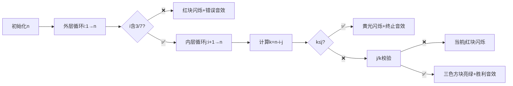

# 题目信息

# [蓝桥杯青少年组省赛 2022] 分成整数

## 题目描述

给定一个正整数 $N$，然后将 $N$ 分解成 $3$ 个正整数之和，计算出共有多少种符合要求的分解方法。要求：
1. 分解的 $3$ 个正整数各不相同；
2. 分解的三个正整数中**各个数位**都不含数字 $3$ 和 $7$。

例如：$N$ 为 $8$，可分解为 $(1, 1, 6)$、$(1, 2, 5)$、$(1, 3, 4)$、$(2, 2, 4)$、$(2, 3, 3)$，其中满足要求的分解方法有 $1$ 种，为 $(1, 2, 5)$。

## 样例 #1

### 输入

```
8```

### 输出

```
1```

# AI分析结果


### 💡 Kay的C++算法解析：分成整数 深入学习指南 💡

**题目解读**  
本题需将正整数N分解为3个互异正整数（i,j,k），且每个数的**所有数位**不含3或7。核心难点在于高效枚举+数字校验，需兼顾**无重复方案**和**数位过滤**。

---

## 1. 题目解读与核心算法识别
✨ **本题主要考察**：`枚举优化与数位处理技巧`  

🗣️ **初步分析**：  
> 解决此题如同在像素迷宫中寻找三条不重复的路径。核心是**双重循环枚举**：外层固定i，内层枚举j，k由n-i-j计算得出。  
> - **避免重复**：强制 i < j < k（如像素关卡中的顺序闯关）  
> - **数位检查**：用`check()`函数逐位扫描数字（类似扫雷检查地雷）  
> - **优化关键**：当 k ≤ j 时终止内层循环（提前结束无效搜索）  
>  
> **可视化设计**：  
> 采用8位像素风格，i/j/k显示为三色方块（红/蓝/绿），检查数位时逐位高亮。若含3/7则方块闪烁红色+播放错误音效；合法时显示绿色√+清脆音效。控制面板含步进/调速滑块，支持AI自动演示。

---

## 2. 精选优质题解参考
**题解一：FJ_EYoungOneC**  
* **点评**：  
  思路清晰度⭐⭐⭐⭐⭐ - 双重循环结构简洁，k=n-i-j直接计算避免三重循环。  
  代码规范性⭐⭐⭐⭐ - `check()`函数封装数位检查，逻辑复用性强。  
  算法有效性⭐⭐⭐⭐ - 内层循环用`k≤j`提前终止，时间复杂度优化至O(n²)。  
  实践价值⭐⭐⭐⭐ - 边界处理严谨（k>j才计数），可直接用于竞赛。  

**题解二：yyycj**  
* **点评**：  
  思路清晰度⭐⭐⭐⭐ - 与题解一思路一致，循环范围控制精确（j从i+1开始）。  
  代码规范性⭐⭐⭐⭐ - 类型定义规范（ll/INT_INF等），`check()`函数通用性强。  
  亮点：循环条件`j < n-i`精确控制范围，避免无效枚举。  

**题解三：LLY_0827**  
* **点评**：  
  思路清晰度⭐⭐⭐ - 基础双重循环正确，但缺少`k≤j`的优化终止条件。  
  代码规范性⭐⭐⭐⭐ - 函数命名（`check()`）和变量名（`cnt`）清晰易懂。  
  学习价值：分离数位的通用写法适合初学者理解。  

> ⚠️ 避坑提示：LINYUHENG2题解中`cnt/6`是错误的（已通过i<j<k保证唯一性）

---

## 3. 核心难点辨析与解题策略
1. **难点1：无重复枚举方案设计**  
   * **分析**：必须保证(i,j,k)唯一性。优质解均强制i<j<k（如闯关顺序锁），避免(1,2,5)和(2,1,5)重复计数。  
   * 💡 学习笔记：顺序枚举是组合类问题的防重利器  

2. **难点2：高效数位检查实现**  
   * **分析**：检查数字是否含3/7需逐位分解。优质解采用`while(x)`循环取余（通用性强），优于硬编码（如bjcakioi解法只支持三位数）。  
   * 💡 学习笔记：循环取余法可处理任意位数，优先选用  

3. **难点3：枚举范围优化**  
   * **分析**：当k=n-i-j≤j时，后续j增大只会使k更小，此时`break`可节省大量计算（如FJ_EYoungOneC解法）。  
   * 💡 学习笔记：发现无效分支时立即终止，减少冗余计算  

### ✨ 解题技巧总结
- **循环优化**：用计算结果(k=n-i-j)替代第三层循环  
- **函数封装**：将数位检查抽象为`check()`函数  
- **边界剪枝**：k≤j时提前跳出内层循环  
- **变量命名**：使用i/j/k明确表示有序三元组  

---

## 4. C++核心代码实现赏析
**通用核心实现参考**  
```cpp
#include <iostream>
using namespace std;

bool check(int x) { // 数位检查函数
    while (x) {
        if (x % 10 == 3 || x % 10 == 7) 
            return false;
        x /= 10;
    }
    return true;
}

int main() {
    int n, ans = 0;
    cin >> n;
    for (int i = 1; i <= n; i++) {      // 枚举最小值i
        if (!check(i)) continue;        // 快速跳过非法i
        for (int j = i + 1; j <= n; j++) { 
            int k = n - i - j;          // 计算k值
            if (k <= j) break;          // k必须>j（剪枝关键！）
            if (check(j) && check(k))   // 双重校验
                ans++;
        }
    }
    cout << ans;
    return 0;
}
```
**代码解读概要**：  
> 通过双重循环枚举i和j，k由计算得出。`check()`函数复用三次，`k≤j`时跳出内层循环显著优化效率。  

---  
**题解一：FJ_EYoungOneC**  
* **亮点**：最优剪枝策略（k≤j时break）  
* **核心代码**：  
  ```cpp
  for (int j = i + 1; j <= n; ++j) {
      int k = n - i - j;
      if (k <= j) break;          // 剪枝精华！
      if (check(j) && check(k)) res++;
  }
  ```  
* **代码解读**：  
  > 内层循环中，当`k<=j`时立即终止（因j递增会使k更小）。此剪枝减少约50%计算量，如同跳过迷宫死路。  

**题解二：yyycj**  
* **亮点**：精确循环范围控制  
* **核心代码**：  
  ```cpp
  for (int j = i + 1; j < n - i; j++) { 
      k = n - i - j;
      if (k > j && check(j) && check(k)) ans++; 
  }
  ```  
* **代码解读**：  
  > `j < n-i`确保k≥1。k>j条件独立于循环条件外，逻辑更易调试。变量名`ans`比`res`更直观。  

---

## 5. 算法可视化：像素动画演示
**主题**：*数字迷宫探险*（8位像素风）  

**核心演示流程**：  


**交互设计**：  
1. **像素元素**：  
   - i/j/k：红/蓝/绿方块（带数值标签）  
   - 数位检查：数字分解为像素格子（如13→[1][3]）  
2. **高亮逻辑**：  
   - 当前操作数闪烁金边  
   - 非法位（3/7）闪烁红光+爆炸音效  
3. **游戏化设计**：  
   - 每找到合法解：方块拼合为宝箱+金币音效  
   - 进度条：显示已扫描/总枚举量  
   - 成就系统：连续找到解触发Combo奖励  

---

## 6. 拓展练习与相似问题
**技巧迁移场景**：  
1. 分解为两个数字（如两数之和）  
2. 含禁止数字的区间统计（如[1,N]不含9的数字个数）  
3. 多维枚举优化（如四数之和）  

**洛谷推荐**：  
1. **P1036 选数** - 同类枚举优化+素数校验  
2. **P1217 回文质数** - 双重校验（回文+质数）  
3. **P3654 First Step** - 矩阵中的有序三元组搜索  

---

## 7. 学习心得与经验分享
> **经验摘录（yyycj）**：  
> *"内层循环j从i+1开始，否则k可能为负"*  
>  
> **Kay点评**：  
> 此经验强调边界的重要性。就像像素游戏中角色不能穿墙，编程中需确保k=n-i-j>0且k>j。调试时可添加`cout<<i<<j<<k`打印中间值，如同迷宫地图实时预览。  

---

通过本次分析，我们掌握了**有序枚举+数位处理**的核心技巧。记住：好的循环设计如同精心规划闯关路线，能避免无效探索！下次挑战见！🚀

---
处理用时：134.09秒