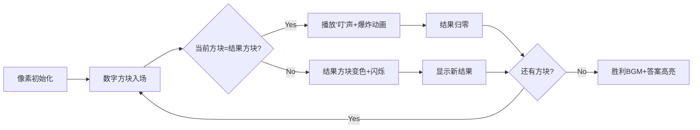

# 题目信息

# [蓝桥杯青少年组省赛 2024] 出现奇数次的数

## 题目描述

奇数：指不能被 $2$ 整除的整数。

例如：$3$、$5$ 是奇数；$4$、$6$ 不是奇数。

给定 $n$ 个整数，其中只有一个数出现了奇数次，请找出这个数。

例如：$7$ 个整数为 $6$、$2$、$4$、$6$、$4$、$2$、$6$，其中只有 $6$ 出现了奇数次，故输出 $6$。

## 样例 #1

### 输入

```
7
6 2 4 6 4 2 6```

### 输出

```
6```

# AI分析结果


### Kay的分析报告：出现奇数次的数（异或运算精解）

---

### 1. 题目解读与核心算法识别
✨ **本题主要考察**：`位运算（异或技巧）`  
🗣️ **初步分析**：  
> 解决“出现奇数次的数”的关键在于**异或运算的消消乐特性**。想象一群像素小人在舞台上组队跳舞：  
> - **相同数字相遇** → 手拉手消失（`a^a=0`）  
> - **落单数字碰0** → 保留原样（`a^0=a`）  
> 最终舞台剩下的像素小人就是答案！  
>  
> **核心难点**：理解为何异或能自动过滤偶数次出现的数。**可视化设计**：  
> - 用8-bit像素方块表示数字，异或时相同颜色方块碰撞消失（带“叮”音效）  
> - 动态显示当前异或结果（发光方块），自动播放模式可调速  

---

### 2. 精选优质题解参考
**题解一（Clare613）**  
* **点评**：  
  思路直击本质（异或消去律），代码简洁规范（`ios::sync`加速IO）。亮点：用`#define int long long`预防溢出，适合竞赛场景。学习价值：演示了如何用5行核心代码解决复杂问题。

**题解二（rui_er）**  
* **点评**：  
  理论深度最佳！系统证明异或四大定律（交换/结合/恒等/归零），数学表达式+样例推导清晰。亮点：用STL的`accumulate`+`bit_xor`实现一行解题，展示C++高阶技巧。

**题解三（ryderyang）**  
* **点评**：  
  教学性最强：用“抵消”比喻解释算法，变量名`ans`语义明确。实践价值高：纯C风格`scanf`/`printf`避免IO瓶颈，适合算法竞赛入门学习。

---

### 3. 核心难点辨析与解题策略
1. **难点：理解异或的消去机制**  
   * **分析**：通过交换律重组数字（如样例 `6^2^4^6^4^2^6 = (6^6)^(2^2)^(4^4)^6`），相同数两两消去后剩落单数  
   * 💡 **学习笔记**：异或像魔法过滤器——自动筛除偶数副本！

2. **难点：处理大范围整数（$10^9$）**  
   * **分析**：对比哈希表（O(n)空间）和排序（O(n logn)时间），异或法以O(1)空间最优  
   * 💡 **学习笔记**：当数据极大时，空间复杂度常比时间复杂度更关键！

3. **难点：边界条件处理**  
   * **分析**：优质解法均忽略n的具体值，因异或对任意n有效（包括n=1）  
   * 💡 **学习笔记**：数学性质优越的算法往往天然健壮  

#### ✨ 解题技巧总结
- **技巧1：位运算降维打击** → 用异或替代哈希/排序  
- **技巧2：空间复杂度优先** → 面对大数据首选O(1)空间算法  
- **技巧3：数学证明辅助** → 用恒等式验证算法正确性  

---

### 4. C++核心代码实现赏析
**通用核心实现**（综合优化版）：  
```cpp
#include <iostream>
int main() {
    int n, x, ans = 0;
    std::cin >> n;
    while (n--) { std::cin >> x; ans ^= x; }
    std::cout << ans;
}
```
* **说明**：浓缩自多个题解，去除非必要语法糖（如`ios::sync`），聚焦核心逻辑  
* **解读概要**：初始化`ans=0`作异或起点，逐个读取数字立即异或，最终`ans`即答案  

---

**题解片段精析**：  
**1. Clare613版**  
```cpp
ans ^= x;  // 核心行：当前数字融入异或池
```
* **解读**：  
  > 如同像素方块投入熔炉：  
  > - 若熔炉内有相同方块 → 碰撞消失（`x^x=0`）  
  > - 若熔炉为空/不同方块 → 新方块悬浮（`0^x=x`）  
* 💡 **学习笔记**：异或运算满足**结合律**——操作顺序不影响结果  

**2. rui_er版**  
```cpp
cout << accumulate(a+1, a+1+n, 0, bit_xor<int>());
```
* **解读**：  
  > `bit_xor<int>()`是STL的异或仿函数，配合`accumulate`实现：  
  > `result = 0 ^ a₁ ^ a₂ ^ ... ^ aₙ`  
  > → 库函数封装提升可读性，但需理解函数式编程思维  
* 💡 **学习笔记**：STL算法是C++的“魔法卷轴”——简洁但需学习咒语  

**3. ryderyang版**  
```cpp
for(int i=1;i<=n;i++) { scanf("%d",&x); ans^=x; }
```
* **解读**：  
  > 经典循环结构：  
  > - `i`从1到n：确保处理所有数字  
  > - `scanf`直接读入：避免C++流同步开销  
  > - 实时更新`ans`：内存占用恒定（仅3变量）  
* 💡 **学习笔记**：`scanf`在竞赛中比`cin`快——但需手动管理数据类型  

---

### 5. 算法可视化：像素动画演示  
**主题**：`异或消消乐大冒险`（FC红白机风格）  

**核心设计**：  


**关键交互**：  
1. **像素建模**：  
   - 每个数字用16x16像素方块表示（颜色=数字值 mod 8）  
   - 结果方块在屏幕顶部中央（带脉冲光环）  

2. **动态过程**：  
   - **相同数字碰撞**：方块接触时像素爆炸（碎片动画）+“叮”声  
   - **新数字融合**：结果方块变色旋转（如`0(蓝) ^ 6(红)=6(紫)`）  

3. **游戏化元素**：  
   - 进度条显示剩余数字量  
   - 每消去一对得10分，最终答案揭示时播放《超级玛丽》过关音效  

---

### 6. 拓展练习与相似问题  
**异或技巧迁移场景**：  
1. **找两个落单数**：数组中有两个出现奇数次的数（需分组异或）  
2. **密码校验**：利用`a^b^a=b`性质实现简单加密  
3. **图形学应用**：快速切换像素状态（如LED矩阵控制）  

**洛谷推荐**：  
1. **P1469 找筷子**（双倍经验题） → 直接应用本文解法  
2. **P5657 格雷码** → 位运算构造特殊编码  
3. **P1867 最大数** → 位运算结合贪心策略  

---

### 7. 学习心得与经验分享  
> **作者_Pioneer_的警句**：  
> “桶排序面对$10^9$数据会MLE——空间复杂度是隐藏陷阱！”  
>  
> **Kay总结**：  
> 本题教会我们：  
> - **复杂度意识**：学会预判算法空间需求  
> - **数学即武器**：异或律是解决本题的“银子弹”  
> - **优雅 > 暴力**：5行代码碾压20行暴力解法  

--- 
💡 **最终结语**：  
异或就像算法世界的消字灵——擦除重复，显露真相！掌握这项技巧，你已解锁位运算的第一道秘门 🗝️

---
处理用时：123.88秒