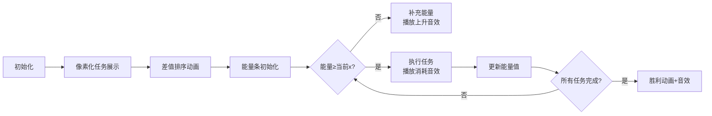

# 题目信息

# [蓝桥杯青少年组省赛 2024] 通关游戏的最少能量值

## 题目描述

有一款新游戏，通关这个游戏需要完成 $n$ 个任务。这 $n$ 个任务可按任意次序完成。每个任务设置了启动能量值 $x$ 和完成任务消耗的能量值 $y$，且满足 $y \leq x$。如果玩家当前的能量值低于该任务的启动能量值，则不能开始该任务。

- 例 1：玩家当前的能量值为 $7$，当前任务的启动能量值为 $5$，完成任务消耗的能量值为 $3$。则可以开始该任务，完成任务后玩家剩余能量值为 $4$。
- 例 2：玩家当前的能量值为 $5$，当前任务的启动能量值为 $8$。则无法开始该任务。

游戏开始时，玩家需要一个初始能量值 $E$ 用来完成这 $n$ 个任务。给定每个任务的启动能量值和消耗能量值，求初始能量值的最小可能值。

例如，$n=3$，这 $3$ 个任务的启动能量值和消耗能量值分别是 $(2, 2)$、$(9, 5)$、$(7, 4)$。那么玩家初始能量的最小值为 $12$，可以按照如下顺序完成任务：

1. 完成任务 $(9, 5)$，玩家剩余能量值为 $7$；
2. 完成任务 $(7, 4)$，玩家剩余能量值为 $3$；
3. 完成任务 $(2, 2)$，玩家剩余能量值为 $1$。

尽管最后玩家的能量值剩余 $1$，但初始能量值无法再降低，否则完成任务 $(9, 5)$ 后，玩家的剩余能量值会小于任务 $(7, 4)$ 的启动能量值，导致无法开始该任务。

## 样例 #1

### 输入

```
3
2 2
9 5
7 4```

### 输出

```
12```

# AI分析结果


# 💡 Kay的C++算法解析：通关游戏的最少能量值 深入学习指南 💡

今天我们来分析"通关游戏的最少能量值"这道C++编程题。本指南将帮助大家掌握贪心算法的核心思想，理解任务排序策略，并通过像素动画直观感受算法执行过程。

## 1. 题目解读与核心算法识别

✨ **本题主要考察**：`贪心算法` (任务排序策略)

🗣️ **初步分析**：
> 解决这道题的关键在于理解**能量管理**的本质。就像在冒险游戏中要优先收集高价值的宝物一样，我们需要优先完成"性价比"最高的任务（启动能量与消耗能量差值大的任务）。通过精心排序任务顺序，让每次任务完成后保留尽可能多的能量，从而最小化初始能量需求。
> 
> - **核心思路**：所有题解都采用**差值降序排序**策略（优先选择x-y差值大的任务），差值相同时选启动能量x更大的任务
> - **算法流程**：排序后通过模拟执行或直接计算得到最小初始能量。关键变量包括：`当前能量`、`消耗总和`、`初始能量`
> - **可视化设计**：将用像素方块表示任务（颜色深浅表示x-y差值大小），能量条动态变化，高亮显示任务执行时的能量检查点
> - **复古元素**：采用8-bit像素风格，任务执行时有"能量充满"和"能量消耗"音效，通关时播放胜利音乐，支持单步/自动播放模式

---

## 2. 精选优质题解参考

**题解一：(来源：wenqinghua1001)**
* **点评**：此解法思路清晰，直接推导出最小初始能量的计算公式（`ans = max(ans, 当前x + 已消耗总和)`）。代码结构简洁规范（结构体+自定义排序），变量命名合理（qi/xiao），时间复杂度O(n log n)优化到位。亮点在于避免了模拟过程，直接通过数学关系求解，竞赛实践价值高。

**题解二：(来源：FJ_EYoungOneC)**
* **点评**：提供独特的二分答案验证思路，虽然效率略低(O(n log max_value))，但展示了贪心策略的严格证明过程。代码结构严谨（运算符重载+边界处理），特别适合帮助理解"为什么排序规则有效"。亮点在于详细数学推导，加深算法理解深度。

**题解三：(来源：ShaDouBuShi123)**
* **点评**：采用直观的能量模拟过程，通过`当前能量不足时动态补充`的方式求解。代码可读性强，用具体实例(6,3)(5,1)生动解释了排序规则的重要性。亮点在于调试心得分享，提醒学习者避免直觉误区。

---

## 3. 核心难点辨析与解题策略

1.  **如何确定最优排序规则？**
    * **分析**：通过交换论证法证明：设两任务d1=x1-y1, d2=x2-y2，当d1≥d2时，先执行任务1所需初始能量≤交换顺序后的需求。差值相同时优先大x值，避免后续能量不足。
    * 💡 **学习笔记**：贪心策略有效性需严格证明，不能仅靠直觉
    
2.  **如何高效计算最小初始能量？**
    * **分析**：两种等价方法：①直接计算：ans = max{ x_i + ∑y_j } (j<i) ②动态模拟：当当前能量<任务x时补充差值。方法①更简洁高效。
    * 💡 **学习笔记**：识别问题中的数学关系可大幅优化代码
    
3.  **为什么贪心优于其他算法？**
    * **分析**：动态规划会面临状态爆炸(O(2^n))，枚举排序复杂度O(n!)。贪心通过排序规则将复杂度降为O(n log n)，且被证明是最优解。
    * 💡 **学习笔记**：贪心在任务调度类问题中常是最佳选择

### ✨ 解题技巧总结
- **技巧1：属性分析法** - 识别影响结果的关键属性（本题的x-y差值）
- **技巧2：数学建模法** - 将执行过程转化为求和公式，避免模拟
- **技巧3：边界思维** - 特别注意x=y的任务和极大/极小值情况
- **技巧4：交换验证法** - 通过假设交换任务顺序验证贪心策略

---

## 4. C++核心代码实现赏析

**本题通用核心C++实现参考**
* **说明**：综合优质题解优化的标准实现，兼顾效率和可读性
* **完整核心代码**：
```cpp
#include <iostream>
#include <algorithm>
using namespace std;
const int N = 1e5+5;

struct Task {
    int x, y; // x:启动能量, y:消耗能量
} tasks[N];

bool cmp(Task a, Task b) {
    int d1 = a.x - a.y, d2 = b.x - b.y;
    if (d1 != d2) return d1 > d2;    // 优先差值大的
    return a.x > b.x;                 // 差值相同选x大的
}

int main() {
    int n;
    cin >> n;
    for (int i = 0; i < n; i++) 
        cin >> tasks[i].x >> tasks[i].y;
    
    sort(tasks, tasks + n, cmp);  // 关键排序
    
    long long ans = 0, sum = 0;  // sum: 已消耗能量总和
    for (int i = 0; i < n; i++) {
        ans = max(ans, (long long)tasks[i].x + sum);
        sum += tasks[i].y;  // 更新消耗总和
    }
    cout << ans;
    return 0;
}
```
* **代码解读概要**：
  1. 定义任务结构体存储x和y
  2. 自定义排序规则：主排序键x-y降序，次排序键x降序
  3. 核心计算：遍历时维护sum（前i-1个任务的y总和）
  4. 最小初始能量 = 所有任务中（当前x + 之前sum）的最大值

---
**题解一核心片段**(wenqinghua1001)
* **亮点**：简洁高效的核心计算逻辑
* **核心代码片段**：
```cpp
int ans=0, sum=0;
for(int i=1;i<=n;i++){
    ans=max(ans, a[i].qi+sum);
    sum+=a[i].xiao;
}
```
* **代码解读**：
  > `sum`像能量消耗计数器，累加已完成任务的消耗。每个任务要求初始能量至少达到`当前x + 已消耗量`，`ans`记录这些需求中的最大值。就像登山时记录最高海拔点，最终值就是最小初始能量。
* 💡 **学习笔记**：用累加和代替模拟过程是经典优化手段

**题解二核心片段**(FJ_EYoungOneC)
* **亮点**：二分验证的check函数实现
* **核心代码片段**：
```cpp
bool check(int x) {
    for (int i = 0; i < n; ++i)
        if (x < q[i].a) return false;
        else x -= q[i].b;
    return true;
}
```
* **代码解读**：
  > 函数模拟给定初始能量x能否完成所有任务：遍历任务时若能量不足启动(x < a)立即失败，否则扣除消耗(b)。像能量探测器，测试给定能量能否通关。
* 💡 **学习笔记**：二分验证适用于"最小值验证"类问题

**题解三核心片段**(ShaDouBuShi123)
* **亮点**：动态能量补充的模拟过程
* **核心代码片段**：
```cpp
int ene=0, total=0;
for (int i=1;i<=n;i++) {
    if (ene < tasks[i].s) {
        total += (tasks[i].s - ene);
        ene = tasks[i].s;
    }
    ene -= tasks[i].e;
}
```
* **代码解读**：
  > `ene`像实时能量槽，不足时从`total`补充（补到刚好启动）。执行后`ene`减少消耗量。类似手机充电：用到低电量时才充，充到刚好够用。
* 💡 **学习笔记**：实时模拟虽直观，但需注意初始条件设置

---

## 5. 算法可视化：像素动画演示

**主题**：能量迷宫大冒险（8-bit复古风格）

**核心演示**：
- 任务方块：不同颜色代表x-y差值（深色=差值大）
- 能量条：实时显示当前能量值
- 控制台：启动/暂停/单步/速度调节

**动画流程**：


**关键交互设计**：
1. **像素任务墙**：显示排序前后的任务布局，排序时有方块交换动画
2. **能量管理面板**：
   - 进度条：实时显示当前能量/最大需求
   - 消耗记录：显示∑y的累计值
3. **执行高亮**：
   - 当前任务闪烁红光
   - 能量检查时显示`if(energy >= x)`判断框
4. **音效系统**：
   - 能量不足：低电量"滴"声
   - 任务执行："能量消耗"爆破音
   - 关卡通过：8-bit胜利旋律

**技术实现**：
- 使用Canvas绘制像素网格（30×30像素/任务）
- 能量条渐变填充：`ctx.fillRect(0,0,energy/maxEnergy*width,height)`
- 音效触发：通过Web Audio API播放8-bit波形

---

## 6. 拓展练习与相似问题思考

**通用思路迁移**：
贪心排序策略可扩展至：
1. 任务调度问题（最大化完成量）
2. 资源分配问题（最小化等待时间）
3. 投资回报问题（最大化收益率）

**洛谷推荐**：
1. **P1223 排队接水**  
   🗣️ *巩固贪心排序基础，学习最小化平均等待时间*
2. **P1803 线段覆盖**  
   🗣️ *强化任务调度思维，处理区间型贪心*
3. **P1080 国王游戏**  
   🗣️ *进阶贪心证明，需要高精度处理*

---

## 7. 学习心得与经验分享

> **参考经验 (来自 ShaDouBuShi123)**：  
> "很多人想到按x排序，但通过实例(6,3)(5,1)发现错误排序需要8能量，正确排序只需7能量。这让我意识到贪心规则需要严格验证。"

> **点评**：这位作者的经验极具代表性。在贪心问题中，**构造反例验证**是检验策略有效性的黄金方法。建议学习者在提交前，用边界数据（如x=y、极大x极小y等）测试代码。

---

本次关于"通关游戏的最少能量值"的分析就到这里。记住，贪心算法的核心在于"局部最优导致全局最优"的证明，而好的排序策略是成功的关键。下次遇到任务调度问题时，不妨先思考：影响后续操作的关键属性是什么？

---
处理用时：216.11秒