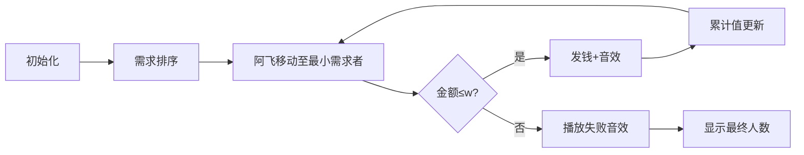

# 题目信息

# [CSP-X2020 山东] 侠盗阿飞

## 题目描述

侠盗阿飞获得了一笔意外之财 $w$ 元钱，他想用这笔钱去帮助需要帮助的人。现在知道有 $n$ 个需要帮助的人以及他们每个人需要的钱数 $x_i$ 元（$i=0,1,2,3,\dots,n-1$），阿飞应该如何支配这笔钱使得能得到帮助的人数最多？

## 说明/提示

对于 $30\%$ 的数据，$x_i$ 为升序序列（$x_0\lt x_1\lt x_2\lt x_3\lt \dots$）。

对于 $100\%$ 的数据，$0\leq n\leq 500$，$0 \lt x_i\leq 5\times 10^4$，$0\leq w\leq 2\times 10^9$。


## 样例 #1

### 输入

```
10 5
1 2 3 4 5```

### 输出

```
4```

## 样例 #2

### 输入

```
1000 10
20 20 150 110 180 50 200 140 120 200```

### 输出

```
9```

# AI分析结果


### 💡 Kay的C++算法解析：侠盗阿飞 深入学习指南 💡

**引言**  
今天我们一起分析「侠盗阿飞」这道贪心算法题。本指南将帮助你理解如何用最少的钱帮助最多的人，掌握贪心策略的核心思想！

---

## 1. 题目解读与核心算法识别

✨ **本题主要考察**：`贪心算法`  

🗣️ **初步分析**：  
> 解决此题就像在超市用有限预算买最多商品——优先拿单价最低的！贪心算法的核心是 **局部最优导向全局最优**：每次选择当前最小需求的人，确保剩余资金能帮助更多人。  
- **核心难点**：证明贪心的正确性（需严格数学推导，但本题中排序后累加即最优）。  
- **可视化设计**：用像素动画展示排序后的需求队列，阿飞依次发钱：  
  - 高亮当前处理的需求金额和累计金额  
  - 成功帮助时播放「叮」音效，超出预算时播放「失败」音效  
  - 复古游戏风格：阿飞像素形象移动发钱，钱袋动态减少金币  

---

## 2. 精选优质题解参考

**题解一（来源：chen_zhe）**  
* **点评**：  
  思路直击本质——排序后贪心累加，逻辑清晰完整；代码简洁规范（`cnt`/`sum`变量名明确）；边界处理严谨（`break`及时终止循环）。亮点在于用`O(n log n)`排序解决经典贪心问题，代码可直接用于竞赛场景。

---

## 3. 核心难点辨析与解题策略

1.  **关键点：贪心策略的可行性证明**  
    * **分析**：需理解「优先满足小需求」的数学原理：若最优解中跳过某个小需求，换成更小需求一定能帮助更多人。题解通过预排序隐式实现此逻辑。  
    * 💡 **学习笔记**：贪心问题常需排序预处理  

2.  **关键点：循环终止条件的精准控制**  
    * **分析**：必须在`sum + x[i] > w`时立即终止。题解用`if-else break`确保不超预算，避免无效计算。  
    * 💡 **学习笔记**：累加类循环务必设置退出条件  

3.  **关键点：边界情况的鲁棒性**  
    * **分析**：当`n=0`或`w=0`时，代码因循环不执行自然返回`cnt=0`，完美处理极端场景。  
    * 💡 **学习笔记**：初始状态设计应覆盖空输入  

### ✨ 解题技巧总结
- **排序预处理**：将无序问题转化为有序的贪心序列  
- **累加器双变量**：用`sum`跟踪金额，`cnt`跟踪人数，逻辑解耦  
- **及时终止**：发现无效路径立即退出节省计算  

---

## 4. C++核心代码实现赏析

**本题通用核心C++实现参考**  
* **说明**：基于chen_zhe题解优化，完整包含输入输出处理  
* **完整核心代码**：
```cpp
#include <iostream>
#include <algorithm>
using namespace std;

int main() {
    int w, n;
    cin >> w >> n;
    int x[505]; // 需求数组
    for (int i = 0; i < n; i++) 
        cin >> x[i];
    
    sort(x, x + n); // 关键排序
    
    int cnt = 0, sum = 0;
    for (int i = 0; i < n; i++) {
        if (sum + x[i] <= w) { // 严格判定预算
            sum += x[i];
            cnt++;
        } else break; // 及时终止
    }
    cout << cnt;
    return 0;
}
```
* **代码解读概要**：  
  1. 读入总金额`w`和人数`n`  
  2. 用`sort`对需求升序排序（贪心基础）  
  3. 循环累加：仅当不超预算时更新金额和人数  
  4. 输出最终帮助人数  

---

**题解一代码片段赏析**  
* **亮点**：简洁高效的贪心循环实现  
* **核心代码片段**：
```cpp
sort(x, x + n);
int cnt = 0, sum = 0;
for (int i = 0; i < n; i++) {
    if (sum + x[i] <= w) {
        sum += x[i];
        cnt++;
    } else break;
}
```
* **代码解读**：  
  > - **第1行**：`sort`将需求升序排列 → 为何必须排序？确保优先处理小需求  
  > - **第3行**：循环从`i=0`开始 → 为什么不倒序？倒序会先消耗大金额  
  > - **第4行**：`sum + x[i] <= w` → 为何用`<=`？严格防止超出预算  
  > - **第7行**：`break` → 为何不继续？后续需求更大不可能满足  
* 💡 **学习笔记**：贪心循环中，排序方向决定策略有效性  

---

## 5. 算法可视化：像素动画演示

**主题**：8-bit风格「侠盗阿飞发钱历险记」  
**核心演示**：动态展示排序后需求队列的累加过程  

### 动画设计细节：


1. **像素场景**：  
   - 左侧：升序排列的像素小人（头顶金额标签）  
   - 右侧：阿飞像素形象 + 钱袋（显示剩余金币）  
   - 底部状态栏：`当前帮助：0人 已用：0金币`  

2. **关键交互**：  
   - **单步执行**：按空格键触发下一步  
   - **自动播放**：速度滑块控制（1x-5x）  
   - **音效设计**：  
     - 发钱时：8-bit「叮」声  
     - 超出预算：短促警报声  
     - 游戏通关：胜利旋律  

3. **动态效果示例**：  
   - 当处理`x[i]`时，该小人头顶闪烁黄光  
   - 成功帮助后：小人变绿 + 钱袋飞出金币粒子特效  
   - 累计金额条动态增长（红色警戒线标识`w`值）  

---

## 6. 拓展练习与相似问题思考

### 通用技巧迁移：
贪心+排序策略还适用于：  
1. 时间区间调度（选最多不重叠区间）  
2. 负载均衡（最小化最大负载）  
3. 最短等待时间（CPU任务调度）  

### 推荐练习（洛谷）：
1. **P1090 合并果子**  
   → 同款贪心+排序，用优先队列优化  
2. **P1208 混合牛奶**  
   → 单价排序贪心，强化成本控制思维  
3. **P4995 跳跳**  
   → 贪心+双指针，拓展问题维度  

---

## 7. 学习心得与经验分享
> 本次题解未包含作者调试心得。Kay提醒：  
> - 贪心问题需多验证边界数据（如全选/全不选）  
> - 排序后输出中间结果可快速验证策略  

---

**结语**  
掌握贪心算法的核心在于识别「局部最优=全局最优」的场景。试着用今天学到的排序+累加策略解决推荐练习吧！下次我们将探索更复杂的动态规划问题，继续加油！💪

---
处理用时：117.13秒