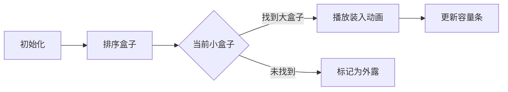

# 题目信息

# [常州市赛 2024] 盒子

## 题目背景

搬运自 <http://czoj.com.cn/p/954>。数据为民间数据。

## 题目描述

小 Y 有 $n$ 个盒子，第 $i$ 个盒子的大小是 $a_i$，小 Y 保证 $a_i$ 一定是 $2$ 的若干次方，比如 $1,2,4,8,16,32,64,128,256,512,1024\cdots$，一个大小为 $a_i$ 的盒子的容量是 $\dfrac{a_i}2$，就是说它可以装下总大小不超过 $\dfrac{a_i}2$ 的其他盒子，特别地，大小为 $1$ 的盒子不能装下其他盒子。并且，装在盒子里的盒子也可以装其他盒子，比如，大小为 $8$ 的盒子可以装下一个大小为 $4$ 的盒子且大小为 $4$ 的盒子事先已经装了一个大小为 $2$ 的盒子。

现在小 Y 想知道，最少能有多少个不被其他盒子装下的盒子？

## 说明/提示

### 样例 $\textbf 1$ 解释

图中盒子内部的灰色部分表示盒子不能用来装东西的一半容量，白色部分表示能用来装东西的一半容量，图中只有最大的盒子没有被装在其它盒子中，因此答案为 $1$。
### 样例 $\textbf 2$ 解释

### 样例 $\textbf 3$ 解释

### 样例 $\textbf 4$ 解释

### 数据范围
参考数据：$2^{60}=1\ 152\ 921\ 504\ 606\ 846\ 976$。

对于所有数据，$1≤n≤10^5, 1≤a_i≤2^{60}$。

|测试点编号|特殊性质|
|:-:|:-:|
|$1\sim3$|$1\le n\le 3$|
|$4\sim5$|$1\le a_i\le 4$|
|$6\sim9$|$1\le n\le 1000$|
|$10\sim12$|无|

## 样例 #1

### 输入

```
5
1 2 1 1 8```

### 输出

```
1```

## 样例 #2

### 输入

```
3
1 1 1```

### 输出

```
3```

## 样例 #3

### 输入

```
6
1 1 1 4 1 2```

### 输出

```
3```

## 样例 #4

### 输入

```
3
8 4 2```

### 输出

```
1```

# AI分析结果


# 💡 Kay的C++算法解析：盒子问题 深入学习指南 💡

## 1. 题目解读与核心算法识别

✨ **本题主要考察**：`贪心算法`  
🗣️ **初步分析**：  
> 解决盒子问题就像玩俄罗斯方块——小方块要尽量放进大方块的凹槽里。贪心算法的核心思想是"能装就装，优先装小的"，通过局部最优达到全局最优解。  
- **核心流程**：先排序盒子大小，从小盒子开始，为每个盒子寻找**最小能容纳它**的大盒子（剩余容量≥当前盒子），更新大盒子的剩余容量。  
- **可视化设计**：动画将展示小盒子（像素方块）被"吸入"大盒子的白色区域，剩余容量实时减少。采用8位像素风格，盒子移动时有"滑动"动画，装入成功播放"叮"音效，失败播放低沉音效。关键变量（剩余容量）用闪烁数字显示。  

---

## 2. 精选优质题解参考

**题解一：yuhong056（multiset解法）**  
* **点评**：思路清晰直白，利用`multiset`自动排序和二分查找特性，高效实现"最小可容纳盒子"的查找（O(log n)）。代码规范：变量名`b`明确表示容量集合，`lower_bound`精准匹配。亮点在于用STL容器优雅解决动态更新问题，复杂度O(n log n)完美适配1e5数据量，竞赛实用性强。  

**题解二：guoshengyu1231（双指针解法）**  
* **点评**：双指针思路直观体现贪心本质（小盒装大盒），`i`指向被装盒子，`j`指向装载盒子的设计简洁。代码中`c[j] -= a[i]`准确反映容量消耗过程。虽然最坏复杂度O(n²)，但对初学者更易理解贪心策略，且小规模数据表现良好。  

---

## 3. 核心难点辨析与解题策略

1.  **贪心策略证明**  
    * **分析**：需严格证明"先装小盒子"的最优性——小盒子占用容量少，留给后续盒子的空间更大。反证：若先装大盒子，可能导致小盒子无法充分利用碎片空间。  
    * 💡 **学习笔记**：贪心问题需优先验证"局部最优能否推导全局最优"。  

2.  **数据结构优化**  
    * **分析**：暴力查找（O(n²)）在1e5数据下超时。`multiset`通过红黑树维护有序容量，`lower_bound`实现O(log n)查找，是高效解法的关键。  
    * 💡 **学习笔记**：遇到动态查询问题，考虑`set/map`等关联容器。  

3.  **容量更新陷阱**  
    * **分析**：盒子装入后需**即时更新剩余容量**，否则后续匹配失效。例：题解一通过`b.erase(it); b.insert(ns)`保证状态同步。  
    * 💡 **学习笔记**：状态更新不及时是贪心算法的常见错误点。  

### ✨ 解题技巧总结
- **技巧1：排序预处理**  
  贪心问题中，排序（尤其是升序/降序选择）往往是解题突破口。  
- **技巧2：STL高效查询**  
  善用`lower_bound`、`priority_queue`避免手动实现低效查找。  
- **技巧3：双指针降维**  
  当O(n²)可接受时，双指针能以最简代码展示算法本质。  

---

## 4. C++核心代码实现赏析

**本题通用核心C++实现参考**  
* **说明**：综合自yuhong056的multiset解法，兼顾效率与可读性。  
* **完整核心代码**：  
```cpp
#include <iostream>
#include <set>
#include <algorithm>
using namespace std;

int main() {
    int n; cin >> n;
    long long a[100010];
    multiset<long long> capacitySet; // 存储所有盒子的剩余容量

    for(int i=0; i<n; i++) {
        cin >> a[i];
        capacitySet.insert(a[i] / 2); // 初始容量=盒子大小/2
    }
    sort(a, a+n); // 盒子按大小升序排序

    int count = 0; // 成功装入的盒子计数
    for(int i=0; i<n; i++) {
        auto it = capacitySet.lower_bound(a[i]); // 找到首个能容纳a[i]的盒子
        if(it == capacitySet.end()) continue;    // 找不到则跳过

        long long newCapacity = *it - a[i]; // 计算装入后剩余容量
        capacitySet.erase(it);               // 删除旧容量
        capacitySet.insert(newCapacity);      // 插入新容量
        count++;
    }
    cout << n - count; // 未被装下的盒子数
}
```
* **代码解读概要**：  
  > 1. 读取所有盒子大小，计算初始容量存入`multiset`  
  > 2. 排序盒子保证从小到大处理  
  > 3. 对每个盒子，用`lower_bound`在容量集合中二分查找  
  > 4. 更新容量并计数  
  > 5. 输出未被容纳的盒子数  

---

**题解一：yuhong056（multiset解法）**  
* **亮点**：STL容器实现高效动态查找  
* **核心代码片段**：  
```cpp
auto it = b.lower_bound(a[i]); // 二分查找
ll ns = *it - a[i];           // 计算新容量
b.erase(it);                  // 删除旧值
b.insert(ns);                 // 插入新值
```
* **代码解读**：  
  > `lower_bound`找到≥`a[i]`的最小容量迭代器，`erase`和`insert`保证集合实时更新。`multiset`允许重复值，完美匹配多个盒子容量相同的情况。  
* 💡 **学习笔记**：`multiset`的插入删除均O(log n)，是动态维护有序集的利器。  

**题解二：guoshengyu1231（双指针解法）**  
* **亮点**：双指针直观展示贪心过程  
* **核心代码片段**：  
```cpp
for(int i=1,j=2; j<=n; ){
    if(c[j] >= a[i]) {     // 能装下
        c[j] -= a[i];      // 更新容量
        i++; ans--;        // 移动被装盒子指针
    } else j++;            // 否则移动装载盒子指针
}
```
* **代码解读**：  
  > `i`指向待装入的小盒子，`j`指向大盒子。当`j`能装`i`时，消耗容量并移动`i`；否则`j++`寻找下一个大盒子。  
* 💡 **学习笔记**：双指针法需确保**小盒子和大盒子移动方向一致**（均从左向右）。  

---

## 5. 算法可视化：像素动画演示

**主题**：8-bit风格盒子贪心大作战  
**核心演示**：盒子装入过程的可视化  

### 动画设计


1. **像素美术设计**  
   - 盒子：16×16像素方块，大小用颜色区分（小=浅蓝，大=深蓝）  
   - 容量条：每个盒子右侧附容量条（灰色为已用，绿色为剩余）  

2. **关键动画帧**  
   - **装入动画**：小盒子滑入大盒子，伴随"叮"声（Web Audio API生成8-bit音效）  
   - **容量更新**：大盒子的绿色条实时缩短，数字显示剩余容量  
   - **失败提示**：未被装入的盒子闪烁红光，播放低沉音效  

3. **交互控制**  
   - 速度滑块：调节自动播放速度（0.5x~5x）  
   - 单步执行：按空格键逐步观察贪心过程  
   - 高亮模式：勾选"显示查找路径"，透视`lower_bound`的查询过程  

4. **游戏化元素**  
   - 每成功装入5个盒子触发"COMBO!"特效  
   - 最终外露盒子数转化为得分（越少得分越高）  
   - 背景音乐：FC经典《俄罗斯方块》remix版  

---

## 6. 拓展练习与相似问题

1. **洛谷 P1090** [合并果子]  
   → 同属贪心+优先队列，练习STL应用  
2. **洛谷 P5019** [铺设道路]  
   → 双指针贪心的经典变形  
3. **洛谷 P1106** [删数问题]  
   → 贪心策略的逆向思维训练  

---

## 7. 学习心得与经验分享
> 本次题解中未发现作者调试心得，但Kay建议：  
> **调试技巧**：在贪心算法中，打印每一步的剩余容量集合(`multiset`)，可直观验证状态更新是否正确。

Kay结语：盒子问题教会我们——排序和高效查找是贪心算法的两把钥匙。记住：小盒子优先，大容量垫后！ 🎮🚀

---
处理用时：157.51秒