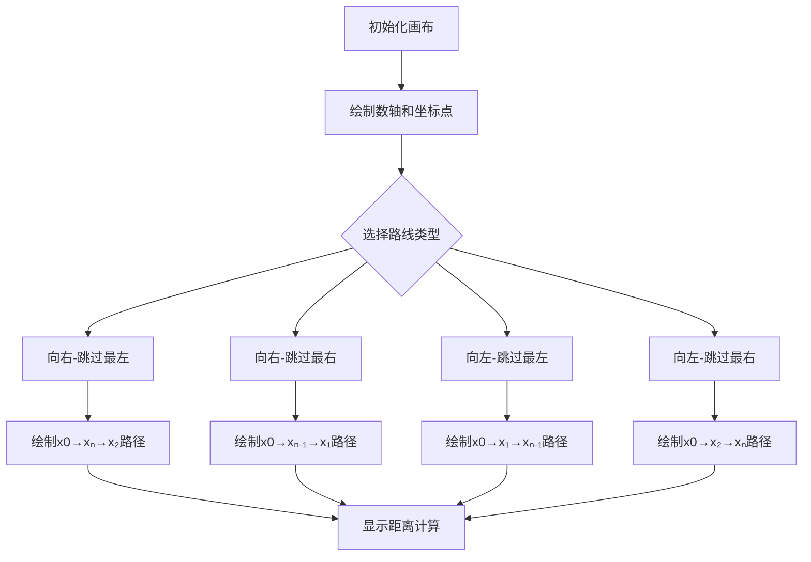

# 题目信息

# [海淀区小学组 2025] 拜访朋友

## 题目背景

2025 年海淀区中小学生信息学竞赛小学组复赛题目，数据为洛谷自造。

## 题目描述

陶陶有 $n$ 个好朋友，他们的住所都分布在同一条笔直的街道旁，如果把这条街道看作一个数轴，选定一个点作为坐标原点（坐标为 $0$），则这 $n$ 个好朋友的住所的坐标分别为 $x_1, x_2, \dots, x_n$。一天，陶陶要去朋友们的住所去拜访朋友们，陶陶初始位置的坐标为 $x_0$，他希望至少拜访到 $n - 1$ 个好朋友，请你确定陶陶要最少要行走的总距离。

## 说明/提示

对于 $100\%$ 的数据：$1 \leq n \leq 10^5$，对于每一个正整数 $i$，$1 \leq i \leq n$，都有 $-10^6 \leq x_i \leq 10^6$。

## 样例 #1

### 输入

```
3 10
1 7 12```

### 输出

```
7```

## 样例 #2

### 输入

```
2 0
11 -10```

### 输出

```
10```

## 样例 #3

### 输入

```
5 0
0 0 1000 0 0```

### 输出

```
0```

# AI分析结果


# 💡 Kay的C++算法解析：拜访朋友 深入学习指南 💡

> 今天我们来分析"拜访朋友"这道C++编程题。本指南将帮助你理解贪心算法的应用，掌握分类讨论的解题技巧，并通过生动的像素动画直观感受算法执行过程。

## 1. 题目解读与核心算法识别

✨ **本题主要考察**：`贪心算法` (排序与分类讨论)

🗣️ **初步分析**：
> 解决这道题就像规划一条高效的快递路线：我们需要找到最短路径覆盖大部分目的地。贪心算法的核心在于**做出当前最优选择**，在本题中体现为：  
> - 先排序所有朋友坐标（确定端点位置）  
> - 分类讨论四种可能的最优路线  
> - 比较所有路线取最小值  
>  
> **可视化设计思路**：我们将用像素风格数轴展示四种路线：  
> 1. 起点用绿色像素块，朋友住所用蓝色方块  
> 2. 移动路径用黄色线条动态绘制  
> 3. 被跳过的朋友变为灰色方块  
> 4. 路线切换时播放8-bit转向音效  
> 5. 控制面板支持速度调节和路线选择

---

## 2. 精选优质题解参考

**题解一（来源：chen_zhe）**
* **点评**：该题解思路清晰，通过图示直观展示了两类路线（向右/向左）及其子情况。代码实现简洁高效，利用`min()`和`abs()`函数巧妙计算四种可能路径。变量命名合理（`ans1`/`ans2`区分方向），排序预处理逻辑严谨。虽然未展示n=1的特判代码，但在文字说明中完整覆盖了边界情况，具有很高的实践参考价值。

---

## 3. 核心难点辨析与解题策略

1.  **关键点1：理解"跳过1个朋友"的数学含义**
    * **分析**：最优解一定跳过端点朋友（最左或最右），因为跳过中间点会导致路径断裂。通过坐标排序（`sort`）快速定位端点位置。
    * 💡 **学习笔记**：排序是处理无序位置关系的利器。

2.  **关键点2：分类讨论路线可能性**
    * **分析**：需全面覆盖四种情况：  
      - 向右走跳过最左（拜访x₂~xₙ）  
      - 向右走跳过最右（拜访x₁~xₙ₋₁）  
      - 向左走跳过最左（同上镜像）  
      - 向左走跳过最右（同上镜像）
    * 💡 **学习笔记**：分支情况用min函数嵌套可读性更佳。

3.  **关键点3：距离计算的数学转化**
    * **分析**：总距离=起点到端点A距离 + 端点A到端点B距离。注意端点B是被跳过点的相邻点（跳过最左则终点是x₂）。
    * 💡 **学习笔记**：绝对值计算需注意坐标大小关系。

### ✨ 解题技巧总结
- **排序预处理**：对无序数据先排序再处理
- **分类讨论法**：将复杂问题分解为有限种情况
- **数学公式转化**：用绝对值计算路径距离
- **边界特判**：n=1时距离为0

---

## 4. C++核心代码实现赏析

**完整核心代码**：
```cpp
#include <iostream>
#include <algorithm>
#include <cmath>
using namespace std;

int main() {
    int n;
    long long x0;
    cin >> n >> x0;
    long long x[100010];
    for (int i = 1; i <= n; i++) cin >> x[i];
    
    if (n == 1) { cout << 0; return 0; } // 特判
    
    sort(x+1, x+n+1);  // 关键排序
    
    long long ans1 = min( 
        abs(x0 - x[n-1]) + abs(x[n-1] - x[1]),  // 向右走跳过最右
        abs(x0 - x[n]) + abs(x[n] - x[2])       // 向右走跳过最左
    );
    long long ans2 = min(
        abs(x0 - x[1]) + abs(x[1] - x[n-1]),    // 向左走跳过最右
        abs(x0 - x[2]) + abs(x[2] - x[n])       // 向左走跳过最左
    );
    
    cout << min(ans1, ans2);
    return 0;
}
```

**代码解读概要**：
1. 输入处理：读取起点`x0`和朋友坐标
2. 特判处理：当只有1个朋友时距离为0
3. 关键排序：将坐标从小到大排列确定端点
4. 路线计算：通过两组`min()`函数嵌套计算四种路径
5. 结果输出：取两个方向的最小值

---

## 5. 算法可视化：像素动画演示

* **动画主题**：8-bit风格数轴探险  
* **核心演示**：四种路线动态对比  



**交互设计**：
1. **视觉元素**：
   - 数轴：8-bit像素风格水平线
   - 坐标点：绿色（起点）、蓝色（朋友）、灰色（跳过）
   - 路径线：黄色动态绘制线条

2. **控制面板**：
   - 路线选择按钮（4种）
   - 速度调节滑块（0.5x~3x）
   - 单步执行/连续播放切换

3. **音效系统**：
   - 移动音效：根据速度调节的脚步声
   - 转向提示：8-bit "嘀"声
   - 结果播放：胜利/失败音效

---

## 6. 拓展练习与相似问题思考

**通用技巧迁移**：
贪心+排序的组合适用于：
1. 区间调度问题（如课程安排）
2. 最小覆盖问题（如传感器部署）
3. 路径优化问题（如快递配送）

**洛谷推荐**：
1. P1223 排队接水（贪心+排序）
   - 理由：巩固排序预处理技巧
2. P1803 线段覆盖（端点选择策略）
   - 理由：强化分类讨论能力
3. P1090 合并果子（贪心+优先队列）
   - 理由：拓展贪心算法数据结构应用

---

## 7. 学习心得与经验分享
> 本题解中未包含作者个人心得分享，但通过分析我们可总结：  
> **调试技巧**：当贪心策略出错时，建议用小规模数据手工模拟路径计算过程，验证每种路线的数学表达式是否正确。

---

> 通过本次分析，相信大家已掌握贪心算法在路径规划中的应用精髓。记住：排序是贪心的好伙伴，分类讨论是解题的利器！下次挑战见！💪

---
处理用时：207.36秒