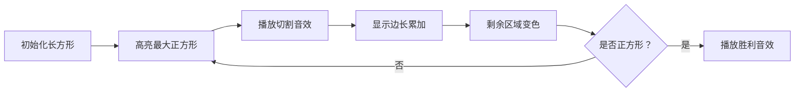

# 题目信息

# [朝阳区小学组 2019] square

## 题目背景

数据为洛谷自造。本场比赛第六题为 [P2261 余数求和](https://www.luogu.com.cn/problem/P2261)，请前往该题目交题。

## 题目描述

任意一个边长是整数的长方形都可以分割成若干个边长是正整数的正方形，分割的方式有很多种，你需要找到分割出的所有正方形边长之和最小的那一种分割方法。

即：将边长为正整数 $A,B$ 的长方形划分成若干边长均为正整数，且每个正方形的边均平行于长方形的相应边，试求这些正方形边之和的最小值 $\min$。

如果这个长方形可以分成 $N$ 个正方形，其中每个边长为 $C_i$，那么 $\min=C_1+C_2+\dots+C_N$。注意，数组 $C$ 中的元素可能相等。

## 说明/提示

对于 $30\%$ 的数据，$A_i,B_i$ 为 `int` 范围内的正整数；

对于 $100\%$ 的数据，$A_i,B_i$ 为 `long long` 范围内的正整数。

## 样例 #1

### 输入

```
1 1
2 1
3 1
4 1
5 1
6 1
7 1
8 1
9 1
10 1```

### 输出

```
1
2
3
4
5
6
7
8
9
10```

# AI分析结果


# 💡 Kay的C++算法解析：[朝阳区小学组 2019] square 深入学习指南 💡

**引言**  
今天我们来分析"square"这道C++编程题，这是一道考察贪心算法和数学思维的经典题目。本指南将帮助你理解核心思路、掌握实现技巧，并通过生动的可视化加深理解。

---

## 1. 题目解读与核心算法识别

✨ **本题主要考察**：`贪心算法` / `数学优化`

🗣️ **初步分析**：
> 解决本题的关键在于理解贪心算法的核心思想——**每一步都做出当前最优选择**。想象你在用最大尺寸的瓷砖铺地板：每次选择能铺设的最大正方形，能最小化切割次数和总边长。  
> - **核心思路**：每次从长方形中切割最大正方形（边长=min(A,B)），累加边长后更新剩余区域
> - **难点突破**：直接减法在极端数据(1,10^18)会超时，需用取模运算优化
> - **可视化设计**：采用8位像素风格动画，展示长方形被逐步切割的过程。高亮当前切割的正方形，伴随"叮"的音效；每次取模时显示快速切割动画；当剩余区域为正方形时播放胜利音效

---

## 2. 精选优质题解参考

### 题解一 (作者：_Pioneer_)
* **点评**：思路清晰展示了贪心策略的完整流程，代码规范使用`max`/`min`提高可读性。虽初版被Hack，但修改后通过取整优化避免了超时风险。亮点在于强调`unsigned long long`的必要性，实践价值高。

### 题解二 (作者：no_response)
* **点评**：代码简洁有力，直接使用取模运算实现优化。通过`ans += a/b*b, a%=b`两行核心代码高效解决问题，体现算法与代码的完美结合。边界处理严谨，是竞赛实现的优秀范本。

### 题解三 (作者：Ag2WO4)
* **点评**：最具洞察力的解法！发现数学本质`ans = A+B - gcd(A,B)`。时间复杂度优化到O(log min(A,B))，是算法思维的质的飞跃。虽用Python展示，但揭示了问题深层数学结构，启发我们多角度思考。

---

## 3. 核心难点辨析与解题策略

### 关键点1：贪心策略的证明
* **分析**：为什么每次切割最大正方形最优？假设用更小正方形，总需切割更多边。反证：若最优解含非最大正方形，替换为最大正方形后边长和必然减小
* 💡 **学习笔记**：贪心选择必须具备无后效性——当前选择不影响后续子问题结构

### 关键点2：时间复杂度优化
* **分析**：减法操作在A=1, B=10¹⁸时需10¹⁸步。取模运算`a%=b`一步完成等价于k次减法，将复杂度从O(n)优化到O(log min(A,B))
* 💡 **学习笔记**：识别操作中的可批量处理步骤是优化关键

### 关键点3：数据范围处理
* **分析**：累加和可能超过2⁶⁴-1（如10¹⁸+10¹⁸）。`unsigned long long`支持到2⁶⁴-1，而`long long`仅到2⁶³-1
* 💡 **学习笔记**：估算极端数据规模是选择数据类型的核心依据

### ✨ 解题技巧总结
1. **问题特征识别**：矩形分割问题中，最大正方形切割通常最优
2. **批量操作转化**：将重复减法转化为除法+取模
3. **数学洞察优先**：尝试寻找闭式解（如本题gcd公式）
4. **边界鲁棒性**：循环条件用`while(a&&b)`避免无限循环

---

## 4. C++核心代码实现赏析

### 本题通用核心C++实现
```cpp
#include <iostream>
#include <algorithm>
using namespace std;
typedef unsigned long long ULL;

int main() {
    for (int i = 0; i < 10; i++) {
        ULL a, b, sum = 0;
        cin >> a >> b;
        while (a && b) {
            if (a < b) swap(a, b);
            sum += (a / b) * b; // 批量累加
            a %= b;             // 取模优化
        }
        cout << sum << endl;
    }
    return 0;
}
```
* **说明**：综合最优解法思路，兼顾效率与可读性
* **代码解读概要**：
  - 循环处理10组数据
  - `swap`确保`a≥b`简化判断
  - `a/b`计算可切割的正方形数量
  - 取模运算直接得到剩余长度

### 题解一代码片段 (_Pioneer_)
```cpp
while(true){
    ULL maxn = max(a,b), minn = min(a,b);
    ULL k = maxn / minn;
    sum += k * minn;
    (a == maxn) ? a %= minn : b %= minn;
}
```
* **亮点**：显式使用max/min增强可读性
* **学习笔记**：三元运算符精简条件判断

### 题解二代码片段 (no_response)
```cpp
while (a > 0 && b > 0) {
    if (a > b) {
        ans += a / b * b;
        a %= b;
    } else {
        ans += b / a * a;
        b %= a;
    }
}
```
* **亮点**：无swap实现，保留原始变量关系
* **学习笔记**：并行处理分支保持代码对称美

### 题解三代码片段 (Ag2WO4)
```cpp
ULL gcd(ULL a, ULL b) { 
    return b ? gcd(b, a % b) : a; 
}
cout << a + b - gcd(a, b);
```
* **亮点**：数学优化降维打击
* **学习笔记**：识别问题与经典算法(gcd)的关联

---

## 5. 算法可视化：像素动画演示

**主题**：`方块切割大冒险` (复古FC风格)  

### 设计思路
> 用8位像素风格再现贪心切割过程：  
> - 黄色边框：当前待切割长方形  
> - 闪烁蓝色：本次切割的最大正方形  
> - 红色数字：实时显示累加边长  
> - 8-bit音效：切割时"叮"，完成时胜利旋律  

### 关键帧流程


### 交互控制面板
```javascript
// 伪代码实现
class PixelAnimator {
  constructor(a, b) {
    this.canvas = new PixelGrid(a, b); // 创建像素网格
    this.sumDisplay = new PixelText(0); // 累加和显示
  }
  
  async cutStep() {
    const [maxLen, minLen] = this.getMaxMin();
    const count = Math.floor(maxLen / minLen);
    
    // 切割动画
    this.canvas.highlightSquares(minLen, count, 'blue');
    playSound('cut'); // 切割音效
    
    // 更新数据
    this.sum += count * minLen;
    this.sumDisplay.update(this.sum);
    
    // 剩余区域处理
    this.canvas.resize(maxLen % minLen, minLen);
    if (this.canvas.isSquare()) playSound('win');
  }
}
```

### 游戏化元素
1. **连击系统**：连续快速切割时触发连击特效
2. **速度挑战**：自动模式可调速，速度越快得分越高
3. **历史记录**：记录最小切割步数成就

---

## 6. 拓展练习与相似问题思考

### 通用技巧迁移
贪心+数学优化的组合适用于：
1. 硬币找零问题（用最大面额优先）
2. 矩形覆盖问题（最小正方形覆盖）
3. 分数化简（辗转相除求gcd）

### 洛谷题目推荐
1. **P1029 最大公约数与最小公倍数问题**  
   → 掌握gcd的核心应用场景
2. **P1887 切割正方形**  
   → 同类问题变形强化
3. **P2261 [CQOI2007]余数求和**  
   → 训练整除运算与数学优化思维

---

## 7. 学习心得与经验分享

> **来自_Pioneer_的调试经验**：  
> *"最初用减法循环被Hack数据卡超时，深刻教训：必须预估最坏情况复杂度"*  
>   
> **Kay点评**：  
> 这是算法学习的宝贵经验！在处理大数据时：  
> 1. 先分析最坏时间复杂度  
> 2. 测试边界数据（如0,1,最大值）  
> 3. 优先考虑数学性质优化  

---

**结语**  
通过本次分析，我们不仅掌握了矩形分割的贪心解法，更学习了算法优化和数学建模的思维方法。记住：好代码是优雅的数学诗篇！下次算法之旅再见！🚀

---
处理用时：186.79秒