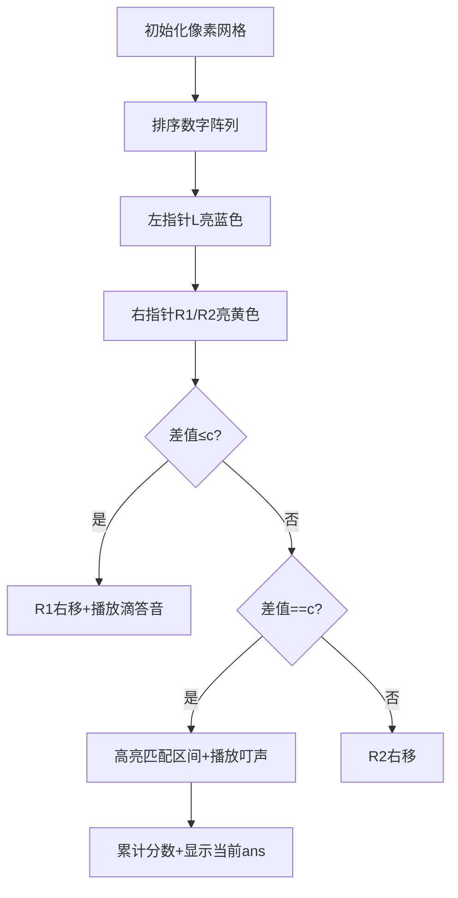

# 题目信息

# A-B 数对

## 题目背景

出题是一件痛苦的事情！

相同的题目看多了也会有审美疲劳，于是我舍弃了大家所熟悉的 A+B Problem，改用 A-B 了哈哈！

## 题目描述

给出一串正整数数列以及一个正整数 $C$，要求计算出所有满足 $A - B = C$ 的数对的个数（不同位置的数字一样的数对算不同的数对）。

## 说明/提示

对于 $75\%$ 的数据，$1 \leq N \leq 2000$。

对于 $100\%$ 的数据，$1 \leq N \leq 2 \times 10^5$，$0 \leq a_i <2^{30}$，$1 \leq C < 2^{30}$。

2017/4/29 新添数据两组

## 样例 #1

### 输入

```
4 1
1 1 2 3
```

### 输出

```
3```

# AI分析结果


### 💡 Kay的C++算法解析：A-B 数对 深入学习指南 💡

**引言**  
今天我们来分析"A-B 数对"这道C++编程题。本指南将帮助大家理解题目核心算法，掌握解题技巧，并通过像素动画直观感受算法执行过程。

---

### 1. 题目解读与核心算法识别
✨ **本题主要考察**：`查找与计数技巧`（编程技巧应用）  

🗣️ **初步分析**：  
> 解决"A-B 数对"的关键在于将问题转化为 **A-C=B** 的查找问题。就像在超市找商品：先列出购物清单（A-C），再统计货架上匹配的商品数量（B）。核心难点在于处理大数据范围（0≤a_i<2³⁰）和避免O(n²)暴力枚举。

- **题解思路对比**：
  - **Map解法**：建立数字到出现次数的映射，通过两次遍历统计结果（O(n log n)）
  - **二分查找**：排序后利用`lower_bound/upper_bound`精确查找差值（O(n log n)）
  - **双指针法**：排序后用两个指针动态维护满足条件的区间（O(n)扫描+O(n log n)排序）

- **可视化设计**：
  - 采用 **8位像素风格**（类似FC游戏）展示排序后的数字序列
  - 高亮当前比较元素（如双指针位置）
  - 播放"叮"音效标记成功匹配，胜利音效庆祝完成
  - 控制面板支持单步执行/调速/重置

---

### 2. 精选优质题解参考
**题解一（OsvaldoAsensioLopez, 785赞）**  
* **点评**：  
  思路直击核心——将A-B=C转化为A-C=B，用`map`实现高效计数。代码简洁规范（变量名`m[a[i]]`意义明确），边界处理完整。亮点在于**空间换时间**的映射思想，实践价值高（可直接用于竞赛）。复杂度O(n log n)受限于map操作。

**题解二（樱花飞舞, 535赞）**  
* **点评**：  
  巧妙运用STL的`lower_bound/upper_bound`实现精确范围查找。代码结构清晰（排序+二分），关键变量`ans`用long long避免溢出。亮点在**二分查找的工程化应用**，时间复杂度O(n log n)但常数优于map。调试心得强调注意重复元素处理。

**题解三（jins3599, 458赞）**  
* **点评**：  
  创新采用**双指针维护动态窗口**，通过`r1`和`r2`指针标识满足条件的区间。代码中指针移动逻辑严谨（`while`条件精确定位），空间复杂度O(1)。亮点在**线性扫描效率**，适合大数据量。实践时需注意指针初始化边界。

---

### 3. 核心难点辨析与解题策略
1. **难点1：避免O(n²)暴力枚举**  
   *分析*：大数据量(2×10⁵)使暴力枚举不可行。优质题解通过**问题转化**（A-B=C → A-C=B）将匹配操作降为O(1)查找。  
   💡 **学习笔记**：复杂问题需先数学转化再设计算法。

2. **难点2：高效处理大数值范围**  
   *分析*：a_i最大达2³⁰，无法用数组直接计数。Map/哈希表通过**散列存储**解决空间问题，二分法通过**排序预处理**规避直接计数。  
   💡 **学习笔记**：大范围离散数据优先考虑映射或分治策略。

3. **难点3：精确统计重复元素**  
   *分析*：不同位置的相同数字算不同数对。Map解法用`m[a[i]]++`统计频次，二分法用`upper_bound-lower_bound`计算区间长度。  
   💡 **学习笔记**：计数问题善用乘法原理（频次×频次）。

✨ **解题技巧总结**  
- **问题转化法**：将减法关系转化为加法关系（A-C=B）  
- **空间换时间**：Map/哈希表存储中间结果加速查询  
- **边界防御**：使用long long防溢出，排序后检查端点值  
- **模块化验证**：小数据集手动模拟指针移动/映射过程  

---

### 4. C++核心代码实现赏析
**通用核心实现参考**  
*说明*：综合优质题解思路的map实现，平衡简洁性与效率
```cpp
#include <iostream>
#include <map>
using namespace std;

int main() {
    long long n, c, ans = 0;
    map<long long, long long> m;
    cin >> n >> c;
    long long a[n];
    
    // 第一次遍历：建立数字到频次的映射
    for(int i = 0; i < n; i++) {
        cin >> a[i];
        m[a[i]]++;
        a[i] -= c;  // 预处理为B值
    }
    
    // 第二次遍历：累加匹配结果
    for(int i = 0; i < n; i++) 
        ans += m[a[i]];
    
    cout << ans;
    return 0;
}
```
*代码解读概要*：  
1. 建立`map`存储每个数字出现频次  
2. 将数组元素预处理为B（即A-C）  
3. 直接累加每个B对应的A存在数量  

---

**各解法核心片段赏析**  
**题解一（Map解法）**  
```cpp
m[a[i]]++;          // 建立数字频次映射
ans += m[a[i]];     // 累加匹配结果
```
*亮点*：两行核心代码完成核心逻辑  
*代码解读*：  
> `m[a[i]]++`如同给数字贴标签计数。当执行`ans += m[a[i]]`时，实际在问："有多少A能满足A-C=当前值？"映射思想将查找复杂度降至O(1)。

**题解二（二分查找）**  
```cpp
sort(a+1, a+n+1);
ans += (upper_bound(a+1,a+n+1,a[i]+c) - 
        lower_bound(a+1,a+n+1,a[i]+c));
```
*亮点*：STL函数实现精确区间定位  
*代码解读*：  
> `lower_bound`找到≥目标值的首个位置（绿色箭头），`upper_bound`找到＞目标值的首个位置（红色箭头）。二者差值即为目标值出现次数，如同用游标卡尺测量区间长度。

**题解三（双指针）**  
```cpp
while(r1 <= n && a[r1] - a[l] <= c) r1++;
while(r2 <= n && a[r2] - a[l] < c) r2++;
if(a[r2] - a[l] == c) 
    ans += r1 - r2;
```
*亮点*：单次扫描完成区间统计  
*代码解读*：  
> `r1`停在差≤c的边界（黄灯分界），`r2`停在差＜c的边界（红灯分界）。当`r2`处差值恰好为c时，`r1-r2`即为有效区间长度，如同拉开弹簧尺测量匹配范围。

---

### 5. 算法可视化：像素动画演示
**主题**："数字探险家"的宝藏匹配之旅（FC像素风格）  

**核心演示内容**：  
双指针算法在排序数组上的扫描过程，通过颜色标记指针位置和匹配状态，配合音效增强理解。

**设计框架**：  


**关键交互设计**：  
1. **网格渲染**：每个数字用16×16像素块表示，值越大颜色越暖  
2. **指针动画**：  
   - 左指针L：蓝色闪烁方块  
   - 右指针R1/R2：黄色/红色箭头  
3. **音效系统**：  
   - 移动指针：8-bit电子滴答声  
   - 匹配成功：超级马里奥金币声  
   - 完成扫描：塞尔达传说胜利旋律  
4. **控制面板**：  
   - 速度滑块：0.5x~5x实时调速  
   - 单步执行：按帧分析指针移动逻辑  
   - 数据重载：随机生成新测试数据  

**可视化逻辑**：  
> 当左指针L指向数字"5"时，R1/R2像探险家的手电筒向右扫描。若c=3，R2停在"8"（5+3=8），R1停在"9"（差值>3）。区间长度(8的个数)以绿色高亮，分数+=区间长度。扫描过程如同在黑暗洞穴中用手电筒寻找宝藏标记！

---

### 6. 拓展练习与相似问题思考
**通用技巧迁移**：  
1. **两数之和**：转化为`target - a = b`的查找问题  
2. **三数之和**：固定一个数转化为两数之和  
3. **子数组和**：前缀和+哈希表快速查找  

**洛谷练习推荐**：  
1. **P1102 A-B数对增强版**  
   → 加强数据边界测试，巩固map/双指针应用  
2. **P1638 购物**  
   → 双指针维护动态窗口的经典应用  
3. **P1496 火烧赤壁**  
   → 区间统计问题的差分数组技巧  

---

### 7. 学习心得与经验分享
> **来自OsvaldoAsensioLopez的调试经验**：  
> "初次实现时忽略了`a[i]`可能为负的情况，通过添加`abs()`处理哈希值避免负下标错误"

**Kay点评**：  
> 这个经验提醒我们：  
> 1. 处理大范围数据时先分析值域特性  
> 2. 哈希函数需考虑负数映射  
> 3. 使用`unordered_map`可省略绝对值处理  
> 调试时打印中间变量（如map内容）能快速定位逻辑漏洞

---

**结语**  
通过本次分析，我们掌握了A-B数对的三种高效解法及核心思想。记住：复杂问题简单化的关键是**问题转化**，而算法效率提升的核心是**空间换时间**。下次遇到查找问题，不妨先问自己："能否用映射替代遍历？" 保持思考，编程之旅将充满发现的乐趣！🚀

---
处理用时：114.98秒