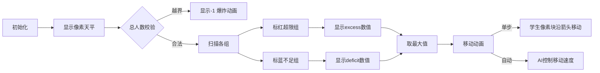

# 题目信息

# 学生分组

## 题目描述

有 $n$ 组学生，给出初始时每组中的学生个数，再给出每组学生人数的上界 $R$ 和下界 $L\ (L \le R)$，每次你可以在某组中选出一个学生把他安排到另外一组中，问最少要多少次才可以使 $N$ 组学生的人数都在 $[L,R]$ 中。


## 说明/提示

### 数据范围及约定

对于全部数据，保证 $1\le n \le 50$。

## 样例 #1

### 输入

```
2
10 20
10 15
```

### 输出

```
5```

# AI分析结果


### 💡 Kay的C++算法解析：学生分组 深入学习指南 💡

#### 题目解读与核心算法识别
✨ **本题主要考察**：`数学推导与贪心策略应用`  
🗣️ **初步分析**：  
> 解决学生分组问题就像在平衡一个天平⚖️——我们需要用最少的移动次数让所有砝码（学生组）都在规定重量区间内。关键在于：
> 1. **可行性判断**：总学生数必须在$[n×L, n×R]$区间内（如天平总重量需在承载范围内）
> 2. **贪心策略**：最小移动次数 = max(低于下限的总缺口, 超出上限的总盈余)  
> 核心变量推导：
> - `excess`：记录超出上限$R$的学生总数
> - `deficit`：记录低于下限$L$的学生总数
> 
> **可视化设计**：采用8位像素风格天平动画，每组显示为砝码方块：
> - 红色方块：超出上限（播放"滴"警告音）
> - 蓝色方块：低于下限（播放"嘟"提示音）
> - 绿色箭头：移动学生时的动画轨迹
> - 控制面板：调速滑块控制移动速度，AI模式自动完成最优解

---

#### 精选优质题解参考
**题解一（樱雪喵）**  
* **点评**：思路直击本质，用`b`和`c`变量分别记录缺口与盈余，代码简洁规范（如`if(all<n*l||all>n*r)`边界处理）。亮点在于将复杂问题转化为两个关键变量的比较，实践价值高（可直接用于竞赛）。  

**题解二（HohleFeuerwerke）**  
* **点评**：独创性提出$x$（需移出）与$y$（需移入）的数学定义，用公式$f_a$清晰表达算法逻辑。代码中`away`和`newin`变量命名精准，体现专业抽象能力。  

**题解三（gravf）**  
* **点评**：代码最简练（仅20行），但完整包含核心逻辑。亮点在于用`x`和`y`直接对应问题本质，`if(!((l*n<=tot)&&...))`的布尔表达式展现严密思维。  

---

#### 核心难点辨析与解题策略
1. **可行性判定**  
   * **分析**：必须严格验证 $total \in [nL, nR]$，如天平超载会崩溃。优质解均用`if(sum<n*l||sum>n*r)`处理  
   * 💡 学习笔记：总人数是问题可行性的"总闸门"

2. **移动次数计算**  
   * **分析**：关键发现是单次移动可同时解决一个缺口和一个盈余，故次数取决于较大值。如樱雪喵的`max(b,c)`  
   * 💡 学习笔记：移动操作具有"双向修正"特性

3. **变量意义抽象**  
   * **分析**：优秀代码都用`excess/deficit`类变量替代原始数组操作，如`away += gr[i]-r`  
   * 💡 学习笔记：用中间变量剥离问题核心

### ✨ 解题技巧总结
- **数学建模法**：将操作转化为`excess`和`deficit`的数值问题  
- **边界先行**：优先处理无解情况（总人数越界）  
- **双向统计**：独立计算超出/缺口再取最大值  
- **变量即注释**：用`need`/`surplus`等变量名自解释逻辑  

---

#### C++核心代码实现赏析
**通用核心实现**  
```cpp
#include <iostream>
#include <algorithm>
using namespace std;

int main() {
    int n, L, R, total = 0;
    cin >> n;
    int groups[50];
    for(int i=0; i<n; ++i) {
        cin >> groups[i];
        total += groups[i];
    }
    cin >> L >> R;
    
    // 可行性校验
    if(total < n*L || total > n*R) {
        cout << -1;
        return 0;
    }
    
    // 计算缺口与盈余
    int deficit = 0, excess = 0;
    for(int i=0; i<n; ++i) {
        if(groups[i] < L) deficit += L - groups[i];
        if(groups[i] > R) excess += groups[i] - R;
    }
    cout << max(deficit, excess);
    return 0;
}
```
* **代码解读概要**：  
  1. 输入组数及各组人数  
  2. 严格校验总人数区间（核心防线）  
  3. 独立计算低于/超出范围的总量  
  4. 输出两者最大值（贪心精髓）

---

#### 算法可视化：像素动画演示
**动画主题**：`像素天平平衡大作战`  
**核心演示流程**：  

**交互设计**：  
- 🎮 控制面板：步进/暂停/速度滑块（1x-5x）  
- 🔴 超限组：闪烁红色+警告音效  
- 🔵 不足组：闪烁蓝色+水滴音效  
- 🟢 移动时：学生像素块沿绿色箭头轨迹滑动，伴随"嗖"音效  
- 🎉 完成时：天平平衡动画+胜利音乐  

---

#### 拓展练习与相似问题思考
**技巧迁移场景**：  
1. 资源再分配问题（如P2512 糖果传递）  
2. 水位平衡问题（如P1996 最小差值）  
3. 数组区间规范化问题  

**洛谷推荐**：  
1. **P2512 糖果传递**  
   🗣️ 环形版学生分组，强化贪心策略应用  
2. **P1996 最小差值**  
   🗣️ 变体训练，求极差最小化移动次数  
3. **P3811 均分纸牌**  
   🗣️ 基础贪心思想延伸，巩固变量抽象能力  

---

#### 学习心得与经验分享
> **樱雪喵的调试经验**：  
> "最初在变量意义混淆时卡壳，后明确区分`缺额`/`盈余`才突破"  
>   
> **Kay点评**：这印证了核心技巧——用`deficit/excess`等自解释变量替代原始数据操作，能大幅降低思维复杂度。建议初学者在草稿纸上先画出变量关系图再编码。

---

本次分析揭示了贪心问题的核心诀窍：**将操作转化为数值平衡问题**。记住这个思维模型，你就能举一反三解决同类问题！下次我们将探索更复杂的资源分配场景，继续加油！💪

---
处理用时：84.62秒