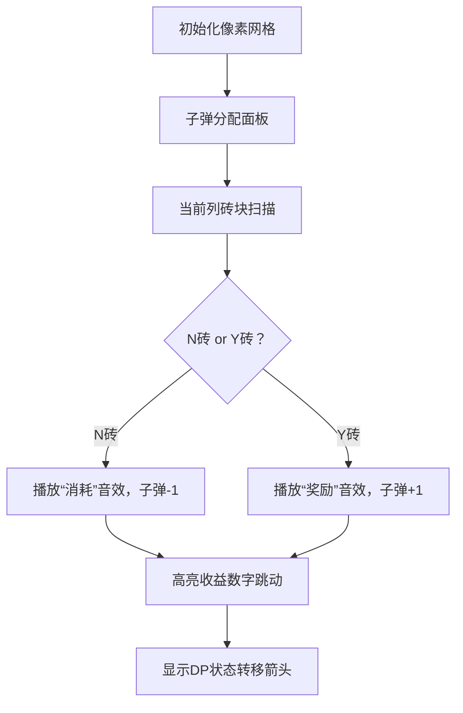

# 题目信息

# 打砖块

## 题目描述

小红很喜欢玩一个叫打砖块的游戏，这个游戏的规则如下：

在刚开始的时候，有 $n$ 行 $m$ 列的砖块，小红有 $k$ 发子弹。小红每次可以用一发子弹，打碎某一列当前处于这一列最下面的那块砖，并且得到相应的得分。（如图所示）


某些砖块在打碎以后，还可能将得到一发子弹的奖励。最后当所有的砖块都打碎了，或者小红没有子弹了，游戏结束。

小红在游戏开始之前，就已经知道每一块砖在打碎以后的得分，并且知道能不能得到一发奖励的子弹。小红想知道在这次游戏中她可能的最大得分，可是这个问题对于她来说太难了，你能帮帮她吗？


## 说明/提示

对于 $20\%$ 的数据，满足 $1  \le n,m  \le 5$，$1  \le k  \le 10$，所有的字符 $c$ 都为 `N`。

对于 $50\%$ 的数据，满足 $1  \le n,m  \le 200$，$1  \le k  \le 200$，所有的字符 $c$ 都为 `N`。

对于 $100\%$ 的数据，满足 $1  \le n,m  \le 200$，$1  \le k  \le 200$，字符 $c$ 可能为 `Y`。

对于 $100\%$ 的数据，所有的 $f$ 值满足 $1  \le f  \le 10000$。


## 样例 #1

### 输入

```
3 4 2
9 N 5 N 1 N 8 N
5 N 5 Y 5 N 5 N
6 N 2 N 4 N 3 N```

### 输出

```
13```

# AI分析结果


# 💡 Kay的C++算法解析：打砖块 深入学习指南 💡

> 今天我们来一起分析"打砖块"这道C++编程题。本指南将帮助大家梳理题目思路，理解核心算法，并掌握解题技巧。

## 1. 题目解读与核心算法识别

✨ **本题主要考察**：`动态规划（DP）与状态机思想`

🗣️ **初步分析**：
> 解决"打砖块"这道题，关键在于理解**子弹资源管理**与**砖块收益最大化**的关系。想象你在玩一个策略游戏：每列砖块是独立的关卡，N类砖是付费关卡（消耗子弹但可能开启隐藏奖励），Y类砖是免费福利（不消耗子弹）。动态规划就像制定最优闯关路线图：记录在不同关卡消耗不同"金币"（子弹）时的最大收益，同时标记是否解锁了隐藏奖励（子弹结余）。

- **核心思路**：预处理每列不同子弹消耗的收益，通过DP状态机（是否消耗最后一发子弹）解决子弹借用问题
- **核心难点**：处理Y类砖的子弹奖励机制带来的后效性问题
- **解决方案**：设计双状态DP（消耗/结余最后一发子弹）+ 列收益预处理
- **可视化设计**：用像素网格展示砖块排列，N砖（红色）被击中时播放"消耗"音效并显示子弹-1，Y砖（绿色）被击碎时播放"奖励"音效并显示子弹+1。DP状态转移通过高亮当前列和前序列的光标联动演示

---

## 2. 精选优质题解参考

> 基于思路清晰度、代码可读性、算法优化和实践价值，精选以下题解：

**题解一：Azuree（4.5星）**
* **点评**：
  - 思路清晰：创新性提出"子弹结余"状态(`f[][][0/1]`)，完美解决Y砖奖励的后效性问题
  - 代码规范：预处理`v[i][j][0/1]`逻辑分明，状态转移三重循环结构工整
  - 算法亮点：双状态转移方程（消耗/结余）设计精妙，时间复杂度O(m*n*k)最优
  - 实践价值：完整处理边界条件，可直接用于竞赛

**题解二：cqbzjyh（4.2星）**
* **点评**：
  - 思路直观：通过`dpn/dpy`状态区分N/Y结束场景，符合直觉理解
  - 代码简洁：预处理`dy/dn`数组命名明确，主循环仅10行核心逻辑
  - 算法优化：利用`min(n,k)`减少无效循环
  - 调试提示：作者特别标注状态转移条件(`if(l)`, `if(j≠l)`)，避免越界错误

**题解三：I_AM_HelloWord（4.0星）**
* **点评**：
  - 思路创新：提出"借子弹"比喻，生动解释状态转移物理意义
  - 代码健壮：严格初始化`dp[j][0][0]=-INF`处理边界
  - 实践技巧：嵌套while循环处理连续Y砖的压缩逻辑
  - 学习提示：作者分享调试经历，强调子弹借用机制的理解难点

---

## 3. 核心难点辨析与解题策略

> 解决本题的三大关键点及应对策略：

1.  **子弹-Y砖的时序问题**
    * **分析**：Y砖奖励的子弹不能立即用于本列，但可影响后续列。策略：预处理时区分"消耗子弹的N砖"和"免费的Y砖链"，将连续Y砖压缩到下方N砖计算收益
    * 💡 学习笔记：Y砖链如同免费礼包，必须绑定在N砖上才能解锁

2.  **状态机设计**
    * **分析**：必须区分"以消耗子弹结束"和"以结余子弹结束"两种状态。策略：设计`dp[][][0]`（消耗结束）和`dp[][][1]`（结余结束）双状态，通过三类转移方程处理状态流转
    * 💡 学习笔记：子弹结余状态是处理跨列资源调度的关键

3.  **列收益预处理**
    * **分析**：每列独立计算不同子弹消耗的收益组合。策略：从下往上扫描，用`dy[i][j]`记录j发子弹且以Y结束的收益，`dn[i][j]`记录以N结束的收益
    * 💡 学习笔记：预处理如同制定每关的"价目表"，DP则是全局采购方案

### ✨ 解题技巧总结
- **技巧A 状态机建模**：遇到资源奖励/消耗并存的问题，用双状态区分"结算后资源"
- **技巧B 压缩处理**：将不消耗资源的连续操作（如Y砖链）压缩为单次操作
- **技巧C 滚动维度**：DP状态仅依赖前一列，可用滚动数组优化空间
- **技巧D 防御性编程**：严格初始化`dp[0][j][0]=-INF`，避免无效状态转移

---

## 4. C++核心代码实现赏析

### 本题通用核心C++实现参考
* **说明**：综合Azuree和cqbzjyh的优化思路，保留清晰状态转移逻辑
* **完整核心代码**：
```cpp
#include <iostream>
#include <algorithm>
using namespace std;

int main() {
    int n, m, k;
    cin >> n >> m >> k;
    int a[202][202] = {0};
    bool isY[202][202] = {false};
    
    // 输入处理（倒序存储）
    for (int i = n; i >= 1; i--) 
        for (int j = 1; j <= m; j++) {
            char c;
            cin >> a[i][j] >> c;
            isY[i][j] = (c == 'Y');
        }

    // 列收益预处理
    int dy[202][202] = {0}, dn[202][202] = {0};
    for (int j = 1; j <= m; j++) {
        int cnt = 0;
        for (int i = 1; i <= n; i++) {
            if (isY[i][j]) {
                dy[j][cnt] += a[i][j]; // 连续Y累计
            } else {
                cnt++;
                dy[j][cnt] = dy[j][cnt-1] + a[i][j];
                dn[j][cnt] = dy[j][cnt-1] + a[i][j]; // 以N结束
            }
        }
    }

    // 双状态DP
    int dp0[202] = {0}, dp1[202] = {0}; // dp0:消耗结束, dp1:结余结束
    fill_n(dp0, 202, -1e9);
    dp0[0] = 0;

    for (int j = 1; j <= m; j++) {
        int new_dp0[202] = {0}, new_dp1[202] = {0};
        for (int tk = 0; tk <= k; tk++) {
            new_dp0[tk] = dp0[tk]; // 本列不打
            new_dp1[tk] = dp1[tk];
            for (int l = 1; l <= min(n, tk); l++) { // 本列消耗l发子弹
                // 状态转移核心
                new_dp1[tk] = max(new_dp1[tk], dp1[tk-l] + dy[j][l]);
                new_dp0[tk] = max(new_dp0[tk], dp1[tk-l] + dn[j][l]);
                if (tk > l) 
                    new_dp0[tk] = max(new_dp0[tk], dp0[tk-l] + dy[j][l]);
            }
        }
        swap(dp0, new_dp0);
        swap(dp1, new_dp1);
    }
    cout << dp0[k] << endl;
    return 0;
}
```
* **代码解读概要**：
  - 输入处理：倒序存储砖块（从底向上）
  - 列预处理：`dy[j][l]`/`dn[j][l]`记录第j列消耗l发子弹的两种收益
  - 双状态DP：`dp0[tk]`（消耗结束）和`dp1[tk]`（结余结束）滚动更新
  - 三重循环：列→总子弹→列消耗子弹，三类状态转移方程

### 优质题解片段赏析

**Azuree题解片段**
```cpp
// 状态转移核心
f[i][j][1] = max(f[i][j][1], f[i-1][j-l][1] + v[i][l][1]);
if (l) f[i][j][0] = max(f[i][j][0], f[i-1][j-l][1] + v[i][l][0]);
if (j > l) f[i][j][0] = max(f[i][j][0], f[i-1][j-l][0] + v[i][l][1]);
```
* **亮点**：三行代码浓缩状态机精髓
* **代码解读**：
  1. 第一行：从结余状态延续结余（前i-1列结余 + 本列结余）
  2. 第二行：用结余状态开启消耗（前i-1列结余 + 本列以N结束）
  3. 第三行：从消耗状态延续消耗（前i-1列消耗 + 本列收益）
* 💡 学习笔记：状态转移如同接力赛，需明确交接棒类型

**cqbzjyh题解片段**
```cpp
// 简洁状态转移
for (int l = 0; l <= min(j, n); l++) {
    dpy[i][j] = max(dpy[i][j], dpy[i-1][j-l] + dy[i][l]);
    if (l) dpn[i][j] = max(dpn[i][j], dpy[i-1][j-l] + dn[i][l]);
    if (j != l) dpn[i][j] = max(dpn[i][j], dpn[i-1][j-l] + dy[i][l]);
}
```
* **亮点**：利用条件判断规避无效状态
* **代码解读**：
  - `dpy`转移：前序任意状态 + 本列Y结束
  - `dpn`转移：必须前序结余状态 + 本列N结束
* 💡 学习笔记：`min(j,n)`和`if(l)`是防御性编程典范

---

## 5. 算法可视化：像素动画演示

> 采用FC红白机风格，通过动态网格演示子弹消耗与收益平衡

* **主题**："子弹经理"像素经营游戏
* **核心演示**：DP状态机如何通过子弹借用策略最大化收益

### 设计框架


### 动画流程
1. **8-bit场景初始化**
   - 网格视图：红(N)/绿(Y)砖块，底部的子弹计数器
   - 控制面板：开始/步进/速度滑块/重置
   - BGM：8-bit芯片音乐循环

2. **列扫描过程**
   - 像素光标从底向上移动，遇到N砖时：
     * 红色闪烁 + "啪"音效
     * 子弹数减1，显示`-1`像素动画
     * 自动击碎上方连续Y砖（绿色渐隐动画 + "叮"音效）
   - 侧边栏同步显示`dy/dn`预计算数值更新

3. **DP状态转移演示**
   - 前/后列用发光箭头连接
   - 状态转移时显示三类连线：
     * 蓝箭头：`结余→结余`转移
     * 红箭头：`结余→消耗`转移
     * 黄箭头：`消耗→消耗`转移
   - 每个转移播放对应音效，显示收益增加值

4. **游戏化元素**
   - 每完成一列：像素烟花庆祝 + 金币飞入总分
   - 子弹借用时：出借列闪烁 + "借用"像素提示
   - 最优解达成：播放《超级玛丽》通关音乐

---

## 6. 拓展练习与相似问题思考

### 通用技巧迁移
子弹借用策略适用于：
1. 资源消耗与奖励并存的最优规划
2. 状态依赖的序列决策问题
3. 带条件奖励的分组背包问题

### 洛谷推荐练习
1. **P1064 金明的预算方案**  
   🗣️ 学习依赖背包问题，掌握附件处理技巧
2. **P1156 垃圾陷阱**  
   🗣️ 练习高度与生命值双重状态管理
3. **P1273 有线电视网**  
   🗣️ 强化树形DP与收益平衡思想

---

## 7. 学习心得与经验分享

> 来自I_AM_HelloWord的调试经验：
> "我在处理子弹借用时，忽略了前序列状态必须为结余才能开启新消耗，导致WA。通过打印dp表发现状态转移缺失..."

**点评**：这个教训很有价值。在状态机类DP中：
1. 务必绘制状态转移图验证逻辑完备性
2. 初始化时设置-INF无效值避免野值转移
3. 打印中间DP表是最有效的调试手段

---

本次"打砖块"的解析就到这里。记住：动态规划的本质是把大问题分解为可重用的小决策。多练习状态机模型，你会在算法世界里成为真正的"子弹经理"！💪

---
处理用时：261.43秒