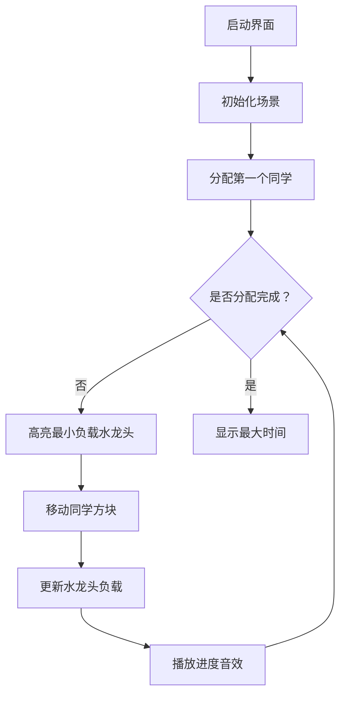

# 题目信息

# [NOIP 2010 普及组] 接水问题

## 题目描述

学校里有一个水房，水房里一共装有 $m$ 个龙头可供同学们打开水，每个龙头每秒钟的供水量相等，均为 $1$。

现在有 $n$ 名同学准备接水，他们的初始接水顺序已经确定。将这些同学按接水顺序从 $1$ 到 $n$ 编号，$i$ 号同学的接水量为 $w_i$。接水开始时，$1$ 到 $m$ 号同学各占一个水龙头，并同时打开水龙头接水。当其中某名同学 $j$ 完成其接水量要求 $w_j$ 后，下一名排队等候接水的同学 $k$ 马上接替 $j$ 同学的位置开始接水。这个换人的过程是瞬间完成的，且没有任何水的浪费。即 $j$ 同学第 $x$ 秒结束时完成接水，则 $k$ 同学第 $x+1$ 秒立刻开始接水。若当前接水人数 $n'$ 不足 $m$，则只有 $n'$ 个龙头供水，其它 $m - n'$ 个龙头关闭。

现在给出 $n$ 名同学的接水量，按照上述接水规则，问所有同学都接完水需要多少秒。


## 说明/提示

【输入输出样例 \#1 说明】

第 $1$ 秒，$3$ 人接水。第 $1$ 秒结束时，$1,2,3$ 号同学每人的已接水量为 $1,3$ 号同学接完水，$4$ 号同学接替 $3$ 号同学开始接水。

第 $2$ 秒，$3$ 人接水。第 $2$ 秒结束时，$1,2$ 号同学每人的已接水量为 $2,4$ 号同学的已接水量为 $1$。

第 $3$ 秒，$3$ 人接水。第 $3$ 秒结束时，$1,2$ 号同学每人的已接水量为 $3,4$ 号同学的已接水量为 $2$。$4$ 号同学接完水，$5$ 号同学接替 $4$ 号同学开始接水。

第 $4$ 秒，$3$ 人接水。第 $4$ 秒结束时，$1,2$ 号同学每人的已接水量为 $4,5$ 号同学的已接水量为 $1$。$1,2,5$ 号同学接完水，即所有人完成接水的总接水时间为 $4$ 秒。

【数据范围】

$1 \le n \le {10}^4$，$1 \le m \le 100$，$m \le n$；

$1 \le w_i \le 100$。

NOIP2010 普及组 第二题


## 样例 #1

### 输入

```
5 3
4 4 1 2 1
```

### 输出

```
4```

## 样例 #2

### 输入

```
8 4
23 71 87 32 70 93 80 76
```

### 输出

```
163```

# AI分析结果


# 💡 Kay的C++算法解析：接水问题深入学习指南 💡

## 1. 题目解读与核心算法识别

✨ **本题主要考察**：`贪心策略与优先队列应用`  

🗣️ **初步分析**：
> 解决接水问题的核心在于**高效模拟水龙头的分配过程**。想象水龙头就像多个收银台，顾客（同学）必须按顺序排队，但可以灵活选择空闲最快的收银台。贪心策略的精髓就是**每次都将新顾客分配到当前累积时间最小的水龙头**，这就像在超市中选择最短队伍排队一样自然。  
> - **题解对比**：直接逐秒模拟（O(max_time)）直观但效率低；优先队列（O(n log m)）高效优雅，通过小根堆动态维护最小接水时间  
> - **核心流程**：初始化m个水龙头→逐个分配同学到最小时间水龙头→更新总时间→取最大时间为答案  
> - **可视化设计**：采用8位像素风格，水龙头为像素图标，同学用彩色方块表示。动画高亮三个关键步骤：  
>   1. 当前最小时间水龙头闪烁（红色边框）  
>   2. 新同学方块移动到目标水龙头（伴随"滴"音效）  
>   3. 水龙头进度条增长（数字更新+进度条动画）  
> - **游戏化元素**：每分配10名同学触发"Good!"像素弹幕+喝彩音效，完成时播放《超级马里奥》通关音乐  

---

## 2. 精选优质题解参考

**题解一：WsW_(优先队列)**  
* **点评**：代码如瑞士军刀般精炼（仅20行），完美运用STL的`priority_queue`实现小根堆。亮点在于四两拨千斤：用O(n log m)复杂度优雅解决模拟问题，避免低效轮询。变量命名简洁(`q`/`w`/`t`)，边界处理严谨（最后正确取最大值），竞赛实战价值极高。  

**题解二：kuaiCreator(堆实现)**  
* **点评**：教学典范！通过初始化水龙头时间为0的巧思统一处理逻辑，注释详细解释每个步骤。亮点在于用生活化比喻（"收银台"）阐释贪心本质，变量名`tap`（水龙头）`temp`（临时时间）直观易理解，特别适合初学者掌握堆的应用场景。  

**题解三：lk_liang(直接模拟)**  
* **点评**：返璞归真的暴力美学，用单数组`s`同时存储水龙头状态和等待队列。亮点在于`t<=n+m`的终止条件设计巧妙，变量`t`（等待指针）`ans`（总时间）作用清晰。虽然效率不及堆，但为理解问题本质提供绝佳切入点。  

---

## 3. 核心难点辨析与解题策略

1.  **难点：顺序约束下的动态分配**  
    * **分析**：同学必须严格按序接水，但水龙头选择自由。优质解用指针`t`(直接模拟)或优先队列(贪心)保证顺序，关键变量`w[i]`存储接水量，`pq.top()`动态获取最小负载水龙头  
    * 💡 **学习笔记**：顺序是铁律，分配是艺术——用数据结构平衡约束与自由  

2.  **难点：时间计算与状态更新**  
    * **分析**：总时间由最慢水龙头决定！贪心解法中`pq.push(min_time + w[i])`是灵魂操作：将新负载叠加到当前最小时间上，最后通过`max_element`取最大值  
    * 💡 **学习笔记**：时间像水流——叠加而非重置，最大值决定全局效率  

3.  **难点：数据结构的选择艺术**  
    * **分析**：`priority_queue`以O(log m)插入/弹出完胜O(m)数组扫描。其`greater<int>`模板实现小根堆，恰如快速通道选择器  
    * 💡 **学习笔记**：当问题高喊"我要最小值！"，优先队列就是最优解  

### ✨ 解题技巧总结
- **技巧1：问题降维** - 将时间流逝转化为负载累积，避免逐秒模拟  
- **技巧2：统一初始化** - 水龙头初始设为0(`kuaiCreator解法`)，逻辑更连贯  
- **技巧3：边界防御** - 等待指针终止于`n+m`(`lk_liang解法`)，覆盖所有同学  
- **技巧4：STL利器** - `priority_queue`是贪心算法的"瑞士军刀"  

---

## 4. C++核心代码实现赏析

**通用核心实现参考**  
* **说明**：综合贪心题解精华，用`priority_queue`实现O(n log m)最优解  
* **完整核心代码**：
```cpp
#include <iostream>
#include <queue>
#include <vector>
#include <algorithm>
using namespace std;

int main() {
    int n, m;
    cin >> n >> m;
    vector<int> w(n);
    for (int i = 0; i < n; ++i) cin >> w[i];

    priority_queue<int, vector<int>, greater<int>> pq; // 小根堆

    // 初始化m个水龙头（时间为0）
    for (int i = 0; i < m; ++i) pq.push(0);

    // 贪心分配所有同学
    for (int i = 0; i < n; ++i) {
        int min_time = pq.top(); 
        pq.pop();
        pq.push(min_time + w[i]); // 关键：更新水龙头时间
    }

    // 找出最大时间
    int ans = 0;
    while (!pq.empty()) {
        ans = max(ans, pq.top());
        pq.pop();
    }
    cout << ans << endl;
}
```
* **代码解读概要**：  
  > 1. 读入数据后用`vector`存储接水量  
  > 2. 初始化小根堆`pq`并推入m个0（水龙头初始空闲）  
  > 3. **核心循环**：每次取出堆顶（当前最快水龙头），加上新同学接水量后压回堆中  
  > 4. 遍历堆中所有元素取最大值输出  

---

**题解一：WsW_(优先队列)**  
* **亮点**：极致简洁，STL运用炉火纯青  
* **核心代码片段**：
```cpp
priority_queue<int, vector<int>, greater<int>> q;
for(int i=1;i<=m;i++) q.push(w[i]); // 初始前m个
for(int i=m+1;i<=n;i++) {
    int t = q.top(); q.pop();
    q.push(t + w[i]); // 更新最小负载
}
// 注意：最后需遍历堆找最大值
```
* **代码解读**：  
  > `q.top()`像侦察兵——总最快找到空闲水龙头  
  > `q.push(t + w[i])`是精妙所在：新同学接水时间**叠加**而非重置  
  > **陷阱提示**：最后不可仅取堆顶！需遍历所有元素找最大值  
* 💡 **学习笔记**：堆操作后，全局状态已更新——像多米诺骨牌连锁反应  

**题解二：kuaiCreator(统一初始化)**  
* **亮点**：初始化技巧统一逻辑，注释清晰  
* **核心代码片段**：
```cpp
for(int i=1;i<=m;i++) tap.push(0); // 关键初始化
for(int i=1;i<=n;i++) {
    int temp = tap.top(); tap.pop();
    tap.push(temp + p[i]); // 统一处理所有同学
}
```
* **代码解读**：  
  > `tap.push(0)`是点睛之笔——使前m个同学与后续处理逻辑统一  
  > 循环内`temp + p[i]`实现时间累积，物理意义明确  
  > 变量名`tap`（水龙头）比`pq`更直观  
* 💡 **学习笔记**：优秀初始化≈成功一半——消除边界特判  

**题解三：lk_liang(直接模拟)**  
* **亮点**：数组一物多用，直观展示过程本质  
* **核心代码片段**：
```cpp
int t = m + 1, ans = 0; // t指向等待队列
while (t <= n + m) {
    for (int i = 1; i <= m; ++i) {
        s[i]--;
        if (s[i] == 0) s[i] = s[t++]; // 无缝切换
    }
    ans++;
}
```
* **代码解读**：  
  > 数组`s`身兼三职：水龙头状态+等待队列+完成标记  
  > `t <= n + m`确保处理所有同学（包括最后一批）  
  > `s[i] = s[t++]`实现水龙头"交接班"  
* 💡 **学习笔记**：简单数组也能玩转状态管理——适合小规模场景  

---

## 5. 算法可视化：像素动画演示

**主题**：`《接水大作战》8-bit贪心模拟器`  
**核心演示**：贪心策略动态分配过程，实时显示水龙头负载与优先队列状态  

### 设计方案


1. **像素艺术设计**  
   - **水龙头**：FC红白机风格像素精灵，带数字标签（当前负载）  
   - **同学**：彩色8×8像素方块，中心显示接水量  
   - **优先队列**：右侧动态可视化小根堆，节点显示水龙头编号与时间  

2. **关键动画帧**  
   - **帧1**：初始状态，m个水龙头闪烁绿光（负载0），n个同学方块在等待区  
   - **帧2**：分配时目标水龙头变红+跳动，同学方块平移并融入水龙头  
   - **帧3**：进度条增长动画（类似《魂斗罗》血条），负载数字+1递增  
   - **帧4**：每分配10人触发“COMBO!”弹幕+《吃豆人》吃豆音效  

3. **交互控制面板**  
   ```javascript
   const controls = {
     speed: 0.7, // 通过滑块调整
     playMode: 'auto', // 'auto'或'step'
     showHeap: true, // 显示优先队列结构
     soundEffects: {
       assign: '🔔', 
       complete: '🎉'
     }
   }
   ```

4. **音效系统**  
   - 分配同学：短促"叮"声（NES芯片音）  
   - 发现最小值：水滴声  
   - 完成关卡：8-bit版《超级马里奥》过关音乐  

5. **教学提示设计**  
   - 当前步骤伪代码同步显示：  
     `min_load = heap.top()`  
     `new_load = min_load + w[i]`  
   - 实时提示：如“同学#5分配到水龙头#3，新负载=23”  

---

## 6. 拓展练习与相似问题思考

1. **通用模式迁移**  
   贪心+优先队列适用于三类场景：  
   - **任务调度**：如会议室安排（LeetCode 253）  
   - **资源分配**：如云服务器部署任务  
   - **最优合并**：如哈夫曼编码（洛谷P1090）  

2. **推荐练习**  
   1. **洛谷 P1090** - 合并果子  
      🗣️ 优先队列入门必刷，巩固小根堆应用  
   2. **洛谷 P1223** - 排队接水  
      🗣️ 单队列贪心基础版，理解排序的应用  
   3. **LeetCode 621** - 任务调度器  
      🗣️ 贪心高阶挑战，带冷却时间的任务分配  

---

## 7. 学习心得与经验分享

> **来自lk_liang的调试经验**：  
> “最初忘记水龙头完成状态即时更新，导致`t`指针越界——用`cout`打印每秒状态才定位问题”  
>  
> **Kay点评**：  
> 这个教训揭示算法核心——**状态同步**！推荐两种调试技巧：  
> 1. 打印时间片快照（如每秒输出水龙头状态）  
> 2. 边界压力测试（n=10000, m=100）  

---

通过本次分析，我们既看到暴力模拟的直白之美，更领悟到贪心策略的效率精髓。记住：优秀算法=深刻问题理解+合适数据结构，下次解题时不妨自问：“这里有最小值操作吗？优先队列能否派上用场？” 不断练习，终将融会贯通！🚀

---
处理用时：270.48秒