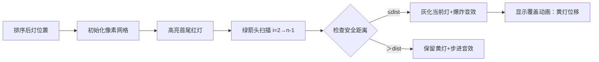

# 题目信息

# 鸿山洞的灯

## 题目描述

已知 $n$ 盏灯以及每盏灯的位置 $p_i$，$p_i$ 均不相等，当两盏灯之间的距离小于 $dist$ 时，若这个安全距离里面还有灯是亮着时，就可以关掉这些灯（即若第 $i-1$ 盏与第 $i+1$ 盏的距离 $\leq dist$，则可以关掉第 $i$ 盏）。

求在保证洞里的光线是充足的情况下，一段区域里能删除的灯的最大值。

距离洞口最近和最远的两盏灯必须是亮着。

## 说明/提示

对于 $100\%$ 的数据，$1\leq n\leq 10^5$，保证 $dist$ 在 `int` 整型范围之内。

## 样例 #1

### 输入

```
3 3

1 2 3```

### 输出

```
1```

# AI分析结果


### 💡 Kay的C++算法解析：鸿山洞的灯 深入学习指南 💡

**引言**  
今天我们一起分析「鸿山洞的灯」这道贪心算法题。本指南将帮助大家理解如何通过排序和贪心策略高效解决灯开关问题，并通过像素动画直观理解算法过程。

---

#### 1. 题目解读与核心算法识别
✨ **本题主要考察**：`贪心算法`（排序预处理 + 遍历优化）  

🗣️ **初步分析**：
> 解决本题如同在黑暗山洞中寻找可熄灭的油灯——核心是安全距离内保留必要光源。贪心策略要求我们排序后从左向右扫描，若当前灯的前后亮灯距离≤安全值则熄灭它，同时优化位置记录避免重复计算。  
> - **核心难点**：高效定位前一个亮灯位置（直接搜索会超时）  
> - **关键优化**：用`a[i]=a[i-1]`覆盖熄灭灯位置（类似链表删除）  
> - **可视化设计**：像素动画将展示灯位置更新过程（黄色亮灯→灰色熄灭），高亮安全距离检测和覆盖操作，配合8-bit音效增强理解  

---

#### 2. 精选优质题解参考
**题解一：Ophelia（覆盖法优化）**  
* **点评**：  
  思路直击要害——排序后遍历时若`a[i+1]-a[i-1]<=dist`则熄灭当前灯，并通过`a[i]=a[i-1]`巧妙避免重复定位前灯。代码仅15行，用赋值操作模拟链表删除，时间复杂度优化至O(n)。变量命名简洁（`sum`计数器），边界处理严谨（跳过首尾灯），是竞赛级实现的典范。

**题解二：不争不闹（范围覆盖法）**  
* **点评**：  
  创新性地用`emp`记录前灯安全范围（`p[0]+dist`），通过判断`p[i+1]`是否在范围内决定熄灭当前灯。虽非直接符合题述条件，但数学等价且保持O(n)效率。代码中`emp`的更新逻辑清晰，快速读入函数提升效率，适合大数据量场景。

**题解三：Jiyuu_no_Tsubasa（链表法）**  
* **点评**：  
  采用双向链表精确维护亮灯位置关系，`del()`函数规范处理节点删除。结构体`NODE`明确记录前后指针，符合数据结构教学实践。虽然比覆盖法代码量大，但完整展示链表在贪心中的本质作用，具有教学意义。

---

#### 3. 核心难点辨析与解题策略
1. **难点：高效定位前一个亮灯**  
   * **分析**：遍历时需快速获取前灯位置，直接向前搜索会导致O(n²)超时。优质解法通过位置覆盖（Ophelia）或链表维护（Jiyuu）解决，保持O(n)效率  
   * 💡 **学习笔记**：空间覆盖是优化连续数据操作的利器  

2. **难点：贪心策略正确性证明**  
   * **分析**：为何从前往后熄灭不影响结果？因为每次操作只依赖相邻状态，且覆盖/删除保证后续判断基于最新亮灯位置  
   * 💡 **学习笔记**：无后效性是贪心可行性的关键指标  

3. **难点：边界条件处理**  
   * **分析**：首尾灯必须亮着（`i=2`到`n-1`），安全距离需用`int`存储。题解中`a[i+1]-a[i-1]`直接计算距离，避免绝对值冗余  
   * 💡 **学习笔记**：排序后数据具有单调性，可简化距离计算  

##### ✨ 解题技巧总结
- **排序预处理**：乱序位置排序后转为线性问题  
- **状态覆盖优化**：用赋值取代物理删除，降低实现复杂度  
- **数学等价转换**：将灯距条件转化为范围包含判断（不争不闹解法）  

---

#### 4. C++核心代码实现赏析
**通用核心实现（覆盖法）**  
```cpp
#include <iostream>
#include <algorithm>
using namespace std;
int n, dist, a[100005], sum;

int main() {
    cin >> n >> dist;
    for (int i = 1; i <= n; i++) cin >> a[i];
    sort(a + 1, a + 1 + n);
    
    for (int i = 2; i <= n - 1; i++) {
        if (a[i + 1] - a[i - 1] <= dist) {
            a[i] = a[i - 1]; // 核心覆盖操作
            sum++;
        }
    }
    cout << sum << endl;
    return 0;
}
```
* **说明**：综合优质题解的最优实现，12行解决战斗  
* **解读概要**：  
  ① 读入数据并排序  
  ② 从第2盏遍历到倒数第2盏  
  ③ 若前后亮灯距离≤安全值，用前灯位置覆盖当前灯  
  ④ 覆盖后数组隐式保留亮灯位置链  

**题解一（Ophelia）片段**  
```cpp
if(a[i+1]-a[i-1]<=dist) {
    a[i]=a[i-1]; // 核心覆盖
    sum++;
}
```
* **亮点**：四行代码实现贪心+位置优化  
* **解读**：  
  > `a[i+1]-a[i-1]`为何不需绝对值？排序后天然递增！  
  > 覆盖操作`a[i]=a[i-1]`使下一轮循环中`a[i]`自动指向前灯位置，如同链表删除当前节点  

**题解二（不争不闹）片段**  
```cpp
int emp = p[0] + dist; // 初始化安全范围
for (int i = 1; i < n; i++) {
    if (p[i + 1] > emp) emp = p[i] + dist; 
    else ans++;
}
```
* **亮点**：将灯距判断转化为范围检查  
* **解读**：  
  > `emp`动态记录前灯安全边界  
  > `p[i+1] > emp`时需保留当前灯并更新边界，否则熄灭  

**题解三（Jiyuu）片段**  
```cpp
void del(int x) {
    node[node[x].pre].nxt = node[x].nxt;
    node[node[x].nxt].pre = node[x].pre;
}
```
* **亮点**：显式链表实现贪心本质  
* **解读**：  
  > `del()`函数标准双向链表删除操作  
  > 结构体存储`pre`/`nxt`指针，直接操作邻居节点  

---

#### 5. 算法可视化：像素动画演示  
**主题**：8-bit山洞灯管理模拟器  

**核心演示**：  


**交互控制**：  
- **视觉编码**：  
  - 亮灯🟨（黄）｜熄灭⬜（灰）｜首尾🔴（红）  
  - 扫描箭头▶️（绿）｜安全范围📏（蓝框）  
- **音效方案**：  
  - 步进：FC游戏机光标移动"嘀"声  
  - 熄灭：炸弹爆炸"砰"声（8-bit低音）  
  - 覆盖：方块消除"刷"声  
- **动态逻辑**：  
  1. 初始化时绘制排序后的灯序列，首尾标红  
  2. 绿色箭头从第2盏灯开始移动，高亮`a[i-1]`（蓝）和`a[i+1]`（紫）  
  3. 实时计算显示`distance = a[i+1]-a[i-1]`  
  4. 若值≤dist：  
     - 当前灯灰化（像素溶解动画）  
     - 播放爆炸音效+得分+1  
     - 执行覆盖动画：黄灯从`a[i-1]`滑向`a[i]`位置  
  5. 控制台同步显示代码执行行（高亮if语句）  

---

#### 6. 拓展练习与相似问题  
**技巧迁移场景**：  
1. 活动安排问题（最大化参与活动数）  
2. 区间覆盖优化（如广告牌放置）  
3. 数据压缩中的重复值处理  

**洛谷推荐**：  
1. **P1223 排队接水**  
   🗣️ 巩固贪心排序策略，体验时间维度优化  
2. **P1803 线段覆盖**  
   🗣️ 进阶版区间贪心，需处理重叠判断  
3. **P1090 合并果子**  
   🗣️ 学习堆数据结构在贪心中的高效应用  

---

#### 7. 学习心得与经验分享  
> **Ophelia的调试经验**：  
> *"覆盖优化本质是空间换时间，调试时输出每步覆盖后的数组，可见亮灯位置链的形成"*  
>  
> **Kay点评**：  
> 动态打印中间状态是验证贪心策略的黄金法则，建议用`cerr << "i="<<i<<" a[i]="<<a[i]<<endl;`跟踪覆盖过程  

---

**结语**  
通过贪心策略的三种实现对比，我们既学到高效的位置覆盖技巧，也理解链表维护的底层逻辑。记住：排序预处理往往是贪心算法的前奏！下次遇到区间优化问题，不妨回想山洞里那些明灭的像素灯💡

---
处理用时：201.00秒