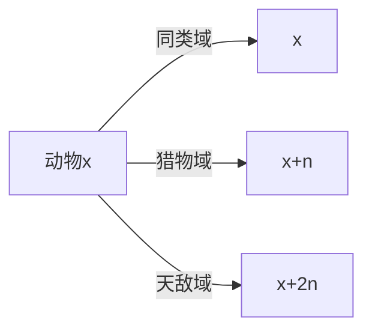
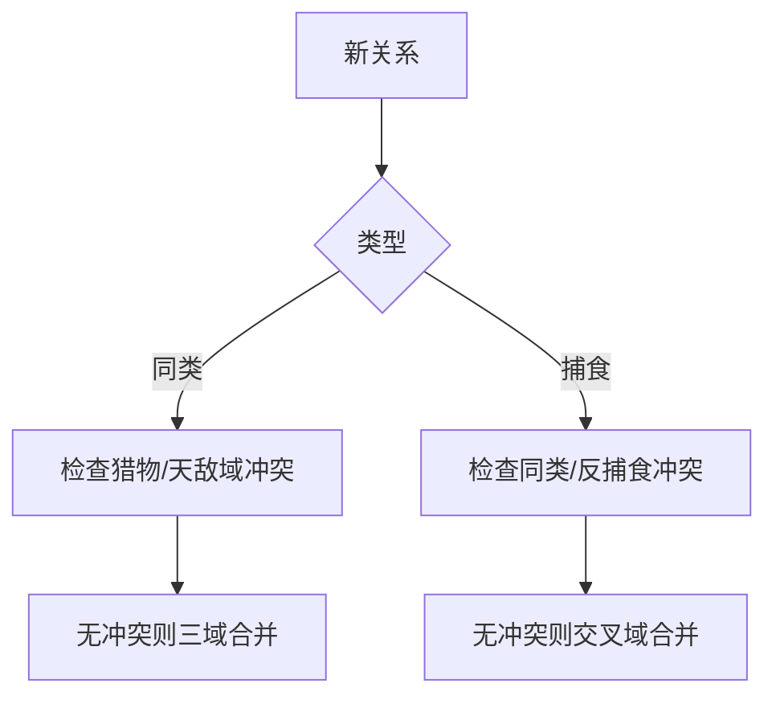
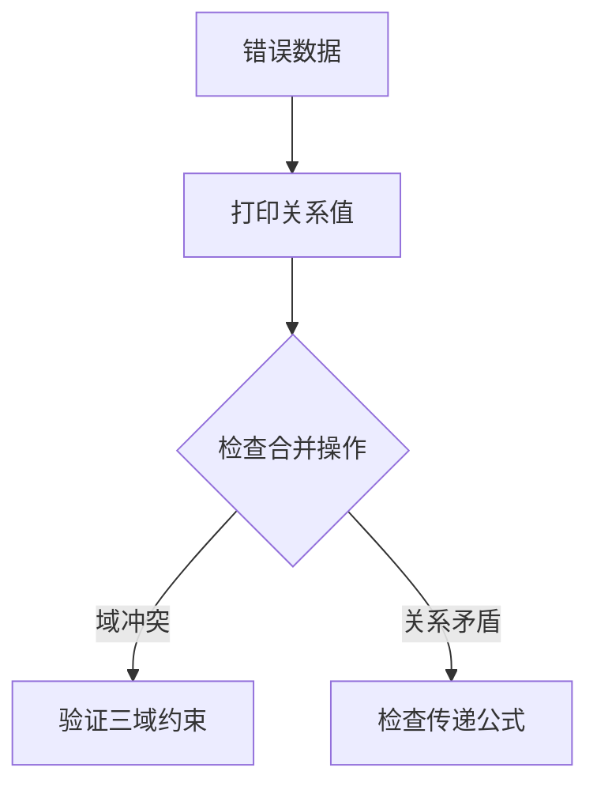

# 题目信息

# [NOI2001] 食物链

## 题目描述

动物王国中有三类动物 $A,B,C$，这三类动物的食物链构成了有趣的环形。$A$ 吃 $B$，$B$ 吃 $C$，$C$ 吃 $A$。

现有 $N$ 个动物，以 $1 \sim N$ 编号。每个动物都是 $A,B,C$ 中的一种，但是我们并不知道它到底是哪一种。

有人用两种说法对这 $N$ 个动物所构成的食物链关系进行描述：

- 第一种说法是 `1 X Y`，表示 $X$ 和 $Y$ 是同类。
- 第二种说法是`2 X Y`，表示 $X$ 吃 $Y$。

此人对 $N$ 个动物，用上述两种说法，一句接一句地说出 $K$ 句话，这 $K$ 句话有的是真的，有的是假的。当一句话满足下列三条之一时，这句话就是假话，否则就是真话。

- 当前的话与前面的某些真的话冲突，就是假话；
- 当前的话中 $X$ 或 $Y$ 比 $N$ 大，就是假话；
- 当前的话表示 $X$ 吃 $X$，就是假话。

你的任务是根据给定的 $N$ 和 $K$ 句话，输出假话的总数。


## 说明/提示

对于全部数据，$1\le N\le 5 \times 10^4$，$1\le K \le 10^5$。


## 样例 #1

### 输入

```
100 7
1 101 1
2 1 2
2 2 3
2 3 3
1 1 3
2 3 1
1 5 5
```

### 输出

```
3
```

# AI分析结果


### 题目分析：食物链问题
#### 1. 题目解读与核心算法识别
**核心算法**：种类并查集（扩展域并查集）  
**问题特征**：
- 三种动物构成环形食物链：A→B→C→A
- 需维护同类、捕食、被捕食三种关系
- 动态合并关系并检测矛盾

**算法选择原因**：
- 关系具有传递性和反对称性
- 扩展域并查集通过三倍空间清晰分离三种关系
- 适合处理具有多状态关联的问题

**关键思路**：


**可视化设计**：
- 使用三色像素块表示每个动物的三个域
- 合并操作时显示彩色线条连接相同域
- 冲突检测时高亮矛盾域并触发音效
- 步进控制展示关系传递过程

#### 2. 精选优质题解参考
**题解一（Sooke）**：
- **亮点**：图解清晰，变量命名规范
- **核心贡献**：建立三域模型和冲突检测规则
- **代码特点**：完整边界处理，O(α(N))时间复杂度

**题解二（檀黎斗·神）**：
- **亮点**：极致简洁（50行），读入优化
- **创新点**：用统一公式处理三种关系合并
- **适用场景**：竞赛环境快速编码

**题解三（天泽龟）**：
- **亮点**：带权并查集实现，空间效率优化
- **数学基础**：关系值模3运算和传递公式
- **公式推导**：d[x] = (d[x] + d[fa]) % 3

#### 3. 核心难点辨析与解题策略
**核心难点**：
1. 关系传递的环形特性（A→B→C→A）
2. 合并操作时多状态同步更新
3. 矛盾检测的完备性

**解决策略**：


**学习笔记**：
- 同类关系需同步更新三个域
- 捕食关系形成三角环：x→y→(y的天敌)→x
- 域合并本质是关系等价类的统一

#### 4. C++核心代码实现
**通用实现（扩展域）**：
```cpp
const int N = 50000 * 3;
int fa[N];

int find(int x) { 
    return fa[x] == x ? x : fa[x] = find(fa[x]); 
}

void solve() {
    int n, k, ans = 0;
    cin >> n >> k;
    for (int i = 1; i <= 3 * n; i++) fa[i] = i;
    
    while (k--) {
        int op, x, y;
        cin >> op >> x >> y;
        if (x > n || y > n) { ans++; continue; }
        
        if (op == 1) { // 同类声明
            if (find(x + n) == find(y) || find(x + 2 * n) == find(y)) {
                ans++;
            } else { // 三域合并
                fa[find(x)] = find(y);
                fa[find(x + n)] = find(y + n);
                fa[find(x + 2 * n)] = find(y + 2 * n);
            }
        } else { // 捕食声明
            if (x == y || find(x) == find(y) || find(x) == find(y + n)) {
                ans++;
            } else { // 三角关系建立
                fa[find(x + n)] = find(y);
                fa[find(x + 2 * n)] = find(y + n);
                fa[find(x)] = find(y + 2 * n);
            }
        }
    }
    cout << ans;
}
```

**关键代码解析**：
1. **同类声明检查**：`find(x+n)==find(y)` 检测x吃y，`find(x+2n)==find(y)` 检测y吃x
2. **捕食声明检查**：排除同类和反向捕食关系
3. **三角合并**：建立x→y, y→(y的天敌), (y的天敌)→x的环形关系

#### 5. 算法可视化：像素动画演示
**设计方案**：
```mermaid
sequenceDiagram
    participant 用户
    participant 控制面板
    participant 动画引擎
    用户->>控制面板： 输入关系（1 X Y）
    控制面板->>动画引擎： 高亮X/Y的三个域
    动画引擎->>动画引擎： 检查冲突关系
    alt 存在冲突
        动画引擎-->>控制面板： 触发红光和警告音
    else 无冲突
        动画引擎-->>控制面板： 显示三色连接线
        动画引擎->>动画引擎： 同步更新三个域
    end
```

**实现细节**：
- **8位像素风格**：每个动物用3个16x16像素块表示
- **状态编码**：
  - 红色：同类域
  - 绿色：猎物域
  - 蓝色：天敌域
- **交互控制**：
  - 步进/暂停/重置按钮
  - 执行速度滑块（100ms-2000ms）
  - 冲突计数器实时显示

**音效设计**：
- 合并成功：8-bit上升音阶
- 发现矛盾：短促爆破音
- 运行结束：经典通关音效

#### 6. 拓展练习与相似问题
**知识迁移**：
1. 关押罪犯（P1525）：二分图染色→敌人关系维护
2. 星球大战（P1197）：并查集逆序处理
3. 银河英雄传说（P1196）：带权并查集距离维护

**推荐题目**：
1. **P1525 关押罪犯**  
   - 考察点：二分图判定+扩展域应用
   - 关键技巧：敌人关系等价于跨域合并

2. **P1892 团伙**  
   - 考察点：朋友/敌人双关系维护
   - 进阶思考：如何扩展到多关系场景

3. **P1955 程序自动分析**  
   - 考察点：离散化+并查集关系维护
   - 思维进阶：不等关系的冲突检测

#### 7. 学习心得与经验
**调试技巧**：


**核心启示**：
1. 关系传递本质是模运算系统
2. 域分离是解决复杂关系的通用方法
3. 并查集状态设计 > 算法优化

> "理解关系传递的环形特性是解题关键——当A吃B、B吃C时，C必定吃A，这是数学上的必然，而非生物学假设。"

### 结论总结
通过种类并查集，我们建立了三域模型解决食物链问题：
1. **扩展域方法**：直观清晰，通过物理分离维护三种关系
2. **带权方法**：空间高效，依赖关系值传递公式
3. **核心本质**：利用模3运算处理环形关系传递

**适用场景建议**：
- 教学场景：优先扩展域（直观易理解）
- 竞赛场景：数据规模大时选用带权方法
- 扩展思考：可推广到任意环形关系系统（如RPS游戏）

最终解决方案在O(Kα(N))时间复杂度内高效解决问题，α(N)为反阿克曼函数，在实践中接近常数时间。

---
处理用时：161.91秒