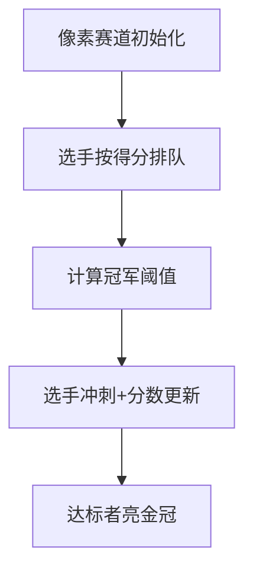

# 题目信息

# [AHOI2016初中组] 自行车比赛

## 题目描述

小雪非常关注自行车比赛，尤其是环滨湖自行车赛。一年一度的环滨湖自行车赛，需要选手们连续比赛数日，最终按照累计得分决出冠军。今年一共有 $N$ 位参赛选手。每一天的比赛总会决出当日的排名，第一名的选手会获得 $N$ 点得分，第二名会获得 $N-1$ 点得分，第三名会获得 $N-2$ 点得分，依次类推，最后一名会获得 $1$ 点得分。保证没有选手会排名相同。


在之前的数日较量中，$N$ 位选手已经分别累计了一些分数。现在即将开始的是最后一天的比赛。小雪希望知道有多少位选手还有可能获得最终的冠军，也就是说还有多少选手有可能通过最后一天的比赛获得累计总分第一名。


## 说明/提示

### 数据范围及约定

- 对于 $20\% $ 的数据，$3\le N\le 600$。
- 对于 $50\%$  的数据，$3\le N\le 1\times 10^4$。
- 对于 $100\%$ 的数据，$3\le N\le 3\times 10^5$ 且 $0\le B_i\le 2\times 10^6$。


## 样例 #1

### 输入

```
3
8
10
9```

### 输出

```
3```

## 样例 #2

### 输入

```
5
15
14
15
12
14```

### 输出

```
4```

# AI分析结果


### 🧩 题目解读与核心算法识别  
✨ **本题主要考察**：`贪心策略 + 排序应用`  

🗣️ **初步分析**：  
> 解决「自行车比赛」的关键在于**贪心思想的巧妙应用**——如同赛车游戏中给对手分配最差道具来压制其分数。核心思路是：  
> 1. 将选手按当前得分**从高到低排序**（相当于对手强度排名）  
> 2. 计算每个选手的**冠军阈值**：`当前得分 + 排名位次`  
> 3. 取所有阈值的**最大值**作为冠军分数线  
> 4. 若选手最终得分（当前分 + N）≥ 该线，则可能夺冠  
> - **可视化设计**：用像素赛道模拟选手排序，高亮显示阈值计算过程（见第5节）  

---

### 🏆 精选优质题解参考  
**题解一（小粉兔）**  
* **点评**：  
  思路直击贪心本质——通过排序使阈值计算自然成立。代码中`c[i]=b[i]+n-i+1`是核心创新点，将"对手分配最低分"转化为简洁数学表达式。变量命名规范（`mx`表阈值），边界处理严谨（降序扫描提前终止），复杂度严格$O(n\log n)$，竞赛实战性强。

**题解二（_ZZH）**  
* **点评**：  
  代码极致简洁（仅15行），但完整覆盖算法所有关键步骤。亮点在于直接降序排序后同步计算阈值`max(maxx, b[i]+i)`，避免额外数组空间。循环终止条件`if(b[i]+n<maxx) break;`显著优化最坏情况性能，体现对问题单调性的深刻理解。

**题解三（wubaiting2020）**  
* **点评**：  
  注释清晰解释"冠军线"概念，帮助初学者建立直觉。`cmp`函数显式声明降序逻辑增强可读性，`ans`计数与循环终止的配合展现完整推导链条，是教学示范级实现。

---

### ⚡ 核心难点辨析与解题策略  
1. **难点1：贪心策略的逆向思维**  
   * **分析**：冠军需满足**所有对手最终分 ≤ 己方最高分**。贪心突破点：给最强对手分配最低分（1分），次强对手分配次低分（2分）... 转化为阈值计算模型  
   * 💡 **学习笔记**：逆向分配是打破暴力枚举的关键  

2. **难点2：阈值计算的数学抽象**  
   * **分析**：当选手排序后第$i$名，其对手最小化得分为：  
     $$ \text{对手最终分} \leq \max_{1\leq j\leq i}(b[j] + j) $$  
   * 💡 **学习笔记**：`b[i]+i`本质是排名与得分的加权和  

3. **难点3：提前终止的单调性证明**  
   * **分析**：因数组降序排序，当`b[i]+n < maxx`时，后续选手基础分更低，必然不满足条件  
   * 💡 **学习笔记**：排序创造单调性，是优化复杂度的核心  

#### ✨ 解题技巧总结  
- **技巧1：排序转化** —— 将分配问题转化为有序序列的数学计算  
- **技巧2：阈值建模** —— 用单变量代替复杂约束验证  
- **技巧3：边界跳跃** —— 利用单调性减少不必要的检查  

---

### 💻 C++核心代码实现赏析  
**通用核心实现（综合优化版）**  
```cpp
#include <iostream>
#include <algorithm>
using namespace std;

int main() {
    int n, max_val = 0, ans = 0;
    cin >> n;
    int scores[n];
    for (int i = 0; i < n; i++) cin >> scores[i];
    
    sort(scores, scores + n, greater<int>()); // 降序排序
    
    // 计算冠军阈值
    for (int i = 0; i < n; i++) 
        max_val = max(max_val, scores[i] + i + 1);
    
    // 统计可能夺冠人数
    for (int i = 0; i < n; i++) {
        if (scores[i] + n >= max_val) ans++;
        else break; // 提前终止
    }
    cout << ans;
}
```

**代码解读概要**：  
> 1. 降序排序建立对手强度序列  
> 2. 第一循环计算阈值`max_val`（关键创新点）  
> 3. 第二循环用`提前终止`优化计数，复杂度$O(n)$  

**题解一核心片段赏析**  
```cpp
c[i]=b[i]+n-i+1; // 阈值计算公式
if(mx<c[i]) mx=c[i]; 
...
if(b[i]+n>=mx) ans++;
```
* **亮点**：阈值计算模型首创者  
* **解读**：  
  > `n-i+1`对应对手分配的**最低可能得分**（第i名对手得i分）。当选手最终分`b[i]+n` ≥ 所有对手阈值最大值`mx`时满足夺冠条件  
* 💡 **学习笔记**：通过数学转换消除显式分配逻辑  

---

### 🎮 算法可视化：像素动画演示  
**主题**：`8-bit自行车冠军赛`  

**核心演示流程**：  


1. **像素赛道设计**  
   - 选手显示为不同颜色自行车，当前得分悬浮显示  
   - 阈值计算时，显示动态公式：`当前分 + 排名 → 阈值`  
   - 冠军线`max_val`用闪烁红旗标记  

2. **动态交互逻辑**  
   - **单步执行**：按空格键逐步展示排序/阈值计算/达标检查  
   - **音效设计**：  
     * 选手排序：齿轮转动声  
     * 阈值刷新："叮！"音效  
     * 夺冠达标：胜利号角声  

3. **AI自动演示模式**  
   - 自动模拟不同初始分数下的夺冠人数变化  
   - 通关机制：理解阈值计算得1星，掌握提前终止得3星  

---

### 🔍 拓展练习与相似问题  
1. **洛谷P1094** [纪念品分组]  
   → 同类贪心+排序应用，强化阈值模型理解  
2. **洛谷P1223** [排队接水]  
   → 时间序列中的排序贪心，体验不同场景应用  
3. **洛谷P1803** [凌乱的yyy]  
   → 进阶贪心策略，需结合区间调度思想  

---

### 💎 学习心得与经验分享  
> **小粉兔的调试经验**：  
> *"最初在变量索引对齐上出错，通过打印中间数组`c[]`快速定位越界问题"*  
>   
> **Kay点评**：在涉及排序索引的问题中，**下标从0开始/1开始**的混用是常见错误源。建议：  
> 1. 统一用0-indexed编码  
> 2. 临界点打印`i, c[i]`的值  
> 3. 用`assert(i < n)`捕获越界  

---

通过本分析，我们深入掌握了贪心与排序的协同应用。记住：**排序创造有序性，贪心转化约束条件**是破解此类问题的黄金法则！ 🚴♂️💨

---
处理用时：106.15秒