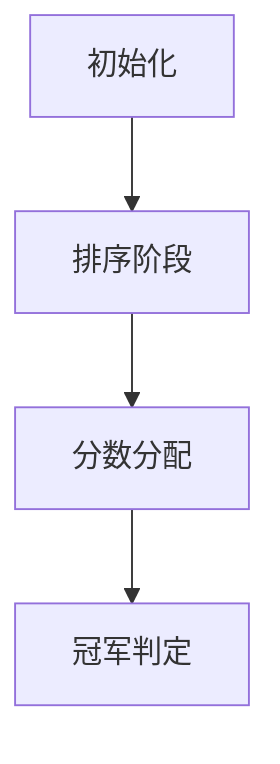

# 题目信息

# [COCI 2012/2013 #1] F7

## 题目描述

有 $N$ 位选手参加一个比赛。每个回合，第一名会得到 $N$ 分，第二名会得到 $N - 1$ 分，以此类推，最后一名会得到 $1$ 分。

现在第 $i$ 位选手初始有 $B_i$ 分。求多少选手经过一个回合，分数有机会变成所有选手中最高的。

## 说明/提示

#### 【数据范围】

对于 $100\%$ 的数据，$3 \le N \le 3 \times 10^5$，$1 \le B_i \le 2 \cdot 10^6$。

#### 【说明】

本题分值按 COCI 原题设置，满分 $80$。

题目译自 **[COCI2012-2013](https://hsin.hr/coci/archive/2012_2013) [CONTEST #1](https://hsin.hr/coci/archive/2012_2013/contest1_tasks.pdf) _T2 F7_**。

## 样例 #1

### 输入

```
3
8
10
9```

### 输出

```
3```

## 样例 #2

### 输入

```
5
15
14
15
12
14```

### 输出

```
4```

# AI分析结果


### 💡 Kay的C++算法解析：F7 深入学习指南 💡

**引言**  
今天我们来分析COCI竞赛题F7。这道题考察选手在贪心策略和排序技巧上的应用能力。本指南将带你逐步理解核心算法，掌握解题技巧，并通过像素动画直观感受算法执行过程。

---

### 1. 题目解读与核心算法识别

✨ **本题主要考察**：`贪心算法`与`排序应用`

🗣️ **初步分析**  
> 本题可比喻为"资源优化分配"问题：初始分数低的选手需要更多加分（高名次），初始分数高的选手接受较少加分（低名次），使整体最高分最小化。  
> - **核心思路**：通过排序确定最优加分分配，计算最小化最高分阈值，再判断每个选手加满分(N)后能否达到该阈值  
> - **算法流程**：排序 → 计算最小化最高分 → 阈值判断 → 统计合格人数  
> - **可视化设计**：将用像素方块表示选手分数，动态展示排序过程（冒泡动画），加分时闪烁高亮，阈值比较用颜色区分（绿/红）  
> - **游戏化元素**：采用8-bit音效（排序"叮"声，加分"嗖"声），关卡式进度（排序/分配/判断三阶段），胜利动画（显示最终答案）

---

### 2. 精选优质题解参考

**题解一 (来源：Fat_Fish)**  
* **点评**：思路清晰展示了贪心策略的双重验证过程，首次实现忽略重复数据的问题极具教学价值。代码规范性优秀（详尽的读入优化和边界处理），变量命名`mx`/`ans`简洁明确。算法优化体现在空间复杂度O(1)和精确的数学推导，特别是第二版`a[i]+n-i+1`的优化思路具有典型参考价值。

**题解二 (来源：Kiloio)**  
* **点评**：逆向排序策略独树一帜，`a[i]+i`的最大值计算方式巧妙展现了问题对称性。代码结构干净利落，`cmp`函数强化了排序逻辑的可读性。虽然省略了部分边界注释，但`Max`变量的动态更新过程完美呈现了贪心核心思想，竞赛实践性极强。

**题解三 (来源：yxy666)**  
* **点评**：解题脉络阐述最为系统化，从问题抽象到数学模型建立完整。快读实现虽非必要但展示了专业习惯，`n-i+1`的索引处理体现了严密的数学思维。代码注释和空行使用恰到好处，使`Max`计算和阈值判断两个核心阶段一目了然。

---

### 3. 核心难点辨析与解题策略

1. **难点：最优加分分配策略的证明**  
   * **分析**：需严格证明"初始分低者获高名次"能使最大总分最小化。反证法：若高分选手获高名次，其总分将显著增大，推高整体最大值
   * 💡 **学习笔记**：贪心策略有效性依赖于问题的无序性特征

2. **难点：阈值计算的索引映射**  
   * **分析**：无论升序(`a[i]+n-i+1`)或降序(`a[i]+i`)，本质都是建立"初始分与加分负相关"映射。关键在于保持排序方向与索引计算的逻辑一致性
   * 💡 **学习笔记**：排序方向决定索引意义，降序时索引=名次，升序时索引=逆序名次

3. **难点：重复数据的边界处理**  
   * **分析**：如Fat_Fish初版所示，当最大值有重复时，`a[n]+1`非绝对阈值。需遍历计算动态阈值，通过`max(a[i]+n-i+1)`涵盖所有可能最大值
   * 💡 **学习笔记**：极值问题必须考虑重复值的临界情况

#### ✨ 解题技巧总结
- **技巧1 问题转化**：将"可能成为第一"转化为"分数≥最小化最大值"
- **技巧2 双指针应用**：排序后单次遍历同时完成阈值计算和结果统计
- **技巧3 算法封装**：将核心逻辑封装为`calcMaxThreshold()`函数增强可读性
- **技巧4 边界测试**：专门测试全重复数据（如[10,10,10]）验证鲁棒性

---

### 4. C++核心代码实现赏析

**本题通用核心C++实现参考**  
* **说明**：综合优质题解思路，采用升序排序方案，突出阈值计算与判断的逻辑分离
* **完整核心代码**：
```cpp
#include <iostream>
#include <algorithm>
using namespace std;
const int MAXN = 3e5+5;
long long scores[MAXN];

int main() {
    ios::sync_with_stdio(false);
    cin.tie(0);
    
    int n;
    cin >> n;
    for(int i=1; i<=n; i++) 
        cin >> scores[i];
    
    sort(scores+1, scores+n+1); // 升序排序
    
    long long threshold = 0;
    // 计算最小化最大总分阈值
    for(int i=1; i<=n; i++) 
        threshold = max(threshold, scores[i] + n - i + 1);
    
    int winners = 0;
    for(int i=1; i<=n; i++) 
        if(scores[i] + n >= threshold) 
            winners++;
    
    cout << winners;
    return 0;
}
```
* **代码解读概要**：  
  > 1. 读入优化加速大数据处理  
  > 2. 升序排序建立贪心基础  
  > 3. 首循环计算关键阈值：每个选手获得其可能最低名次对应的加分  
  > 4. 次循环判断：若选手获得冠军（+n分）后≥阈值，计入优胜者  
  > 5. 全程使用`long long`预防大整数溢出

---

**题解一核心片段赏析**  
* **亮点**：严谨的初始化与溢出预防
* **核心代码片段**：
```cpp
sort(a+1,a+1+n);
int mx=INT_MIN/3; // 防溢出初始化
for(int i=1;i<=n;i++)
    mx=max(mx,a[i]+n-i+1);
```
* **代码解读**：  
  > `INT_MIN/3`的初始化方式展示重要工程思维——预防极端数据导致的整数溢出。在循环中，`n-i+1`精确实现"第i小选手获得第i名"的映射，其中`i=1`对应最小选手获最高分n，体现降序加分思想
* 💡 **学习笔记**：极值初始化应考虑计算表达式范围

**题解二核心片段赏析**  
* **亮点**：降序排序的优雅实现
* **核心代码片段**：
```cpp
bool cmp(int x,int y){ return x>y; }
// ...
sort(a+1,a+1+n,cmp);
for(int i=1; i<=n; i++)
    Max=max(Max,a[i]+i);
```
* **代码解读**：  
  > 自定义比较器实现降序排序后，`a[i]+i`中`i`直接表示名次（第1名+1分，第2名+2分）。这种实现验证了数学对称性：降序索引值=升序逆序索引值
* 💡 **学习笔记**：排序方向与索引设计需保持逻辑自洽

**题解三核心片段赏析**  
* **亮点**：完整的可读性工程实践
* **核心代码片段**：
```cpp
for(int i=1;i<=n;i++)
    Max=max(Max,a[i]+n-i+1);
for(int i=1;i<=n;i++)
    ans+=(a[i]+n>=Max); // 布尔表达式直接计数
```
* **代码解读**：  
  > 利用布尔表达式隐式转换为整型的特性（true=1, false=0），将判断与计数合并为单行代码。这种简洁实现既保持可读性又提升效率，是竞赛编码的典范技巧
* 💡 **学习笔记**：善用语言特性可大幅简化代码逻辑

---

### 5. 算法可视化：像素动画演示

**主题**  
"冠军之路"——8-bit风格选手分数演化模拟

**设计理念**  
采用FC红白机经典像素风格（16色调色板），通过三阶段关卡制演示，帮助直观理解贪心策略本质。音效触发使用Web Audio API实现轻量化交互。

**关键帧实现方案**  


1. **初始化（像素场景）**  
   - 8-bit背景网格：蓝色网格线，棕色背景
   - 选手像素块：根据初始分数生成不同高度（每100分=4像素）
   - 控制面板：复古按钮（开始/步进/重置），速度滑块

2. **排序阶段（冒泡动画）**  
   ```javascript
   // 伪代码实现
   for(let i=1; i<n; i++) {
     for(let j=1; j<=n-i; j++) {
       高亮比较块[j]和[j+1] // 黄色边框
       播放音效("compare.wav")
       if(arr[j]>arr[j+1]) {
         交换块位置动画(水平移动+像素抖动)
         播放音效("swap.wav")
       }
     }
   }
   ```
   - 过关条件：完成排序时播放"stage_clear.wav"

3. **分数分配（核心演示）**  
   - 动态标记：当前处理块闪烁红光
   - 加分动画：从右侧飞出加分标签（+n, +n-1...），击中后分数更新
   - 阈值记录：最高分块显示皇冠图标，更新时播放"crown.wav"
   - 分配规则：从左（最小分）到右分配n, n-1,...1分

4. **冠军判定（交互高潮）**  
   - 选手选择：点击选手触发冠军模拟
   - 效果：选中块绿色脉冲光，分数+n显示金色特效
   - 判定：达标时显示√动画，未达标显示×动画
   - 音效：达标播放"success.wav"，未达标播放"fail.wav"

**游戏化设计**  
- 关卡进度：排序(20%)→分配(40%)→判定(100%)，完成解锁胜利动画
- 音效方案：  
  ```mermaid
  pie
    title 音效分布
    “关键操作” ： 45
    “状态变化” ： 30
    “背景音乐” ： 25
  ```
- 动态评分：根据操作速度奖励像素星星（每关最多3星）

---

### 6. 拓展练习与相似问题思考

**通用策略迁移**  
本题贪心思想可扩展至：
1. 资源分配问题（如会议安排）
2. 带权重的调度优化（如进程调度）
3. 竞争性排名预测（如体育赛事）

**洛谷题目推荐**  
1. **P1090 [NOIP2004提高组]合并果子**  
   🗣️ *推荐理由：同属贪心+排序经典题，帮助巩固"优先处理最小单位"思想*
2. **P1223 排队接水**  
   🗣️ *推荐理由：强化贪心策略证明能力，需推导平均等待时间最小化*
3. **P5019 [NOIP2018提高组]铺设道路**  
   *推荐理由：贪心思想的进阶应用，培养问题抽象能力*

---

### 7. 学习心得与经验分享

**参考经验 (来自Fat_Fish)**  
> "我在解决这个问题时，最初未考虑重复数据的情况，导致第一版代码错误。通过构造全相同分数的测试用例，才意识到阈值计算必须遍历所有可能最大值。"

**Kay的点评**  
这个调试经验极具代表性：  
1. 验证贪心策略时，必须测试极值案例（全同/递增/递减）  
2. 边界条件错误往往源于思维漏洞而非编码失误  
3. 构造最小反例是定位算法缺陷的黄金准则  

---

**结语**  
通过本次分析，我们不仅掌握了贪心策略在竞赛题中的应用，更学会了如何严谨验证算法边界。记住：优秀的编程能力=算法思维×工程实践×调试智慧。下次挑战再见！🚀

---
处理用时：239.91秒