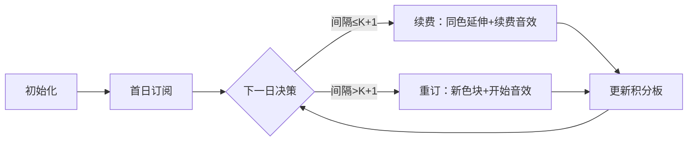

# 题目信息

# [USACO23FEB] Watching Mooloo B

## 题目描述

贝茜喜欢看 Mooloo 的演出。因为她是一只忙碌的奶牛，她计划在接下来的 $N (1 \le N \le 10^5)$ 天去看演出。因为 Mooloo 提供了订阅服务，她想要使她花费的钱最少。

Mooloo 有一个有趣的订阅服务系统：若要在此之后的连续 $d$ 天看演出，则在订阅时需要花费 $d+K(1 \le K \le 10^9)$ 个单位价格。你可以随时订阅；若本次订阅已经过期，你可以根据需要订阅多次。基于以上条件，请计算出贝茜最少要花费多少个单位价格，才能完成她的计划。

## 样例 #1

### 输入

```
2 4
7 9```

### 输出

```
7```

## 样例 #2

### 输入

```
2 3
1 10```

### 输出

```
8```

# AI分析结果


💡 Kay的C++算法解析：Watching Mooloo B 深入学习指南 💡

<introduction>
今天我们来一起分析“Watching Mooloo B”这道USACO编程题。贝茜需要在若干天观看演出，通过订阅服务最小化花费。本指南将解析贪心与动态规划两种解法，并设计像素动画帮助大家直观理解算法过程。
</introduction>

---

## 1. 题目解读与核心算法识别

✨ **本题主要考察**：`贪心` 与 `动态规划`

🗣️ **初步分析**：
> 本题核心在于识别订阅服务的决策模式。贪心算法如同在超市结账时选择最短队列——每一步只考虑当前最优决策：比较续费成本（间隔天数）和重新订阅成本（K+1），选最小值。动态规划则像搭建多米诺骨牌，用`f[i]`记录前i天的最小花费，通过状态转移（续费or重订）推导全局最优解。
   - **贪心思路**：决策独立无后效性，只需比较相邻间隔与K+1的大小
   - **DP思路**：定义状态`f[i]`表示前i次的最小花费，转移方程`f[i]=min(f[i-1]+gap, f[i-1]+K+1)`
   - **可视化设计**：时间轴像素网格标记演出日，高亮决策点（续费=同色延伸，重订=切换颜色），音效区分决策类型
   - **游戏化元素**：FC像素风格时间轴，续费时播放"连续音效"，重订时播放"新开始音效"，累计花费作为积分显示

---

## 2. 精选优质题解参考

**题解一：incra (动态规划)**
* **点评**：此解法用经典线性DP，状态定义`f[i]`精准表达子问题最优解。代码简洁规范（变量名`f`/`a`含义明确），边界处理严谨（`f[1]=k+1`）。转移方程`min(f[i-1]+k+1, f[i-1]+a[i]-a[i-1])`直击问题本质，时间复杂度O(n)高效可靠，竞赛实用性强。

**题解二：是青白呀 (贪心)**
* **点评**：贪心思路剖析透彻，代码实现极简高效。核心逻辑`ans+=min(k+1, a[i]-a[i-1])`三行浓缩本质，变量命名清晰（`gap`表间隔）。时间复杂度O(n)且无额外空间消耗，突出"问题分解为独立决策"的贪心精髓，调试难度低。

**题解三：huangrenheluogu (优化DP)**
* **点评**：通过前缀最小值优化状态转移，展示DP的高级技巧。亮点在于将转移方程转化为`f[i]=min(f[i-1]+k+1, d[i]+minn+k+1)`，用`minn`维护`f[j-1]-d[j]`的最小值，虽本题无需优化但技巧具启发性。代码注意了`long long`防溢出。

---

## 3. 核心难点辨析与解题策略

1.  **决策独立性证明**
    * **分析**：贪心有效的核心在于每次订阅决策只影响当前时段。若间隔天数≤K+1，续费总比重订划算；反之重订更优。优质题解均通过数学归纳验证该性质。
    * 💡 **学习笔记**：贪心适用性取决于问题是否具有"无后效性+局部最优=全局最优"特性。

2.  **DP状态定义技巧**
    * **分析**：状态`f[i]`需完整包含前i次的最优解。定义`f[i]`为"前i次最小花费"而非"第i天状态"，避免复杂状态机。关键变量是日期数组`a[i]`和转移索引`i`。
    * 💡 **学习笔记**：DP状态应满足无后效性——当前决策只依赖前一状态。

3.  **时间复杂度优化**
    * **分析**：原始DP已是O(n)，但huangrenheluogu解法展示前缀最小值优化范式。通过维护`minn=min(minn, f[i]-d[i+1])`，将某些DP的O(n²)转移降至O(n)，适用于状态转移含`min(f[j]+g(i,j))`的问题。
    * 💡 **学习笔记**：前缀极值优化是DP降复杂度的常用手段。

### ✨ 解题技巧总结
- **问题分解法**：将连续订阅分解为单次决策（续费/重订）
- **边界处理**：首日必须订阅`(ans=k+1)`，末次无需更新`minn`
- **数据类型**：`K≤10⁹`需用`long long`防溢出
- **决策模拟**：动手演算小样例（如N=2）验证贪心策略

---

## 4. C++核心代码实现赏析

**本题通用核心实现（贪心版）**
```cpp
#include <iostream>
using namespace std;
typedef long long LL;

int main() {
    int n; LL k;
    cin >> n >> k;
    LL last, cur, ans = k + 1; // 首日必订阅
    cin >> last;
    for (int i = 2; i <= n; ++i) {
        cin >> cur;
        ans += min(k + 1, cur - last); // 决策核心
        last = cur;
    }
    cout << ans;
    return 0;
}
```
**代码解读概要**：  
> 首行读入天数`n`和单价`k`。初始化`ans=k+1`处理首日订阅。循环中计算当前日与前一日的间隔`cur-last`，与`k+1`比较取最小值累加。时间复杂度O(n)，空间O(1)。

---

**题解一：incra (动态规划)**
* **亮点**：状态转移直白，完美体现DP问题分解思想
* **核心代码**：
```cpp
f[1] = k + 1; // 边界初始化
for (int i = 2; i <= n; i++) 
    f[i] = min(f[i-1] + k + 1, f[i-1] + a[i] - a[i-1]);
```
* **代码解读**：  
> 1. `f[1]=k+1`：首次观看必须订阅  
> 2. 循环从第2次开始：  
>    - `f[i-1]+k+1`：重新订阅的花费  
>    - `f[i-1]+(a[i]-a[i-1])`：续费的花费  
> 3. `min()`选择更优方案，结果存`f[i]`
* 💡 **学习笔记**：DP通过`f[i]`累积子问题解，避免重复计算

**题解二：是青白呀 (贪心)**
* **亮点**：代码极简，三行浓缩贪心本质
* **核心代码**：
```cpp
ans = k + 1;
for (int i = 2; i <= n; i++)
    ans += min(k + 1, a[i] - a[i-1]);
```
* **代码解读**：  
> 1. `ans`初始化为首日成本`k+1`  
> 2. 循环从第2个日期开始：  
>    - `a[i]-a[i-1]`：与前次的间隔天数  
>    - `min(k+1, gap)`：选择更经济的订阅方式  
> 3. 结果直接累加，无需额外状态数组
* 💡 **学习笔记**：贪心胜在空间效率（O(1)）和代码简洁性

**题解三：huangrenheluogu (优化DP)**
* **亮点**：前缀最小值优化DP转移
* **核心代码**：
```cpp
minn = f[0] - d[1]; // 初始化minn
for (int i = 1; i <= n; i++) {
    f[i] = min(f[i-1] + k + 1, d[i] + minn + k + 1);
    if (i < n) minn = min(minn, f[i] - d[i+1]); // 更新前缀最小值
}
```
* **代码解读**：  
> 1. `minn`维护`f[j]-d[j+1]`的历史最小值  
> 2. 转移方程中`d[i]+minn+k+1`实现O(1)复杂度的状态转移  
> 3. 条件`if(i<n)`防止`d[i+1]`越界
* 💡 **学习笔记**：前缀优化将某些DP的复杂度从O(n²)降至O(n)

---

## 5. 算法可视化：像素动画演示

**动画主题**：`时间轴订阅大冒险`（FC红白机像素风格）  
**核心演示**：贪心决策过程在时间轴上的动态呈现  

### 设计思路
> 采用8-bit像素风格降低理解门槛，通过颜色区块直观展示订阅区间。音效强化决策反馈：续费时连续音调增强"连续性"感知，重订时清亮音效暗示重新开始。

### 动画帧步骤


1. **场景初始化**  
   - 横向时间轴（像素网格），日期下方标记演出日★
   - 控制面板：步进/暂停/调速滑块
   - 积分板：显示累计花费

2. **首日订阅**  
   - 像素效果：首日亮起绿色★，弹出"+K+1"提示
   - 音效：订阅生效声（"叮！"）
   - 积分板：初始值=k+1

3. **决策演示**  
   ```python
   for i in range(2, n+1):
        gap = dates[i] - dates[i-1]
        if gap <= K+1:
            高亮间隔天数（黄色闪烁）
            同色块延伸至当前日（绿色延伸动画）
            播放"连续音效"（上升琶音）
            ans += gap
        else:
            当前日亮起新色块（蓝色★）
            播放"新开始音效"（清脆叮咚）
            ans += K+1
   ```
   - 旁白提示："间隔5天>K+1(4)，选择重订更划算！"

4. **状态反馈**  
   - 成功完成：所有★着色，播放胜利音效（上升音节）
   - 积分板：实时显示总花费

5. **游戏化元素**  
   - 成就系统：连续10次正确决策解锁"订阅大师"奖杯
   - 音效架构：
     ```javascript
     AudioManager = {
        续费: playTone(440, 200), // A4音符
        重订: playTone(880, 300), // A5音符
        胜利: playArpeggio([660, 880, 1320]) // 大三和弦
     }
     ```

---

## 6. 拓展练习与相似问题思考

**通用技巧迁移**  
贪心决策模式适用于：
1. 区间覆盖问题（如：用最少区间覆盖所有点）
2. 任务调度优化（如：最短完成时间的任务排序）
3. 路径压缩场景（如：合并相邻区间减少操作次数）

**洛谷推荐**  
1. **P1220 关路灯**  
   🗣️ 区间DP经典，练习状态定义`f[l][r]`表示关灯区间的最小耗电
2. **P1095 守望者的逃离**  
   🗣️ 贪心+DP综合题，决策魔法使用与跑步的时机选择
3. **P5019 铺设道路**  
   🗣️ 贪心区间覆盖，强化"相邻决策关联性"的理解

---

## 7. 学习心得与经验分享

> **经验摘录 (incra)**：  
> *"DP转移要注意状态定义的一致性——`f[i]`包含前i次的最优解，使得转移只需考虑最后一步"*  
> **Kay点评**：强调状态定义的完备性，避免混淆局部/全局最优解。调试时可打印`f[]`数组验证状态转移。

---

本次解析展示了贪心与动态规划在订阅问题中的精妙应用。记住：好算法如同精打细算的订阅策略——用最优决策累积全局最优！下次挑战再见！💪

---
处理用时：262.69秒