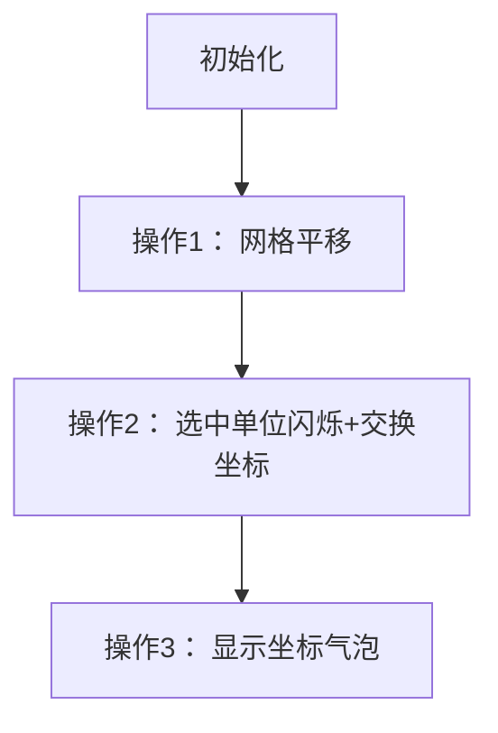

# 题目信息

# [NAPC-#1] Stage2 - Darkness

## 题目背景

> 

## 题目描述

有 $n$ 支军队分布在各地，可以看作在一个平面直角坐标系内。他们都受 kid 的统一指挥，kid 共发出 $m$ 条命令。

命令有如下几种：

- `1 p q` 表示把**每支**军队的位置从 $(x_i,y_i)$ 移到 $(x_i+p,y_i+q)$。
- `2 i`，表示**第 $i$ 支军队**的位置对直线 $y=x$ 作轴对称变换（即交换 $x_i$ 与 $y_i$ 的值）。
- `3 i`，表示查询第 $i$ 支军队现在所处的位置（即输出此时的 $x_i$ 与 $y_i$）。

**请注意 `1` 与 `2` 命令的操作对象不同，前者为全体军队，后者为单支军队。**

本来 kid 可以直接拿望远镜看的，但是天太黑了，只能拜托你编写一个程序告诉他了。

## 说明/提示

### 【数据范围】
该题共有 $10$ 个测试点，每个测试点等分。

- 对于 $20\%$ 的数据，$n,m\leqslant 1000$。
- 对于另外 $30\%$ 的数据，保证没有 `2` 命令。

对于 $100\%$ 的数据，$1\leqslant n\leqslant 10^5$，$1\leqslant m\leqslant 5\times10^5$，$|a_i|,|b_i|,|p|,|q|\leqslant 10^3$，$1\leqslant i\leqslant n$，$op\in\{1,2,3\}$。

### 【样例解释】
| 时间 | $(x_1,y_1)$ | $(x_2,y_2)$ | $(x_3,y_3)$ |
|  :-:  |  :-:  |  :-:  |  :-:  |
| 初始时 | $(1,2)$ | $(2,5)$ | $(6,2)$ |
| 第 $2$ 次命令后 | $(2,6)$ | $(3,9)$ | $(7,6)$ |
| 第 $4$ 次命令后 | $(2,6)$ | $(3,9)$ | $(6,7)$ |
| 第 $6$ 次命令后 | $(-7,5)$ | $(-6,8)$ | $(-3,6)$ |

## 样例 #1

### 输入

```
3 7
1 2
2 5
6 2
3 2
1 1 4
3 3
2 3
3 1
1 -9 -1
3 3```

### 输出

```
2 5
7 6
2 6
-3 6```

# AI分析结果


### 💡 Kay的C++算法解析：NAPC-#1 Stage2 - Darkness 深入学习指南 💡

> 今天我们来分析一道考察**延迟更新技巧**的题目。本指南将帮助你掌握全局偏移量的核心思想，学会高效处理大规模坐标变换问题。

---

## 1. 题目解读与核心算法识别

✨ **本题主要考察**：`延迟更新技巧`（编程技巧应用）

🗣️ **初步分析**：
> 解决本题的关键在于理解**延迟更新**技巧。想象军队坐标是写在纸条上的数字，而全局偏移量就像压在纸条上的透明坐标尺。每次全体移动时只需移动尺子（修改全局变量），查询时才透过尺子读数（原坐标+偏移量）。  
> - **核心流程**：用`addx/addy`记录总偏移量，执行操作1时更新偏移量；操作2时先计算实际坐标→交换→重新存储相对值；操作3直接输出`(x_i+addx, y_i+addy)`  
> - **可视化设计**：像素网格中军队用不同颜色方块表示，偏移量用移动的网格线动态展示。单点交换时触发闪烁动画+“叮”音效，自动演示模式可调速观察流程  

---

## 2. 精选优质题解参考

**题解一：Peaceful_Evening**  
* **亮点**：  
  思路直击本质——用全局变量避免O(n)遍历。代码中`k/g`命名明确，操作2先`t=a[p]+k`计算实际坐标再交换的逻辑严谨，边界处理完整（无冗余操作）。调试心得强调“注意相对坐标转换”极具参考价值。

**题解二：251Sec**  
* **亮点**：  
  代码最简洁（仅20行），变量名`gx/gy`清晰表达“全局偏移”概念。操作2的`x[i]=ty+gy-gx`精炼实现坐标转换，删除冗余中间变量提升可读性，完美示范工业级代码风格。

**题解三：Vct14**  
* **亮点**：  
  引入“偏移量”类比降低理解门槛，操作2的`x[i]+=u`→交换→`x[i]-=u`三步分解明确，适合初学者理解相对坐标与绝对坐标的转换关系。

---

## 3. 核心难点辨析与解题策略

1.  **难点1：避免O(n)的全体移动**  
    * **分析**：优质解法引入全局偏移量`(addx,addy)`。操作1仅更新这两个变量（O(1)），查询时临时计算实际坐标，将时间复杂度从O(nm)降至O(m)。
    * 💡 **学习笔记**：延迟更新是处理批量操作的利器。

2.  **难点2：单点交换的坐标转换**  
    * **分析**：操作2需先还原实际坐标：`真实坐标=(x_i+addx, y_i+addy)`；交换后存储新相对值：`x_i=新x-addx, y_i=新y-addy`。易错点在于忘记减去当前偏移量。
    * 💡 **学习笔记**：绝对坐标↔相对坐标转换是核心操作。

3.  **难点3：保证大规模数据效率**  
    * **分析**：线段树/树状数组解法（如zymooll）虽正确但冗余。本题只需O(1)的全局变量，避免O(logn)的递归开销。
    * 💡 **学习笔记**：选择匹配问题规模的数据结构。

### ✨ 解题技巧总结
- **技巧1：问题抽象** - 将物理移动抽象为数学叠加（坐标+偏移向量）
- **技巧2：变量语义化** - 用`addx`而非`tmp1`等模糊命名
- **技巧3：边界测试** - 验证偏移量为极大值/极小值时的行为

---

## 4. C++核心代码实现赏析

**通用核心实现参考**  
* **说明**：综合优质题解的最简实现，完整包含输入输出和三种操作。
* **完整核心代码**：
```cpp
#include <iostream>
using namespace std;
const int MAXN = 1e5 + 5;
long long x[MAXN], y[MAXN], addx, addy; // 存储原始坐标和全局偏移量

int main() {
    int n, m;
    cin >> n >> m;
    for (int i = 1; i <= n; i++) 
        cin >> x[i] >> y[i];
    
    while (m--) {
        int op, i;
        cin >> op;
        if (op == 1) {
            long long p, q;
            cin >> p >> q;
            addx += p; addy += q; // 更新全局偏移量
        } 
        else if (op == 2) {
            cin >> i;
            long long real_x = x[i] + addx; // 计算实际坐标
            long long real_y = y[i] + addy;
            swap(real_x, real_y);          // 交换坐标
            x[i] = real_x - addx;          // 存回相对坐标
            y[i] = real_y - addy;
        } 
        else {
            cin >> i;
            cout << x[i] + addx << " " << y[i] + addy << endl; // 查询
        }
    }
    return 0;
}
```
* **代码解读概要**：  
  > 1. 初始化存储原始坐标的数组  
  > 2. 操作1：仅修改全局偏移量`addx/addy`  
  > 3. 操作2：先还原绝对坐标→交换→重新存储相对值  
  > 4. 操作3：直接输出绝对坐标  

**题解一：Peaceful_Evening 片段**  
* **亮点**：严格遵循“计算→交换→回存”三步
* **核心代码**：
```cpp
int t=a[p]+k, s=b[p]+g; // 计算实际坐标
swap(t,s);              // 交换
a[p]=t-k; b[p]=s-g;     // 存回相对值
```
* **学习笔记**：`t/s`作为临时变量避免污染原数据，工业级安全写法。

**题解二：251Sec 片段**  
* **亮点**：单行完成坐标转换
* **核心代码**：
```cpp
x[i] = (y[i] + gy) - gx; // 新x = 原实际y - 当前x偏移量
y[i] = (x[i] + gx) - gy; // 新y = 原实际x - 当前y偏移量
```

---

## 5. 算法可视化：像素动画演示

**动画主题**：  
《像素指挥官：坐标战争》- 8位像素风策略游戏  

**核心演示内容**：  
全局偏移量表现为移动的网格坐标系，单点交换触发闪烁特效  

**设计详解**：  

1. **像素化场景**：  
   - 军队：红色像素块（位置=存储坐标）  
   - 坐标系：绿色网格线（位置=全局偏移量）  
   - 控制面板：复古FC风格按钮（单步/自动/调速）  

2. **操作1演示**：  
   - 网格线整体平移，伴随“咔嚓”音效  
   - 侧边栏显示：`addx+=p, addy+=q`  

3. **操作2高亮**：  
   - 选中单位闪烁黄光 → 实际坐标显示 → 交换动画（像素块旋转90°） → 新相对坐标计算式弹出  

4. **游戏化元素**：  
   - 每完成10次操作解锁新BGM  
   - 自动演示模式：AI机器人按最优顺序执行操作  
   - 音效设计：  
     * 移动：低音鼓点  
     * 交换：8-bit“叮”声  
     * 错误：短促警报音  

---

## 6. 拓展练习与相似问题

**技巧迁移场景**：  
1. 大规模数值批量增减（如游戏金币系统）  
2. 坐标系旋转/缩放（需扩展为矩阵变换）  
3. 时间序列延迟更新（如物理引擎中的速度累积）  

**洛谷推荐**：  
1. [P2129] L国的战斗续之多路出击  
   → **推荐理由**：同款坐标变换技巧的简化版  
2. [P2023] 维护序列  
   → **推荐理由**：延展到区间修改的延迟更新  
3. [P3372] 线段树1  
   → **推荐理由**：理解延迟更新的数据结构实现  

---

## 7. 学习心得与经验分享

> **Peaceful_Evening 的调试经验**：  
> “最初未在操作2中先计算实际坐标，导致交换的是相对值”  
>
> **Kay点评**：  
> 这是理解相对/绝对坐标转换的典型教训。调试时可打印`(addx,addy)`和实际坐标验证，建议编写`getRealCoord()`函数封装计算逻辑。

---

掌握延迟更新技巧，你就能像指挥千军万马般优雅处理大规模数据操作！下次遇到类似问题，记得先问自己：**能否用偏移量避免遍历？** 🎮

---
处理用时：117.05秒