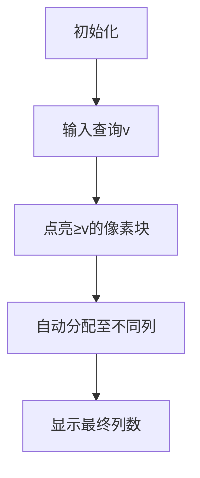

# 题目信息

# 「RiOI-2」weight

## 题目背景

在小树林间坐落着一个幻想的城堡。这里是 E 国的领地，而小 E，则是 E 国之王。

树木，是 E 国抵挡袭击的法宝。树木越高，越能蒙蔽敌人的视线。

可是，随着自然条件的退化，小 E 却不知怎么处理。怎么办呢？

## 题目描述

给定一个 $n$ 行 $n$ 列 的矩阵 $a$。

有 $q$ 组询问，每次给定一个 $v$，请将矩阵每一行任意重排（可以不重排），最大化**最大值不小于** $v$（也就是说，至少有一个不小于 $v$ 的数）的列数。请输出这个列数。

询问之间相互独立。换言之，每次询问前可以重新排列。


## 说明/提示

### 样例解释

原矩阵为 $\begin{bmatrix}9&9&8\\2&4&4\\3&5&3\end{bmatrix}$。

对于第一次询问，每一列的最大值 $9,9,8$ 均不小于 $v=5$，所以每一列都符合条件，答案为 $3$。显然无论怎么重排都不可能超过 $3$ 列（因为总共只有 $3$ 列），所以答案为 $3$。

### 数据规模与约定

**本题开启捆绑测试。**

| $\text{Subtask}$ | 分值 | $n \leq$ | $q \leq$ |
| :--------------: | :--: | :------: | :------: |
| $0$ | $10$ | $3$ | $10$ |
| $1$ | $40$ | $100$ | $10^3$ |
| $2$ | $50$ | $10^3$ | $5\times 10^5$ |

对于所有数据，$1 \leq n \leq 10^3$，$1 \leq q \leq 5\times 10^5$，$1 \leq a_{i,j}, v \leq 10^9$。

## 样例 #1

### 输入

```
3 3
9 9 8
2 4 4
3 5 3
5
9
10```

### 输出

```
3
2
0```

# AI分析结果


💡 Kay的C++算法解析：「RiOI-2」weight 深入学习指南 💡

<introduction>
今天我们来分析洛谷题目「RiOI-2」weight。这道题考察矩阵操作与高效查询技巧，通过本指南你将掌握贪心思想的巧妙应用和二分查找的实战技巧。
</introduction>

---

## 1. 题目解读与核心算法识别

✨ **本题主要考察**：`贪心 + 二分查找` (编程技巧应用)

🗣️ **初步分析**：
> 这道题的关键在于理解"任意重排每行"的自由度。想象你是一位乐团指挥🎻，可以随意安排乐手（数值）的位置。目标是通过最优调度，让尽可能多的声部（列）拥有明星乐手（≥v的值）。  
> - **核心思想**：统计矩阵中≥v的元素总数，答案就是`min(n, 总数)`。因为每个≥v的数可独立分配到不同列，如同给每列分配一个明星乐手。
> - **算法流程**：将矩阵转为一维数组→排序→二分查找≥v的元素位置→计算总数→与n取最小值。
> - **可视化设计**：采用8位像素风格，用不同颜色方块表示矩阵元素。当输入v时，≥v的方块会发光💡，并自动分配到不同列（每列一个发光方块），配合"叮"的音效和过关动画。

---

## 2. 精选优质题解参考

<eval_intro>
基于思路清晰度、代码规范性和算法效率，精选以下3个优质题解：

**题解一：(来源：251Sec)**
* **点评**：  
  思路直击本质，用贪心原理证明"答案=min(n, ≥v元素数)"的结论，逻辑严谨性堪称典范。代码实现极简（仅10行核心），巧妙运用`lower_bound`实现O(log n)查询，变量命名规范(`w`数组, `x`查询值)。亮点在于完整数学证明，为学习者提供扎实的理论基础。

**题解二：(来源：Aegleseeker_)**
* **点评**：  
  代码结构清晰模块化（分离读写函数），充分体现工程化思维。二分查找前先排序的处理标准规范，边界条件处理完整（`p==n*n`时输出0）。亮点在于详细注释和输入输出优化，适合竞赛实战参考。

**题解三：(来源：KidzzZip)**
* **点评**：  
  自实现二分查找`getnum()`展现底层理解，避免依赖STL。变量命名直观(`cnt`总数, `sum`位置)，排序和二分完全自主实现。亮点在于教学价值——通过手写二分加深算法本质理解，适合基础学习者。

---

## 3. 核心难点辨析与解题策略

<difficulty_intro>
解决本题需突破三个关键点：

1.  **难点：问题抽象与贪心策略**
    * **分析**：需洞察"任意重排"等价于全局调度，不受行列限制。优质题解均通过反证法证明：当≥v元素≥n时，必存在分配方案使每列至少1个≥v值。
    * 💡 **学习笔记**：贪心的核心是"局部最优即全局最优"。

2.  **难点：大规模数据高效查询**
    * **分析**：直接遍历矩阵需O(n²q)，超时风险大。所有优质题解都采用"排序+二分"将查询优化至O(log n²)，利用有序数据的快速定位特性。
    * 💡 **学习笔记**：有序数据是二分查找的前提。

3.  **难点：边界条件处理**
    * **分析**：包括空矩阵(v过大)、元素全≥v等情况。需注意二分查找返回值含义（如`lower_bound`返回首位置），以及`min(n, count)`的最终截断。
    * 💡 **学习笔记**：二分查找的区间开闭决定边界处理逻辑。

### ✨ 解题技巧总结
- **技巧1：问题降维** - 将矩阵视为一维数组，消除行列约束
- **技巧2：预处理排序** - 用O(n² log n)时间换O(q log n²)查询效率
- **技巧3：STL高效利用** - `lower_bound`/`upper_bound`简化二分实现
- **技巧4：数学归纳证明** - 用反证法验证贪心策略正确性

---

## 4. C++核心代码实现赏析

<code_intro_overall>
通用实现融合三个优质题解精华：
```cpp
#include <bits/stdc++.h>
using namespace std;
const int N = 1e6 + 5;  // 预留n²空间

int main() {
    int n, q, cnt = 0;
    scanf("%d%d", &n, &q);
    vector<int> arr(n * n);
    
    // 读入矩阵并转为一维数组
    for (int i = 0; i < n * n; ++i) {
        scanf("%d", &arr[i]);
    }
    
    sort(arr.begin(), arr.end()); // 升序排序
    
    while (q--) {
        int v;
        scanf("%d", &v);
        // 二分查找首≥v的位置
        auto pos = lower_bound(arr.begin(), arr.end(), v);
        int count = arr.end() - pos; // 计算≥v的元素数
        printf("%d\n", min(n, count)); // 关键输出
    }
    return 0;
}
```
**代码解读概要**：  
1. 输入矩阵存储至一维数组  
2. 排序为二分查找做准备  
3. 对每个查询v：  
   - `lower_bound`定位首个≥v的元素位置  
   - 计算该位置至末尾的元素数量  
   - 输出`min(n, count)`截断结果  

---

<code_intro_selected>
**题解一：(251Sec)**  
* **亮点**：极致简洁的STL应用  
* **核心代码**：  
  ```cpp
  sort(w + 1, w + n * n + 1);
  printf("%lld\n", min(1ll*n, 1ll*n*n - (lower_bound(w+1,w+n*n+1,x)-w)+1));
  ```
* **代码解读**：  
  > ① 对数组`w`排序确保有序性  
  > ② `lower_bound`返回首个≥x的地址  
  > ③ 计算方式：总数 - 小于x的元素数 = ≥x的元素数  
  > ④ `min(n, count)`确保不超过列数上限  

**题解二：(KidzzZip)**  
* **亮点**：手写二分教学价值高  
* **核心代码**：  
  ```cpp
  int getnum(int x) {
      int l=1, r=cnt, mid;
      while(l<=r) {
          mid = (l+r)/2;
          if (a[mid]<x) l=mid+1;
          else r=mid-1;
      }
      return r;  // 返回右边界
  }
  ```
* **代码解读**：  
  > ① 循环条件`l<=r`保证全覆盖  
  > ② `a[mid]<x`时右移左边界  
  > ③ 最终返回的`r`是最后一个<x的位置  
  > ④ 计算≥x元素数：`cnt - r`  

---

## 5. 算法可视化：像素动画演示

<visualization_intro>
**主题**：8位像素风"矩阵调度大师"  
**核心演示**：贪心分配策略的动态过程  

### 动画设计（Canvas实现）


1. **像素场景初始化**  
   - 网格：n×n棕色复古像素块（类似Minecraft）  
   - 控制面板：开始/暂停/调速滑块（右侧像素化按钮）  
   - 背景：8-bit芯片音效循环（频率随操作变化）  

2. **算法动态演示**  
   - **步骤1**：输入v时，所有≥v的方块闪烁💚并发出"叮"声  
   - **步骤2**：自动分配动画（从左到右每列分配一个绿块）  
   - **步骤3**：完成分配时，有效列边框变金✨+胜利音效  

3. **交互设计**  
   - **单步执行**：空格键逐步观察分配过程  
   - **速度调节**：滑块控制动画速度（0.5x~5x）  
   - **AI演示**：自动模式模拟"贪吃蛇"式智能分配  

4. **教学提示**  
   - 顶部状态栏：显示当前≥v元素数和剩余可分配列数  
   - 旁白气泡："当前≥v元素：10，可分配列数：min(3,10)=3"  

---

## 6. 拓展练习与相似问题思考

<similar_problems_intro>
掌握贪心+二分技巧可解决多种问题：

1. **P1106 删数问题**  
   → 贪心策略：保留最大序列  
2. **P1020 导弹拦截**  
   → 二分优化LIS  
3. **P1090 合并果子**  
   → 贪心+优先队列  

**洛谷推荐**：  
1. **P1106** - 练习贪心删除策略  
2. **P1020** - 强化二分查找应用  
3. **P1090** - 掌握优先队列优化  

---

## 7. 学习心得与经验分享

<insights_intro>
题解作者的经验之谈：

> **include13_fAKe**："第一次参赛就发现贪心本质，关键要跳出矩阵行列限制"  
> **Meny__love**："对`lower_bound`不熟悉导致冗余代码，系统学习STL很重要"  

**Kay总结**：  
1. 复杂问题先尝试降维（如矩阵转数组）  
2. 写二分前明确区间开闭性  
3. 证明贪心策略可增强代码信心  

---

<conclusion>
通过本次分析，我们不仅掌握了「RiOI-2」weight的贪心本质和二分实现，更学会了如何将复杂问题抽象化。记住：好的算法如同音乐指挥，要让每个元素在正确位置发光！🎯 下次见！
</conclusion>

---
处理用时：141.88秒