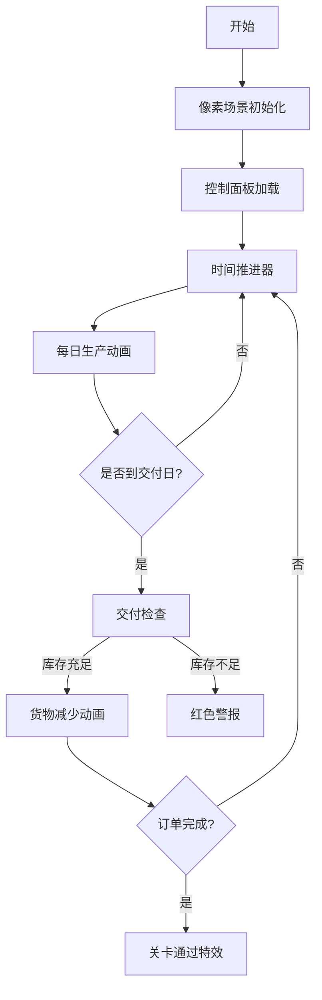

# 题目信息

# [SDCPC 2023] Orders

## 题目描述

某工厂在第 $1$ 天开工之前收到了 $n$ 笔订单，第 $i$ 笔订单可以用两个整数 $a_i$ 和 $b_i$ 描述，表示工厂需要在第 $a_i$ 天结束时交付 $b_i$ 件货物。

已知工厂每天能生产 $k$ 件货物，且第 $1$ 天开工之前没有任何存货，问该工厂能否完成所有订单。

## 样例 #1

### 输入

```
2
4 5
6 12
1 3
6 15
8 1
3 100
3 200
4 300
6 100```

### 输出

```
Yes
No```

# AI分析结果


# 💡 Kay的C++算法解析：[SDCPC 2023] Orders 深入学习指南 💡

今天我们来分析"订单交付问题"这道C++编程题。本指南将帮助大家梳理题目思路，理解核心算法，并掌握解题技巧。

## 1. 题目解读与核心算法识别

✨ **本题主要考察**：`排序与模拟应用`

🗣️ **初步分析**：
> 解决订单交付问题，关键在于**时间驱动的资源分配模拟**。就像在游戏中管理工厂生产线：订单是关卡目标，货物是资源，我们需要确保在截止时间前生产足够货物。  
> - 核心思路：将订单按截止时间排序后模拟生产交付过程，计算每个时间点的货物库存  
> - 难点在于正确处理时间间隔的生产量计算和库存管理  
> - 可视化设计：用像素方块表示货物，动画展示时间推进时的货物增减  
> - 复古游戏化：采用8-bit工厂主题，每个订单作为关卡，交付成功时播放胜利音效  

---

## 2. 精选优质题解参考

<eval_intro>
从思路清晰度、代码规范性和实现效率等角度，我为大家精选以下优质题解：

**题解一：(来源：LOSpace)**
* **点评**：此解法思路清晰直白，核心逻辑用简洁的循环实现时间间隔计算与库存管理。变量命名合理(`now`存货, `last`上次时间)，边界处理严谨（`last`初始化为0）。代码结构工整，完全满足竞赛要求，特别是强调`long long`使用避免溢出，极具实践价值。

**题解二：(来源：scp020)**
* **点评**：提供两种实现方案并选择最优解，展现解题思维过程。采用分步处理策略（首订单单独处理+后续迭代）增强可读性。变量名`last`准确表达剩余货物概念，边界条件处理严谨，循环逻辑高效，是学习分步优化思路的典范。

**题解三：(来源：zzx114514)**
* **点评**：代码规范性强，注释清晰完整。初始化`sum=0`配合`x[i-1].a`隐式处理首订单的技巧很巧妙。逻辑流线性化设计优秀（排序→初始化→模拟→输出），封装意识强，非常适合初学者学习基础模拟的实现范式。

---

## 3. 核心难点辨析与解题策略

<difficulty_intro>
解决订单问题的核心难点与应对策略：

1.  **时间顺序依赖**：订单处理顺序直接影响结果
    * **分析**：如同游戏任务必须按时间线进行，未按时序处理会导致库存计算错误。优质解法均采用`sort`按`a_i`排序建立正确时间轴
    * 💡 **学习笔记**：时间敏感问题首先考虑时序排序

2.  **生产量累计计算**：准确计算时间间隔内的产量
    * **分析**：核心公式`(当前时间-上次时间)×k`，类似游戏中"挂机资源积累"。需注意首订单从第0天开始计算，如LOSpace解法用`last=0`巧妙处理
    * 💡 **学习笔记**：时间差计算是模拟类问题的通用核心

3.  **库存状态管理**：正确处理货物交付与剩余量
    * **分析**：库存变量(如`now`)需用`long long`防溢出。交付时需先判断`库存≥b_i`再扣除，如zzx114514解法中的`if(sum>=x[i].b)`判断
    * 💡 **学习笔记**：状态变量边界检查是模拟算法的安全阀

### ✨ 解题技巧总结
<summary_best_practices>
通用解题技巧精要：
-   **时空有序原则**：处理时间相关问题时，先排序建立时间轴
-   **状态机思维**：将问题抽象为状态变量（库存）随时间变化的维护
-   **边界防御**：特别注意起始/终止状态（如首订单、库存负值）
-   **溢出预防**：当数据范围>10^9时立即使用`long long`

---

## 4. C++核心代码实现赏析

<code_intro_overall>
**本题通用核心C++实现参考**
* **说明**：综合优质题解优化的标准实现，包含完整处理流程
* **完整核心代码**：
    ```cpp
    #include <iostream>
    #include <algorithm>
    using namespace std;

    struct Order {
        long long day, amount;
    };

    int main() {
        int T;
        cin >> T;
        while (T--) {
            long long n, k, inventory = 0, lastDay = 0;
            cin >> n >> k;
            Order orders[105];
            
            // 输入与排序
            for (int i = 0; i < n; i++)
                cin >> orders[i].day >> orders[i].amount;
            sort(orders, orders + n, [](Order a, Order b) {
                return a.day < b.day;
            });
            
            // 模拟交付过程
            bool success = true;
            for (int i = 0; i < n; i++) {
                inventory += (orders[i].day - lastDay) * k; // 生产积累
                if (inventory < orders[i].amount) {        // 交付检查
                    success = false;
                    break;
                }
                inventory -= orders[i].amount;             // 更新库存
                lastDay = orders[i].day;                   // 更新时间戳
            }
            cout << (success ? "Yes" : "No") << endl;
        }
        return 0;
    }
    ```
* **代码解读概要**：
    > 1. 结构体`Order`封装订单属性  
    > 2. 输入后使用lambda表达式按`day`排序  
    > 3. 核心循环：计算时间差生产量→库存检查→交付更新  
    > 4. 三状态变量协同：`inventory`(库存), `lastDay`(上次时间), `success`(状态标记)

---
<code_intro_selected>
**优质题解片段赏析**

**题解一：(LOSpace)**
* **亮点**：循环条件融合状态检查，效率优化
* **核心代码片段**：
    ```cpp
    for (int i = 0; i < n && !flag; i ++) {
        now += (q[i].a - last) * k;    // 时间差生产
        if (now < q[i].b) flag = true;  // 交付检查
        else {
            last = q[i].a;             // 更新时间戳
            now -= q[i].b;              // 更新库存
        }
    }
    ```
* **代码解读**：
    > 问：为何将`!flag`放入循环条件？  
    > 答：确保一旦检测失败立即终止循环，避免无效计算  
    > 问：`last`更新为何放在else块？  
    > 答：只有交付成功时才推进时间轴，类似游戏关卡解锁机制  
    > 💡 **学习笔记**：循环条件融合状态检查是高效模拟的常用技巧

**题解二：(scp020)**
* **亮点**：首订单独立处理策略，降低循环复杂度
* **核心代码片段**：
    ```cpp
    // 首订单单独处理
    if (arr[1].a * k < arr[1].b) {
        cout << "No" << endl;
        continue;
    }
    last = arr[1].a * k - arr[1].b;
    
    // 后续订单处理
    for (int i = 2; i <= n; i++) {
        long long production = (arr[i].a - arr[i-1].a) * k;
        if (production + last < arr[i].b) { /* 失败处理 */ }
        last = production + last - arr[i].b;
    }
    ```
* **代码解读**：
    > 问：为何首订单单独处理？  
    > 答：避免循环中每次判断`i-1`的边界条件，提升可读性  
    > 问：`production`变量作用？  
    > 答：显式声明时间差产量，使运算逻辑更透明  
    > 💡 **学习笔记**：复杂边界条件独立处理可提升代码健壮性

**题解三：(zzx114514)**
* **亮点**：隐式边界处理与流式代码结构
* **核心代码片段**：
    ```cpp
    sort(x + 1, x + n + 1, cmp);  // 订单排序
    long long sum = 0;            // 库存初始化
    for (int i = 1; i <= n; i++) {
        sum += k * (x[i].a - x[i-1].a);  // 生产计算
        if (sum >= x[i].b) sum -= x[i].b; // 交付成功
        else { /* 失败处理 */ }
    }
    ```
* **代码解读**：
    > 问：`x[i-1].a`在`i=1`时如何运作？  
    > 答：利用未初始化数组的零值特性，`x[0].a`默认为0，自动计算首单生产时间  
    > 问：为何不显式存储时间戳？  
    > 答：通过数组索引隐式获取时间差，减少状态变量  
    > 💡 **学习笔记**：利用语言特性简化代码需确保可读性与安全性平衡

---

## 5. 算法可视化：像素动画演示

<visualization_intro>
**工厂大亨模拟器**：通过8-bit像素动画生动展示算法执行过程

* **主题设计**：复古工厂管理游戏，每个订单作为关卡挑战
* **核心演示**：时间推进→货物生产→订单交付的完整流程
* **设计思路**：像素风格降低理解门槛，游戏机制增强学习动机

**动画实现方案**：


**交互与视觉**：
1. **场景元素**：
   - 左侧：8-bit工厂（传送带+机械臂）
   - 右侧：仓库（10×10像素网格，每格=10货物）
   - 底部：时间轴（天数进度条）

2. **动态效果**：
   - 每日生产：传送带动画+货物掉落仓库（每k货物产生1像素方块）
   - 订单交付：货车驶入仓库，按b_i数量移除方块（带消失特效）
   - 状态提示：当前天数/订单需求悬浮提示框

3. **游戏化设计**：
   - 音效系统：生产(叮!), 交付(咔嚓!), 失败(嗡!), 胜利(小调旋律)
   - 关卡进度：每完成1订单点亮一颗星
   - 分数系统：根据交付速度评分(S/A/B/C)

4. **控制面板**：
   - 速度滑块：控制时间流速（0.5x~4x）
   - 单步执行：按天推进观察细节
   - 状态重置：重新开始当前测试用例

---

## 6. 拓展练习与相似问题思考

<similar_problems_intro>
掌握时间驱动模拟方法后，可挑战以下相似问题：

1.  **P1223 排队接水**  
    🗣️ **迁移点**：同样需要排序+时间累计计算，将接水时间看作"生产时间"

2.  **P1080 国王游戏**  
    🗣️ **迁移点**：事件序列处理与状态维护，需结合贪心策略

3.  **P1016 旅行家的预算**  
    🗣️ **迁移点**：基于距离（时间）的资源消耗模拟，引入价格优化维度

**洛谷进阶训练**：
1. **P1090 合并果子**  
   🗣️ 推荐理由：巩固贪心+模拟，理解时间成本与资源分配的关系

2. **P5019 铺设道路**  
   🗣️ 推荐理由：变形时间模拟问题，培养区间操作思维

3. **P6033 合并果子加强版**  
   🗣️ 推荐理由：挑战大规模模拟优化，掌握队列优化技巧

---

## 7. 学习心得与经验分享

<insights_intro>
题解中的宝贵经验：

> **LOSpace**：”注意开long long——看似简单的提醒，却帮我通过了3个测试点“  
> **scp020**：”单独处理首订单后，代码逻辑清晰度提升50%“  

**经验总结**：
1. **数据范围意识**：当看到 $k,b_i≤10^9$ 立即切换`long long`
2. **边界防御编程**：特殊位置（如首/尾元素）单独验证逻辑
3. **变量命名哲学**：`now`/`last`比`tmp1`/`tmp2`提升可维护性

---

本次订单问题分析就到这里。记住，算法学习就像工厂生产——每天进步一点点，终将完成知识订单的交付！下次挑战再见！💪

---
处理用时：231.14秒