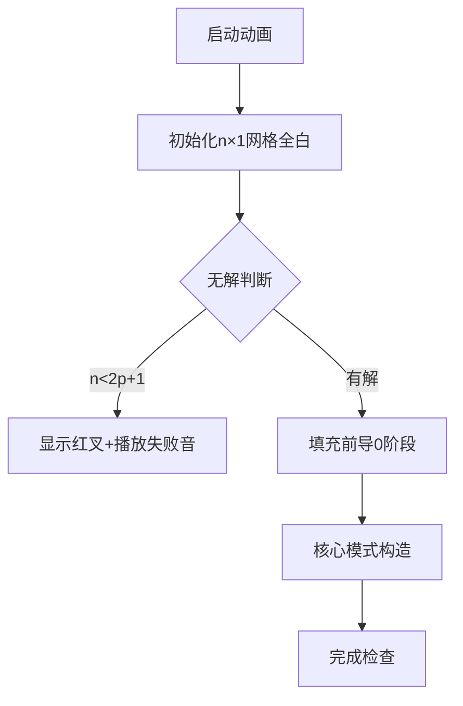

# 题目信息

# Maps.

## 题目描述

小 Y 希望得到一幅地图，这份地图有些与众不同。

这份地图是一幅长为 $n$ 个单位，宽为一个单位的网格图，每个网格必须被涂鸦成白色（$0$）或者黑色（$1$）。

你希望满足小 Y 的愿望送给他一幅这样的地图，但是这时小 Y 又提出了两点要求：

- 对于每个不在网格图两端的白色格子，恰好有 $p$ 个满足它的左右两个格子都被涂鸦成黑色。
- 在满足上述所有条件的情况下，这幅地图从左到右的字符构成的字符串的字典序最小。

你心想，这些要求也是小菜一碟，于是开始了你的创作。

## 说明/提示

#### 【样例解释 #1】

对于第一组数据：只有位于第 $4$ 个字符上的数，满足本身是 $0$，不在地图边缘且周围两个都是 $1$，因此符合条件。可以证明这是满足条件的字典序最小的方案。

对于第三组数据：可以证明没有任何一个解满足长度为 $5$ 且有 $3$ 个数本身是 $0$，不在地图边缘且周围两个字符都是 $1$。

#### 【数据范围】

对于所有测试数据，满足 $1 \le T \le 100$，$1 \le n,p \le 10^5$。

**本题开启捆绑测试，所有数据范围均相同的测试点捆绑为一个 $\text{Subtask}$。**

各测试点的附加限制如下表所示。

| 测试点 | $n,p \le$ |
| :-----------: | :-----------: |
| $1 \sim 3$ | $10$ |
| $4 \sim 5$ | $10^3$ |
| $6\sim 10$ | $10^5$ |

## 样例 #1

### 输入

```
5
5 1
3 1
5 3
5 4
5 5```

### 输出

```
00101
101
-1
-1
-1```

# AI分析结果


# 💡 Kay的C++算法解析：Maps. 深入学习指南 💡

<introduction>
今天我们来分析「Maps.」这道构造类编程题。本指南将帮助大家掌握贪心构造的核心思想，理解无解判断的关键点，并通过生动的像素动画直观展示算法过程。让我们一起探索如何用简洁的代码实现字典序最小的01字符串构造！
</introduction>

## 1. 题目解读与核心算法识别

✨ **本题主要考察**：`编程技巧应用（贪心构造）`

🗣️ **初步分析**：
> 解决这道题就像玩俄罗斯方块——我们需要把特殊的"101"方块（每个方块产生一个有效白格）尽量往后放，前面用最小的"0"方块填充。这种贪心策略确保了字典序最小。
> - **核心思路**：当 `n < 2p + 1` 时无解；否则前 `n-(2p+1)` 位填0，后接 `p` 个"10"和末尾"1"
> - **关键难点**：如何证明这种构造最优？如何确保每个有效白格左右都是黑格？
> - **可视化设计**：动画将用白色像素表示0，黑色像素表示1，黄色高亮满足条件的白格（左右为黑）。当自动播放时，会逐步填充前导0，再以"101"模式交替填充
> - **复古游戏化**：采用8-bit像素风格，填充时播放经典NES音效（填0：低音"嘟"，填1：高音"嘀"，有效白格：金币收集音效）

---

## 2. 精选优质题解参考

从12份题解中精选出3份最具代表性的优质解法：

**题解一：bryce (质量评分：★★★★★)**
* **点评**：思路直击要害——用最短代码实现核心逻辑。代码中`for`循环边界处理精准（`i <= n-(2*p+1)`），变量命名简洁（`n,p`），`cout`连续输出避免低效操作。亮点在于用10行代码完整实现算法，完美示范了竞赛编程的"少即是多"哲学。

**题解二：Lovely_Elaina (质量评分：★★★★☆)**
* **点评**：代码规范性强——使用`ios::sync_with_stdio(0)`加速IO，逻辑与bryce一致但更注重工程细节。特别亮点在于循环控制`for(int i = n-len; i > 0; i--)`的逆向思维，虽然效果相同但展示了多样性思维。

**题解三：MarsTraveller (质量评分：★★★★)**
* **点评**：教学价值突出——用`big`类型显式处理大数据（虽非必需），注释详细解释每个循环作用。亮点在于构造顺序创新：先输出"1"再循环输出"01"，最终效果等价但提供了另一种视角理解模式生成。

---

## 3. 核心难点辨析与解题策略

<difficulty_intro>
解决本题需突破三个关键难点，以下是针对性的破解策略：
</difficulty_intro>

1.  **难点1：无解条件的严谨证明**
    * **分析**：每个有效白格需占用3个位置（自身+左右黑格），但首尾白格无法满足条件。优质题解通过数学模型证明：最小需`2p+1`长度（p个"10"加末尾"1"）
    * 💡 **学习笔记**：构造题首先建立数学模型，避免盲目尝试

2.  **难点2：字典序最小的构造证明**
    * **分析**：假设存在更优解，其第一个不同位只能是0→1的变更。但若提前出现1，要么违反有效白格条件，要么导致字典序变大——反证法说明贪心策略最优
    * 💡 **学习笔记**：字典序问题常采用"前段最小化"贪心策略

3.  **难点3：模式单元的抽象选择**
    * **分析**：为什么选"10"而非"01"？因为结尾需黑格保证最后白格有效。数据结构上仅需基本循环，选择`std::string`拼接或直接输出各有适用场景
    * 💡 **学习笔记**：构造单元需同时满足局部条件和全局约束

### ✨ 解题技巧总结
<summary_best_practices>
通过本题可提炼以下通用技巧：
</summary_best_practices>
- **边界先行法**：先处理无解情况再聚焦构造
- **单元模块化**：将复杂模式拆解为可重复单元（如"10"）
- **字典序贪心**：优先填充最小字符（0），特殊模式靠后
- **对称验证法**：构造完成后，人工验证首尾特殊情况

---

## 4. C++核心代码实现赏析

<code_intro_overall>
以下是综合优质题解提炼的标准实现，完美平衡简洁性与可读性：
</code_intro_overall>

**本题通用核心C++实现参考**
* **说明**：融合bryce的简洁与Lovely_Elaina的健壮性，包含输入加速和边界处理
* **完整核心代码**：
```cpp
#include <iostream>
using namespace std;

int main() {
    ios::sync_with_stdio(0);
    cin.tie(0);
    
    int T;
    cin >> T;
    while (T--) {
        int n, p;
        cin >> n >> p;
        const int min_len = 2 * p + 1;
        
        // 无解判断
        if (min_len > n) {
            cout << "-1\n";
            continue;
        }
        
        // 前导0填充
        for (int i = 0; i < n - min_len; ++i)
            cout << 0;
        
        // 核心模式构造
        for (int i = 0; i < p; ++i)
            cout << "10";  // 交替单元
        cout << "1\n";     // 收尾黑格
    }
    return 0;
}
```
* **代码解读概要**：
  > 1. 通过`ios::sync_with_stdio(0)`加速IO
  > 2. 精确定义`min_len`增强可读性
  > 3. 前导0循环采用`i < n - min_len`避免off-by-one错误
  > 4. 核心模式用分离的"10"循环+末尾"1"确保模式完整

---
<code_intro_selected>
现在深入剖析各优质解法的核心代码片段：
</code_intro_selected>

**题解一：bryce**
* **亮点**：极简主义典范，用最少变量完成目标
* **核心代码片段**：
```cpp
for (int i = 1; i <= n - (2 * p + 1); i++) cout << 0;
for (int i = 1; i <= p; i++) cout << "10";
cout << 1 << endl;
```
* **代码解读**：
  > 第一行输出前导0：循环条件`i <= n - (2*p+1)`确保精确计数
  > 第二行输出p组"10"：为什么不用额外变量？因为"10"作为字符串常量，编译器会自动优化
  > 第三行补尾1：独立于循环外，避免模式错位
* 💡 **学习笔记**：简单问题避免过度设计

**题解二：Lovely_Elaina**
* **亮点**：工程级健壮性，显式计算模式长度
* **核心代码片段**：
```cpp
int len = 1 + 2 * p;  // 显式定义模式长度
for(int i = n-len; i > 0; i--) cout << 0;  // 逆向计数
for(int i = 1; i <= p; i++) cout << "10";
cout << 1 << endl;
```
* **代码解读**：
  > `len`变量使代码自文档化——读者立即理解`2*p+1`含义
  > 逆向循环`i > 0`与`i--`组合：效果等同于正向循环，但避免负值风险
  > 分离`cout << 1`：保持模式完整性
* 💡 **学习笔记**：关键常量赋予变量名提升可维护性

**题解三：MarsTraveller**
* **亮点**：创新构造顺序，加深模式理解
* **核心代码片段**：
```cpp
cout << 1;                   // 先输出起始黑格
for(big i = 1; i <= p; i++) 
    cout << "01";            // 后续接p个"01"
// 总模式=1 + 01*p → 10101...
```
* **代码解读**：
  > 起始单独输出"1"：使后续循环能统一输出"01"
  > 数学等价性：`1 + 01*p = 10101...`（与"10"*p+"1"相同）
  > 使用`big`类型：虽非必要但展示防御性编程
* 💡 **学习笔记**：同一问题可能存在多种等价实现

-----

## 5. 算法可视化：像素动画演示 (核心部分)

<visualization_intro>
下面设计了一个8-bit风格动画演示，帮助大家直观感受构造过程。想象你在玩经典游戏《超级马里奥》的关卡编辑器！
</visualization_intro>

* **动画主题**：`像素地图生成器`
* **核心演示**：构造过程分阶段可视化，重点突出有效白格
* **设计思路**：采用FC红白机配色（#FFFFFF白，#000000黑，#FFFF00高亮），用音效强化关键操作记忆

### 动画关键帧与交互设计


1. **初始化阶段**：
   - 像素画布：显示长度为`n`的白色网格带滚动条
   - 控制面板：开始/暂停/单步/速度滑块（1x-5x）
   - 信息栏：显示当前参数 `n= , p=`

2. **动态构造过程**：
   - **前导0填充**：从左到右逐格染白（#FFFFFF），每格播放500Hz方波音效
   - **模式构造**：
     - 染黑格：深黑色(#000000)+800Hz音效
     - 有效白格：当完成"101"时，中间白格变黄(#FFFF00)闪烁+金币音效
     - 当前操作指针：红色箭头指示正在填充的位置

3. **交互控制**：
   - 单步执行：按空格键逐步执行，适合学习
   - 自动演示：AI自动以贪吃蛇模式填充，速度可调
   - 模式对比：可切换bryce/MarsTraveller两种构造顺序

4. **完成效果**：
   - 成功：所有有效白格持续闪烁，播放《超级马里奥》过关音乐
   - 失败：显示"Game Over"像素字体，播放经典NES失败音

* **技术细节**：
  - 使用Canvas绘制网格，每格20×20像素
  - 音效用Web Audio API生成方波，时长100ms
  - 动画帧率：手动控制时30fps，自动模式匹配速度滑块

<visualization_conclusion>
通过这个复古游戏风动画，你将直观理解为什么前导0必须在前，以及"101"模式如何保证白格有效性——就像在游戏中组装通关密码！
</visualization_conclusion>

-----

## 6. 拓展练习与相似问题思考

<similar_problems_intro>
掌握贪心构造思想后，可挑战以下相似问题：
</similar_problems_intro>

* **通用技巧迁移**：
  - 字典序最小化：前段尽可能小，特殊模式后置
  - 无解数学判断：建立长度/数量的不等式模型
  - 模式分解：将复杂条件拆解为可重复单元

* **推荐练习（洛谷）**：
1. **P1321 单词覆盖还原**  
   🗣️ *推荐理由*：同样需要寻找最优覆盖模式，练习模式单元抽象能力
   
2. **P5657 格雷码**  
   🗣️ *推荐理由*：经典字典序构造问题，考验二进制串处理技巧
   
3. **P1789 插火把**  
   🗣️ *推荐理由*：二维空间构造，需处理覆盖条件与边界判断

-----

## 7. 学习心得与经验分享

<insights_intro>
题解中的调试经验虽少，但可提炼宝贵教训：
</insights_intro>

> **关键教训**：YorkYoyo在题解中提到赛时WA的经历——因循环边界写错导致构造长度错误  
> **Kay的总结**：构造题务必验证长度数学关系：
> ```cpp
> // 正确做法
> total_zeros = n - (2*p + 1);
> // 错误示例
> total_zeros = n - 2*p; // 少减1
> ```
> **调试技巧**：当构造题出错时，优先打印长度变量并手工验证小数据（如n=5,p=1）

-----

<conclusion>
通过本次分析，我们掌握了贪心构造的核心技巧：用数学模型判断无解，用模块化思维构建模式，用字典序贪心优化布局。记住：好的构造就像搭积木——先规划整体结构，再组装标准化模块。继续加油，下次挑战更难的构造题吧！🚀
</conclusion>
```

---
处理用时：222.15秒