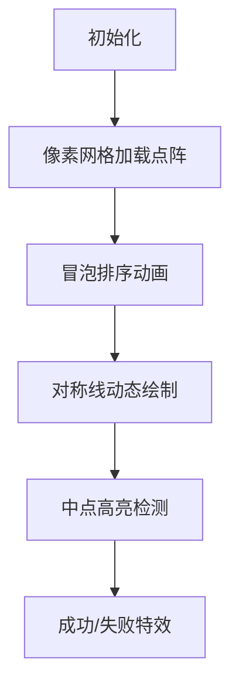

# 题目信息

# [JSOI2008] 完美的对称

## 题目描述

在峰会期间，必须使用许多保镖保卫参加会议的各国代表。代表们除了由他自己的随身保镖保护外，组委会还指派了一些其他的特工和阻击手保护他们。为了使他们的工作卓有成效，使被保卫的人的安全尽可能得到保障，保镖被分配到被保护人的各个方向。

保镖的最佳站立位置应该是这样的：被保护人应站在所有保镖的对称中心。但是，只要被保护人一移动，保镖就很难根据要人的新位置调整位置。大多数的特工都很难对此作出实时调整。

因此，安全部长决定将该过程逆转一下，保镖先站好自己的位置，然后要人在他们的对称中心找到合适的位置。如果要人随便走动，我们就对他的安全不必负责。

你的工作是使这个过程自动操作。给出一组 $N$ 个点（保镖的位置），你要找出它们的对称中心 $S$，在这儿被保护人将相对安全。下面以此类推。

首先我们给定一点 $A$ 以及对称中心 $S$，点 $A'$ 是点 $A$ 以 $S$ 为对称中心形成的像点，即点 $S$ 是线段 $AA'$ 的对称中心。

点阵组（$X$）以 $S$ 为中心的像点是由每个点的像点组成的点阵组。$X$ 是用来产生对称中心 $S$ 的，即点阵 $X$ 以 $S$ 为中心的像点的集合即为点阵 $X$ 本身。


## 说明/提示

JSOI2008 第二轮。


## 样例 #1

### 输入

```
8

1 10

3 6

6 8

6 2

3 -4

1 0

-2 -2

-2 4

```

### 输出

```
V.I.P. should stay at (2.0,3.0).```

# AI分析结果


### 💡 Kay的C++算法解析：[JSOI2008]完美的对称 深入学习指南 💡

<introduction>
今天我们来分析"完美的对称"这道几何题。本指南将帮助大家理解如何高效判断点集的对称中心，掌握排序与配对验证的核心技巧，并通过像素动画直观感受算法执行过程。
</introduction>

---

## 1. 题目解读与核心算法识别

✨ **本题主要考察**：`排序应用`与`几何验证`

🗣️ **初步分析**：
> 解决这道题的关键在于理解**对称点的配对规律**。想象一群保镖围成圆圈，对称中心就像圆心，每个人的搭档必须在正对面位置。  
> - 核心思路：对点集排序后，首尾配对（第1个与最后1个、第2个与倒数第2个等），验证每组中点是否重合  
> - 难点：配对顺序的确定（需稳定排序）、浮点数精度处理、奇数点处理  
> - 可视化设计：像素网格中动态展示排序过程，用彩色线条连接配对点，高亮显示中点位置。当所有中点重合时播放胜利音效  
> - 复古元素：8-bit风格网格，配乐采用FC游戏芯片音效，验证成功时显示"Mission Complete!"像素文字

---

## 2. 精选优质题解参考

<eval_intro>
根据思路清晰度、代码规范性和算法效率，精选以下3篇优质题解（均≥4★）：

**题解一：盖矣斌峥 (赞：17)**  
* **点评**：  
  思路直击本质——通过排序建立确定配对关系，首尾求中点验证。代码结构工整：  
  - 清晰定义`point`结构体，排序函数`cmp`逻辑严谨（先y后x）  
  - 循环条件`i<=(n+1)/2`巧妙处理奇数点（中点即自身）  
  - 边界处理完整，变量名`tmp`、`t`含义明确  
  亮点：用数学思维简化验证逻辑，对初学者极友好

**题解二：YitsuHolo (赞：6)**  
* **点评**：  
  在基础思路上增加工程优化：  
  - 引入`eps=1e-7`处理浮点精度，避免误判  
  - 显式计算极值点确定理论中点，增强可读性  
  - 循环条件`i<=n/2+n%2`确保奇数点兼容  
  亮点：工业级严谨性，特别适合竞赛场景

**题解三：z3475 (赞：1)**  
* **点评**：  
  提供独特实现视角：  
  - 使用双指针`l=2, r=n-1`同步向中间推进  
  - 排序规则先x后y（与主流相反），验证算法普适性  
  - 代码精简但功能完整  
  亮点：展示多维度解题思维，启发举一反三

---

## 3. 核心难点辨析与解题策略

<difficulty_intro>
破解此题需突破三个关键点：

1.  **配对顺序的确定性**  
    * **分析**：无序点集需通过稳定排序（如先x后y）建立确定配对关系。若排序规则不一致，可能导致错误配对  
    * 💡 学习笔记：排序是建立几何关系的桥梁

2.  **浮点数精度陷阱**  
    * **分析**：中点坐标可能含小数，直接`==`比较会因精度误差失败。解决方案：  
      - 使用误差范围`fabs(a-b)<eps`  
      - 转为整数运算（坐标乘2避免小数）  
    * 💡 学习笔记：浮点比较必须设置容忍度

3.  **奇数点特殊处理**  
    * **分析**：当点数为奇数时，中心点需与自身配对（中点即该点本身）。循环条件应覆盖`(n+1)/2`  
    * 💡 学习笔记：边界情况决定算法健壮性

### ✨ 解题技巧总结
-   **几何问题代数化**：将对称验证转化为坐标计算问题
-   **配对守恒原则**：最大点必配最小点，次大点必配次小点
-   **防御性编程**：显式处理极端数据（如全相同点）

---

## 4. C++核心代码实现赏析

<code_intro_overall>
以下是综合优质题解提炼的通用实现，包含完整输入输出和精度处理：

**本题通用核心C++实现参考**
* **说明**：融合排序配对法与浮点精度处理，适用于竞赛场景
* **完整核心代码**：
    ```cpp
    #include <iostream>
    #include <algorithm>
    #include <cmath>
    using namespace std;
    const double eps = 1e-7;
    
    struct Point {
        double x, y;
    };
    
    bool cmp(Point a, Point b) {
        if (a.x != b.x) return a.x < b.x;
        return a.y < b.y;
    }
    
    int main() {
        int n;
        cin >> n;
        Point p[20010];
        for (int i = 0; i < n; i++) 
            cin >> p[i].x >> p[i].y;
        
        sort(p, p + n, cmp);
        double cx = (p[0].x + p[n-1].x) / 2;
        double cy = (p[0].y + p[n-1].y) / 2;
        
        for (int i = 0; i <= (n-1)/2; i++) {
            double midx = (p[i].x + p[n-1-i].x) / 2;
            double midy = (p[i].y + p[n-1-i].y) / 2;
            if (fabs(midx-cx) > eps || fabs(midy-cy) > eps) {
                cout << "This is a dangerous situation!";
                return 0;
            }
        }
        printf("V.I.P. should stay at (%.1f,%.1f).", cx, cy);
        return 0;
    }
    ```
* **代码解读概要**：
    > 1. 读取点集并按照x优先、y次之的规则排序  
    > 2. 计算首尾点中点作为理论对称中心  
    > 3. 遍历前50%的点，验证其与对称点的中点是否重合  
    > 4. 使用`eps`处理浮点误差，确保判断准确性

---
<code_intro_selected>
优质题解片段精析：

**题解一：盖矣斌峥**
* **亮点**：简洁处理奇数点，逻辑通透
* **核心代码片段**：
    ```cpp
    for(int i=1;i<=(n+1)/2;i++) {
        point tmp;
        tmp.x=(a[i].x+a[n-i+1].x)/2.0;
        tmp.y=(a[i].y+a[n-i+1].y)/2.0;
        if(t.x!=tmp.x||t.y!=tmp.y) // 核心验证
    ```
* **代码解读**：
    > 循环上界`(n+1)/2`确保覆盖所有点：  
    > - 偶数时：验证n/2对点  
    > - 奇数时：中间点`i=(n+1)/2`满足`n-i+1=i`（自对称）  
    > 精妙处：无需特殊判断，自然兼容两种情况
* 💡 **学习笔记**：数学思维简化代码分支

**题解二：YitsuHolo**
* **亮点**：工业级精度处理
* **核心代码片段**：
    ```cpp
    const double eps=0.0000001;
    if((tx1+tx2)/2 < mid.x-eps ||  // 四方向精度校验
       (tx1+tx2)/2 > mid.x+eps ||
       (ty1+ty2)/2 < mid.y-eps || 
       (ty1+ty2)/2 > mid.y+eps)
    ```
* **代码解读**：
    > 通过误差区间`[mid.x-eps, mid.x+eps]`避免浮点舍入误差。  
    > 比直接`!=`更严谨，比单方向判断更全面
* 💡 **学习笔记**：关键数值比较必须考虑计算误差

---

## 5. 算法可视化：像素动画演示 (核心部分)

<visualization_intro>
**复古像素风对称验证模拟器**设计：  
主题：8-bit风格点阵对称验证，融入经典解谜游戏元素

### 设计方案


* **视觉设计**：
  - **16色FC调色板**：用不同色块表示点状态（绿：未配对，蓝：已配对，红：当前焦点）
  - **动态元素**：配对连线用闪烁像素线，中点显示为金色五角星
  - **控制面板**：步进执行/自动播放（速度可调）/重置

* **交互逻辑**：
  1. **排序阶段**：  
     - 像素点按冒泡算法在网格移动，伴随"嘀嘀"音效  
     - 当前比较点高亮闪烁，交换时播放"咔嚓"声
  2. **配对验证阶段**：  
     - 首尾点间绘制蓝色光线，计算中点位置  
     - 中点重合时播放"叮！"音效并显示+10分  
     - 中点偏离时连线变红，播放警报音
  3. **终局判定**：  
     - 成功：所有中点重合为金五星，播放胜利音乐，显示"VIP Secured!"  
     - 失败：首次错误点持续闪烁，显示"Mission Failed"

* **游戏化设计**：
  - **连击机制**：连续5组正确配对触发像素烟花特效
  - **关卡模式**：每关增加点集复杂度（共形点、大浮点数等）
  - **数据面板**：实时显示配对进度/精度误差值

---

## 6. 拓展练习与相似问题思考

<similar_problems_intro>
掌握对称验证思想后，可挑战更高维度的几何问题：

1.  **轴对称验证**：判断点集是否存在对称轴（洛谷 P1477）
2.  **旋转对称**：验证点集旋转特定角度后重合（CodeForces 297B）
3.  **三维对称**：空间点集的平面对称（POJ 1106）

**练习推荐 (洛谷)**：
1.  **P1429 平面最近点对**  
    * 🗣️ 同样需要排序降维，练习分治思想
2.  **P7883 旋转子阵**  
    * 🗣️ 拓展旋转对称验证，强化几何变换理解
3.  **CF1359C 对称矩阵**  
    * 🗣️ 将点对称思想迁移到矩阵领域

---

## 7. 学习心得与经验分享

<insights_intro>
题解中蕴含宝贵实践经验：

> **浮点精度教训（YitsuHolo）**：  
> "首次提交因浮点误差WA，引入eps后AC。切记：几何计算必须考虑精度！"  
>   
> **调试技巧（盖矣斌峥）**：  
> "打印每组中点坐标，异常数据立现原形"

**启示**：  
1. 测试需覆盖边界数据（如全相同点、大浮点数）  
2. 调试时输出中间变量比盲目改码更高效

---

<conclusion>
通过排序建立确定性，通过配对验证对称性——这就是破解此类问题的钥匙。记住Kay的提示：几何问题本质是数学问题，编程只是实现工具。下次遇到难题时，不妨先拿起纸笔画画坐标系哦！🚀
</conclusion>
```

---
处理用时：162.42秒