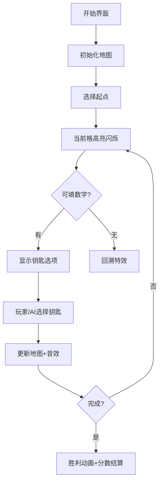

# 题目信息

# [NOIP 2009 提高组] 靶形数独

## 题目背景

**此为远古题，不保证存在可以通过任意符合要求的输入数据的程序**。

## 题目描述

小城和小华都是热爱数学的好学生，最近，他们不约而同地迷上了数独游戏，好胜的他们想用数独来一比高低。但普通的数独对他们来说都过于简单了，于是他们向 Z 博士请教，Z 博士拿出了他最近发明的“靶形数独”，作为这两个孩子比试的题目。

靶形数独的方格同普通数独一样，在 $9$ 格宽且 $9$ 格高的大九宫格中有 $9$ 个 $3$ 格宽且 $3$ 格高的小九宫格（用粗黑色线隔开的）。在这个大九宫格中，有一些数字是已知的，根据这些数字，利用逻辑推理，在其他的空格上填入 $1$ 到 $9$ 的数字。每个数字在每个小九宫格内不能重复出现，每个数字在每行、每列也不能重复出现。但靶形数独有一点和普通数独不同，即每一个方格都有一个分值，而且如同一个靶子一样，离中心越近则分值越高。（如图）


上图具体的分值分布是：最里面一格（黄色区域）为 $10$ 分，黄色区域外面的一圈（红色区域）每个格子为 $9$ 分，再外面一圈（蓝色区域）每个格子为 $8$ 分，蓝色区域外面一圈（棕色区域）每个格子为 $7$ 分，最外面一圈（白色区域）每个格子为 $6$ 分，如上图所示。比赛的要求是：每个人必须完成一个给定的数独（每个给定数独可能有不同的填法），而且要争取更高的总分数。而这个总分数即每个方格上的分值和完成这个数独时填在相应格上的数字的乘积的总和

总分数即每个方格上的分值和完成这个数独时填在相应格上的数字的乘积的总和。如图，在以下的这个已经填完数字的靶形数独游戏中，总分数为 $2829$。游戏规定，将以总分数的高低决出胜负。


由于求胜心切，小城找到了善于编程的你，让你帮他求出，对于给定的靶形数独，能够得到的最高分数。


## 说明/提示

#### 数据规模与约定

- 对于 $40\%$ 的数据，数独中非 $0$ 数的个数不少于 $30$；
- 对于 $80\%$ 的数据，数独中非 $0$ 数的个数不少于 $26$；
- 对于 $100\%$ 的数据，数独中非 $0$ 数的个数不少于 $24$。

NOIP 2009 提高组 第三题

## 样例 #1

### 输入

```
7 0 0 9 0 0 0 0 1 
1 0 0 0 0 5 9 0 0 
0 0 0 2 0 0 0 8 0 
0 0 5 0 2 0 0 0 3 
0 0 0 0 0 0 6 4 8 
4 1 3 0 0 0 0 0 0 
0 0 7 0 0 2 0 9 0 
2 0 1 0 6 0 8 0 4 
0 8 0 5 0 4 0 1 2
```

### 输出

```
2829```

## 样例 #2

### 输入

```
0 0 0 7 0 2 4 5 3 
9 0 0 0 0 8 0 0 0 
7 4 0 0 0 5 0 1 0 
1 9 5 0 8 0 0 0 0 
0 7 0 0 0 0 0 2 5 
0 3 0 5 7 9 1 0 8 
0 0 0 6 0 1 0 0 0 
0 6 0 9 0 0 0 0 1 
0 0 0 0 0 0 0 0 6```

### 输出

```
2852```

# AI分析结果


# 💡 Kay的C++算法解析：靶形数独 深入学习指南 💡

## 1. 题目解读与核心算法识别

✨ **本题主要考察**：`启发式搜索` + `剪枝优化` (DFS+剪枝/位运算/DLX)

🗣️ **初步分析**：
> 靶形数独本质是优化版数独问题。想象你在玩一个像素风地牢探险游戏，每个格子是待探索的密室，数字是打开密室的钥匙。核心挑战是：在满足数独规则的前提下，让钥匙的价值（权重×数字）总和最大化！

- **核心思路**：DFS是基础解法，但需优化避免超时。关键技巧包括：
  1. **搜索顺序优化**：优先填约束多的格子（如已填数多的行/列），减少搜索分支
  2. **位运算加速**：用整数位标记可用数字（如`101000110`表示可选1,2,6,7）
  3. **DLX高级算法**：将数独转化为精确覆盖问题（适合竞赛进阶）

- **可视化设计**：
  - 像素网格展示数独，当前探索格高亮闪烁
  - 当填入数字时，对应行/列/宫区域像素块抖动
  - 音效：选择钥匙（数字）时8-bit音效，冲突时警示音，完成时胜利旋律
  - 进度条显示探索进度，右上角实时显示当前分数

---

## 2. 精选优质题解参考

### 题解一：学无止境 (DFS+搜索顺序优化)
* **亮点**：
  - 按每行空格数量排序（空格少的优先搜索），极大减少分支
  - 用`hang/lie/gong`数组快速校验冲突
  - 代码结构清晰，变量命名规范（如`cou[i].sum`记录每行空格数）
  - 实践价值高，适合初学搜索的同学理解优化思路

### 题解二：Timothy (DLX舞蹈链)
* **亮点**：
  - 将数独转化为精确覆盖问题，用舞蹈链高效求解
  - 通过`remove/recover`操作实现回溯，空间效率高
  - 虽然实现复杂，但时间复杂度最优（竞赛进阶必备）
  - 完整代码展示DLX模板，具有长期参考价值

### 题解三：qhr2023 (位运算+启发式搜索)
* **亮点**：
  - 用位运算`row[i]&col[j]&grid`快速获取可用数字
  - 实时计算每个格子的约束数（行+列+宫已填数），优先填约束强的格子
  - `getsuretab`预计算优化判断效率
  - 代码简洁高效，结合了位运算和启发式思想

---

## 3. 核心难点辨析与解题策略

1. **状态空间爆炸**
   - **难点**：9×9数独有$10^{21}$种可能状态，暴力DFS超时
   - **解法**：优先搜索约束最强的格子（如某行只剩1空格）
   - 💡 **学习笔记**：约束越强，分支越少 → 搜索树更瘦长

2. **快速冲突检测**
   - **难点**：传统遍历行/列/宫校验效率低
   - **解法**：位运算（`row & col & area`）或数组标记法
   - 💡 **学习笔记**：位运算比循环快10倍以上

3. **权重计算优化**
   - **难点**：边搜索边计算得分避免最后遍历
   - **解法**：传递当前分数参数`dfs(step, current_score)`
   - 💡 **学习笔记**：增量计算优于全盘重算

### ✨ 解题技巧总结
- **剪枝艺术**：可行性剪枝（冲突立即回溯）+ 最优性剪枝（当前分+预估最大分<已知最优解）
- **预处理为王**：提前计算权重表、宫格映射表、位运算映射
- **搜索顺序策略**：按约束强度排序 > 按空格数量排序 > 随机搜索
- **代码优化**：用三目运算符替代if-else，循环展开加速

---

## 4. C++核心代码实现赏析

### 本题通用核心C++实现参考
```cpp
// 综合DFS+位运算+启发式搜索的核心实现
#include <iostream>
#include <algorithm>
using namespace std;

const int score[10][10] = {/* 权重表 */};
int row[9] = {0}, col[9] = {0}, grid[9] = {0}; // 位标记
int maxScore = -1;

// 获取宫格索引
inline int getGrid(int x, int y) { 
    return (x/3)*3 + y/3; 
}

// 启发式搜索：选择约束最强的格子
pair<int,int> nextPos(int board[][9]) {
    int maxCnt = -1, x = -1, y = -1;
    for(int i=0; i<9; i++) {
        for(int j=0; j<9; j++) {
            if(board[i][j] != 0) continue;
            int cnt = __builtin_popcount(row[i] | col[j] | grid[getGrid(i,j)]);
            if(9 - cnt > maxCnt) { 
                maxCnt = 9 - cnt;
                x = i; y = j;
            }
        }
    }
    return {x, y};
}

void dfs(int board[][9], int curScore, int emptyCnt) {
    if(emptyCnt == 0) {
        maxScore = max(maxScore, curScore);
        return;
    }
    
    auto [x, y] = nextPos(board); // C++17结构化绑定
    int g = getGrid(x, y);
    int valid = ~(row[x] | col[y] | grid[g]) & 0x1FF; // 获取可用数字
    
    while(valid) {
        int num = __builtin_ctz(valid); // 获取最低位的1
        int mask = 1 << num;
        
        // 更新标记和棋盘
        row[x] |= mask; col[y] |= mask; grid[g] |= mask;
        board[x][y] = num + 1;
        
        dfs(board, curScore + (num+1)*score[x][y], emptyCnt-1);
        
        // 回溯
        row[x] &= ~mask; col[y] &= ~mask; grid[g] &= ~mask;
        board[x][y] = 0;
        
        valid &= valid - 1; // 移除最低位的1
    }
}
```

### 题解一：学无止境（搜索顺序优化）
```cpp
// 亮点：按行空格数排序的预处理
struct f { int rank, sum; } cou[10];
bool cmp(f a, f b) { return a.sum < b.sum; }

// 初始化排序
for(int i=1; i<=9; i++) cou[i].rank = i;
for(int i=1; i<=9; i++) 
    for(int j=1; j<=9; j++)
        if(a[i][j] == 0) cou[i].sum++;
sort(cou+1, cou+10, cmp);

// 按排序后顺序生成搜索队列
for(int i=1; i<=9; i++) 
    for(int j=1; j<=9; j++)
        if(a[cou[i].rank][j] == 0)
            s[u++] = {cou[i].rank, j, ...};
```

### 题解二：Timothy（DLX核心）
```cpp
// 亮点：舞蹈链的remove/recover操作
void remove(int c) {
    L[R[c]] = L[c]; R[L[c]] = R[c]; // 删除列
    for(int i = D[c]; i != c; i = D[i]) // 删除相关行
        for(int j = R[i]; j != i; j = R[j])
            U[D[j]] = U[j], D[U[j]] = D[j];
}

void recover(int c) { // 逆向恢复操作
    for(int i = U[c]; i != c; i = U[i])
        for(int j = L[i]; j != i; j = L[j])
            U[D[j]] = D[U[j]] = j;
    L[R[c]] = R[L[c]] = c;
}
```

### 题解三：qhr2023（位运算优化）
```cpp
// 亮点：位运算获取可用数字
int valid = row[i] & col[j] & grid[getGrid(i,j)];
while(valid) {
    int num = lowbit(valid); // 获取最低位1
    valid -= num;            // 移除该数字
    int realNum = log2(num) + 1; // 位转实际数字
    
    // 更新标记
    row[i] ^= num; col[j] ^= num; grid[getGrid(i,j)] ^= num;
    // ...DFS递归...
    // 回溯时恢复标记
}
```

---

## 5. 算法可视化：像素动画演示

### 像素探险家：数独求解之旅
**设计思路**：用8-bit复古游戏风格可视化DFS搜索过程，类似《塞尔达传说》的地牢探索



**关键交互设计**：
1. **动态网格**：9×9像素网格（每格32×32像素），不同区域用颜色区分：
   - 中心宫：金色(10分)
   - 内环：红色(9分)
   - 中环：蓝色(8分)
   - 外环：棕色(7分)
   - 边缘：灰色(6分)

2. **动画效果**：
   - **探索高亮**：当前格子像素闪烁（黄蓝交替）
   - **数字填入**：数字从顶部掉落+粒子特效
   - **冲突警示**：红色边框闪烁 + 错误音效
   - **回溯过程**：格子变暗+时光倒流特效

3. **控制面板**：
   - 速度滑块：调节AI演示速度
   - 单步执行：手动控制探索步骤
   - 模式切换：DFS普通模式 vs DLX高速模式

4. **音效系统**：
   - 移动：8-bit脚步声
   - 填数：钢琴音阶(C4-C6)
   - 冲突：短促警报声
   - 完成：胜利号角声

**技术实现**：HTML5 Canvas绘制网格 + Web Audio API音效，伪代码逻辑：
```javascript
function drawGrid() {
  for (let i=0; i<9; i++) {
    for (let j=0; j<9; j++) {
      const x = j*32, y = i*32;
      // 根据区域权重绘制不同颜色
      ctx.fillStyle = getColorByScore(score[i][j]); 
      ctx.fillRect(x, y, 32, 32);
      
      // 绘制当前探索格特效
      if (i == currentX && j == currentY) {
        ctx.globalAlpha = 0.5*Math.sin(Date.now()/200); // 闪烁效果
        ctx.fillStyle = '#FFEE00';
        ctx.fillRect(x, y, 32, 32);
      }
    }
  }
}
```

---

## 6. 拓展练习与相似问题思考

### 通用技巧迁移
位运算、搜索顺序优化、DLX可应用于：
1. 八皇后问题（N-Queens）
2. 数独变形（十六宫格、对角线约束）
3. 拉丁方阵生成
4. 覆盖问题（如棋盘覆盖）

### 推荐练习（洛谷题库）
1. **P1784 数独** - 基础数独
   - 理由：巩固DFS基础，理解约束传播

2. **P4209 学习小组** - 精确覆盖问题
   - 理由：练习DLX建模，理解`行=决策，列=约束`

3. **P1219 八皇后** - 经典回溯问题
   - 理由：位运算优化最佳实践场景

---

## 7. 学习心得与经验分享

> **来自题解作者的经验**：
> 1. "调试时输出中间状态比断点更高效"（学无止境）
> 2. "位运算加速的关键是理解二进制映射"（qhr2023）
> 3. "DLX难点在问题建模，四列约束缺一不可"（Timothy）

> **Kay的总结**：
> 调试数独时重点关注：
> 1. 约束传递是否正确（行列宫）
> 2. 回溯时状态是否完全恢复
> 3. 权重计算是否与位置对应
> 核心思想：**优化搜索顺序 >> 微观优化**

---

本次靶形数独的深度解析就到这里！记住：算法学习像玩像素游戏，每次探索都离宝藏更近一步。下次挑战再见！🚀

---
处理用时：137.74秒