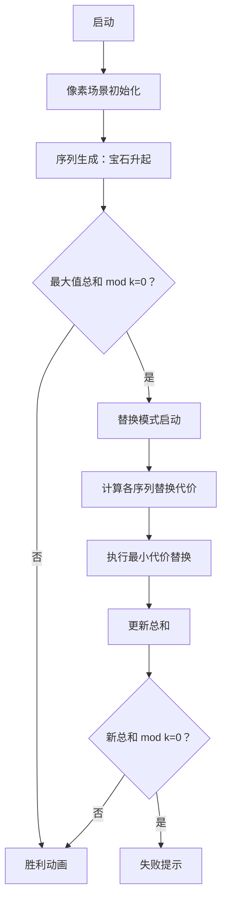

# 题目信息

# [NEERC 2015] Generators

## 题目描述

罗曼在学习线性同余发生器——最古老，也是最广为人知的伪随机数生成算法之一。线性同余发生器（LCG）以 $x_0$ 为随机种子，生成很多非负整数 $x_i$ ,它遵循以下规则：

给定非负整数 $a,b,c\space(0≤x_0<c)$ ，
$x_{i+1} = (ax_i+b)\space mod \space c$

罗曼很好奇由不同LCG产生的序列之间的关系。特别地，他有 $n$ 个不同的LCG，含有参数 $a^{(j)}, b^{(j)}, c^{(j)}\space(1≤j≤n)$。第 $j$ 个LCG会生成一个序列 $x_i^{(j)}$ 。

他希望能从每个LCG产生的序列中挑出一个数，使他们的和最大，且不被给定的 $k$ 整除。

**格式化一点来说**，他希望找到整数 $t_j \space(t_j>0,1≤j≤n)$ ，使$s=\sum\limits_{j=1}^nx_{t_j}^{(j)}$最大，且$s\not\equiv0(mod\space k)$。

## 说明/提示

时间限制：1秒

空间限制：256MB

## 样例 #1

### 输入

```
2 3
1 1 1 6
2 4 0 5
```

### 输出

```
8
4 1
```

## 样例 #2

### 输入

```
2 2
0 7 2 8
2 5 0 6
```

### 输出

```
-1
```

# AI分析结果


# 💡 Kay的C++算法解析：Generators 深入学习指南 💡

> 今天我们来分析NEERC 2015的"Generators"题目。这道题考察了**贪心策略与模运算**的应用，需要从多个循环序列中选数使总和最大且不被k整除。本指南将带你深入理解解题思路，并设计一个复古像素游戏动画帮助直观理解算法过程。

## 1. 题目解读与核心算法识别

✨ **本题主要考察**：`贪心策略`与`模运算应用`

🗣️ **初步分析**：
> 解决本题的关键在于理解**贪心策略的灵活应用**与**模运算的特性**。就像在多个宝箱中选宝石，我们总是优先选最大的宝石（贪心），但如果选出的宝石组合价值正好能被"魔法数字k"整除（不符合要求），就需要用次大的宝石替换其中一个。

- **核心思路**：每个序列取最大值求和 → 若和能被k整除 → 替换一个序列的最大值为次大值（要求替换后和不再被k整除）
- **难点**：高效获取每个序列的最大值/次大值（需满足模k不同余），以及选择最优替换序列
- **可视化设计**：将序列值显示为像素宝石，最大值用金色、次大值用银色表示。当总和被k整除时，动画会闪烁提示，并展示替换过程（下降值最小的序列高亮）

---

## 2. 精选优质题解参考

**题解一（Anins）**
* **点评**：
  思路清晰度 ★★★★☆：明确分三步处理（序列生成→极值记录→替换策略），逻辑严密  
  代码规范性 ★★★★☆：使用结构体封装数据，vis数组记录位置，变量命名合理  
  算法有效性 ★★★★★：通过倒序扫描确保获取真正的最大值/次大值，严格保证次大值模k不同余  
  实践价值 ★★★★☆：完整处理边界情况，可直接用于竞赛  

**题解二（wunaidedanjuan）**
* **点评**：
  思路清晰度 ★★★★☆：动态更新极值简化流程，实时判断循环终止  
  代码规范性 ★★★☆☆：使用pair存储数据，但vis数组复用可能引发问题  
  算法有效性 ★★★★☆：替换时再判断模值，避免无效替换  
  实践价值 ★★★★☆：快读提升效率，但次大值处理稍显粗糙  

---

## 3. 核心难点辨析与解题策略

1. **难点：高效获取有效极值**
   - **分析**：序列具有周期性，需快速定位最大值和模k不同余的次大值
   - **方案**：动态生成序列时记录极值（题解2）或扫描已生成序列（题解1）
   - 💡 **学习笔记**：循环序列只需处理到首次重复值出现

2. **难点：最优替换策略**
   - **分析**：当总和被k整除时，需选择替换后总和下降最小的序列
   - **方案**：比较`max - second_max`差值，选最小下降的序列替换
   - 💡 **学习笔记**：替换必须改变模k结果（次大值需≠最大值 mod k）

3. **难点：位置记录与输出**
   - **分析**：需记录每个极值在序列中的原始位置
   - **方案**：生成序列时同步记录下标（题解1用vis数组，题解2用循环计数）
   - 💡 **学习笔记**：位置记录需注意题目从0开始计数的要求

### ✨ 解题技巧总结
- **贪心优化**：先取全局最优（各序列最大值），再局部调整（单序列替换）
- **模运算特性**：利用`(a-b) mod k ≠ 0`保证替换有效性
- **边界处理**：单独处理全序列只有一个值的情况
- **循环优化**：序列出现重复值时立即终止生成

---

## 4. C++核心代码实现赏析

**通用核心实现参考**
```cpp
#include <iostream>
#include <vector>
using namespace std;

int main() {
    int n, k;
    cin >> n >> k;
    vector<pair<int, int>> best(n), secondBest(n); // 存储极值及其位置
    
    for (int i = 0; i < n; ++i) {
        int x, a, b, c;
        cin >> x >> a >> b >> c;
        vector<bool> vis(c, false);
        best[i] = {-1, -1};      // 最大值初始化
        secondBest[i] = {-1, -1};// 次大值初始化
        
        for (int pos = 0; !vis[x]; ++pos) {
            vis[x] = true;
            // 更新最大值和次大值（保证模k不同余）
            if (x > best[i].first) {
                if (best[i].first % k != x % k) 
                    secondBest[i] = best[i];
                best[i] = {x, pos};
            } else if (x > secondBest[i].first && x % k != best[i].first % k) {
                secondBest[i] = {x, pos};
            }
            x = (a * x + b) % c;
        }
    }

    // 计算最大值总和
    long total = 0;
    for (auto& p : best) total += p.first;

    // 输出结果逻辑（略）
}
```

**题解一核心片段赏析**
```cpp
// 极值记录逻辑（倒序扫描）
for(int j = c-1; j >= 0; j--) {
    if(!vis[j]) continue;
    if(j > best[i].value) {
        if(j % mod != best[i].value % mod) 
            secondBest[i] = best[i];
        best[i] = {j, vis[j]};
    } else if(j > secondBest[i].value && j % mod != best[i].value % mod) {
        secondBest[i] = {j, vis[j]};
    }
}
```
> **代码解读**：  
> 1. 从高到低扫描值域（c-1 → 0），优先获取更大值  
> 2. 更新最大值时，原最大值若模k不同余则转为次大值  
> 3. 次大值必须满足：①小于最大值 ②模k不同余  
> 💡 **学习笔记**：倒序扫描确保优先获取真最大值，严格筛选有效次大值

**题解二核心片段赏析**
```cpp
// 动态更新极值
for (int pos = 0; !vis[x]; pos++) {
    vis[x] = true;
    if (x > best[i].first) {
        secondBest[i] = best[i];
        best[i] = {x, pos};
    } else if (x > secondBest[i].first) {
        secondBest[i] = {x, pos};
    }
    x = (a * x + b) % c;
}
```
> **代码解读**：  
> 1. 实时生成序列值并更新极值  
> 2. 新值大于最大值时，原最大值降级为次大值  
> 3. 遇到重复值时终止循环（周期性利用）  
> 💡 **学习笔记**：动态更新减少扫描次数，但需注意次大值有效性

---

## 5. 算法可视化：像素动画演示

* **主题**："宝石猎手"复古像素游戏  
* **核心演示**：贪心选择与替换策略的动态过程

### 动画设计：


**关键交互设计**：
1. **宝石生成**：  
   - 每个序列显示为一列像素方块（高度=值 mod c）  
   - 最大值：金色✨，次大值：银色🔹，其他值：灰色▫️

2. **替换演示**：  
   ```python
   # 伪代码：替换算法可视化
   if total % k == 0:
       play_sound('warning')  # 播放警告音
       highlight_column(i)    # 高亮最小替换代价序列
       animate_swap(
           from=best[i], 
           to=secondBest[i], 
           delta=best[i]-secondBest[i]
       )
   ```

3. **游戏化元素**：  
   - 8-bit音效：宝石生成(叮🔔)，替换(咔嗒▶️)，成功(胜利号角🎺)，失败(低沉音💢)  
   - 控制面板：步进执行⏯️/暂停⏸️/重置🔄/速度滑块📏  
   - 积分系统：成功替换+10分💯，直接成功+50分🏆

---

## 6. 拓展练习与相似问题思考

**技巧迁移**：  
1. 贪心极值替换策略 → 适用于需要规避特定模值的优化问题  
2. 循环序列极值获取 → 周期性数据处理通用方案  

**洛谷推荐**：  
1. [P1090 合并果子](https://www.luogu.com.cn/problem/P1090)  
   → 练习贪心策略基础应用  
2. [P1803 凌乱的yyy](https://www.luogu.com.cn/problem/P1803)  
   → 强化贪心选择与证明能力  
3. [P4059 找爸爸](https://www.luogu.com.cn/problem/P4059)  
   → 复杂场景下的极值替换训练  

---

## 7. 学习心得与经验分享
> 两位作者均未提供调试心得，但通过代码可提炼：  
> - **极值有效性**：次大值必须与最大值模k不同余（题解1严格实现）  
> - **循环处理**：遇重复值立即终止生成（避免无效计算）  
> - **位置映射**：位置记录需匹配题目从0开始的要求  

---

通过本次分析，我们掌握了贪心策略的灵活应用和模运算的巧妙处理。记住：算法优化就像宝石替换，有时退一步（用次大值）反而能实现更大目标！下次挑战见！💪

---
处理用时：207.31秒