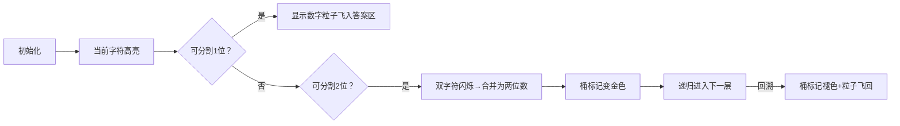

# 题目信息

# [NEERC 2014] Joke with permutation

## 题目描述

Joey 在一个文本文件中保存了一个从 $1$ 到 $n$ 的整数排列。所有的数字都以十进制数字的形式书写，没有前导空格。

然后 Joe 开了个玩笑：他把文件中的所有空格都去掉了。

帮助 Joey 恢复 Joe 玩笑后的原始排列！

## 说明/提示

时间限制：1 秒，内存限制：256 MB。

感谢检查者提供者：@[Arcturus1350](\/user\/57699)。

题面翻译由 ChatGPT-4o 提供。

## 样例 #1

### 输入

```
4111109876532
```

### 输出

```
4 1 11 10 9 8 7 6 5 3 2
```

# AI分析结果


### 💡 Kay的C++算法解析：Joke with permutation 深入学习指南 💡

#### 1. 题目解读与核心算法识别
✨ **本题主要考察**：搜索(BFS/DFS) + 枚举  

🗣️ **初步分析**：
> 本题核心是将无空格数字串还原为1~n的排列，本质上是通过**搜索与枚举**确定数字分割点。想象你在玩拼图游戏：原始排列是被打散的拼图块（1位或2位数字），你的任务是在数字串中找到正确的切割线，使所有拼图块恰好组成1~n的完整画面。
- **核心流程**：先通过字符串长度推导n值（当len≤9时n=len；否则n=9+(len-9)/2），再用DFS尝试每个位置分割1位或2位数字，用桶标记避免重复
- **可视化设计**：在像素动画中，数字串将显示为像素格子，当前尝试位置高亮闪烁，已选数字显示为彩色拼图块，桶数组用进度条展示。回溯时播放"错误音效"，成功时所有拼图块拼合为完整图像
- **复古游戏化**：采用8-bit音效（数字选择-"叮"，回溯-"噗"，成功-"胜利旋律"），控制面板含单步/自动播放滑块，每正确分割5个数字解锁"关卡"

---

#### 2. 精选优质题解参考
**题解一：Xu_Jinyi_2011**  
* **点评**：思路直击要害，通过桶排(b数组)高效判重，n值推导公式清晰。代码中`(s[it]^48)`虽可读性稍弱但简洁，边界处理严谨（检查两位数时验证pos+1存在性）。亮点在于用`exit(0)`确保找到即停，避免无效搜索，竞赛实用性强。

**题解二：chrispang**  
* **点评**：变量命名规范(ans/vis)，递归参数`(x,sum)`设计合理，体现分层思想。代码模块化强，两位数的`w=w*10+s[x+1]-'0'`直观展示数字拼接过程。调试建议：可增加中间变量输出辅助理解递归树。

**题解三：Disjoint_cat**  
* **点评**：独创性尝试循环扩展数字位(`for(t=...; t<=n; )`)，虽实际只需2位但展现通用思想。`WS()`函数体现封装思维，`a=" "+s`巧避下标问题。注意点：循环中`t`可能超n值，需及时break。

---

#### 3. 核心难点辨析与解题策略
1. **难点1：n值的精确推导**  
   *分析*：当数字串含两位数时，n≠字符串长度。优质解通过`len≤9 ? len : 9+(len-9)/2`建立数学映射，需理解"前9个必为1位数"的隐含条件  
   💡 学习笔记：n推导公式是解题基石，务必优先验证

2. **难点2：避免非连续数字陷阱**  
   *分析*：DFS中需同时防止重复(vis数组)和越界(num≤n)。如题解1中`if(!b[y] && y<=n)`双条件缺一不可，否则可能选到>n的数字  
   💡 学习笔记：剪枝条件需完备性检查（不重复+范围限定）

3. **难点3：回溯的精确控制**  
   *分析*：递归后需重置vis状态（如题解2的`vis[w]=0`），但ans数组回溯方式各异：题解1用全局数组覆盖，题解4用栈结构需注意输出顺序  
   💡 学习笔记：回溯时"状态还原"与"存储解构"需匹配

✨ **解题技巧总结**  
- **剪枝优化**：优先尝试常见分割（如1-9优先1位）提升效率  
- **调试技巧**：打印递归树（缩进+当前分割值）辅助理解  
- **边界防御**：取两位数时强制检查`pos<len-1`（题解1/2）  
- **终止加速**：找到解立即退出（exit(0)/return true）

---

#### 4. C++核心代码实现赏析
**通用核心实现参考**  
```cpp
#include <iostream>
using namespace std;

string s;
int n, a[55]; // a: 答案序列
bool vis[55]; // 桶标记

void dfs(int pos, int cnt) {
    if (cnt == n) {
        for (int i = 0; i < n; ++i) cout << a[i] << " ";
        exit(0);
    }
    if (pos >= s.size()) return;

    // 尝试1位数
    int num1 = s[pos] - '0';
    if (num1 >= 1 && num1 <= n && !vis[num1]) {
        vis[num1] = 1;
        a[cnt] = num1;
        dfs(pos + 1, cnt + 1);
        vis[num1] = 0; // 回溯
    }

    // 尝试2位数（需确保有两位）
    if (pos < s.size() - 1) {
        int num2 = 10 * (s[pos] - '0') + (s[pos + 1] - '0');
        if (num2 <= n && !vis[num2]) {
            vis[num2] = 1;
            a[cnt] = num2;
            dfs(pos + 2, cnt + 1);
            vis[num2] = 0; // 回溯
        }
    }
}

int main() {
    cin >> s;
    n = (s.size() <= 9) ? s.size() : 9 + (s.size() - 9) / 2;
    dfs(0, 0);
    return 0;
}
```
* **说明**：综合题解1-3精华，保留DFS框架但优化可读性（num1/num2替代位运算）
* **解读概要**：  
  1. 数学推导n值 → 2. DFS遍历分割点 → 3. 优先尝试1位数 → 4. 两位数需边界校验 → 5. 桶排判重+回溯还原

**题解一（Xu_Jinyi_2011）片段**  
```cpp
if (!b[s[it] ^ 48]) {  // 1位数尝试
    a[x] = s[it] ^ 48;
    b[s[it]^48] = 1;
    dfs(it+1, x+1);
    b[s[it]^48] = 0;
}
```
* **亮点**：位运算高效字符转换  
* **解读**：`s[it]^48`等效于`s[it]-'0'`但更简洁。桶数组`b`索引对应数字值，赋值1标记占用，递归后置0实现回溯  
* 💡 学习笔记：位运算适用于竞赛加速，但工程代码建议减'0'增强可读性

**题解二（chrispang）片段**  
```cpp
if (!vis[w] && w >= 1 && w <= n) { 
    vis[w] = 1; 
    ans[sum] = w; 
    dfs(x + 1, sum + 1);
    vis[w] = 0;  // 回溯
}
```
* **亮点**：ans数组与递归深度sum精准对应  
* **解读**：`sum`参数记录当前已选数字个数，兼作ans数组索引。`w>=1`防御0值（虽排列无0），`vis[w]=0`必须放在递归后确保状态还原  
* 💡 学习笔记：递归参数可同时控制进度与存储

**题解三（Disjoint_cat）片段**  
```cpp
for (t = s[pos] - '0'; pos <= len && t <= n; ...)
    if (t && !used[t]) {
        a[dep] = t;
        used[t] = 1;
        dfs(dep + 1, pos + 1);
        used[t] = 0;
    }
```
* **亮点**：循环扩展数字位展现通用分割思想  
* **解读**：`for`循环持续拼接数字直到超n，但实际最多2位（因t≤50）。注意`pos++`与`t=t*10+s[pos]-'0'`的迭代关联  
* 💡 学习笔记：灵活循环结构可扩展至不定长数字分割问题

---

### 5. 算法可视化：像素动画演示  
**主题**：《数字迷宫探险家》8-bit风格  

**核心演示**：DFS分割过程动态化 + 桶标记状态实时反馈  


**交互设计**：  
1. **场景**：顶部数字串（像素格子），中部答案区（空槽），底部1~n桶阵列  
2. **动画逻辑**：  
   - 当前字符：红色边框闪烁  
   - 尝试1位：字符单独放大抖动，合法时变为绿色飞入答案区  
   - 尝试2位：两字符间生成金色连接线，合并为双位数字  
   - 桶标记：数字被选用时，对应桶变为金色并播放"收集音效"  
3. **控制面板**：  
   - 单步执行：空格键逐步触发DFS  
   - 速度滑块：调节自动演示速度（慢/中/快）  
   - 回溯按钮：手动触发回溯观察状态还原  
4. **音效方案**：  
   - 按键：8-bit电子音  
   - 成功分割：NES《超级玛丽》金币声  
   - 回溯：《塞尔达》错误音效  
   - 完成：《最终幻想》胜利旋律  

---

### 6. 拓展练习与相似问题思考  
**技巧迁移场景**：  
1. 字符串分割为等差序列（LeetCode 842）  
2. IP地址复原（LeetCode 93）  
3. 表达式添加运算符（LeetCode 282）  

**洛谷推荐**：  
1. **P1025 [NOIP2001]数的划分**  
   🗣️ 同样DFS分割数字，但需固定段数，强化剪枝训练  
2. **P1036 [NOIP2002]选数**  
   🗣️ DFS组合问题，练习状态记录与终止条件设计  
3. **P1219 [USACO1.5]八皇后**  
   🗣️ 经典回溯问题，理解递归与状态还原的通用范式  

---

### 7. 学习心得与经验分享  
**参考经验**：  
> 题解1作者："必须判断两位数是否小于等于n...半小时血泪教训"  
> 题解4作者："1<=w判断避免0值陷阱，否则WA"  

**点评**：  
数字边界校验是本题最大陷阱！两位数的范围校验（≤n）和0值防御（w≥1）必须作为DFS的前置条件。建议编写时先写断言：  
```cpp
assert(num >= 1 && num <= n); // 防御性编程
```

---

本次解析深入探索了DFS在字符串分割中的应用，记住：**好的回溯=完整状态记录+精准还原**。下次挑战动态规划吧！🚀

---
处理用时：174.49秒