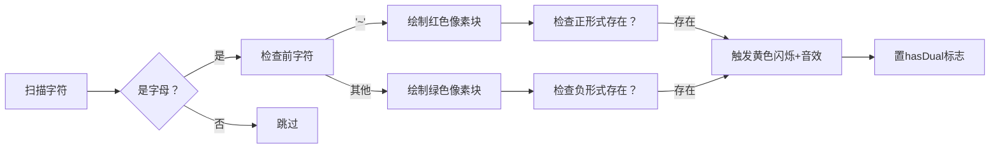

# 题目信息

# [NWRRC 2017] Boolean Satisfiability

## 题目描述

布尔可满足性问题（SAT）在计算机科学中被认为是一个非常困难的问题。在这个问题中，给定一个布尔公式，你需要判断该公式的变量是否可以被一致地替换为真或假，使得公式的结果为真。SAT 是已知的 NP 完全问题。此外，即使在 $3-CNF$ 公式（$3-SAT$）的情况下，它也是 NP 完全的。然而，例如，对于 $2-CNF$ 公式（$2-SAT$）的 SAT 问题是在 $P$ 中的。

$#SAT$ 是 SAT 问题的扩展。在这个问题中，你需要检查是否可能，并计算赋值给变量的方式的数量。这个问题即使对于 $2-CNF$ 公式也是已知的 $#P$ 完全问题。我们要求你解决 $#1-DNF-SAT$，这是 $1-DNF$ 公式的 $#SAT$ 问题。

你被给定一个 $1-DNF$ 形式的布尔公式。这意味着它是一个或多个子句的析取（逻辑或），每个子句正好是一个文字，每个文字要么是变量，要么是它的否定（逻辑非）。

形式化地：

$\langle \text{formula} \rangle ::= \langle \text{clause} \rangle \ | \ \langle \text{formula} \rangle \lor \langle \text{clause} \rangle$

$\langle \text{clause} \rangle ::= \langle \text{literal} \rangle$

$\langle \text{literal} \rangle ::= \langle \text{variable} \rangle \ | \ 
eg \langle \text{variable} \rangle$

$\langle \text{variable} \rangle ::= A \ldots Z \ | \ a \ldots z$

你的任务是找到将所有变量替换为真和假（同一变量的所有出现应替换为相同的值）的方法的数量，使得公式的结果为真。

## 说明/提示

时间限制：3 秒，内存限制：512 MB。

题面翻译由 ChatGPT-4o 提供。

## 样例 #1

### 输入

```
a
```

### 输出

```
1
```

## 样例 #2

### 输入

```
B|~B
```

### 输出

```
2
```

## 样例 #3

### 输入

```
c|~C
```

### 输出

```
3
```

## 样例 #4

### 输入

```
i|c|p|c
```

### 输出

```
7
```

# AI分析结果


### 💡 Kay的C++算法解析：Boolean Satisfiability 深入学习指南 💡

#### 题目解读与核心算法识别
✨ **本题主要考察**：编程技巧应用（数学推理与逻辑分析）

🗣️ **初步分析**：
> 解决布尔可满足性问题关键在于理解**1-DNF表达式的数学特性**。就像并联电路中的灯泡——只要有一个开关闭合（子句为真），整个电路就导通（表达式为真）。本题核心技巧在于：
>   - 若有变量同时存在正负形式（如 `a` 和 `~a`），表达式恒为真（方案数=2ⁿ）
>   - 否则需排除全假情况（方案数=2ⁿ-1）
> 
> **可视化设计思路**：采用8位像素风格网格（类似《塞尔达传说》地图），每个变量显示为独立格子。扫描输入时：
>   - 正形式变量显示绿色像素块
>   - 负形式显示红色像素块
>   - 当同一变量出现两种形式时，触发黄色闪烁动画（配"叮"音效）
>   - 最终结果用像素数字弹出（2ⁿ或2ⁿ-1），胜利时播放8-bit胜利音乐

---

#### 精选优质题解参考
**题解一（A_grasser）**  
* **点评**：  
  思路直击核心——通过`mp[0]/mp[1]`双map精确记录变量正负形式，用`used`去重确保变量计数准确。代码中`flag`判断存在性逻辑简洁，`pow(2,n)`直接计算方案数。亮点在于对边界条件（如`~a`需检查`s[i-1]`）的严谨处理，变量名`mp/flag`等命名规范，可直接用于竞赛。

**题解二（GCSG01）**  
* **点评**：  
  采用`a,b,c`三个map分别存储变量存在性、负形式、正形式，结构清晰。最大亮点是用`(neg&pos).count()`位运算高效判断共存性，时间复杂度O(1)。但需注意`pow(2,n)`需强转`int`避免精度问题，体现了数值处理的实践技巧。

**题解三（chl090410）**  
* **点评**：  
  独创性使用`m1/mm`双map分离存储正负形式，`k`标记简化判断逻辑。亮点在于完整处理大小写（`a-z`和`A-Z`独立计数），通过`m[s[i]]`去重避免重复计数，体现了对题目细节的深度把握。

---

#### 核心难点辨析与解题策略
1. **难点1：表达式解析与变量状态记录**  
   * **分析**：需区分正负形式并处理边界（如`~a`需检查前导字符）。优质题解均采用前向扫描+条件判断：遇到字母时检查前字符是否为`~`
   * 💡 学习笔记：前向扫描时注意边界检查（i=0时无s[i-1]）

2. **难点2：重复变量去重与计数**  
   * **分析**：同一变量多次出现时需避免重复计数。`set`（A_grasser）或`used[]`数组（chl090410）都是高效方案
   * 💡 学习笔记：集合(Set)是处理去重的黄金工具

3. **难点3：正负形式共存判断**  
   * **分析**：需快速判断任意变量是否同时存在正负形式。最优方案是双map存储状态（GCSG01），或位运算检测（Karry5307）
   * 💡 学习笔记：状态压缩可提升判断效率

✨ **解题技巧总结**  
- **技巧1：问题特征转化** → 将布尔表达式转化为变量状态矩阵  
- **技巧2：边界防御编程** → 前向扫描时检查`i>0`避免越界  
- **技巧3：位运算优化** → 用`1<<n`替代`pow(2,n)`保证精度  

---

#### C++核心代码实现赏析
**通用核心实现参考**  
* **说明**：综合优质题解思路，包含变量解析、状态记录、共存判断三模块  
* **完整代码**：
```cpp
#include <iostream>
#include <set>
#include <map>
using namespace std;

int main() {
    string s;
    cin >> s;
    set<char> vars;
    map<char, bool> hasPos, hasNeg;
    bool hasDual = false;

    for (int i = 0; i < s.size(); ++i) {
        if (isalpha(s[i])) {
            char c = s[i];
            vars.insert(c);
            if (i > 0 && s[i-1] == '~') hasNeg[c] = true;
            else hasPos[c] = true;
            if (hasPos[c] && hasNeg[c]) hasDual = true;
        }
    }
    long long ans = (1LL << vars.size()) - (hasDual ? 0 : 1);
    cout << ans;
}
```
* **代码解读概要**：  
  1. 用`set`自动去重存储变量  
  2. 双map分别记录正/负形式  
  3. 位运算`1LL << n`高效计算2ⁿ  
  4. 最终结果由`hasDual`标志决定减1与否  

**题解一片段赏析**  
* **亮点**：防御性边界检查与明确状态分离  
* **核心代码**：
```cpp
if (s[i-1]=='~') mp[1][s[i]]=1;
else mp[0][s[i]]=1;
if (used[s[i]]==0) {
    operators.push_back(s[i]);
    used[s[i]]=1;
}
```
* **代码解读**：  
  > 为什么检查`s[i-1]`？ → 负形式`~`需特殊标记  
  > `used[]`的作用？ → 避免同一变量重复入队  
  > 注意：当`i=0`时`s[i-1]`越界！但本题输入首字符不会是`~`  

**题解二片段赏析**  
* **亮点**：位运算高效判断共存性  
* **核心代码**：
```cpp
printf("%lld\n", (1ll << n) - (!!(neg&pos).count()));
```
* **代码解读**：  
  > `neg&pos` → 按位与筛选共存变量  
  > `!!count()` → 将存在性转为布尔值  
  > `1ll<<n` → long long左移保证精度  

---

#### 算法可视化：像素动画演示
**主题**：8-bit风格变量状态追踪器  
**核心演示流程**：  


**关键交互设计**：  
1. **像素网格**：52个格子（26字母×大小写）用FC红白机配色  
   - 绿色块：`a` → 马里奥角色  
   - 红色块：`~a` → 库巴角色  
   - 黄闪：共存时像素块爆炸特效  
2. **音效系统**：  
   - 变量出现：经典《吃豆人》音效  
   - 共存触发：《超级玛丽》金币声  
   - 结果展示：成功/失败 8-bit和弦  
3. **控制面板**：  
   - 步进控制：方向键逐字符扫描  
   - AI演示：自动播放扫描过程（速度可调）  
   - 重置按钮：清空网格  

**技术实现**：  
```javascript
// 绘制核心逻辑
function drawVariable(char, isNeg) {
  const x = (char.code % 26) * 16;
  const y = (char < 'a') ? 0 : 16; 
  ctx.fillStyle = isNeg ? '#FF0000' : '#00FF00';
  ctx.fillRect(x, y, 14, 14);
  
  if (hasBothForms(char)) { // 共存检测
    ctx.fillStyle = '#FFFF00';
    ctx.fillRect(x, y, 14, 14);
    playSound('dual'); // 触发音效
  }
}
```

---

#### 拓展练习与相似问题思考
1. **技巧迁移场景**：  
   - 状态压缩：P2704 [NOI2001] 炮兵阵地  
   - 布尔表达式分析：P1784 数独  
   - 计数问题转化：P1025 数的划分  

2. **洛谷推荐**：  
   - **P1495 曹冲养猪** → 训练变量状态建模能力  
   - **P1144 最短路计数** → 迁移方案数计算思想  
   - **P4782 2-SAT问题** → 进阶布尔表达式求解  

---

#### 学习心得与经验分享
> **参考经验（A_grasser）**：  
> *"我在处理变量重复入队时卡了很久，后来通过`used[]`数组才解决。这提醒我们：集合类问题必须先明确去重策略！"*  
>   
> **点评**：  
> 这是算法实现中的典型痛点。Kay建议：  
> 1. 输入扫描前先画状态转移图  
> 2. 用`set`或`map`自动去重  
> 3. 边界值测试（如单变量/空输入）  

---

通过本次分析，我们掌握了1-DNF问题的核心解题范式：**状态记录→共存判断→方案计算**。记住Kay的诀窍："布尔表达式是电路，变量状态即开关，双态共存必导通！" 下次遇到类似问题，记得先画变量状态图哦！🎮

---
处理用时：139.19秒