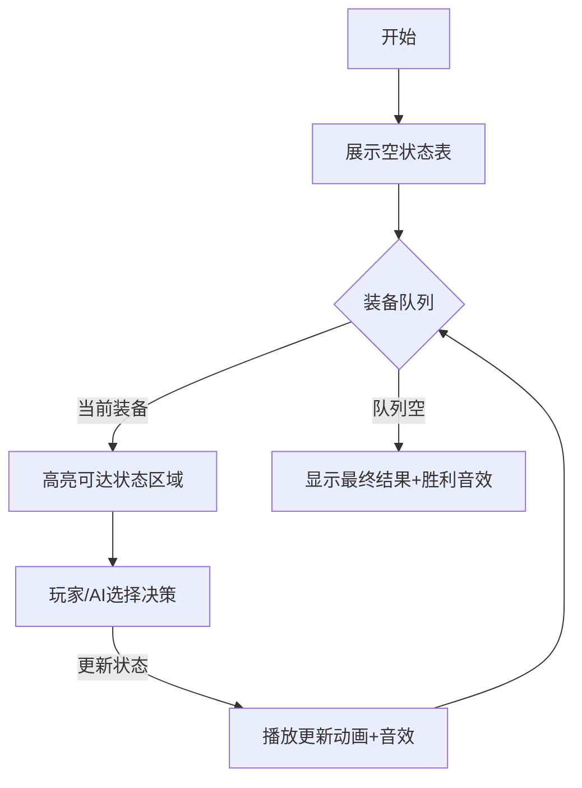

# 题目信息

# 装备运输

## 题目描述

德国放松对英国的进攻后，把矛头指向了东边——苏联。$1943$ 年初，东线的战斗进行到白热化阶段。据可靠情报，$90$ 余万德国军队在库尔斯克准备发动浩大攻势。因此，朱可夫元帅要求你立即从远东的军工厂运输大量装备支援库尔斯克前线。列车司机告诉你，一趟列车最多可以容纳 $V$ 体积的武器装备，但是你可能不能装满，因为列车承受不了那么大的重量，一趟列车最多可以承载 $G$ 单位的重量。同时，军工厂仓库提供给你一份装备清单，详细记录了每件装备的体积、重量和火力。为了有效支援朱可夫元帅，你要找到一种方案，使得总火力值最大。

## 说明/提示

对于 $100\%$ 的数据，$1\le V, G, N \le 500$，$1 \leq T_i, V_i, G_i \leq 10^9$。

## 样例 #1

### 输入

```
6 5 
4
10 2 2
20 3 2 
40 4 3 
30 3 3 
```

### 输出

```
50
```

# AI分析结果


# 💡 Kay的C++算法解析：装备运输 深入学习指南 💡

> 欢迎各位算法探索者！今天我们将深入分析**装备运输**这道二维费用背包问题，帮助大家掌握动态规划的核心思想与实现技巧。

## 1. 题目解读与核心算法识别

✨ **本题主要考察**：`动态规划（二维01背包）`

🗣️ **初步分析**：
> 装备运输问题本质是经典的01背包升级版，就像在游戏中管理背包空间：背包有**体积**和**重量**双重限制，每个装备只能选一次。核心思想是"分步决策+状态累积"——通过记录不同体积和重量组合下的最优解，逐步构建全局最优方案。
- **核心难点**：同时处理两个维度的约束条件，需要二维状态数组记录最优解
- **解决方案**：采用**滚动数组**优化空间，通过倒序枚举避免重复选择
- **可视化设计**：我们将设计像素网格展示状态更新过程，高亮当前物品和状态转移路径
- **复古元素**：采用8位像素风格，装备显示为不同颜色的方块，状态更新时播放"叮"音效，成功找到最优解时播放胜利音效

---

## 2. 精选优质题解参考

**题解一：(来源：翼德天尊)**
* **点评**：此解思路清晰直白，直接点明"二维01背包"本质。代码规范（变量名`dp[i][j]`含义明确），特别强调了倒序枚举的关键细节。转移方程`dp[i][j]=max(...)`简洁高效，边界处理严谨，完整注释更提升可读性。其强调"倒序枚举重要性"的经验对初学者尤其宝贵。

**题解二：(来源：355_113)**
* **点评**：解法精炼高效，用一句话概括核心思想："花费多一种，维数加上一"。代码实现干净利落（省去多余变量），同步优化了IO速度。特别指出了01背包与完全背包的枚举顺序差异，展示了深刻的算法理解。

**题解三：(来源：HPXXZYY)**
* **点评**：最具教学价值的题解！系统梳理了背包问题知识体系：从01背包→完全背包→多维背包的演进逻辑。通过数学公式+代码对照，清晰展示状态转移本质。提供的多维背包通用模板`f[j][k]=max(...)`极具拓展价值。

---

## 3. 核心难点辨析与解题策略

1.  **状态定义双维度**
    * **分析**：传统背包只有容量一维状态，本题需同时记录体积+重量。优质题解均采用`dp[j][k]`表示剩余体积j、重量k时的最大火力
    * 💡 **学习笔记**：多维约束=多维状态，问题维度决定DP数组维度

2.  **倒序枚举的必要性**
    * **分析**：正序枚举会导致物品被重复选择（完全背包特性）。所有优质解都强调：当`j`从`V->v[i]`，`k`从`G->g[i]`倒序枚举时，`dp[j-v[i]][k-g[i]]`才是未考虑当前物品的状态
    * 💡 **学习笔记**：倒序是01背包的防重选核心机制！

3.  **状态转移方程推导**
    * **分析**：关键决策逻辑`max(不选, 选)`转化为：
    ```math
    dp[j][k] = max(dp[j][k], dp[j-v_i][k-g_i] + t_i)
    ```
    * 💡 **学习笔记**：转移方程就是决策的数学表达

### ✨ 解题技巧总结
- **维度扩展法**：新增约束⇒DP数组新增维度
- **枚举顺序口诀**：01背包倒序走，完全背包正序搜
- **滚动数组优化**：当前状态仅依赖上一行，只需保留相邻状态
- **变量命名技巧**：如`v/g/t`比`a/b/c`更直观（翼德天尊解法）

---

## 4. C++核心代码实现赏析

**本题通用核心C++实现参考**
* **说明**：综合优质题解优化的标准实现
* **完整核心代码**：
```cpp
#include <iostream>
#include <algorithm>
using namespace std;

int dp[501][501]; // dp[体积][重量] = 最大火力

int main() {
    int V, G, N; // 总体积, 总重量, 装备数
    cin >> V >> G >> N;
    
    for(int i = 0; i < N; i++) {
        int t, v, g; // 火力, 体积, 重量
        cin >> t >> v >> g;
        
        // 倒序更新状态
        for(int j = V; j >= v; j--) {
            for(int k = G; k >= g; k--) {
                dp[j][k] = max(dp[j][k], dp[j-v][k-g] + t);
            }
        }
    }
    cout << dp[V][G];
    return 0;
}
```
* **代码解读概要**：
  - **输入处理**：读入背包限制V/G和装备列表
  - **核心循环**：对每个装备，倒序枚举所有可能的状态组合
  - **状态转移**：通过max()决策是否选择当前装备
  - **输出**：dp[V][G]即为全局最优解

---

**题解一：翼德天尊（核心片段）**
```cpp
for (int x=1;x<=n;x++) {
    for (int i=v;i>=t[x];i--) {
        for (int j=g;j>=z[x];j--) {
            dp[i][j]=max(dp[i-t[x]][j-z[x]]+h[x],dp[i][j]);
        }
    }
}
```
* **亮点**：严格遵循"物品→体积→重量"循环层次
* **代码解读**：
  - 外层`x`：遍历每个装备（决策单元）
  - 中层`i`：倒序枚举可用体积（从大到小）
  - 内层`j`：倒序枚举可用重量（从大到小）
  - `dp[i-t[x]][j-z[x]]`：选择当前装备前的状态
* 💡 **学习笔记**：三重循环顺序体现"自顶向下"的决策过程

**题解二：355_113（核心片段）**
```cpp
for(int j=v;j>=V;--j) {
    for(int k=g;k>=G;--k)
        f[j][k]=max(f[j][k],f[j-V][k-G]+t);
}
```
* **亮点**：极简实现，省去冗余变量
* **代码解读**：
  - 合并了装备遍历与状态更新
  - `j`/`k`循环顺序可互换：因状态无交叉依赖
  - `f[j-V][k-G]`：二维状态索引计算
* 💡 **学习笔记**：简洁≠低效，合理牺牲可读性可提升性能

**题解三：HPXXZYY（知识体系）**
```cpp
// 多维背包通用框架
for(int i=1;i<=n;i++)
    for(int j=C1;j>=W1[i];j--)
        for(int k=C2;k>=W2[i];k--)
            f[j][k]=max(f[j][k],f[j-W1[i]][k-W2[i]]+Val[i]);
```
* **亮点**：提炼出可扩展的多维背包模板
* **代码解读**：
  - `C1/C2`：各维度的容量上限
  - `W1/W2`：物品在各维度的"开销"
  - 嵌套循环层数 = 维度数量
* 💡 **学习笔记**：掌握算法框架比记忆单题解法更重要

---

## 5. 算法可视化：像素动画演示

**主题**："像素指挥官"的军备运输挑战（8-bit军事风格）

**核心演示**：  
通过动态网格展示DP状态表更新过程，每个单元格显示`dp[体积][重量]`值。装备显示为不同颜色的方块（如坦克=绿色，火炮=红色），选择时播放"滴"音效。

**交互设计**：


**关键动画细节**：
1. **初始化**：灰色网格表示状态表，左上角显示背包图标（V×G）
2. **装备入场**：当前装备从顶部下落，显示其(v,g,t)参数
3. **状态高亮**：
   - 红色区域：当前装备无法放入（超体积/重量）
   - 绿色区域：可更新状态，闪烁提示
4. **决策效果**：
   - 选择装备：该装备融入背包，路径上的状态格变金并显示`+t`
   - 不选择：状态格变蓝保持原值
5. **游戏化元素**：
   - 每正确更新10个状态得1⭐
   - "自动演示"模式：AI以最优路径点亮状态表
   - 背景音效：8-bit行军曲，更新时短促"滴"，胜利时播放苏联国歌片段

---

## 6. 拓展练习与相似问题思考

**多维背包思想迁移**：
1. **资源调度**：服务器选择（CPU+内存双约束）
2. **投资组合**：风险+收益平衡优化
3. **环保运输**：碳排放+里程双指标优化

**洛谷推荐**：
1. **P1853 投资的最大效益**（二维完全背包）  
   → 巩固滚动数组与正序枚举技巧
2. **P1509 精卫填海**（二维01背包+最小剩余）  
   → 学习状态定义变形
3. **P2014 [CTSC1997] 选课**（树形背包+依赖关系）  
   → 挑战高维背包进阶

---

## 7. 学习心得与经验分享

> **翼德天尊的经验**：  
> *"倒序枚举！倒序枚举！倒序枚举！重要的事情说三遍！正序会错成完全背包！"*

**Kay的总结**：  
这位前辈的调试经验极其宝贵！二维背包中，**枚举顺序**是新手最容易踩的坑。建议：
1. 每次写DP前画2×2小表格模拟
2. 输出中间状态验证（如`cout << dp[3][2]`）
3. 对比正/倒序的结果差异

---

通过今天的分析，相信大家已掌握二维背包的核心思想。记住：动态规划就是"聪明地穷举"——通过状态记录避免重复计算。下次遇到三维背包（比如时间+空间+成本），你会怎么设计呢？💪

> 算法世界如同战场，好的策略是胜利的关键。继续前进吧，指挥官们！

---
处理用时：112.23秒