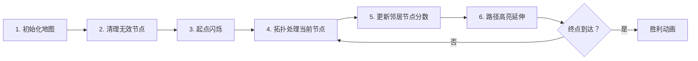

# 题目信息

# 最长路

## 题目描述

设 $G$ 为有 $n$ 个顶点的带权有向无环图，$G$ 中各顶点的编号为 $1$ 到 $n$，请设计算法，计算图 $G$ 中 $1, n$ 间的最长路径。

## 说明/提示

**【数据规模与约定】**

- 对于 $20\%$的数据，$n \leq 100$，$m \leq 10^3$。
- 对于 $40\%$ 的数据，$n \leq 10^3$，$m \leq 10^{4}$。
- 对于 $100\%$ 的数据，$1 \leq n \leq 1500$，$0 \leq m \leq 5 \times 10^4$，$1 \leq u, v \leq n$，$-10^5 \leq w \leq 10^5$。

## 样例 #1

### 输入

```
2 1
1 2 1```

### 输出

```
1```

# AI分析结果


# 💡 Kay的C++算法解析：最长路 深入学习指南 💡

## 1. 题目解读与核心算法识别

✨ **本题主要考察**：`拓扑排序+动态规划`（图论应用）

🗣️ **初步分析**：
> 解决"最长路"问题，关键在于理解**有向无环图(DAG)**的特性。想象你在游乐场玩闯关游戏，每个关卡（节点）都有单向通道（边）通向后续关卡，我们需要找到从第1关到最后一关的最高得分路径。拓扑排序就像按关卡顺序排队入场，确保计算每个关卡时，所有前置关卡的最优解都已确定。动态规划则记录到达每个关卡的最高得分，通过状态转移不断更新最优解。

- **核心思路**：利用拓扑排序确定节点处理顺序，配合动态规划计算最长路径
- **难点处理**：非起点入度为0的节点需预处理移除（如游乐场未开放入口的关卡）
- **可视化设计**：采用8位像素风格展示关卡地图，当前处理节点高亮闪烁，路径更新时显示分数变化动画，伴随"叮"的音效。自动演示模式会像游戏AI一样逐步闯关。

---

## 2. 精选优质题解参考

**题解一（作者：Mine_King）**
* **点评**：思路清晰展示了拓扑排序预处理非起点节点的重要性，DP状态转移简洁（`v[g[x][i]] = max(v[g[x][i]], v[x]+d[x][i])`）。代码中队列处理逻辑严谨，边界初始化规范（`v[i]=-1e9`）。亮点在于独创性处理入度为0节点的两步拓扑法，避免错误传播。

**题解二（作者：vectorxyz）**
* **点评**：巧妙运用负权转换思想（边权取负后跑最短路），最后结果取负即为最长路。代码采用标准SPFA实现，变量命名规范（`dist[]`/`st[]`）。虽然SPFA在稠密图上效率不稳定，但转换思路极具启发性，帮助理解问题本质。

**题解三（作者：lijingyuanpp）**
* **点评**：创新引入`str[]`数组标记起点可达路径（类似"有效通行证"概念），确保只计算从节点1出发的路径。拓扑排序与DP分离实现，模块清晰。代码中`px[]`存储拓扑序，`dp[]`状态转移逻辑分明，实践时注意负权初始化。

---

## 3. 核心难点辨析与解题策略

1.  **难点：非起点入度为0节点的处理**
    * **分析**：这些节点会阻塞拓扑排序流程（如游乐场死胡同）。优质解法采用"预清理"策略：先将其入队移除非起点节点再开始DP，避免错误状态传播。
    * 💡 **学习笔记**：拓扑排序前必须清理"无效入口"节点。

2.  **难点：DP状态转移设计**
    * **分析**：状态定义为`dp[i]`表示到达节点i的最大路径和。转移方程：`dp[v] = max(dp[v], dp[u] + w(u→v))`。关键在确保处理节点u时，所有可能的前驱状态已确定。
    * 💡 **学习笔记**：DAG的特性保证了DP无后效性。

3.  **难点：负权边与初始化**
    * **分析**：负权存在要求初始化为负无穷（`-1e9`），否则0初始值可能导致错误路径。SPFA解法需注意负权转换时边界值的同步转换。
    * 💡 **学习笔记**：路径不存在需返回-1，初始化值要与有效路径区分。

### ✨ 解题技巧总结
- **拓扑排序预处理**：先移除无关节点再计算有效路径
- **状态初始化技巧**：负权图初始化负无穷，起点初始0
- **模块化设计**：分离拓扑排序与状态更新逻辑
- **转换思维**：负权边取负跑最短路是经典技巧

---

## 4. C++核心代码实现赏析

**通用核心实现参考（拓扑+DP）**
```cpp
#include <iostream>
#include <vector>
#include <queue>
using namespace std;

const int N = 1510;
vector<pair<int, int>> g[N]; // 邻接表：<邻居节点, 边权>
int in[N], dp[N]; // 入度数组，DP状态数组

void longestPath(int n) {
    queue<int> q;
    // 初始化：非起点入度0节点入队
    for (int i = 2; i <= n; i++) {
        dp[i] = -1e9;
        if (!in[i]) q.push(i);
    }
    // 预处理移除无关节点
    while (!q.empty()) {
        int u = q.front(); q.pop();
        for (auto [v, w] : g[u]) 
            if (--in[v] == 0) q.push(v);
    }
    // 主拓扑DP
    q.push(1);
    while (!q.empty()) {
        int u = q.front(); q.pop();
        for (auto [v, w] : g[u]) {
            dp[v] = max(dp[v], dp[u] + w); // 状态转移
            if (--in[v] == 0) q.push(v);
        }
    }
    cout << (dp[n] < -1e8 ? -1 : dp[n]);
}
```
* **代码解读概要**：
  > 1. 初始化阶段标记非起点入度0节点
  > 2. 预处理移除无效节点避免阻塞
  > 3. 从起点开始拓扑排序，实时更新邻接节点DP值
  > 4. 状态转移方程体现贪心思想：总取最大路径和

---

**题解一核心片段（Mine_King）**
```cpp
// 预处理非起点节点
for (int i = 2; i <= n; i++) {
    v[i] = -1e9;
    if (!in[i]) q.push(i);
}
while (!q.empty()) {
    int x = q.front(); q.pop();
    for (int i = 0; i < g[x].size(); i++)
        if (--in[g[x][i]] == 0) 
            q.push(g[x][i]);
}
```
* **亮点**：独创两步拓扑法解决无效节点
* **学习笔记**：像扫雷游戏先排除安全区，再处理核心区域

**题解二核心片段（vectorxyz）**
```cpp
add(a, b, -c); // 建负边
int t = spfa(); // 跑最短路
cout << -t;    // 取负得最长路
```
* **亮点**：数学思维转换（max→min问题）
* **学习笔记**：问题等价转换可化未知为已知

**题解三核心片段（lijingyuanpp）**
```cpp
if (str[u] == 0) continue; // 跳过非起点路径
for (auto [v, w] : g[u]) 
    dp[v] = max(dp[v], dp[u] + w);
```
* **亮点**：`str[]`数组精准控制有效路径
* **学习笔记**：路径标记法避免无效状态污染

---

## 5. 算法可视化：像素动画演示

* **主题**："DAG大冒险"8位像素闯关游戏
* **核心演示**：拓扑排序节点处理顺序 + DP状态更新过程

### 动画设计（Canvas实现）


1. **像素场景**：
   - 节点：16x16像素方块（绿色起点/红色终点/灰色普通）
   - 边：黄色箭头连接
   - 状态面板：显示当前节点ID和累计分数

2. **关键动画**：
   - 节点处理时：像素方块闪烁（黄→白循环）
   - 分数更新：绿色↑数字飘动动画 + "叮"音效
   - 路径生成：红色线条逐帧绘制

3. **交互控制**：
   - 速度滑块：调节单步延迟(100ms~2s)
   - 模式切换：手动步进/AI自动演示
   - 重置按钮：重新生成随机地图

4. **游戏化元素**：
   - 每完成10%进度获得星星评价
   - 最终路径长度换算为游戏金币奖励
   - 背景音乐：8位芯片风格循环BGM

---

## 6. 拓展练习与相似问题思考

* **技巧迁移**：
  1. 任务调度（拓扑排序确定执行顺序）
  2. 关键路径分析（AOE网络最长路径）
  3. 依赖关系解析（如Makefile编译顺序）

* **洛谷推荐**：
  1. P1113 杂务（拓扑排序经典应用）
  2. P4017 最大食物链计数（拓扑+DP路径统计）
  3. P1983 车站分级（拓扑排序确定层次）

---

## 7. 学习心得与经验分享

> **Mine_King的经验**："非起点入度为0节点需优先处理，否则会导致拓扑阻塞"  
> **Kay点评**：这揭示了DAG算法的核心——保证状态无前效性。就像搭积木必须从底层开始，处理节点前需确保所有依赖已解决。

---

通过本次分析，我们掌握了DAG最长路问题的两种核心解法：拓扑排序+DP的优雅高效，以及负权转换的巧妙思路。记住，算法学习就像闯关游戏——理解机制、掌握技巧、不断实践才能通关！下次遇到新挑战时，愿你像像素勇士一样勇往直前！💪

---
处理用时：121.19秒